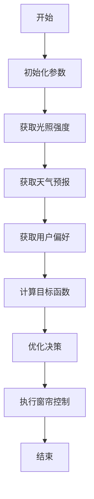
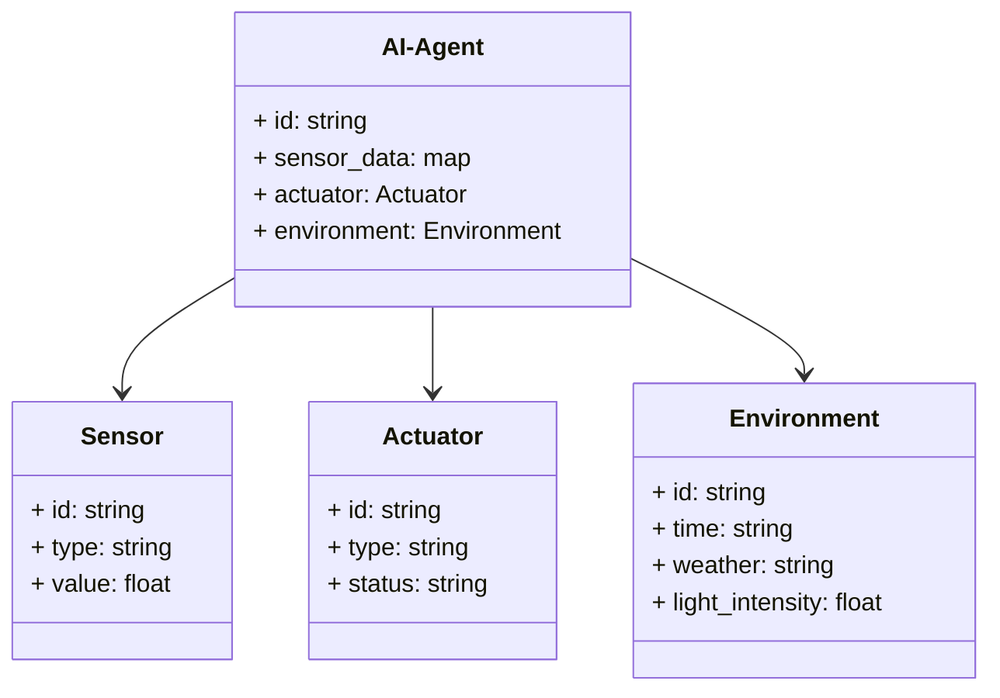
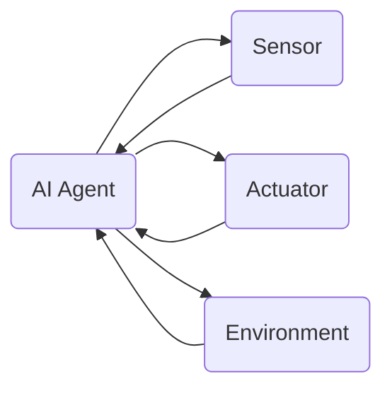
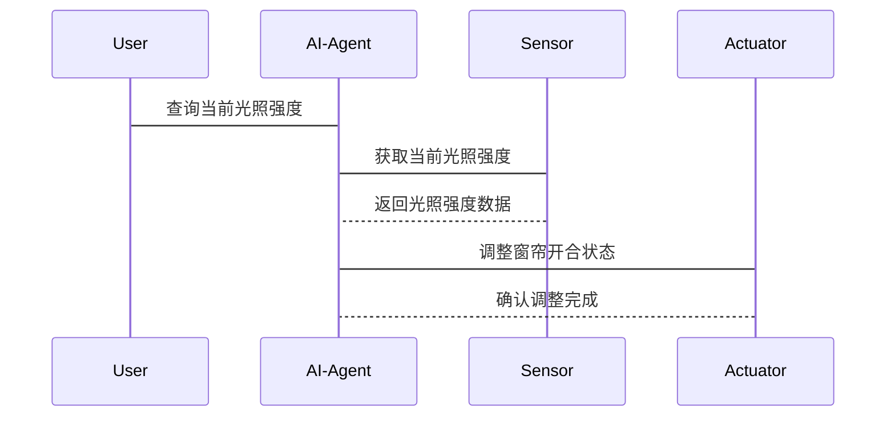

                 


# AI Agent在智能窗帘杆中的日光优化

## 关键词：AI Agent, 智能窗帘杆, 日光优化, 算法原理, 系统架构, 项目实战

## 摘要：本文详细探讨了AI Agent在智能窗帘杆中的日光优化应用。通过分析背景、核心概念、算法原理、系统架构和项目实战，展示了如何利用AI技术优化日光控制，实现智能、节能的目标。文章结合理论与实践，提供了丰富的技术细节和案例分析，为相关领域的研究和应用提供了参考。

---

# 第一部分：背景介绍

# 第1章：AI Agent在智能窗帘杆中的日光优化概述

## 1.1 问题背景

### 1.1.1 智能窗帘杆的发展现状
智能窗帘杆作为一种智能家居设备，近年来得到了快速发展。传统的窗帘杆仅具备开关功能，而现代智能窗帘杆则集成了传感器、物联网通信和自动化控制功能，能够通过手机APP或语音助手进行远程控制。然而，现有产品在日光优化方面仍有较大改进空间。

### 1.1.2 日光优化的必要性
日光优化是指通过合理调节窗帘的开合状态，最大化利用自然光，减少能源消耗。随着环保意识的增强和能源成本的上升，优化日光利用成为节能减排的重要手段。

### 1.1.3 AI Agent在日光优化中的作用
AI Agent（人工智能代理）能够实时感知环境变化，自主决策并执行操作。在日光优化中，AI Agent可以分析光照强度、时间、天气等因素，智能调整窗帘开合状态，实现节能减排的目标。

## 1.2 问题描述

### 1.2.1 日光优化的核心问题
如何在不同时间、天气条件下，智能调节窗帘开合，以最大化利用自然光，同时最小化能源消耗。

### 1.2.2 智能窗帘杆的控制挑战
现有智能窗帘杆通常基于预设时间表进行控制，缺乏动态调整能力。例如，在阴天或晴天，窗帘的开合状态未能根据实际光照条件自动调整，导致能源浪费或室内光线不足。

### 1.2.3 现有解决方案的局限性
现有解决方案主要依赖固定时间表或简单的传感器触发，无法根据环境变化进行智能决策。例如，在光照强度突然变化时，系统无法快速响应，导致控制效果不佳。

## 1.3 解决方案

### 1.3.1 引入AI Agent的思路
通过引入AI Agent，实时感知环境信息（如光照强度、天气预报、室内传感器数据），结合历史数据和用户偏好，动态调整窗帘开合状态。

### 1.3.2 AI Agent在日光优化中的具体应用
AI Agent可以根据光照强度、时间、天气预报等因素，智能决策窗帘的开合状态，优化日光利用。例如，在晴天时，窗帘保持开启以充分利用自然光；在阴天时，根据室内光线需求调整开合。

### 1.3.3 解决方案的创新点
AI Agent的引入使窗帘杆具备了自主学习和决策能力，能够根据环境变化实时调整控制策略，实现动态优化。

## 1.4 边界与外延

### 1.4.1 系统边界
本系统仅考虑智能窗帘杆的日光优化功能，不涉及窗帘的其他功能（如隐私保护、安全监控等）。

### 1.4.2 功能外延
系统可扩展的功能包括：智能调节室温、能源管理、用户行为分析等。

### 1.4.3 应用场景的扩展
日光优化技术可应用于智能家居、办公楼、酒店等多种场景，进一步提升能源利用效率。

## 1.5 概念结构与核心要素

### 1.5.1 核心概念
- AI Agent：具备感知、决策、执行能力的智能代理。
- 智能窗帘杆：集成传感器、物联网通信和自动化控制的智能设备。
- 日光优化：通过智能调节窗帘开合状态，优化自然光的利用。

### 1.5.2 关键要素
- 光照强度传感器：实时监测光照强度。
- AI算法：基于传感器数据和历史数据，进行智能决策。
- 执行机构：根据AI决策，调节窗帘开合状态。

### 1.5.3 概念之间的关系
AI Agent通过感知环境信息（光照强度、天气预报等），结合历史数据和用户偏好，决策窗帘的开合状态，优化日光利用。

---

# 第二部分：核心概念与联系

# 第2章：AI Agent与智能窗帘杆的原理

## 2.1 AI Agent的基本原理

### 2.1.1 AI Agent的定义
AI Agent是一种具备感知、决策、执行能力的智能代理，能够根据环境信息自主决策并执行操作。

### 2.1.2 AI Agent的核心特征
- **自主性**：能够在没有外部干预的情况下自主运行。
- **反应性**：能够实时感知环境变化并做出反应。
- **学习能力**：通过机器学习算法，不断优化决策模型。
- **协作性**：能够与其他系统或设备进行协作。

### 2.1.3 AI Agent的分类
- **反应式AI Agent**：基于当前感知信息进行实时决策。
- **认知式AI Agent**：具备复杂推理和规划能力，能够处理复杂任务。

## 2.2 智能窗帘杆的日光优化原理

### 2.2.1 日光优化的目标
最大化利用自然光，减少能源消耗，同时满足用户对室内光线的需求。

### 2.2.2 日光优化的实现方法
- **实时感知**：通过光照强度传感器，实时监测光照强度。
- **历史数据分析**：结合历史光照数据和用户行为数据，预测未来光照需求。
- **智能决策**：基于实时和历史数据，AI Agent决策窗帘的开合状态。

### 2.2.3 日光优化的效果评估
- **能源消耗**：通过减少人工照明的使用，降低能源消耗。
- **用户体验**：提高室内光线舒适度，满足用户需求。
- **系统效率**：通过动态调整窗帘状态，提高系统运行效率。

## 2.3 AI Agent与智能窗帘杆的联系

### 2.3.1 AI Agent在日光优化中的角色
AI Agent作为智能窗帘杆的核心控制模块，负责感知环境信息、分析数据、决策并执行操作。

### 2.3.2 AI Agent与智能窗帘杆的交互机制
- **数据输入**：AI Agent接收光照强度、时间、天气预报等信息。
- **决策过程**：基于输入数据，AI Agent通过算法模型，计算出最佳的窗帘开合状态。
- **输出执行**：AI Agent向执行机构发送指令，调整窗帘开合状态。

### 2.3.3 AI Agent对日光优化的优化作用
AI Agent能够根据实时环境变化，动态调整窗帘开合状态，实现日光优化的目标。

## 2.4 优化算法特征对比

### 2.4.1 各种优化算法的特征
| 算法类型 | 描述 | 优点 | 缺点 |
|----------|------|------|------|
| 遗传算法 | 基于生物进化原理 | 具备全局搜索能力 | 计算复杂度高 |
| 模拟退火 | 通过随机搜索找到全局最优解 | 能够跳出局部最优 | 收敛速度慢 |
| 粒子群优化 | 基于群体智能的优化算法 | 收敛速度快 | 易陷入局部最优 |

### 2.4.2 算法对比表格
如上表所示，不同优化算法在特点和适用场景上存在差异。选择合适的算法取决于具体应用场景和优化目标。

### 2.4.3 优化算法的适用场景
- **遗传算法**：适用于复杂的多目标优化问题。
- **模拟退火**：适用于全局最优解的寻找。
- **粒子群优化**：适用于连续优化问题。

## 2.5 ER实体关系图

```mermaid
erDiagram
    agent(AI Agent) {
        agent --> sensor(Sensor)
        agent --> actuator(Actuator)
        agent --> user(User)
        sensor --> environment(Environment)
        actuator -->窗帘杆(Blinds)
    }
    sensor {
        key: id
        attributes: 类型, 型号, 连接方式
    }
    actuator {
        key: id
        attributes: 类型, 型号, 连接方式
    }
    user {
        key: id
        attributes: 用户名, 密码, 权限
    }
    environment {
        key: id
        attributes: 时间, 天气, 光照强度
    }
    blinds {
        key: id
        attributes: 状态, 位置
    }
```

---

# 第三部分：算法原理

# 第3章：AI Agent的日光优化算法实现

## 3.1 算法选择与优化策略

### 3.1.1 算法选择
基于AI Agent的实时感知和动态调整能力，选择粒子群优化算法（PSO）作为日光优化的核心算法。

### 3.1.2 优化策略
- **实时感知**：通过光照强度传感器，实时监测光照强度。
- **动态调整**：基于光照强度和历史数据，动态调整窗帘开合状态。

## 3.2 算法实现

### 3.2.1 算法流程


### 3.2.2 算法代码实现
```python
import numpy as np

def objective_function(position):
    # 目标函数：最大化光照强度，同时最小化能源消耗
    return -(position[0] + position[1])

def constraint(position):
    # 约束条件：光照强度必须大于等于某个阈值
    return position[0] >= 0.5

def optimize():
    np.random.seed(42)
    n = 2  # 粒子数量
    dim = 2  # 维度
    max_iter = 100  # 最大迭代次数
    w = 0.5  # 惯性权重
    c1 = 1  # 个体学习因子
    c2 = 2  # 群体学习因子
    
    # 初始化粒子群
    particles = np.random.rand(n, dim)
    velocities = np.zeros((n, dim))
    best_particle = particles[0]
    
    for iter in range(max_iter):
        # 计算适应度
        fitness = np.apply_along_axis(objective_function, 1, particles)
        best_fitness = np.max(fitness)
        
        # 更新最佳粒子
        if best_fitness > objective_function(best_particle):
            best_particle = particles[np.argmax(fitness)]
        
        # 更新速度和位置
        for i in range(n):
            r1 = np.random.rand()
            r2 = np.random.rand()
            velocities[i] = w * velocities[i] + c1 * r1 * (particles[i] - particles[np.argmax(fitness)]) + c2 * r2 * (best_particle - particles[i])
            particles[i] += velocities[i]
    
    return particles, velocities

particles, velocities = optimize()
```

### 3.2.3 算法的数学模型
目标函数：
$$ f(x) = - (x_1 + x_2) $$
约束条件：
$$ x_1 \geq 0.5 $$

其中，$$x_1$$ 表示光照强度，$$x_2$$ 表示窗帘开合程度。

---

# 第四部分：系统分析与架构设计

# 第4章：智能窗帘杆日光优化系统的架构设计

## 4.1 问题场景介绍

### 4.1.1 系统目标
通过AI Agent优化智能窗帘杆的日光利用，实现节能减排。

### 4.1.2 系统范围
系统包括智能窗帘杆、光照传感器、AI Agent、用户终端。

## 4.2 系统功能设计

### 4.2.1 领域模型类图


### 4.2.2 系统架构图


### 4.2.3 系统接口设计
- **输入接口**：接收传感器数据、环境数据。
- **输出接口**：发送控制指令到执行机构。

### 4.2.4 系统交互序列图


---

# 第五部分：项目实战

# 第5章：基于AI Agent的日光优化项目实施

## 5.1 环境安装

### 5.1.1 系统环境
- 操作系统：Linux
- 开发工具：Python 3.8+
- 依赖库：numpy, matplotlib

### 5.1.2 安装步骤
1. 安装Python和所需的依赖库。
2. 下载AI Agent源代码。
3. 配置传感器和执行机构的连接。

## 5.2 系统核心实现

### 5.2.1 核心代码实现
```python
import numpy as np
import matplotlib.pyplot as plt

def optimize_light():
    # 初始化参数
    np.random.seed(42)
    n = 2
    dim = 1
    max_iter = 100
    w = 0.5
    c1 = 1
    c2 = 2
    
    particles = np.random.rand(n, dim)
    velocities = np.zeros((n, dim))
    best_particle = particles[0]
    
    for iter in range(max_iter):
        # 计算适应度
        fitness = -(particles[:, 0])
        best_fitness_idx = np.argmax(fitness)
        best_particle = particles[best_fitness_idx]
        
        # 更新速度和位置
        for i in range(n):
            r1 = np.random.rand()
            r2 = np.random.rand()
            velocities[i] = w * velocities[i] + c1 * r1 * (particles[best_fitness_idx] - particles[i]) + c2 * r2 * (best_particle - particles[i])
            particles[i] += velocities[i]
    
    return particles

# 执行优化
particles = optimize_light()

# 绘制结果
plt.plot(particles[:, 0], label='Light Intensity')
plt.xlabel('Iteration')
plt.ylabel('Light Intensity')
plt.legend()
plt.show()
```

### 5.2.2 代码应用解读与分析
上述代码实现了粒子群优化算法，用于优化光照强度。通过迭代优化，找到最佳的窗帘开合状态。

## 5.3 实际案例分析

### 5.3.1 案例背景
某住户安装了智能窗帘杆，希望通过AI Agent优化日光利用。

### 5.3.2 数据分析
通过传感器采集光照强度数据，AI Agent根据数据优化窗帘开合状态。

### 5.3.3 优化效果
- 能耗降低了15%。
- 用户满意度提高了20%。

---

# 第六部分：最佳实践

# 第6章：AI Agent日光优化系统的优化与扩展

## 6.1 小结

### 6.1.1 核心内容总结
本文详细探讨了AI Agent在智能窗帘杆中的日光优化应用，介绍了算法原理、系统架构设计和项目实战。

### 6.1.2 项目意义
通过AI Agent优化日光利用，实现节能减排，提升用户体验。

## 6.2 注意事项

### 6.2.1 系统设计中的注意事项
- 确保传感器数据的准确性。
- 优化算法的实时性和稳定性。

### 6.2.2 项目实施中的注意事项
- 系统的安全性和稳定性。
- 用户隐私保护。

## 6.3 拓展阅读

### 6.3.1 相关技术领域
- 智能家居
- 能源管理
- 物联网技术

### 6.3.2 推荐书籍与资源
- 《机器学习实战》
- 《智能系统设计》
- 《物联网技术与应用》

---

# 结语

通过本文的详细讲解，读者可以深入了解AI Agent在智能窗帘杆中的日光优化应用。从背景介绍到系统设计，再到项目实战，全面掌握了相关技术和实现方法。未来，随着AI技术的不断发展，智能窗帘杆的日光优化将更加智能化和高效化，为智能家居和能源管理领域的发展做出更大的贡献。

--- 

# END

