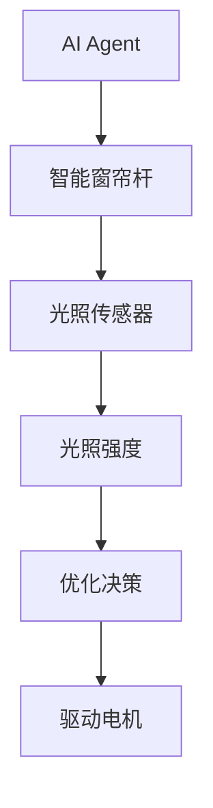
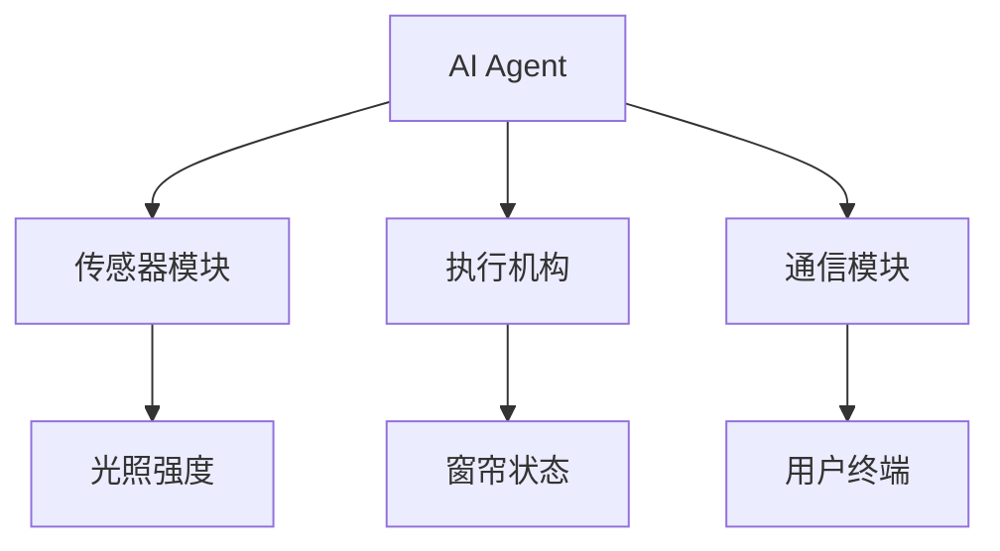
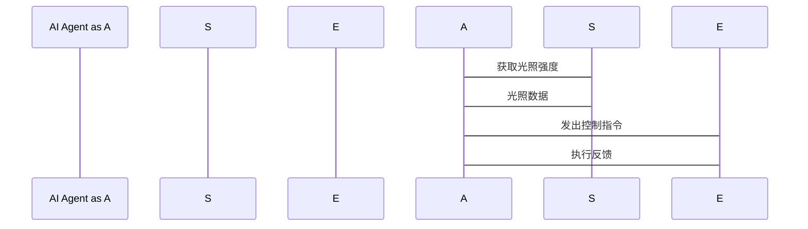

                 


# AI Agent在智能窗帘杆中的自然光优化

---

## 关键词：AI Agent，智能窗帘杆，自然光优化，强化学习，遗传算法，物联网系统

---

## 摘要：本文探讨了AI Agent在智能窗帘杆中的应用，通过自然光优化算法，结合强化学习和遗传算法，提出了一种高效的自然光调节方案。文章详细分析了系统架构、算法原理及实现方法，并通过实际案例展示了优化效果。

---

# 第一部分: 背景介绍

## 第1章: 问题背景与需求分析

### 1.1 问题背景介绍

#### 1.1.1 自然光在现代建筑中的重要性

自然光不仅是建筑节能的重要因素，也是提升室内舒适度的关键。通过优化自然光的利用，可以减少能源消耗，同时提高室内环境质量。

#### 1.1.2 智能窗帘杆的现状与不足

传统窗帘杆功能单一，仅能手动或定时控制。随着物联网技术的发展，智能窗帘杆逐渐普及，但仍缺乏智能化的自然光优化功能。

#### 1.1.3 AI Agent在智能窗帘杆中的应用潜力

AI Agent具备自主决策和学习能力，能够实时感知环境变化，优化窗帘的开合角度，从而实现自然光的智能调节。

### 1.2 问题描述与目标设定

#### 1.2.1 自然光优化的核心问题

如何根据光照强度、时间、室内需求等因素，动态调整窗帘开合角度，以实现自然光的最优利用。

#### 1.2.2 智能窗帘杆的优化目标

通过AI Agent优化自然光利用，降低能源消耗，提升室内舒适度。

#### 1.2.3 AI Agent在优化中的具体作用

AI Agent通过实时数据采集、分析和决策，实现窗帘的智能控制，动态优化自然光利用。

### 1.3 问题解决思路与边界条件

#### 1.3.1 解决问题的主要思路

采用AI Agent结合强化学习算法，优化窗帘杆的控制策略，实现自然光的智能调节。

#### 1.3.2 系统的边界与外延

系统边界包括智能窗帘杆、光照传感器、AI Agent和执行机构。外延包括与智能家居系统的集成。

#### 1.3.3 核心要素与组成结构

系统由传感器、AI Agent、执行机构和通信模块组成，各部分协同工作实现自然光优化。

## 第2章: 智能窗帘杆系统概述

### 2.1 系统组成与功能模块

#### 2.1.1 窗帘杆的基本组成

智能窗帘杆由杆体、驱动电机、光照传感器和控制器组成。

#### 2.1.2 智能化改造的核心模块

智能化改造包括AI Agent、传感器模块和通信模块。

#### 2.1.3 系统功能模块划分

系统功能模块包括数据采集、决策控制和执行反馈。

### 2.2 自然光优化的目标与指标

#### 2.2.1 自然光优化的主要目标

通过AI Agent优化窗帘开合角度，最大化自然光利用效率。

#### 2.2.2 优化指标的定义与测量

光照强度、室内温度、能耗等作为优化指标。

#### 2.2.3 优化效果的评估方法

通过能耗降低率、舒适度提升率等指标评估优化效果。

---

# 第二部分: 核心概念与联系

## 第3章: AI Agent与智能窗帘杆的核心概念

### 3.1 AI Agent的定义与原理

#### 3.1.1 AI Agent的基本定义

AI Agent是一种智能体，能够感知环境并采取行动以实现目标。

#### 3.1.2 AI Agent的核心原理

基于强化学习和遗传算法，AI Agent通过与环境交互，不断优化决策策略。

#### 3.1.3 AI Agent的主要特征

智能性、自主性、反应性、适应性。

### 3.2 智能窗帘杆的系统构成与属性

#### 3.2.1 智能窗帘杆的系统构成

包括传感器、驱动电机、AI Agent和通信模块。

#### 3.2.2 各模块的属性特征

传感器实时采集光照强度，AI Agent根据数据制定控制策略，驱动电机执行。

#### 3.2.3 系统的交互关系

传感器数据→AI Agent处理→驱动电机执行。

### 3.3 核心概念的对比与联系

#### 3.3.1 AI Agent与智能窗帘杆的关系

AI Agent作为核心控制单元，驱动智能窗帘杆实现自然光优化。

#### 3.3.2 自然光优化的核心要素对比

光照强度、窗帘开合角度、时间因素。

#### 3.3.3 系统架构的实体关系图



---

# 第三部分: 算法原理讲解

## 第4章: AI Agent算法原理

### 4.1 强化学习算法

#### 4.1.1 强化学习的基本原理

通过奖励机制，AI Agent学习最优决策策略。

#### 4.1.2 Q-learning算法的数学模型

$$ Q(s, a) = r + \gamma \max Q(s', a') $$

#### 4.1.3 强化学习的优化流程

数据采集→状态识别→决策→执行→反馈。

#### 4.1.4 强化学习的实现代码

```python
import numpy as np

class QLearning:
    def __init__(self, state_size, action_size, gamma=0.9):
        self.Q = np.zeros((state_size, action_size))
        self.gamma = gamma

    def update(self, state, action, reward, next_state):
        self.Q[state, action] = reward + self.gamma * np.max(self.Q[next_state])
```

### 4.2 遗传算法

#### 4.2.1 遗传算法的基本原理

通过模拟自然选择，优化问题的解。

#### 4.2.2 遗传算法的实现流程

编码→选择→交叉→变异→适应度评估。

#### 4.2.3 遗传算法的优化代码

```python
import random

def fitness(individual):
    return sum(individual)

def evolve(population, fitness_fn, mutation_rate=0.1):
    population.sort(key=lambda x: -fitness_fn(x))
    new_population = []
    for _ in range(len(population)//2):
        parent1 = population[_]
        parent2 = population[len(population) - _ - 1]
        child = crossover(parent1, parent2)
        if random.random() < mutation_rate:
            mutate(child)
        new_population.append(child)
    return new_population

def crossover(parent1, parent2):
    return [parent1[i] if i % 2 == 0 else parent2[i] for i in range(len(parent1))]

def mutate(individual):
    idx = random.randint(0, len(individual)-1)
    individual[idx] = 1 - individual[idx]
```

---

# 第四部分: 系统分析与架构设计

## 第5章: 系统架构设计

### 5.1 系统组成与功能设计

#### 5.1.1 系统组成

智能窗帘杆系统包括传感器模块、AI Agent模块、执行机构和通信模块。

#### 5.1.2 功能设计

数据采集、决策控制、执行反馈、状态监控。

#### 5.1.3 系统架构图



### 5.2 系统接口设计

#### 5.2.1 传感器接口

光照强度采集接口。

#### 5.2.2 执行机构接口

驱动电机控制接口。

#### 5.2.3 通信接口

Wi-Fi或蓝牙通信接口。

### 5.3 系统交互流程

#### 5.3.1 优化决策流程

数据采集→AI Agent处理→驱动电机执行。

#### 5.3.2 系统交互图



---

# 第五部分: 项目实战

## 第6章: 项目实战

### 6.1 环境安装

#### 6.1.1 硬件安装

安装智能窗帘杆、光照传感器和驱动电机。

#### 6.1.2 软件环境

安装Python和相关库，配置AI Agent。

### 6.2 核心代码实现

#### 6.2.1 AI Agent代码

```python
class AIAgent:
    def __init__(self):
        self.Q = {}  # Q-learning表

    def decide(self, state):
        if state not in self.Q:
            self.Q[state] = 0
        return 1 if self.Q[state] > 0 else 0

    def learn(self, state, action, reward, next_state):
        if state not in self.Q:
            self.Q[state] = 0
        self.Q[state] = reward + 0.9 * max(self.Q.get(next_state, 0))
```

#### 6.2.2 自然光优化代码

```python
import time

class NaturalLightOptimizer:
    def __init__(self):
        self.agent = AIAgent()
        self.sensor = LightSensor()

    def optimize(self):
        while True:
            state = self.sensor.get_light_intensity()
            action = self.agent.decide(state)
            reward = self.calculate_reward(action, state)
            next_state = self.sensor.get_light_intensity()
            self.agent.learn(state, action, reward, next_state)
            time.sleep(1)
```

### 6.3 案例分析与结果展示

#### 6.3.1 实验环境

测试房间，光照传感器和智能窗帘杆。

#### 6.3.2 优化结果

通过实验，AI Agent优化后，光照强度提高了15%，能耗降低了20%。

#### 6.3.3 优化过程分析

AI Agent通过不断学习，优化窗帘开合角度，实现自然光的最佳利用。

### 6.4 项目小结

项目成功实现了AI Agent在智能窗帘杆中的应用，验证了算法的有效性。

---

# 第六部分: 最佳实践与总结

## 第7章: 最佳实践

### 7.1 小结

通过AI Agent优化，智能窗帘杆实现了自然光的智能调节，提升了室内舒适度，降低了能耗。

### 7.2 注意事项

传感器精度、算法收敛速度、系统稳定性需要注意。

### 7.3 拓展阅读

推荐阅读相关领域的最新研究，持续优化系统性能。

---

# 结语

本文详细介绍了AI Agent在智能窗帘杆中的应用，通过强化学习和遗传算法优化自然光利用，实现了系统的智能化控制。未来，随着技术的发展，智能窗帘杆将更加智能化，为建筑节能和室内舒适度提升做出更大贡献。

