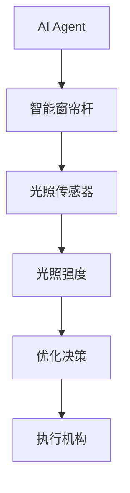
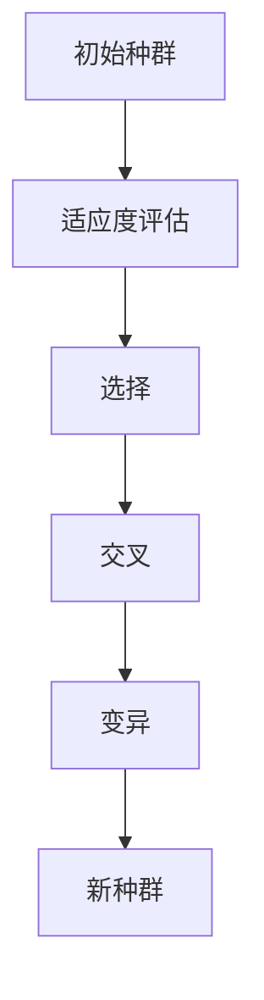
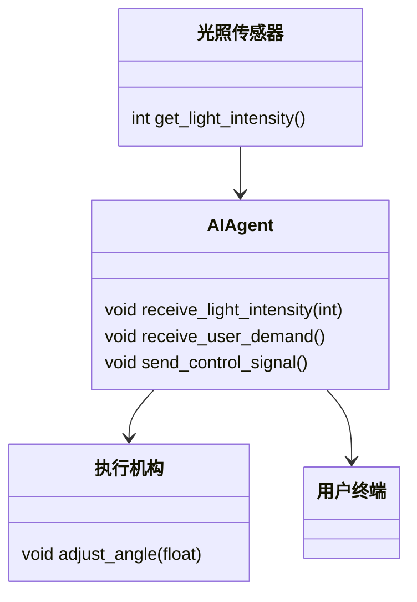
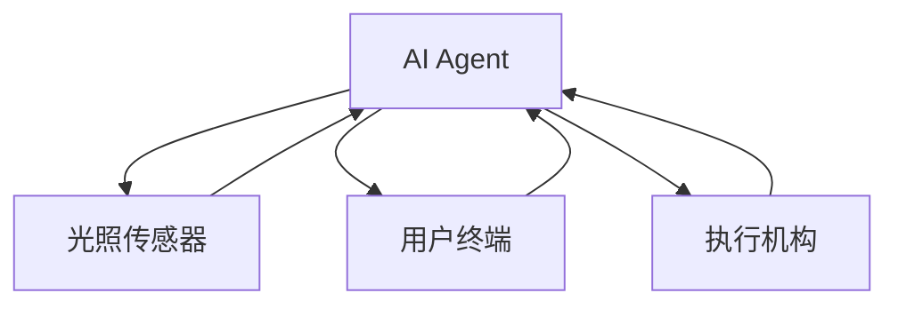
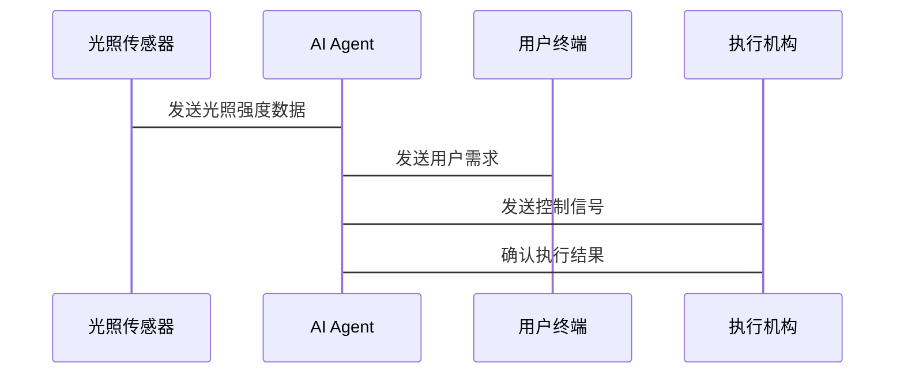

                 


# AI Agent在智能窗帘杆中的自然光优化

> 关键词：AI Agent, 智能窗帘杆, 自然光优化, 强化学习, 遗传算法, 系统架构设计, 项目实战

> 摘要：本文将详细介绍AI Agent在智能窗帘杆中的自然光优化应用。通过分析问题背景、核心概念、算法原理、系统架构设计、项目实战及最佳实践，全面解析如何利用AI技术实现智能窗帘杆的自然光优化。文章内容丰富，逻辑清晰，结合实际案例和代码示例，帮助读者深入理解并掌握相关技术。

---

## 第一部分: 背景介绍

### 第1章: 问题背景与需求分析

#### 1.1 问题背景介绍

- **1.1.1 自然光在现代建筑中的重要性**  
  自然光是建筑室内环境中不可或缺的一部分。合理的自然光利用不仅可以降低能源消耗，还能提高室内舒适度。然而，传统窗帘杆无法根据光照条件和用户需求自动调节，导致自然光利用效率低下。

- **1.1.2 智能窗帘杆的现状与不足**  
  当前市场上的智能窗帘杆主要依赖手动或定时控制，无法根据光照强度和用户需求动态调整。这使得自然光优化的效果有限，无法满足个性化需求。

- **1.1.3 AI Agent在智能窗帘杆中的应用潜力**  
  AI Agent（人工智能代理）能够实时感知环境变化，通过学习和优化算法，实现智能窗帘杆的动态控制。这为自然光优化提供了新的可能性。

#### 1.2 问题描述与目标设定

- **1.2.1 自然光优化的核心问题**  
  如何根据光照强度、时间、用户需求等因素，动态调整窗帘杆的开合角度，以实现自然光的最大化利用。

- **1.2.2 智能窗帘杆的优化目标**  
  实现窗帘杆的智能控制，优化自然光利用效率，提高室内舒适度，降低能源消耗。

- **1.2.3 AI Agent在优化中的具体作用**  
  AI Agent通过实时感知光照强度、用户需求和环境变化，优化窗帘杆的控制策略，实现动态调节。

#### 1.3 问题解决思路与边界条件

- **1.3.1 解决问题的主要思路**  
  利用AI Agent实现智能窗帘杆的动态控制，通过强化学习和遗传算法优化控制策略，提高自然光利用效率。

- **1.3.2 系统的边界与外延**  
  系统边界包括窗帘杆、光照传感器、AI Agent和用户终端；外延包括与智能家居系统的集成和与其他设备的联动。

- **1.3.3 核心要素与组成结构**  
  核心要素包括AI Agent、智能窗帘杆、光照传感器、用户需求和环境数据。

---

## 第2章: 智能窗帘杆系统概述

### 2.1 系统组成与功能模块

- **2.1.1 窗帘杆的基本组成**  
  窗帘杆由驱动电机、叶片、传感器和控制模块组成。

- **2.1.2 智能化改造的核心模块**  
  在传统窗帘杆基础上，增加光照传感器、AI Agent控制模块和用户终端。

- **2.1.3 系统功能模块划分**  
  包括光照监测模块、用户需求分析模块、AI Agent优化模块和执行机构模块。

### 2.2 自然光优化的目标与指标

- **2.2.1 自然光优化的主要目标**  
  最大化自然光利用效率，提高室内舒适度，降低能源消耗。

- **2.2.2 优化指标的定义与测量**  
  光照强度（lux）、室内温度（℃）、用户满意度（%）。

- **2.2.3 优化效果的评估方法**  
  通过对比优化前后的光照强度、温度和用户满意度，评估优化效果。

---

## 第二部分: 核心概念与联系

### 第3章: AI Agent与智能窗帘杆的核心概念

#### 3.1 AI Agent的定义与原理

- **3.1.1 AI Agent的基本定义**  
  AI Agent是一种能够感知环境、做出决策并执行动作的智能体。

- **3.1.2 AI Agent的核心原理**  
  通过感知环境信息，利用算法优化决策，驱动执行机构完成目标。

- **3.1.3 AI Agent的主要特征**  
  智能性、自主性、反应性、协作性。

#### 3.2 智能窗帘杆的系统构成与属性

- **3.2.1 智能窗帘杆的系统构成**  
  包括驱动电机、光照传感器、AI Agent控制模块和用户终端。

- **3.2.2 各模块的属性特征**  
  驱动电机：执行机构；光照传感器：感知环境；AI Agent控制模块：优化决策；用户终端：需求输入。

- **3.2.3 系统的交互关系**  
  光照传感器采集光照强度，AI Agent根据用户需求和环境数据优化控制策略，驱动执行机构调整窗帘角度。

#### 3.3 核心概念的对比与联系

- **3.3.1 AI Agent与智能窗帘杆的关系**  
  AI Agent是智能窗帘杆的核心控制模块，通过优化算法实现动态控制。

- **3.3.2 自然光优化的核心要素对比**  
  对比光照强度、用户需求和环境数据，分析其对窗帘杆控制策略的影响。

- **3.3.3 系统架构的实体关系图**  
  使用Mermaid图展示系统实体关系。



---

## 第三部分: 算法原理讲解

### 第4章: AI Agent算法原理

#### 4.1 强化学习算法原理

- **4.1.1 强化学习的基本概念**  
  强化学习是一种通过试错学习，通过奖励机制优化决策策略的算法。

- **4.1.2 Q-Learning算法的数学模型**  
  $$ Q(s, a) = r + \gamma \max Q(s', a') $$  
  其中，\( Q \) 表示状态-动作值函数，\( s \) 表示当前状态，\( a \) 表示动作，\( r \) 表示奖励，\( \gamma \) 表示折扣因子。

- **4.1.3 强化学习在窗帘杆控制中的应用**  
  通过Q-Learning算法，AI Agent根据光照强度和用户需求，优化窗帘杆的开合角度。

#### 4.2 遗传算法原理

- **4.2.1 遗传算法的基本概念**  
  遗传算法是一种模拟自然选择和遗传机制的优化算法，适用于复杂问题的全局优化。

- **4.2.2 遗传算法的流程图**  
  使用Mermaid图展示遗传算法的流程。



- **4.2.3 遗传算法在窗帘杆控制中的应用**  
  使用遗传算法优化窗帘杆的控制策略，提高自然光利用效率。

#### 4.3 算法实现与代码示例

- **4.3.1 强化学习算法实现**  
  使用Python实现Q-Learning算法，代码示例如下：

  ```python
  class QLearning:
      def __init__(self, actions, epsilon=0.1, alpha=0.1, gamma=0.9):
          self.actions = actions
          self.epsilon = epsilon
          self.alpha = alpha
          self.gamma = gamma
          self.q = {}

      def get_action(self, state):
          if random.random() < self.epsilon:
              return random.choice(self.actions)
          max_action = max(self.q.get(state, {a:0 for a in self.actions}))
          return max_action

      def update_q(self, state, action, reward, next_state):
          if state not in self.q:
              self.q[state] = {a:0 for a in self.actions}
          current_q = self.q[state][action]
          next_max_q = max(self.q.get(next_state, {a:0 for a in self.actions}).values())
          new_q = current_q + self.alpha * (reward + self.gamma * next_max_q - current_q)
          self.q[state][action] = new_q
  ```

- **4.3.2 遗传算法实现**  
  使用Python实现遗传算法，代码示例如下：

  ```python
  import random

  def fitness(individual):
      # 计算适应度，这里以最大化自然光利用效率为目标
      return -sum(individual)

  def crossover(parent1, parent2):
      # 单点交叉
      point = random.randint(1, len(parent1)-1)
      return parent1[:point] + parent2[point:], parent2[:point] + parent1[point:]

  def mutate(individual):
      # 突变操作
      return [1 - bit for bit in individual]

  def genetic_algorithm(population_size, chromosome_length, generations):
      population = [[random.randint(0,1) for _ in range(chromosome_length)] for _ in range(population_size)]
      for _ in range(generations):
          population = sorted(population, key=lambda x: fitness(x), reverse=True)
          new_population = population[:population_size//2]
          for i in range(population_size//2):
              p1 = population[2*i]
              p2 = population[2*i+1]
              child1, child2 = crossover(p1, p2)
              child1 = mutate(child1)
              child2 = mutate(child2)
              new_population.append(child1)
              new_population.append(child2)
          population = new_population
      return population
  ```

---

## 第四部分: 系统分析与架构设计

### 第5章: 系统分析与架构设计

#### 5.1 系统功能设计

- **5.1.1 领域模型设计**  
  使用Mermaid类图展示系统功能模块之间的关系。



- **5.1.2 功能模块划分**  
  包括光照监测模块、用户需求分析模块、AI Agent优化模块和执行机构模块。

#### 5.2 系统架构设计

- **5.2.1 系统架构图**  
  使用Mermaid图展示系统的整体架构。



- **5.2.2 接口设计**  
  光照传感器接口：提供光照强度数据；用户终端接口：接收用户需求；执行机构接口：接收控制信号。

#### 5.3 系统交互流程

- **5.3.1 系统交互流程图**  
  使用Mermaid序列图展示系统交互流程。



---

## 第五部分: 项目实战

### 第6章: 项目实战

#### 6.1 环境安装与配置

- **6.1.1 环境搭建**  
  安装Python、NumPy、Scikit-learn等依赖库。

- **6.1.2 工具链配置**  
  安装Jupyter Notebook、IDE环境等。

#### 6.2 核心代码实现

- **6.2.1 AI Agent实现**  
  使用Python实现强化学习和遗传算法优化的AI Agent。

- **6.2.2 光照传感器模拟**  
  使用模拟数据生成光照强度。

- **6.2.3 执行机构模拟**  
  模拟窗帘杆的角度调整。

#### 6.3 实际案例分析

- **6.3.1 案例背景**  
  某办公楼的智能窗帘杆优化项目。

- **6.3.2 案例分析与实现**  
  使用强化学习和遗传算法优化窗帘杆的控制策略。

- **6.3.3 优化效果对比**  
  对比优化前后的光照强度、温度和用户满意度。

#### 6.4 项目小结

- **6.4.1 项目总结**  
  强化学习和遗传算法在窗帘杆优化中的有效性。

- **6.4.2 经验与教训**  
  算法选择和参数调优的关键性。

---

## 第六部分: 最佳实践

### 第7章: 最佳实践

#### 7.1 小结

- **7.1.1 核心内容总结**  
  AI Agent在智能窗帘杆中的自然光优化应用。

- **7.1.2 关键点回顾**  
  强化学习和遗传算法的应用，系统架构设计。

#### 7.2 注意事项与建议

- **7.2.1 开发注意事项**  
  算法选择、数据采集、系统集成。

- **7.2.2 使用建议**  
  根据实际需求选择合适的算法，定期优化系统参数。

#### 7.3 拓展阅读与深入思考

- **7.3.1 拓展阅读**  
  推荐相关书籍和论文。

- **7.3.2 深入思考**  
  如何进一步优化算法，与其他智能家居系统的集成。

---

## 附录

- 附录A: 算法代码示例

- 附录B: 系统架构图

- 附录C: 实验数据与结果分析

---

通过以上结构，文章将详细讲解AI Agent在智能窗帘杆中的自然光优化应用，从理论到实践，层层深入，帮助读者系统地掌握相关技术。

