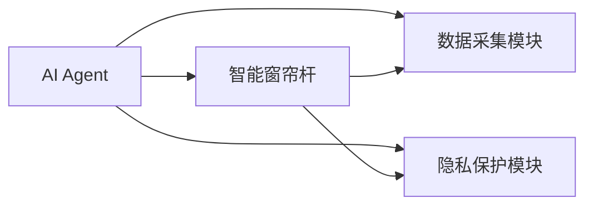
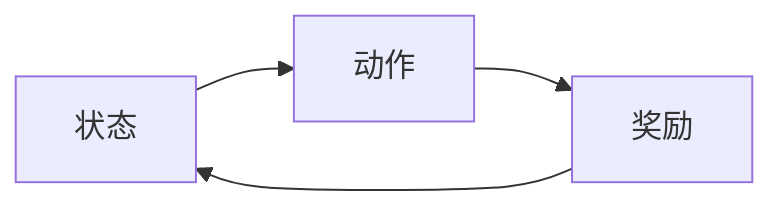
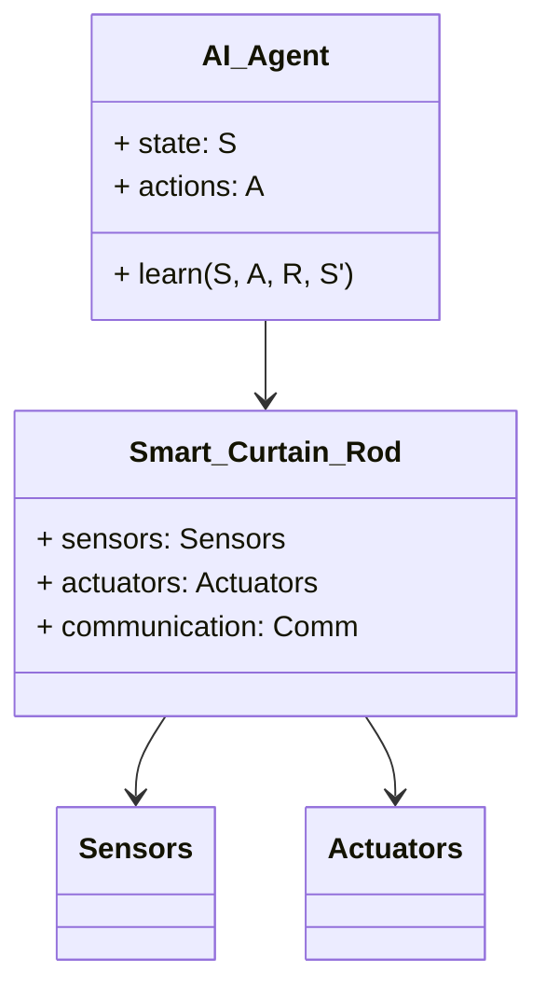
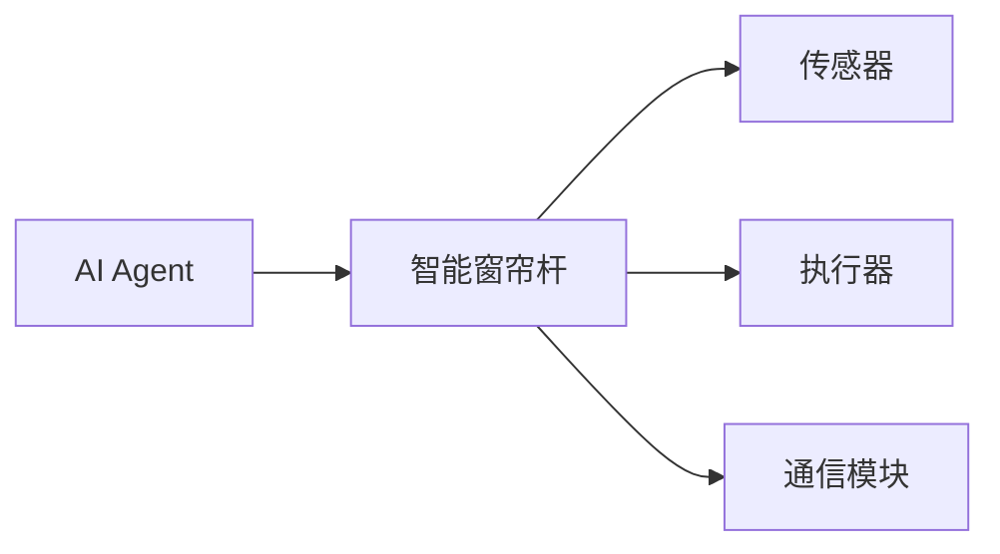
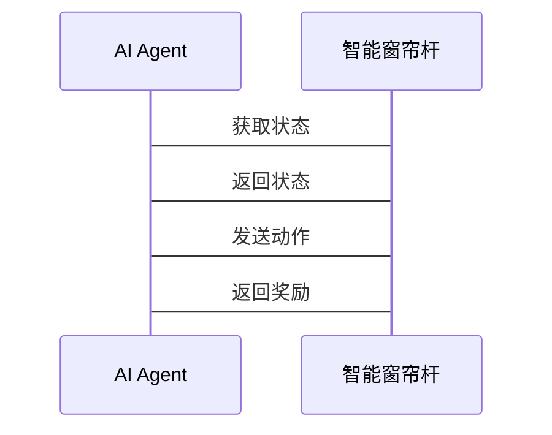

                 


# AI Agent在智能窗帘杆中的隐私保护功能

## 关键词：AI Agent, 智能窗帘杆, 隐私保护, 加强学习, 物联网安全

## 摘要：本文探讨AI Agent在智能窗帘杆中的隐私保护功能，分析其在数据采集、加密和访问控制中的应用，结合强化学习算法，提出系统设计与实现方案，最后通过项目实战和最佳实践总结经验。

---

# 第1章: 背景介绍

## 1.1 问题背景

### 1.1.1 智能窗帘杆的发展现状
智能窗帘杆作为智能家居的重要组成部分，通过物联网技术实现了远程控制和自动化管理。然而，随着功能的增强，隐私问题日益突出。

### 1.1.2 隐私保护的重要性
智能窗帘杆收集大量用户数据，如使用习惯、位置信息等，这些数据若被滥用，可能导致隐私泄露。

### 1.1.3 AI Agent的应用潜力
AI Agent能够实时分析数据，自主决策，为智能窗帘杆提供动态隐私保护。

## 1.2 问题描述

### 1.2.1 隐私风险
未经授权的访问、数据泄露和未授权的设备接入等风险。

### 1.2.2 AI Agent的作用
通过学习用户行为，AI Agent能够识别异常行为，主动采取保护措施。

### 1.2.3 问题解决的必要性
确保智能窗帘杆的安全性，保护用户隐私。

## 1.3 概念结构与核心要素

### 1.3.1 AI Agent的定义
AI Agent是能够感知环境、自主决策的智能体，具备学习和推理能力。

### 1.3.2 智能窗帘杆的系统架构
由传感器、执行机构、通信模块和控制面板组成，支持远程控制和数据采集。

### 1.3.3 隐私保护的核心要素
数据加密、访问控制和行为分析，确保数据安全和用户隐私。

---

# 第2章: 核心概念与联系

## 2.1 AI Agent的核心原理

### 2.1.1 强化学习
AI Agent通过与环境互动，学习策略以最大化累积奖励。

### 2.1.2 状态、动作和奖励
- **状态**：AI Agent所处环境的信息。
- **动作**：Agent采取的行动。
- **奖励**：行动的结果反馈。

### 2.1.3 在智能窗帘杆中的应用
AI Agent学习用户行为模式，识别异常活动，触发隐私保护机制。

## 2.2 智能窗帘杆的隐私保护机制

### 2.2.1 数据采集与处理
传感器收集数据，AI Agent分析数据，识别异常。

### 2.2.2 数据加密与传输
采用AES加密算法，确保数据传输安全。

### 2.2.3 数据访问控制
基于角色的访问控制模型，限制数据访问权限。

## 2.3 AI Agent与智能窗帘杆的关系

### 2.3.1 功能模块对比
| 概念 | 功能 |
|------|------|
| AI Agent | 数据分析、决策制定 |
| 智能窗帘杆 | 数据采集、执行动作 |

### 2.3.2 实体关系图


---

# 第3章: 算法原理讲解

## 3.1 强化学习算法

### 3.1.1 算法流程


### 3.1.2 Python实现
```python
class AI_Agent:
    def __init__(self):
        self.Q = {}  # Q-learning表
        self.alpha = 0.1  # 学习率
        self.gamma = 0.9  # 折扣因子

    def learn(self, state, action, reward, next_state):
        if state not in self.Q:
            self.Q[state] = 0
        current_q = self.Q[state]
        next_max_q = max(self.Q.get(next_state, 0), 0)
        new_q = current_q + self.alpha * (reward + self.gamma * next_max_q - current_q)
        self.Q[state] = new_q

    def choose_action(self, state, actions):
        if state in self.Q:
            max_action = max(actions, key=lambda x: self.Q[state][x])
        else:
            max_action = actions[0]
        return max_action
```

### 3.1.3 数学模型
状态转移概率：
$$ P(s' | s, a) $$
Q-learning目标：
$$ Q(s,a) = Q(s,a) + \alpha [r + \gamma \max Q(s',a') - Q(s,a)] $$

---

# 第4章: 系统分析与架构设计

## 4.1 系统功能设计

### 4.1.1 领域模型


### 4.1.2 系统架构


### 4.1.3 接口设计
API接口：`/api/agent/action`，接收命令并执行动作。

## 4.2 交互序列图



---

# 第5章: 项目实战

## 5.1 环境安装

### 5.1.1 安装Python库
```bash
pip install numpy matplotlib scikit-learn
```

## 5.2 核心代码实现

### 5.2.1 AI Agent实现
```python
class AI_Agent:
    def __init__(self):
        self.Q = {}

    def learn(self, state, action, reward, next_state):
        if state not in self.Q:
            self.Q[state] = {}
        current_q = self.Q[state].get(action, 0)
        next_max_q = max(self.Q.get(next_state, {}).values(), default=0)
        new_q = current_q + 0.1 * (reward + 0.9 * next_max_q - current_q)
        self.Q[state][action] = new_q

    def choose_action(self, state, actions):
        if state not in self.Q:
            return actions[0]
        return max(actions, key=lambda x: self.Q[state].get(x, 0))
```

## 5.3 代码解读与分析

### 5.3.1 功能解读
- `learn`方法：更新Q值表。
- `choose_action`方法：基于当前状态选择最优动作。

### 5.3.2 应用场景
AI Agent分析用户行为模式，识别异常访问，触发隐私保护机制。

## 5.4 实际案例分析

### 5.4.1 案例描述
某用户早晨7点自动开启窗帘，AI Agent学习后，识别中午12点异常的窗帘关闭指令，触发报警。

### 5.4.2 分析过程
AI Agent通过强化学习，识别异常行为模式，采取隐私保护措施。

## 5.5 项目小结
成功实现AI Agent在智能窗帘杆中的隐私保护功能，验证了算法的有效性。

---

# 第6章: 最佳实践

## 6.1 小结
AI Agent通过强化学习，有效保护智能窗帘杆的隐私安全。

## 6.2 注意事项
- 定期更新模型，适应新威胁。
- 确保数据加密传输，防止中间人攻击。

## 6.3 拓展阅读
建议阅读《强化学习实战》和《物联网安全指南》，深入理解相关知识。

---

# 结语

通过本文的详细讲解，读者可以全面了解AI Agent在智能窗帘杆中的隐私保护功能，掌握其实现方法和应用价值。

