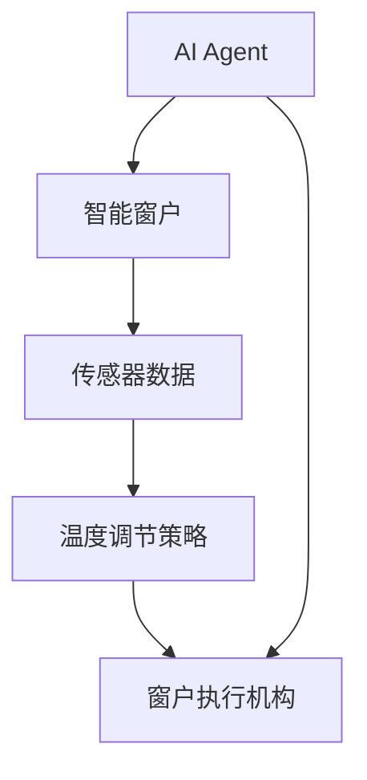

                 

# AI Agent在智能窗户中的室内温度自动调节

> 关键词：AI Agent, 智能窗户, 室内温度调节, 机器学习, 物联网

> 摘要：本文详细探讨了AI Agent在智能窗户中的应用，通过分析温度调节的算法原理、系统架构设计以及实际案例，展示了如何利用AI技术优化室内温度调节过程，提升居住舒适度和能源效率。

---

## 第一部分：AI Agent在智能窗户中的室内温度自动调节背景介绍

### 第1章：问题背景与描述

#### 1.1 问题背景
- **1.1.1 当前室内温度调节的挑战**  
  传统空调系统能耗高、调节延迟大，难以实现精准的温度控制。  
  智能窗户通过调节采光和通风，可以辅助空调系统，降低能耗。

- **1.1.2 智能窗户的定义与特点**  
  智能窗户集成传感器和执行器，能够根据环境条件自动调节开合角度，优化室内温度和空气质量。

- **1.1.3 AI Agent在温度调节中的作用**  
  AI Agent通过分析环境数据，优化窗户的开合策略，提升室内温度调节的效率和舒适度。

#### 1.2 问题描述
- **1.2.1 室内温度调节的复杂性**  
  室内温度受室外环境、人体活动、设备运行等多种因素影响，传统控制方法难以应对复杂场景。

- **1.2.2 智能窗户与传统窗户的区别**  
  智能窗户具备自动化调节能力，能够根据实时数据调整开合角度，而传统窗户无法实现自动化控制。

- **1.2.3 AI Agent如何优化温度调节**  
  AI Agent通过实时数据分析和预测，优化窗户的开合策略，减少能源浪费，提升舒适度。

#### 1.3 问题解决
- **1.3.1 AI Agent的核心功能**  
  数据采集、分析、预测和决策，优化窗户的开合策略，实现精准的温度调节。

- **1.3.2 智能窗户与AI Agent的协同工作**  
  AI Agent通过传感器数据，计算最优窗户开合角度，指导执行机构调整窗户状态。

- **1.3.3 温度调节的优化目标**  
  实现舒适、节能的室内温度调节，减少能源消耗，提升居住体验。

#### 1.4 边界与外延
- **1.4.1 AI Agent的适用场景**  
  适用于需要精确温度控制的建筑，如家庭、办公室、公共场所等。

- **1.4.2 温度调节的边界条件**  
  包括环境温度、湿度、光照强度、室内人数等因素。

- **1.4.3 智能窗户与其他智能家居设备的协同**  
  通过物联网平台，与智能空调、智能灯具等设备协同工作，实现全屋智能化控制。

#### 1.5 概念结构与核心要素
- **1.5.1 核心概念的组成**  
  包括AI Agent、智能窗户、传感器、执行器、温度调节策略等。

- **1.5.2 核心要素的对比分析**  
  对比传统窗户与智能窗户的功能差异，分析AI Agent在温度调节中的独特优势。

- **1.5.3 概念结构的图示化展示**  
  使用Mermaid图展示AI Agent与智能窗户的协同关系，以及各组成部分的功能模块。

---

## 第2章：核心概念与联系

### 2.1 AI Agent的核心原理
- **2.1.1 AI Agent的基本概念**  
  AI Agent是一种智能体，能够感知环境、分析数据、做出决策并执行动作。

- **2.1.2 AI Agent的决策机制**  
  基于实时数据，通过机器学习模型预测最优窗户开合角度。

- **2.1.3 AI Agent的学习与优化**  
  使用强化学习算法，不断优化窗户调节策略，提升温度调节效率。

### 2.2 智能窗户的核心原理
- **2.2.1 智能窗户的结构与功能**  
  集成温度、湿度、光照强度等多种传感器，能够根据环境数据自动调节窗户开合角度。

- **2.2.2 智能窗户的传感器与执行器**  
  传感器负责采集环境数据，执行器负责调整窗户状态。

- **2.2.3 智能窗户的**

---

### 使用 Mermaid 绘制的概念结构图

---

通过以上思考，我们可以看到，AI Agent在智能窗户中的应用需要综合考虑环境数据、算法优化、系统架构等多个方面。接下来，我们将详细介绍AI Agent的算法原理、数学模型以及系统架构设计，帮助读者更深入地理解这一技术的实现细节。

