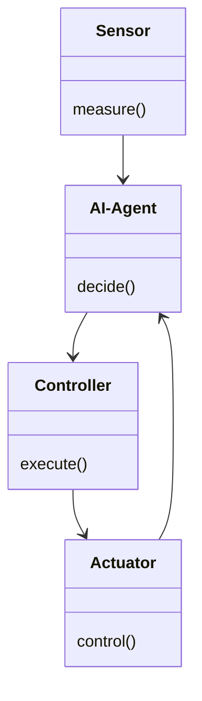
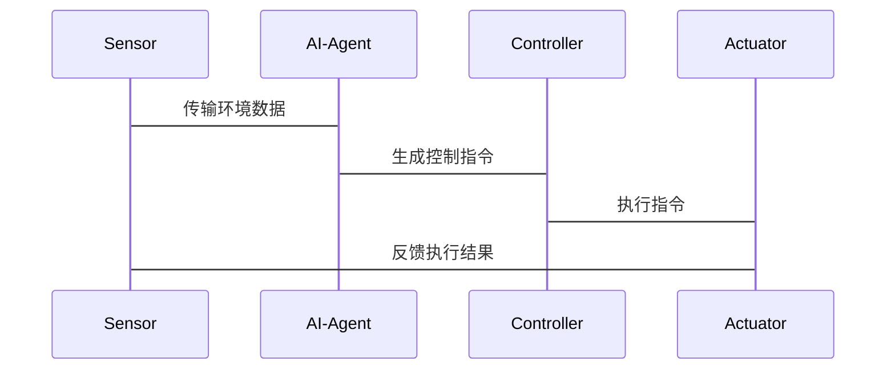

                 


# AI Agent在智能窗户中的室内空气质量控制

## 关键词：AI Agent, 智能窗户, 室内空气质量, 算法原理, 系统架构

## 摘要：
本文探讨了AI Agent在智能窗户中的应用，重点分析了其如何通过感知、决策和执行优化室内空气质量。文章首先介绍了AI Agent和智能窗户的基本概念及其在空气质量控制中的重要性，随后详细阐述了AI Agent的工作原理、算法实现以及与智能窗户的交互机制。通过实际案例，展示了AI Agent在智能窗户中的具体应用，最后总结了当前研究的成果与未来的发展方向。

---

# 第一部分: AI Agent与智能窗户概述

## 第1章: 背景介绍

### 1.1 问题背景
#### 1.1.1 室内空气质量的重要性
室内空气质量直接影响居住者的健康和舒适度。随着城市化进程的加快，封闭的建筑结构使得空气流通不畅，导致污染物浓度增加，引发呼吸系统疾病等问题。因此，优化室内空气质量已成为现代建筑的重要课题。

#### 1.1.2 智能窗户的基本概念
智能窗户是一种集成传感器、执行器和控制系统的窗户，能够根据环境条件自动调整开合状态。常见的智能窗户通过电机驱动，实现远程控制或自动化操作。

#### 1.1.3 AI Agent在智能窗户中的应用背景
AI Agent（智能代理）是一种能够感知环境、自主决策并执行任务的智能系统。将AI Agent应用于智能窗户，可以使其具备自主学习和优化的能力，从而更高效地调节室内空气质量。

### 1.2 问题描述
#### 1.2.1 室内空气质量监测的挑战
传统空气质量监测依赖于固定的传感器和人工干预，存在响应慢、效率低的问题。此外，复杂的环境因素（如温度、湿度、污染物浓度等）使得空气质量优化变得复杂。

#### 1.2.2 智能窗户的控制需求
智能窗户需要实时感知室内环境，并根据空气质量动态调整开合状态。然而，如何实现高效、智能的控制是当前面临的主要挑战。

#### 1.2.3 AI Agent在智能窗户中的目标与意义
AI Agent的目标是通过实时感知和学习，优化智能窗户的开合策略，从而实现室内空气质量的最优控制。其意义在于提升居住舒适度、降低能耗，并为智能建筑的发展提供新思路。

### 1.3 问题解决思路
#### 1.3.1 AI Agent的基本原理
AI Agent通过感知环境信息，结合历史数据和决策模型，生成最优控制策略。其核心在于算法的设计和优化。

#### 1.3.2 智能窗户的控制机制
智能窗户的控制机制包括数据采集、信息处理、决策生成和执行反馈四个环节。AI Agent通过实时数据和模型预测，优化控制策略。

#### 1.3.3 室内空气质量优化的实现路径
实现路径包括：（1）建立空气质量监测系统；（2）设计AI Agent算法；（3）优化智能窗户的控制策略。

### 1.4 边界与外延
#### 1.4.1 系统边界
智能窗户系统包括传感器、执行器、控制器和AI Agent。边界明确后，系统才能高效运行。

#### 1.4.2 外延与扩展
AI Agent的应用不仅限于智能窗户，还可以扩展到智能家居、智慧城市等领域。

#### 1.4.3 系统与环境的交互
智能窗户与环境的交互通过传感器和执行器实现。AI Agent负责处理这些交互数据，优化系统运行。

### 1.5 概念结构与核心要素
#### 1.5.1 核心概念组成
智能窗户系统由传感器、执行器、控制器和AI Agent组成。AI Agent负责协调各部分，实现空气质量优化。

#### 1.5.2 关键要素对比
| 要素 | 描述 |
|------|------|
| 传感器 | 数据采集 |
| 执行器 | 调节开合 |
| 控制器 | 执行决策 |
| AI Agent | 综合协调 |

#### 1.5.3 系统整体架构
智能窗户系统是一个闭环系统，AI Agent作为核心，协调各部分完成空气质量优化。

---

## 第2章: AI Agent与智能窗户的核心概念

### 2.1 AI Agent的基本原理
#### 2.1.1 AI Agent的定义与特点
AI Agent是一种能够感知环境、自主决策并执行任务的智能系统。其特点包括自主性、反应性、学习能力和适应性。

#### 2.1.2 AI Agent的核心属性
- **自主性**：无需外部干预，自主完成任务。
- **反应性**：实时感知环境并做出反应。
- **学习能力**：通过数据学习优化决策策略。
- **适应性**：根据环境变化调整行为。

#### 2.1.3 AI Agent的分类与应用场景
AI Agent可以分为基于规则的和基于模型的两类。在智能窗户中，基于模型的AI Agent更适用于复杂环境的优化控制。

### 2.2 智能窗户的基本原理
#### 2.2.1 智能窗户的定义与特点
智能窗户是集成传感器、执行器和控制系统的智能设备，能够根据环境条件自动调整开合状态。

#### 2.2.2 智能窗户的核心组件
- **传感器**：采集环境数据（如温湿度、污染物浓度）。
- **执行器**：调节窗户的开合状态。
- **控制器**：执行AI Agent的决策指令。

#### 2.2.3 智能窗户的控制需求
智能窗户需要实时感知环境，并根据空气质量动态调整开合状态。

### 2.3 AI Agent与智能窗户的联系
#### 2.3.1 AI Agent在智能窗户中的角色
AI Agent作为智能窗户的核心，负责数据处理、决策生成和系统控制。

#### 2.3.2 AI Agent与智能窗户的交互流程
1. 传感器采集环境数据。
2. AI Agent接收数据并分析。
3. AI Agent生成控制指令。
4. 执行器执行指令。

#### 2.3.3 AI Agent对室内空气质量的影响
AI Agent通过优化窗户开合策略，实现室内空气质量的最优控制。

---

## 第3章: AI Agent的算法原理

### 3.1 算法概述
AI Agent的核心算法是强化学习（Reinforcement Learning）。通过与环境的交互，AI Agent学习最优策略。

### 3.2 算法实现
#### 3.2.1 强化学习的基本原理
强化学习通过奖励机制，引导AI Agent学习最优策略。算法通过状态、动作和奖励的循环，逐步优化决策模型。

#### 3.2.2 算法实现步骤
1. 初始化状态空间、动作空间和奖励函数。
2. AI Agent与环境交互，获取状态和奖励。
3. 更新策略模型，优化决策策略。

### 3.3 算法的数学模型
强化学习的数学模型包括状态空间、动作空间和价值函数。通过Q-learning算法，AI Agent学习最优策略。

#### 3.3.1 Q-learning算法
Q-learning是一种经典的强化学习算法，适用于离线学习。其核心公式为：
$$ Q(s, a) = Q(s, a) + \alpha [r + \gamma \max Q(s', a') - Q(s, a)] $$

其中：
- \( s \)：当前状态
- \( a \)：当前动作
- \( r \)：奖励
- \( \gamma \)：折扣因子
- \( \alpha \)：学习率

#### 3.3.2 算法实现代码
以下是一个简单的Q-learning实现示例：

```python
import numpy as np

class AI-Agent:
    def __init__(self, state_space, action_space):
        self.q_table = np.zeros((state_space, action_space))
        self.learning_rate = 0.1
        self.discount_factor = 0.9

    def choose_action(self, state):
        return np.argmax(self.q_table[state])

    def learn(self, state, action, reward, next_state):
        self.q_table[state, action] += self.learning_rate * (reward + self.discount_factor * np.max(self.q_table[next_state]) - self.q_table[state, action])
```

---

## 第4章: 系统分析与架构设计方案

### 4.1 问题场景介绍
智能窗户系统需要实时监测室内空气质量，并通过AI Agent优化窗户的开合策略。

### 4.2 项目介绍
本项目旨在设计一个基于AI Agent的智能窗户系统，优化室内空气质量。

### 4.3 系统功能设计
系统功能包括：
- 数据采集：传感器采集环境数据。
- 数据处理：AI Agent分析数据并生成决策。
- 系统控制：执行器调整窗户开合状态。

#### 4.3.1 领域模型
领域模型是一个简单的类图，展示了系统各部分的关系。



#### 4.3.2 系统架构
系统架构采用分层设计，包括传感器层、AI Agent层和执行层。


#### 4.3.3 系统交互
系统交互流程如下：



---

## 第5章: 项目实战

### 5.1 环境安装
需要安装传感器、执行器和AI Agent系统。传感器可以使用MQ-2气体传感器，执行器使用电机驱动模块。

### 5.2 系统核心实现
AI Agent通过强化学习算法优化窗户的开合策略。

#### 5.2.1 代码实现
以下是一个简单的AI Agent实现：

```python
import numpy as np
import time

class AI-Agent:
    def __init__(self, state_space, action_space):
        self.q_table = np.zeros((state_space, action_space))
        self.lr = 0.1
        self.gamma = 0.9

    def choose_action(self, state):
        return np.argmax(self.q_table[state])

    def learn(self, state, action, reward, next_state):
        self.q_table[state, action] += self.lr * (reward + self.gamma * np.max(self.q_table[next_state]) - self.q_table[state, action])

# 初始化AI Agent
state_space = 5  # 状态空间大小
action_space = 2  # 动作空间大小（开窗或关窗）
ai_agent = AI-Agent(state_space, action_space)

# 训练过程
for episode in range(100):
    state = 0  # 初始状态
    action = ai_agent.choose_action(state)
    # 模拟环境反馈
    reward = 1 if action == 1 else 0  # 假设开窗得到奖励
    next_state = 1
    ai_agent.learn(state, action, reward, next_state)
```

#### 5.2.2 代码解读
上述代码实现了AI Agent的训练过程，通过不断的学习优化窗户的开合策略。

### 5.3 实际案例分析
以一个典型场景为例，AI Agent通过学习掌握了最优的窗户控制策略。

---

## 第6章: 总结与展望

### 6.1 项目总结
本文详细介绍了AI Agent在智能窗户中的应用，通过强化学习算法优化了室内空气质量。

### 6.2 经验与教训
在实际开发中，传感器的精度和环境的复杂性对AI Agent的性能影响较大。

### 6.3 未来展望
未来，可以进一步优化AI Agent的算法，引入更多传感器和数据源，提升系统的智能化水平。

---

# 附录

## 附录A: AI Agent的数学公式
Q-learning算法的核心公式：
$$ Q(s, a) = Q(s, a) + \alpha [r + \gamma \max Q(s', a') - Q(s, a)] $$

---

## 附录B: 代码实现
完整的AI Agent代码实现示例。

---

通过以上内容，我们详细探讨了AI Agent在智能窗户中的应用，从理论到实践，为读者提供了全面的技术指导。

