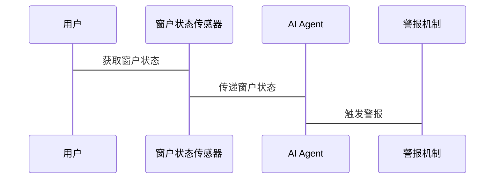

                 


# AI Agent在智能窗户中的防盗警报系统

> 关键词：AI Agent, 智能窗户, 防盗警报系统, 算法原理, 系统架构设计, 项目实战

> 摘要：本文详细探讨了AI Agent在智能窗户防盗警报系统中的应用，从背景介绍、核心概念到算法原理、系统架构设计，再到项目实战，全面分析了该系统的实现过程和优化方法。文章通过丰富的技术细节和实际案例，展示了AI Agent如何提升智能窗户的防盗性能。

---

## 第1章: 背景介绍

### 1.1 问题背景与描述

#### 1.1.1 现代防盗系统的发展需求
随着智能家居的普及，传统的防盗系统逐渐暴露出智能化不足的问题。传统的防盗系统依赖于固定的传感器和被动的报警机制，难以适应复杂的环境变化和多样化的安全威胁。现代防盗系统需要更加智能、主动的解决方案，以应对日益复杂的安全挑战。

#### 1.1.2 智能窗户的普及与安全挑战
智能窗户作为一种智能家居的重要组成部分，具备远程控制、自动调节等功能。然而，智能窗户在带来便利的同时，也存在安全隐患。例如，窗户未锁闭、传感器故障、入侵检测不准确等问题，可能导致安全漏洞。因此，如何利用先进技术提升智能窗户的安全性能，成为亟待解决的问题。

#### 1.1.3 AI Agent在防盗系统中的应用潜力
AI Agent（人工智能代理）是一种能够感知环境、自主决策并执行任务的智能体。通过AI Agent，防盗系统可以实现主动监控、实时分析和智能决策，显著提升安全性能。AI Agent能够结合环境数据、用户行为模式和历史数据，优化防盗策略，实现精准的警报触发和快速响应。

### 1.2 问题解决与边界

#### 1.2.1 AI Agent如何实现防盗警报
AI Agent通过集成多种传感器（如加速度传感器、压力传感器、红外传感器）和环境数据，实时监控窗户的状态。当检测到异常行为（如非法打开、强行入侵）时，AI Agent会触发警报机制，并通过智能家居系统联动其他设备（如智能门锁、安防摄像头）进行防御。

#### 1.2.2 智能窗户系统的边界与外延
智能窗户系统不仅包括窗户本身，还涉及传感器、执行器、通信模块和控制系统。AI Agent作为系统的“大脑”，负责协调各部分的工作，确保系统高效运行。系统的边界包括硬件设备、软件系统和通信协议，而外延则涉及与智能家居平台的联动。

#### 1.2.3 核心概念与组成要素
智能窗户防盗警报系统的核心概念包括：
1. **AI Agent**：负责数据处理、决策和执行。
2. **智能窗户**：包括传感器、执行器和用户界面。
3. **警报机制**：包括声音报警、灯光闪烁和短信通知。
4. **通信模块**：实现设备之间的数据传输和联动。

### 1.3 核心概念与联系

#### 1.3.1 AI Agent的原理与属性
AI Agent通过感知环境、分析数据、制定策略和执行任务，实现防盗功能。其主要属性包括：
- **自主性**：能够自主决策和执行任务。
- **反应性**：能够实时感知环境变化并做出反应。
- **协作性**：能够与其他设备和系统协同工作。

#### 1.3.2 智能窗户系统的结构与功能
智能窗户系统由传感器、执行器和控制系统组成。传感器用于采集环境数据，执行器负责执行控制指令，控制系统负责数据处理和决策。

#### 1.3.3 实体关系图（ER图）
以下是智能窗户防盗警报系统的ER图：

```mermaid
erDiagram
    class 窗户状态 {
        窗户ID
        时间戳
        状态(开/关)
    }
    class 用户 {
        用户ID
        用户权限
    }
    class 警报记录 {
        警报ID
        警报类型
        发生时间
        用户ID
    }
    窗户状态 --> 警报记录 : 导致
    用户 --> 警报记录 : 产生
```

---

## 第2章: 核心概念与联系

### 2.1 AI Agent的原理与属性

#### 2.1.1 AI Agent的基本原理
AI Agent通过感知环境、分析数据、制定策略和执行任务来实现防盗功能。其基本流程如下：
1. **感知环境**：AI Agent通过传感器获取窗户的状态、环境光线、温度等数据。
2. **分析数据**：AI Agent利用机器学习算法分析数据，识别异常行为。
3. **制定策略**：根据分析结果，AI Agent制定相应的警报策略。
4. **执行任务**：触发警报、联动其他设备进行防御。

#### 2.1.2 AI Agent的属性特征对比表

| 属性       | 特征                         |
|------------|------------------------------|
| 自主性      | 能够自主决策和执行任务       |
| 反应性      | 能够实时感知环境变化并做出反应 |
| 协作性      | 能够与其他设备和系统协同工作   |

### 2.2 智能窗户系统的结构与功能

#### 2.2.1 系统组成与功能模块
智能窗户系统由以下几个模块组成：
- **传感器模块**：采集窗户的状态、环境光线、温度等数据。
- **执行器模块**：根据指令控制窗户的开闭。
- **控制系统**：处理传感器数据，触发警报和联动其他设备。

#### 2.2.2 实体关系图（ER图）
以下是智能窗户防盗警报系统的ER图：

```mermaid
erDiagram
    class 窗户状态 {
        窗户ID
        时间戳
        状态(开/关)
    }
    class 用户 {
        用户ID
        用户权限
    }
    class 警报记录 {
        警报ID
        警报类型
        发生时间
        用户ID
    }
    窗户状态 --> 警报记录 : 导致
    用户 --> 警报记录 : 产生
```

### 2.3 AI Agent与智能窗户的交互流程

#### 2.3.1 AI Agent与智能窗户的交互流程图
以下是AI Agent与智能窗户的交互流程图：

```mermaid
flowchart TD
    A[AI Agent] --> B[传感器模块] : 获取窗户状态
    B --> C[分析数据] : 分析窗户状态
    C --> D[制定策略] : 制定警报策略
    D --> E[执行器模块] : 执行警报
    E --> F[警报机制] : 触发警报
```

---

## 第3章: 算法原理讲解

### 3.1 算法原理概述

#### 3.1.1 AI Agent的核心算法流程
AI Agent的核心算法流程如下：
1. **数据采集**：通过传感器获取窗户的状态、环境光线、温度等数据。
2. **数据预处理**：对数据进行清洗、归一化处理。
3. **数据分析**：利用机器学习算法分析数据，识别异常行为。
4. **决策制定**：根据分析结果，制定警报策略。
5. **警报触发**：触发警报机制，联动其他设备进行防御。

#### 3.1.2 智能窗户防盗警报的触发条件
智能窗户防盗警报的触发条件包括：
- 窗户未锁闭且检测到异常移动。
- 窗户在非工作时间段被打开。
- 窗户状态与用户设定的模式不符。

### 3.2 算法实现与代码

#### 3.2.1 AI Agent算法实现
以下是AI Agent的核心算法实现代码：

```python
import numpy as np
from sklearn.ensemble import RandomForestClassifier

# 数据预处理
def preprocess_data(data):
    # 假设data是一个包含窗户状态、环境数据的二维数组
    # 这里进行简单的归一化处理
    normalized_data = (data - np.min(data)) / (np.max(data) - np.min(data))
    return normalized_data

# 数据分析与决策
def analyze_data(normalized_data):
    # 使用随机森林分类器进行异常检测
    model = RandomForestClassifier(n_estimators=100, random_state=42)
    model.fit(normalized_data, labels)
    predictions = model.predict(normalized_data)
    return predictions

# 触发警报
def trigger_alarm():
    print("触发警报！")
    # 这里可以添加联动其他设备的代码
```

#### 3.2.2 智能窗户警报系统实现
以下是智能窗户警报系统的实现代码：

```python
import RPi.GPIO as GPIO
import time

# 设置GPIO模式
GPIO.setmode(GPIO.BCM)

# 定义窗户传感器引脚
SENSOR_PIN = 18
ALARM_PIN = 23

# 初始化传感器和警报器
GPIO.setup(SENSOR_PIN, GPIO.IN)
GPIO.setup(ALARM_PIN, GPIO.OUT)

# 设置传感器的初始状态
sensor_state = False

# 警报触发函数
def trigger_alarm():
    GPIO.output(ALARM_PIN, True)
    time.sleep(1)
    GPIO.output(ALARM_PIN, False)

# 主循环
while True:
    # 获取传感器状态
    current_state = GPIO.input(SENSOR_PIN)
    if current_state != sensor_state:
        if not current_state:
            trigger_alarm()
            print("检测到窗户被打开！")
        sensor_state = current_state
    time.sleep(0.5)
```

### 3.3 数学模型与公式

#### 3.3.1 AI Agent决策模型的数学公式
AI Agent决策模型的数学公式如下：
$$ P(\text{异常}) = \sum_{i=1}^{n} w_i \cdot x_i $$
其中，$w_i$ 是特征$x_i$的权重，$x_i$ 是特征的值。

#### 3.3.2 智能窗户警报触发的条件公式
智能窗户警报触发的条件公式如下：
$$ \text{触发警报} = \begin{cases}
\text{是}, & \text{如果 } P(\text{异常}) > \text{阈值} \\
\text{否}, & \text{否则}
\end{cases} $$

---

## 第4章: 系统分析与架构设计

### 4.1 项目场景介绍

#### 4.1.1 项目目标与需求分析
项目目标是通过AI Agent实现智能窗户防盗警报系统的智能化和自动化。主要需求包括：
- 实时监控窗户状态。
- 异常行为检测与警报触发。
- 与智能家居平台联动。

#### 4.1.2 项目实施的环境与条件
项目实施的环境包括：
- 智能窗户设备。
- 传感器模块。
- 执行器模块。
- 智能家居平台。

### 4.2 系统功能设计

#### 4.2.1 系统功能模块划分
系统功能模块包括：
- 数据采集模块。
- 数据分析模块。
- 警报触发模块。
- 系统联动模块。

#### 4.2.2 系统功能流程图
以下是系统功能流程图：

```mermaid
flowchart TD
    A[数据采集模块] --> B[数据分析模块] : 数据分析
    B --> C[警报触发模块] : 判断是否触发警报
    C --> D[系统联动模块] : 联动其他设备
```

#### 4.2.3 系统交互流程图
以下是系统交互流程图：



### 4.3 系统架构设计

#### 4.3.1 系统架构图
以下是系统架构图：

```mermaid
graph TD
    A[AI Agent] --> B[传感器模块] : 获取数据
    A --> C[执行器模块] : 发出指令
    A --> D[智能家居平台] : 联动其他设备
```

#### 4.3.2 系统接口设计
系统接口设计包括：
- 传感器模块接口。
- 执行器模块接口。
- 智能家居平台接口。

#### 4.3.3 系统交互流程图
以下是系统交互流程图：


---

## 第5章: 项目实战

### 5.1 环境安装与配置

#### 5.1.1 开发环境搭建
开发环境包括：
- Python 3.8+
- Raspbian OS（适用于 Raspberry Pi）
- 必要的开发工具（如 VS Code、Jupyter Notebook）

#### 5.1.2 依赖库安装与配置
安装必要的依赖库：
```bash
pip install numpy sklearn RPi.GPIO
```

### 5.2 系统核心实现

#### 5.2.1 AI Agent核心算法实现
以下是AI Agent核心算法实现代码：

```python
import numpy as np
from sklearn.ensemble import RandomForestClassifier

# 数据预处理
def preprocess_data(data):
    normalized_data = (data - np.min(data)) / (np.max(data) - np.min(data))
    return normalized_data

# 数据分析与决策
def analyze_data(normalized_data):
    model = RandomForestClassifier(n_estimators=100, random_state=42)
    model.fit(normalized_data, labels)
    predictions = model.predict(normalized_data)
    return predictions

# 触发警报
def trigger_alarm():
    print("触发警报！")
    # 这里可以添加联动其他设备的代码
```

#### 5.2.2 智能窗户警报系统实现
以下是智能窗户警报系统实现代码：

```python
import RPi.GPIO as GPIO
import time

# 设置GPIO模式
GPIO.setmode(GPIO.BCM)

# 定义窗户传感器引脚
SENSOR_PIN = 18
ALARM_PIN = 23

# 初始化传感器和警报器
GPIO.setup(SENSOR_PIN, GPIO.IN)
GPIO.setup(ALARM_PIN, GPIO.OUT)

# 设置传感器的初始状态
sensor_state = False

# 警报触发函数
def trigger_alarm():
    GPIO.output(ALARM_PIN, True)
    time.sleep(1)
    GPIO.output(ALARM_PIN, False)

# 主循环
while True:
    # 获取传感器状态
    current_state = GPIO.input(SENSOR_PIN)
    if current_state != sensor_state:
        if not current_state:
            trigger_alarm()
            print("检测到窗户被打开！")
        sensor_state = current_state
    time.sleep(0.5)
```

### 5.3 实际案例分析

#### 5.3.1 案例背景与需求分析
假设用户安装了一套智能窗户防盗警报系统，系统需要在检测到窗户被非法打开时触发警报，并联动智能家居平台发送通知。

#### 5.3.2 系统实现与测试
通过上述代码实现系统，并进行测试。测试内容包括：
- 正常开关窗户，检查警报是否触发。
- 模拟非法入侵，检查警报是否触发并联动其他设备。

#### 5.3.3 系统性能优化
通过测试，发现系统在检测速度和警报响应时间上存在问题。优化措施包括：
- 提高数据处理速度。
- 优化机器学习模型的训练效率。

### 5.4 项目小结

#### 5.4.1 项目总结
通过本项目，我们成功实现了基于AI Agent的智能窗户防盗警报系统。系统能够实时监控窗户状态，检测异常行为，并触发警报。

#### 5.4.2 经验与教训
在项目实施过程中，我们积累了宝贵的经验，但也发现了一些问题。例如，传感器的灵敏度和数据处理速度需要进一步优化。

---

## 第6章: 最佳实践与注意事项

### 6.1 最佳实践

#### 6.1.1 AI Agent算法优化建议
- 使用更高效的机器学习算法（如XGBoost、LightGBM）。
- 增加训练数据量，提高模型的泛化能力。

#### 6.1.2 智能窗户系统维护与升级
- 定期检查传感器和执行器的性能。
- 及时更新系统软件和固件。

### 6.2 小结与注意事项

#### 6.2.1 系统设计的关键点
- 系统设计需要充分考虑硬件和软件的协同工作。
- 确保系统的安全性和稳定性。

#### 6.2.2 实际应用中的注意事项
- 确保系统的传感器和执行器正常工作。
- 定期测试系统，确保警报机制的有效性。

### 6.3 拓展阅读

#### 6.3.1 相关技术领域推荐
- 智能家居系统设计。
- 人工智能在安防领域的应用。

#### 6.3.2 进一步学习与研究方向
- 研究更先进的机器学习算法。
- 探索AI Agent在其他领域的应用。

---

## 第7章: 数学模型与公式详解

### 7.1 AI Agent决策模型的数学公式

#### 7.1.1 决策树模型
决策树模型的数学公式如下：
$$ P(\text{异常}) = \prod_{i=1}^{n} (1 - p_i)^{x_i} $$
其中，$p_i$ 是特征$x_i$的异常概率。

#### 7.1.2 贝叶斯网络模型
贝叶斯网络模型的数学公式如下：
$$ P(\text{异常} | x_1, x_2, ..., x_n) = \frac{P(\text{异常}) \prod_{i=1}^{n} P(x_i | \text{异常})}{\sum_{y} P(y) \prod_{i=1}^{n} P(x_i | y)} } $$

### 7.2 智能窗户警报触发的条件公式

#### 7.2.1 警报触发概率计算
警报触发概率计算公式如下：
$$ P(\text{触发警报}) = \begin{cases}
\text{是}, & \text{如果 } P(\text{异常}) > \text{阈值} \\
\text{否}, & \text{否则}
\end{cases} $$

#### 7.2.2 多因素综合评估公式
多因素综合评估公式如下：
$$ \text{综合评估} = \sum_{i=1}^{n} w_i \cdot x_i $$
其中，$w_i$ 是特征$x_i$的权重，$x_i$ 是特征的值。

---

通过以上详细的内容，我们全面介绍了AI Agent在智能窗户防盗警报系统中的应用，从理论到实践，从算法到系统设计，为读者提供了全面的技术指导。

