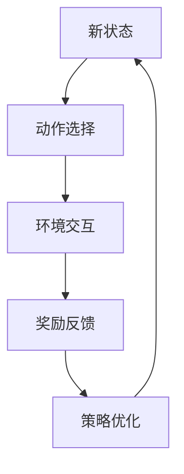
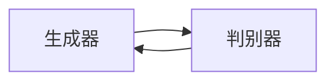
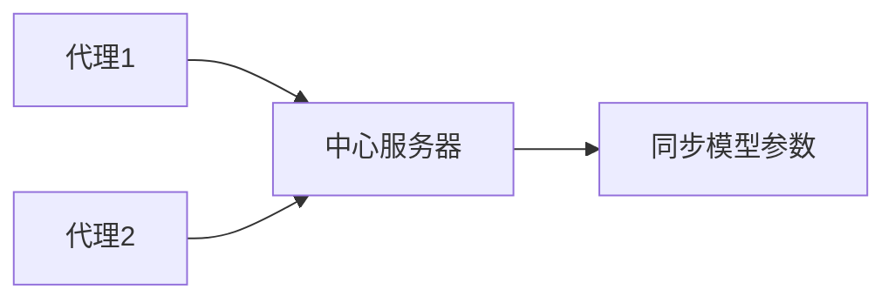
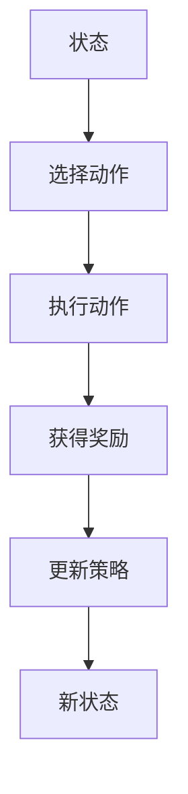
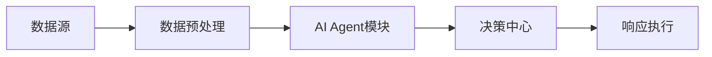
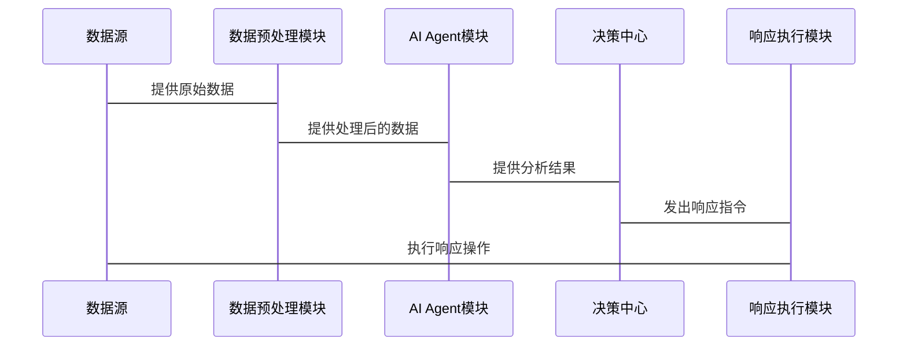

                 


# AI Agent在智能网络安全中的应用

> **关键词**：AI Agent，智能网络安全，人工智能，安全防护，网络威胁，深度学习

> **摘要**：随着网络威胁的日益复杂化，传统的网络安全防护手段已难以应对新型攻击手段。AI Agent作为一种具备自主学习、推理和决策能力的智能体，在智能网络安全中展现出巨大潜力。本文将从AI Agent的核心概念、算法原理、应用场景、系统设计与优化等方面，全面探讨AI Agent在智能网络安全中的应用，分析其优势与挑战，并展望未来的发展方向。

---

## 第1章 AI Agent与智能网络安全背景

### 1.1 AI Agent的基本概念

#### 1.1.1 AI Agent的定义
AI Agent（人工智能代理）是一种能够感知环境、自主决策、执行任务的智能实体。它可以基于感知信息进行推理、规划，并通过行动与环境交互。AI Agent的核心特征包括自主性、反应性、学习能力和社交能力。

#### 1.1.2 AI Agent的核心特征
- **自主性**：AI Agent能够在没有外部干预的情况下独立运行。
- **反应性**：能够实时感知环境变化并做出响应。
- **学习能力**：通过数据和经验不断优化自身行为。
- **社交能力**：能够与其他AI Agent或人类进行协作或对抗。

#### 1.1.3 AI Agent与传统安全技术的对比

| **对比维度** | **传统安全技术** | **AI Agent** |
|--------------|------------------|--------------|
| **处理方式** | 基于规则和特征匹配 | 基于学习和推理 |
| **适应性**   | 静态规则，适应性差 | 动态学习，快速适应 |
| **决策能力** | 依赖人工预设 | 自主决策与优化 |

### 1.2 智能网络安全的背景

#### 1.2.1 网络安全的传统挑战
- 网络攻击手段日益复杂，传统的基于规则的防护技术难以应对未知威胁。
- 黑客攻击技术不断进化，从单一的恶意软件到高级持续性威胁（APT），传统的防护手段逐渐失效。
- 网络环境的动态变化要求安全系统具备更强的自适应能力。

#### 1.2.2 智能化安全的需求
- 需要实时感知网络状态，快速响应异常行为。
- 需要具备自主学习能力，能够识别新型攻击模式。
- 需要支持多场景下的智能决策，如入侵检测、威胁情报分析等。

#### 1.2.3 AI Agent在智能安全中的作用
AI Agent通过其自主性、学习能力和推理能力，能够有效弥补传统安全技术的不足，为智能网络安全提供新的解决方案。

### 1.3 AI Agent与智能网络安全的结合点

#### 1.3.1 AI Agent在网络安全中的应用场景
- **网络入侵检测**：通过AI Agent的实时感知和学习能力，识别异常流量和攻击行为。
- **威胁情报分析**：利用AI Agent的强大推理能力，分析威胁情报，预测潜在攻击。
- **安全策略优化**：基于AI Agent的学习结果，动态调整安全策略，提升防护效果。

#### 1.3.2 AI Agent与智能安全的协同效应
AI Agent与其他智能安全技术（如机器学习、区块链）的协同工作，能够形成更强大的安全防护体系。

#### 1.3.3 未来发展趋势
随着AI技术的不断进步，AI Agent在智能网络安全中的应用将更加广泛，从被动防御向主动防护转变，实现智能化、自动化的安全防护。

---

## 第2章 AI Agent的核心概念与原理

### 2.1 AI Agent的核心概念

#### 2.1.1 知识表示与推理
AI Agent的知识表示通常采用符号逻辑或概率推理方法。符号逻辑通过规则和事实表示知识，而概率推理则通过贝叶斯网络等方式处理不确定性。

#### 2.1.2 行为决策机制
行为决策机制是AI Agent的核心，常用的方法包括基于规则的决策、基于模型的决策和基于强化学习的决策。

#### 2.1.3 学习与自适应能力
AI Agent的学习能力主要通过监督学习、无监督学习和强化学习实现。强化学习是一种重要的学习方式，其原理是通过与环境交互，逐步优化行为策略。

### 2.2 AI Agent的算法原理

#### 2.2.1 强化学习算法
强化学习是一种通过试错机制优化行为策略的算法。其核心是通过环境反馈（奖励或惩罚）调整动作选择，以最大化累积奖励。

**强化学习流程图**



**Python强化学习代码示例**

```python
import numpy as np

class AI-Agent:
    def __init__(self, state_space, action_space):
        self.state_space = state_space
        self.action_space = action_space
        self.Q_table = np.zeros((state_space, action_space))

    def choose_action(self, state):
        # 使用epsilon-greedy策略选择动作
        epsilon = 0.1
        if np.random.random() < epsilon:
            return np.random.randint(self.action_space)
        else:
            return np.argmax(self.Q_table[state])

    def update_Q_table(self, state, action, reward, next_state):
        gamma = 0.9
        self.Q_table[state][action] = reward + gamma * np.max(self.Q_table[next_state])
```

### 2.2.2 生成对抗网络
生成对抗网络（GAN）由生成器和判别器组成，通过对抗训练学习数据的分布。在网络安全中，GAN可以用于生成模拟攻击流量，帮助训练更 robust 的防御模型。

**生成对抗网络结构图**



**Python GAN代码示例**

```python
import torch
import torch.nn as nn

class Generator(nn.Module):
    def __init__(self, input_dim, output_dim):
        super(Generator, self).__init__()
        self.model = nn.Sequential(
            nn.Linear(input_dim, output_dim),
            nn.ReLU(),
            nn.Linear(output_dim, input_dim)
        )

class Discriminator(nn.Module):
    def __init__(self, input_dim, output_dim):
        super(Discriminator, self).__init__()
        self.model = nn.Sequential(
            nn.Linear(input_dim, output_dim),
            nn.ReLU(),
            nn.Linear(output_dim, 1),
            nn.Sigmoid()
        )

# 初始化生成器和判别器
generator = Generator(100, 1024)
discriminator = Discriminator(1024, 1)
```

### 2.2.3 联合学习机制
联合学习是一种分布式学习方法，多个代理通过共享模型参数共同优化整体性能。在网络安全中，联合学习可以用于多机构协同防御。

**联合学习框架**



---

## 第3章 AI Agent在智能网络安全中的应用

### 3.1 网络入侵检测中的AI Agent

#### 3.1.1 基于AI Agent的异常检测
AI Agent通过分析网络流量，识别异常行为模式。例如，利用强化学习检测异常流量中的潜在攻击。

#### 3.1.2 AI Agent在流量分析中的应用
AI Agent可以实时监控网络流量，识别潜在的恶意行为，如DDoS攻击、数据泄露等。

#### 3.1.3 实例分析
通过具体案例分析AI Agent如何在实际网络环境中发现并阻止攻击。

### 3.2 �威脅情报分析与响应

#### 3.2.1 基于AI Agent的威胁情报挖掘
AI Agent能够从大量数据中提取威胁情报，帮助安全团队快速响应潜在威胁。

#### 3.2.2 AI Agent在应急响应中的作用
在发生网络攻击时，AI Agent可以快速启动应急响应机制，如隔离受感染设备、切断恶意连接等。

#### 3.2.3 案例研究
通过具体案例说明AI Agent在威胁情报分析和应急响应中的实际应用。

### 3.3 AI Agent在安全策略优化中的应用

#### 3.3.1 安全策略的自适应优化
AI Agent可以根据实时网络状态动态调整安全策略，如调整防火墙规则、优化入侵检测系统参数等。

#### 3.3.2 基于AI Agent的策略执行
通过AI Agent执行安全策略，确保策略的有效性和一致性。

#### 3.3.3 实际应用中的挑战
讨论AI Agent在安全策略优化中可能遇到的挑战，如数据隐私、计算资源消耗等。

---

## 第4章 AI Agent的算法实现与优化

### 4.1 基于强化学习的AI Agent实现

#### 4.1.1 算法流程图
详细描述强化学习算法的流程。



#### 4.1.2 Python代码实现
提供强化学习AI Agent的具体实现代码，包括状态空间、动作空间、奖励机制等。

#### 4.1.3 算法优化策略
讨论如何优化强化学习算法，如调整探索率、使用经验回放等。

### 4.2 基于生成对抗网络的AI Agent实现

#### 4.2.1 GAN模型结构
详细描述生成器和判别器的结构设计。

#### 4.2.2 代码实现与分析
提供GAN模型的代码实现，并分析其在网络安全中的应用潜力。

#### 4.2.3 模型训练与调优
讨论GAN模型的训练策略和参数调优方法。

### 4.3 联合学习机制的实现

#### 4.3.1 联合学习框架
详细描述联合学习的实现框架。

#### 4.3.2 分布式训练策略
讨论分布式训练的实现方法和优化策略。

#### 4.3.3 性能评估与优化
分析联合学习在网络安全中的性能表现，并提出优化建议。

---

## 第5章 系统分析与架构设计方案

### 5.1 网络入侵检测系统

#### 5.1.1 系统功能设计
设计基于AI Agent的入侵检测系统功能模块，包括数据采集、行为分析、决策响应等。

#### 5.1.2 系统架构设计
通过mermaid图展示系统架构，包括数据源、AI Agent模块、决策中心等。



#### 5.1.3 系统接口设计
描述系统各模块之间的接口设计，包括数据接口、控制接口等。

#### 5.1.4 系统交互流程图
通过mermaid序列图展示系统交互流程。



---

## 第6章 项目实战

### 6.1 环境安装与配置

#### 6.1.1 安装依赖
安装所需的Python库，如TensorFlow、Keras、PyTorch等。

#### 6.1.2 配置开发环境
配置Jupyter Notebook、IDE等开发工具。

### 6.2 核心代码实现

#### 6.2.1 强化学习AI Agent实现
提供强化学习AI Agent的代码实现，包括状态空间、动作空间、奖励函数等。

#### 6.2.2 GAN模型实现
提供生成对抗网络模型的代码实现，包括生成器和判别器的定义、训练循环等。

### 6.3 案例分析与解读

#### 6.3.1 网络入侵检测案例
通过具体案例分析AI Agent在入侵检测中的应用效果。

#### 6.3.2 �威脅情报分析案例
通过具体案例说明AI Agent在威胁情报分析中的应用。

### 6.4 项目总结与优化

#### 6.4.1 项目总结
总结项目实现的效果和经验。

#### 6.4.2 性能优化建议
提出优化AI Agent性能的建议，如算法优化、硬件加速等。

---

## 第7章 最佳实践、小结与展望

### 7.1 最佳实践

#### 7.1.1 数据质量管理
确保数据的准确性和完整性，提升AI Agent的性能。

#### 7.1.2 模型可解释性
提升AI Agent的可解释性，便于安全团队理解和优化。

#### 7.1.3 安全隐私保护
在使用AI Agent时，注意保护用户隐私和数据安全。

### 7.2 小结

本文全面探讨了AI Agent在智能网络安全中的应用，从理论到实践，详细分析了其在入侵检测、威胁情报分析等场景中的潜力和优势。通过具体案例和代码实现，展示了AI Agent的实际应用价值。

### 7.3 注意事项

- AI Agent的应用需要结合具体场景，避免一刀切。
- 注意模型的可解释性和透明性，便于安全团队进行决策。
- 定期更新模型，应对新型攻击手段。

### 7.4 拓展阅读

推荐一些深度学习、强化学习和网络安全相关的书籍和论文，供读者进一步学习。

---

## 总结

AI Agent作为人工智能技术的重要组成部分，在智能网络安全中的应用前景广阔。通过本文的分析，我们可以看到，AI Agent不仅可以提升网络安全防护能力，还能通过其自主学习和决策能力，为智能安全领域带来新的突破。未来，随着AI技术的不断发展，AI Agent在智能网络安全中的应用将更加广泛和深入。

