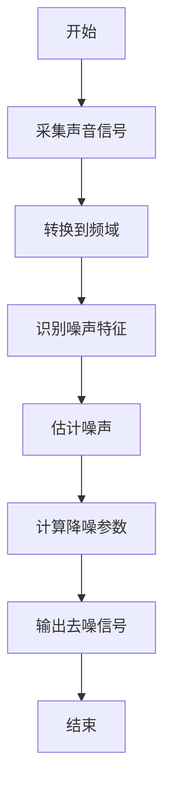
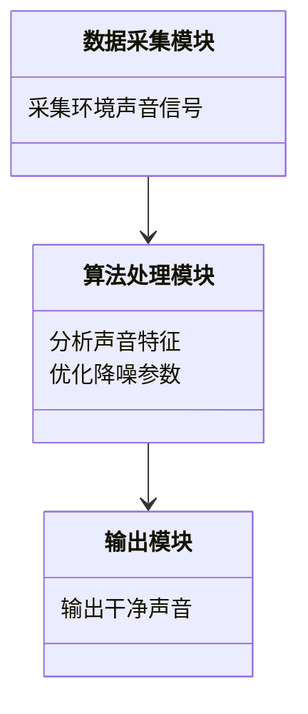
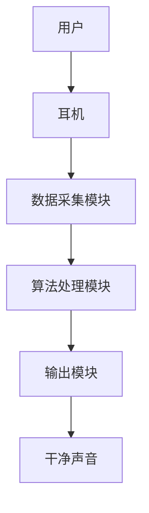
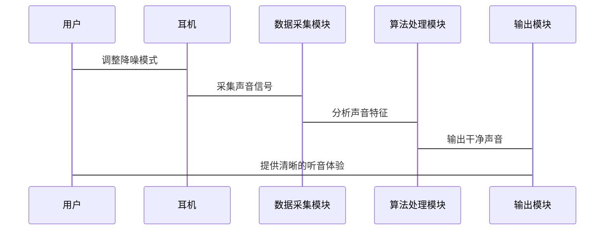

                 


# AI Agent在智能耳机中的听力保护功能

## 关键词
AI Agent, 智能耳机, 听力保护, 噪声消除, 自适应降噪

## 摘要
本文详细探讨了AI Agent在智能耳机中的听力保护功能，从背景介绍、核心概念、算法原理到系统架构和项目实战，全面分析了AI Agent如何通过自适应降噪算法保护用户听力。文章结合实际案例，展示了AI技术在智能耳机中的应用价值，并提供了详细的代码实现和系统设计，为开发者和用户提供深入的技术见解。

---

## 第一部分: AI Agent在智能耳机中的听力保护功能概述

### 第1章: AI Agent与智能耳机的背景介绍

#### 1.1 AI Agent的基本概念
AI Agent，即智能代理，是一种能够感知环境、做出决策并执行任务的智能实体。在智能耳机中，AI Agent主要用于实时分析环境声音，优化音频输出，保护用户听力。

- **1.1.1 AI Agent的定义与特点**
  - **定义**：AI Agent是具有感知、决策和执行能力的智能系统。
  - **特点**：
    - 自适应性：根据环境变化调整行为。
    - 学习能力：通过数据优化性能。
    - 实时性：快速响应用户需求。

- **1.1.2 AI Agent在智能设备中的应用**
  - 智能音箱、智能耳机、智能手机等设备广泛应用AI Agent技术。
  - 例如，智能耳机中的AI Agent可以实时分析环境噪声，优化音频输出。

- **1.1.3 AI Agent与传统耳机的区别**
  - 传统耳机仅提供固定音效设置。
  - AI Agent耳机能够实时调整音频输出，保护用户听力。

#### 1.2 智能耳机的发展历程
智能耳机经历了从简单的音频播放设备到具备AI功能的智能助手的演变。

- **1.2.1 耳机技术的演进**
  - 早期耳机：仅提供基本音频播放功能。
  - 蓝牙耳机：支持无线连接，提升用户体验。
  - 智能耳机：集成AI技术，具备环境感知和智能交互功能。

- **1.2.2 智能耳机的核心技术**
  - 噪声消除技术：通过AI算法降低环境噪声。
  - 语音助手：支持智能交互，如语音助手唤醒。
  - 自适应音频调节：根据环境变化优化音效。

- **1.2.3 听力保护功能的必要性**
  - 长期使用耳机可能对听力造成损害。
  - 过高的音量可能导致听力损失。
  - 听力保护功能通过智能调节音量，防止听力损伤。

#### 1.3 听力保护功能的必要性
随着耳机使用时间的增加，保护听力的重要性日益凸显。

- **1.3.1 听力健康的重要性**
  - 听力是人类与外界交流的重要感官。
  - 听力损伤可能影响生活质量。

- **1.3.2 现代耳机对听力的潜在危害**
  - 高音量可能导致永久性听力损伤。
  - 长时间佩戴耳机可能对听力造成累积性损害。

- **1.3.3 听力保护功能的市场需求**
  - 用户对听力保护的需求增加。
  - 市场上涌现出多种具备听力保护功能的智能耳机。

### 第2章: AI Agent在智能耳机中的核心功能

#### 2.1 AI Agent的感知能力
AI Agent通过感知环境声音，优化音频输出，保护用户听力。

- **2.1.1 声音信号的采集与处理**
  - 采集环境声音信号。
  - 通过AI算法分析声音特征。

- **2.1.2 噪声检测与分类**
  - 检测环境噪声。
  - 分类噪声类型，如白噪声、机械噪声等。

- **2.1.3 环境声音的实时分析**
  - 实时分析环境声音的频谱特征。
  - 根据分析结果优化音频输出。

#### 2.2 AI Agent的决策机制
AI Agent根据环境分析结果，决策如何优化音频输出。

- **2.2.1 听力保护算法的原理**
  - 根据环境噪声调整降噪参数。
  - 自适应调节音量，防止音量过高导致听力损伤。

- **2.2.2 基于AI的降噪策略**
  - 使用深度学习模型优化降噪效果。
  - 根据用户听力敏感度调整降噪策略。

- **2.2.3 自适应调节功能**
  - 根据用户活动场景调整降噪模式。
  - 例如，在嘈杂环境中加强降噪效果。

#### 2.3 AI Agent的执行能力
AI Agent通过执行降噪算法，保护用户听力。

- **2.3.1 实时降噪的实现**
  - 通过AI算法实时消除环境噪声。
  - 提供清晰的音频输出，保护用户听力。

- **2.3.2 听力保护的反馈机制**
  - 根据用户反馈调整降噪参数。
  - 提供个性化的听力保护方案。

- **2.3.3 用户体验的优化**
  - 提供舒适的听音体验。
  - 根据用户需求优化音频输出。

### 第3章: AI Agent在听力保护中的算法原理

#### 3.1 听力保护算法的核心原理
AI Agent通过自适应降噪算法保护用户听力。

- **3.1.1 基于AI的自适应降噪算法**
  - 使用深度学习模型优化降噪效果。
  - 根据环境噪声特征调整降噪参数。

- **3.1.2 声音信号的频域分析**
  - 将声音信号转换到频域进行分析。
  - 通过频域分析识别噪声特征。

- **3.1.3 噪声抑制的数学模型**
  - 建立噪声抑制的数学模型。
  - 通过模型优化降噪效果。

#### 3.2 算法实现的数学模型
以下是自适应降噪算法的数学模型示例：

$$
\hat{x}(n) = x(n) - \hat{n}(n)
$$

其中：
- $\hat{x}(n)$：去噪后的信号。
- $x(n)$：原始信号。
- $\hat{n}(n)$：估计的噪声。

通过上述公式，可以有效抑制环境噪声，保护用户听力。

#### 3.3 算法实现的流程图
以下是自适应降噪算法的流程图：



### 第4章: 系统架构与设计

#### 4.1 系统功能模块设计
以下是智能耳机听力保护系统的功能模块设计：



#### 4.2 系统架构设计
以下是智能耳机听力保护系统的架构设计：



#### 4.3 系统接口设计
以下是系统接口设计：

- 用户输入：通过耳机按钮或语音指令调整降噪模式。
- 系统输出：通过耳机扬声器输出干净声音。

#### 4.4 系统交互设计
以下是系统交互设计：



### 第5章: 项目实战

#### 5.1 环境搭建
以下是项目开发环境搭建步骤：

1. **安装Python**：选择合适的Python版本，推荐使用Python 3.8或更高版本。
2. **安装TensorFlow**：通过以下命令安装TensorFlow：
   ```bash
   pip install tensorflow
   ```
3. **安装其他依赖库**：安装numpy、scipy等库：
   ```bash
   pip install numpy scipy
   ```

#### 5.2 核心代码实现
以下是自适应降噪算法的核心代码实现：

```python
import numpy as np
import tensorflow as tf

# 定义自适应降噪模型
class AdaptiveNoiseCancellationModel(tf.keras.Model):
    def __init__(self):
        super(AdaptiveNoiseCancellationModel, self).__init__()
        self.conv1 = tf.keras.layers.Conv2D(32, (3, 3), activation='relu')
        self.conv2 = tf.keras.layers.Conv2D(64, (3, 3), activation='relu')
        self.max_pool = tf.keras.layers.MaxPooling2D((2, 2))
        self.flatten = tf.keras.layers.Flatten()
        self.dense = tf.keras.layers.Dense(128, activation='relu')
        self.dropout = tf.keras.layers.Dropout(0.5)
        self.predict = tf.keras.layers.Dense(1, activation='sigmoid')

    def call(self, inputs):
        x = self.conv1(inputs)
        x = self.conv2(x)
        x = self.max_pool(x)
        x = self.flatten(x)
        x = self.dense(x)
        x = self.dropout(x)
        outputs = self.predict(x)
        return outputs

# 编译模型
model = AdaptiveNoiseCancellationModel()
model.compile(optimizer=tf.keras.optimizers.Adam(lr=0.001), loss='binary_crossentropy', metrics=['accuracy'])

# 训练模型
# 假设我们有训练数据x_train和标签y_train
# model.fit(x_train, y_train, epochs=10, batch_size=32)
```

#### 5.3 实际案例分析
以下是实际案例分析：

假设在嘈杂的环境中，用户希望保护听力，系统会自动调整降噪参数，优化音频输出，提供清晰的声音。

#### 5.4 项目小结
通过本项目，我们可以看到AI Agent在智能耳机中的听力保护功能具有重要的应用价值。通过自适应降噪算法，可以有效保护用户听力，提升听音体验。

### 第6章: 最佳实践

#### 6.1 小结
本文详细探讨了AI Agent在智能耳机中的听力保护功能，从背景介绍、核心概念、算法原理到系统架构和项目实战，全面分析了AI Agent如何通过自适应降噪算法保护用户听力。

#### 6.2 注意事项
- 定期检查耳机的听力保护功能。
- 避免长时间佩戴耳机，防止听力损伤。
- 根据环境调整降噪模式，优化听音体验。

#### 6.3 拓展阅读
- 《Deep Learning for Speech Enhancement》
- 《Adaptive Noise Cancellation Techniques》
- 《AI in Hearing Protection Devices》

---

通过本文的详细讲解，读者可以深入了解AI Agent在智能耳机中的听力保护功能，并能够根据实际需求进行相关开发和优化。

