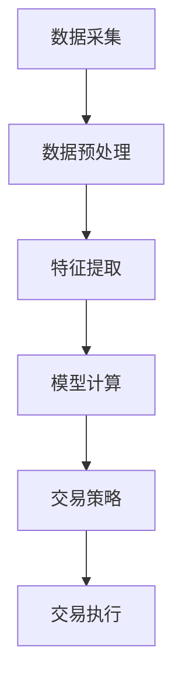

                 


# AI Agent在智能股票交易中的应用

> 关键词：AI Agent, 智能股票交易, 强化学习, Q-Learning, 深度学习, 股票策略优化

> 摘要：本文深入探讨AI Agent在智能股票交易中的应用，分析其核心概念、算法原理、系统架构及实际案例，结合强化学习和深度学习技术，提供详细的技术实现和最佳实践。

---

# 第一部分: AI Agent与智能股票交易的背景介绍

## 第1章: AI Agent的基本概念与核心原理

### 1.1 AI Agent的定义与分类

AI Agent（人工智能代理）是指能够感知环境并采取行动以实现目标的智能实体。根据功能和智能水平，AI Agent可以分为：

- **反应式代理**：基于当前感知做出反应，如Q-Learning算法。
- **基于模型的代理**：利用环境模型进行决策，如深度强化学习。
- **协作式代理**：与其他代理协作，如多智能体系统。

### 1.2 智能股票交易的背景与现状

股票交易的复杂性和不确定性使得传统方法难以应对。AI Agent通过实时数据分析、模式识别和决策优化，为智能股票交易提供了新的可能性。

### 1.3 AI Agent在股票交易中的应用现状

目前，AI Agent在股票交易中的应用主要集中在以下几个方面：

- **实时数据分析**：通过自然语言处理和时间序列分析，识别市场趋势。
- **交易策略优化**：利用强化学习优化买卖时机。
- **风险管理**：通过预测模型识别潜在风险。

---

# 第二部分: AI Agent的核心概念与技术原理

## 第2章: AI Agent的核心概念与联系

### 2.1 AI Agent的核心概念

AI Agent在股票交易中通过感知市场数据和环境，采取行动（如买卖指令）来实现收益最大化。其核心概念包括：

- **感知**：通过数据输入感知市场状态。
- **决策**：基于感知结果做出交易决策。
- **行动**：执行交易指令。

### 2.2 AI Agent与强化学习的关系

AI Agent在股票交易中的决策过程与强化学习密切相关。通过定义状态、动作和奖励，AI Agent在强化学习框架中不断优化策略。

### 2.3 AI Agent的核心技术

- **强化学习（Reinforcement Learning）**：通过试错学习，优化交易策略。
- **Q-Learning算法**：经典的强化学习算法，适用于离散动作空间。
- **Deep Q-Network（DQN）**：结合深度学习，处理复杂状态空间。

---

# 第三部分: AI Agent的算法原理与实现

## 第3章: 强化学习与Q-Learning算法

### 3.1 强化学习的基本原理

强化学习通过智能体与环境的交互，学习最优策略。核心要素包括：

- **状态（State）**：市场数据，如价格、成交量。
- **动作（Action）**：买入、卖出或持有。
- **奖励（Reward）**：交易收益。

### 3.2 Q-Learning算法的实现

Q-Learning通过更新Q值表，记录状态-动作对的期望奖励。公式如下：

$$ Q(s, a) = Q(s, a) + \alpha [r + \gamma \max Q(s', a') - Q(s, a)] $$

其中，$\alpha$为学习率，$\gamma$为折扣因子。

### 3.3 Deep Q-Network（DQN）的实现

DQN通过神经网络近似Q值函数，解决高维状态空间问题。网络结构包括：

- **输入层**：市场特征。
- **隐藏层**：非线性变换。
- **输出层**：动作值。

代码示例：

```python
import numpy as np
import tensorflow as tf

class DQN:
    def __init__(self, state_space, action_space):
        self.state_space = state_space
        self.action_space = action_space
        self.model = self.build_model()

    def build_model(self):
        model = tf.keras.Sequential([
            tf.keras.layers.Dense(32, activation='relu', input_dim=self.state_space),
            tf.keras.layers.Dense(32, activation='relu'),
            tf.keras.layers.Dense(self.action_space, activation='linear')
        ])
        model.compile(optimizer=tf.keras.optimizers.Adam(), loss='mean_squared_error')
        return model

    def predict(self, state):
        return self.model.predict(np.array([state]))[0]

    def update(self, state, action, target):
        state = np.array([state])
        target = np.array([target])
        self.model.fit(state, target, epochs=1, verbose=0)
```

---

# 第四部分: 系统分析与架构设计方案

## 第4章: 股票交易系统的场景分析

### 4.1 问题场景描述

股票交易系统需要处理大量实时数据，包括价格、成交量等，同时需要根据市场变化动态调整策略。

### 4.2 系统功能设计

系统功能模块包括：

- 数据采集：实时获取市场数据。
- 特征提取：将数据转化为模型输入。
- 策略执行：根据模型输出执行交易。

### 4.3 系统架构设计

系统架构包括：

- 数据层：存储市场数据。
- 计算层：模型计算交易策略。
- 控制层：执行交易指令。

Mermaid架构图：



---

# 第五部分: 项目实战与案例分析

## 第5章: 项目实战

### 5.1 环境配置

需要安装以下依赖：

- Python 3.8+
- TensorFlow 2.0+
- Pandas
- NumPy

### 5.2 核心代码实现

```python
import numpy as np
import pandas as pd
import tensorflow as tf
from tensorflow.keras import layers

# 数据预处理
def process_data(data, window_size=30):
    X = []
    Y = []
    for i in range(len(data) - window_size):
        X.append(data[i:i+window_size])
        Y.append(data[i+window_size])
    return np.array(X), np.array(Y)

# DQN模型
class DQN:
    def __init__(self, input_dim, output_dim):
        self.model = self.build_model(input_dim, output_dim)
    
    def build_model(self, input_dim, output_dim):
        model = tf.keras.Sequential([
            layers.Dense(64, activation='relu', input_dim=input_dim),
            layers.Dense(64, activation='relu'),
            layers.Dense(output_dim, activation='linear')
        ])
        model.compile(optimizer='adam', loss='mean_squared_error')
        return model

# 训练过程
def train_model(model, X_train, Y_train, epochs=100):
    model.model.fit(X_train, Y_train, epochs=epochs, batch_size=32, verbose=1)

# 模型预测
def predict_model(model, X_test):
    return model.model.predict(X_test)
```

### 5.3 实际案例分析

以实际股票数据为例，训练模型并评估其表现。假设使用历史数据训练DQN模型，评估其在测试集上的收益情况。

---

# 第六部分: 最佳实践与总结

## 第6章: 最佳实践

### 6.1 小结

本文详细介绍了AI Agent在智能股票交易中的应用，从背景到实现，结合强化学习和深度学习技术，提供了系统的解决方案。

### 6.2 注意事项

- **数据质量**：确保数据准确性和实时性。
- **模型优化**：根据市场变化调整模型参数。
- **风险管理**：设置止损点，控制风险。

### 6.3 拓展阅读

- 《Deep Reinforcement Learning in Game Theory》
- 《Reinforcement Learning: Theory and Algorithms》

---

# 结语

AI Agent在智能股票交易中的应用前景广阔，随着技术进步，AI Agent将更加智能化，为投资者提供更高效的交易策略。

