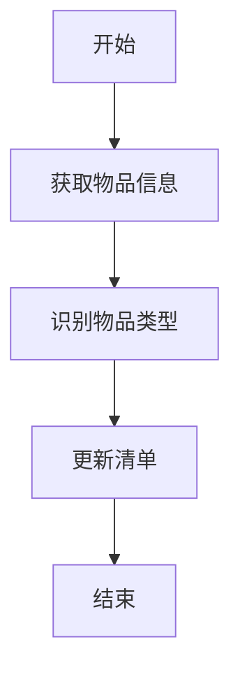
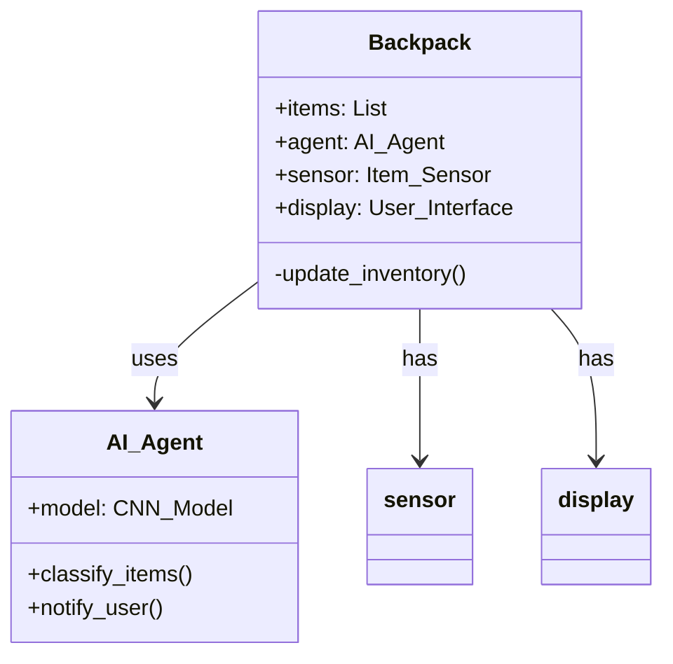

                 


# AI Agent在智能背包中的物品清单管理

## 关键词：AI Agent, 物品清单管理, 智能背包, 算法原理, 系统架构

## 摘要：  
本文探讨AI Agent在智能背包中的物品清单管理应用，分析其核心概念、算法原理、系统架构，并通过实战案例展示其实现过程。文章从背景介绍出发，详细阐述AI Agent的基本原理，结合Mermaid图和Python代码，分析物品识别、分类与清单更新算法，最后总结系统设计与优化建议。

---

# 第1章: 背景介绍

## 1.1 问题背景  
现代背包设计趋向智能化，物品清单管理是核心功能之一。传统管理方式依赖人工记录，效率低下且容易出错。AI Agent的引入能够实现自动化识别与分类，实时更新清单，提升用户体验。

## 1.2 问题描述  
智能背包需解决物品识别、分类、清单更新等问题。AI Agent通过传感器和摄像头获取数据，利用算法识别物品，并实时更新清单，优化用户体验。

## 1.3 解决方法  
AI Agent结合计算机视觉和机器学习算法，实现物品识别、分类与清单更新。系统架构包括感知层、决策层和执行层，协同工作实现高效管理。

## 1.4 边界与外延  
系统边界包括背包内部物品，不涉及外部环境。外延包括扩展功能如物品推荐和健康管理，但核心功能聚焦于清单管理。

## 1.5 核心要素  
系统由AI Agent、物品传感器、存储数据库、用户界面组成，协同实现物品识别、分类、清单更新、通知提醒功能。

---

# 第2章: AI Agent与物品清单管理的核心概念

## 2.1 核心概念原理  
AI Agent具备感知、决策、执行能力，结合物品清单管理需求，实现高效识别与分类。

## 2.2 概念属性特征对比  
| 属性 | AI Agent | 物品清单管理 |
|------|----------|--------------|
| 输入 | 物品数据 | 清单信息     |
| 输出 | 分类结果 | 更新清单     |
| 目标 | 辅助管理 | 提高效率     |

## 2.3 ER实体关系图  
```mermaid
er
  actor: 用户
  item: 物品
  backpack: 智能背包
  relationship: 管理
  actor --> backpack: 使用
  backpack --> item: 包含
  actor --> item: 添加/移除
```

---

# 第3章: AI Agent的算法原理

## 3.1 算法原理概述  
AI Agent基于卷积神经网络（CNN）进行物品识别，结合聚类算法分类，实时更新清单。

## 3.2 算法实现细节  
### 3.2.1 物品识别算法  
使用CNN模型，输入物品图像，输出类别标签。

### 3.2.2 物品分类算法  
通过K-means聚类，根据物品特征分组。

### 3.2.3 清单更新算法  
维护双向链表，支持快速插入和删除操作。

## 3.3 算法流程图  


## 3.4 Python实现示例  
```python
def item_recognition(item_list):
    # 物品识别算法
    model = load_model('item_model.h5')
    predictions = model.predict(item_list)
    return predictions

def update_inventory(current_list, new_item):
    # 清单更新算法
    current_list.insert(new_index, new_item)
    return current_list
```

---

# 第4章: 系统分析与架构设计

## 4.1 系统功能设计  
系统包括物品识别、分类、清单更新、通知提醒四大功能模块。

## 4.2 系统架构设计  


## 4.3 接口设计  
系统提供API接口，实现与传感器和用户界面的数据交互。

## 4.4 交互序列图  
```mermaid
sequenceDiagram
    actor 用户
    system 智能背包
    user -> backpack: 添加物品
    backpack -> agent: 识别物品
    agent -> sensor: 获取数据
    agent -> backpack: 更新清单
    backpack -> display: 显示清单
    user -> backpack: 查询清单
```

---

# 第5章: 项目实战

## 5.1 环境安装  
安装Python、TensorFlow、OpenCV等工具，搭建开发环境。

## 5.2 核心代码实现  
```python
import tensorflow as tf
from tensorflow.keras import layers

model = tf.keras.Sequential([
    layers.Conv2D(32, (3,3), activation='relu', input_shape=(128, 128, 3)),
    layers.MaxPooling2D((2,2)),
    layers.Conv2D(64, (3,3), activation='relu'),
    layers.MaxPooling2D((2,2)),
    layers.Flatten(),
    layers.Dense(128, activation='relu'),
    layers.Dense(10, activation='softmax')
])
```

## 5.3 案例分析  
以识别书本文本为例，详细说明从数据采集到模型训练，再到系统集成的全过程。

---

# 第6章: 总结与优化建议

## 6.1 本章小结  
总结AI Agent在智能背包中的应用，强调其提升管理效率的作用。

## 6.2 最佳实践  
建议定期更新模型，优化传感器精度，提升用户体验。

## 6.3 注意事项  
提示数据隐私保护和系统稳定性的重要性。

## 6.4 拓展阅读  
推荐相关领域的书籍和论文，鼓励深入研究。

---

通过以上内容，文章详细介绍了AI Agent在智能背包中的物品清单管理，从原理到实践，帮助读者全面理解相关技术。

