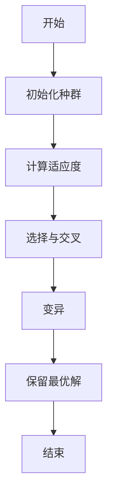
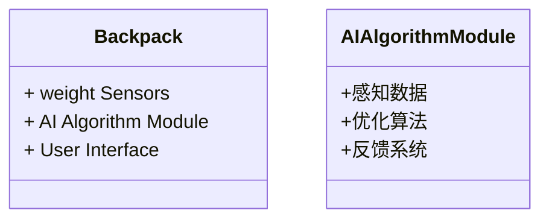
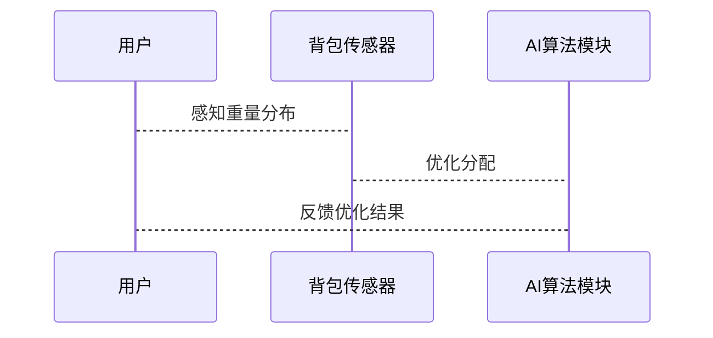

                 


# AI Agent在智能背包中的负重平衡

## 关键词
AI Agent, 智能背包, 负重平衡, 优化算法, 系统架构

## 摘要
本文探讨了AI Agent在智能背包中的应用，重点分析了负重平衡问题。通过数学建模和算法优化，提出了一种基于AI的负重平衡解决方案，旨在提高舒适度和效率。文章详细讲解了AI Agent的工作原理、负重平衡的数学模型、系统架构设计以及实际案例分析，为智能背包的设计提供了理论支持和实践指导。

---

# 第1章: AI Agent与智能背包的背景介绍

## 1.1 AI Agent的基本概念

### 1.1.1 AI Agent的定义与特点
AI Agent（人工智能代理）是指能够感知环境、自主决策并采取行动以实现目标的智能实体。其核心特点包括：
- **自主性**：无需外部干预，自主完成任务。
- **反应性**：能够实时感知环境变化并做出响应。
- **目标导向**：基于目标驱动行为。
- **学习能力**：通过数据和经验优化性能。

### 1.1.2 智能背包的概念与应用场景
智能背包是一种结合AI技术的背包，通过传感器和算法优化负重分配，提升用户体验。其应用场景包括：
- **户外运动**：如徒步、登山，优化负重以减少疲劳。
- **物流运输**：优化货物分配，提高效率。
- **医疗康复**：帮助患者负重训练，促进康复。

### 1.1.3 负重平衡问题的背景与意义
负重平衡是指在背包中合理分配物品重量，以减少人体疲劳和提高舒适度。传统背包依赖人工调整，而AI Agent可以通过动态优化实现智能分配，具有重要意义。

---

## 1.2 负重平衡问题的描述与解决方案

### 1.2.1 负重平衡的定义
负重平衡是通过调整背包内物品的重量分布，使人体受力均匀，减少疲劳。

### 1.2.2 AI Agent在负重平衡中的作用
AI Agent通过感知背包的重量分布和人体反馈，实时优化负重分配。

### 1.2.3 负重平衡的核心目标
- **优化重量分布**：使背包重量均匀分布，减少局部压力。
- **提高舒适度**：降低人体疲劳感。
- **最大化效率**：在负重条件下提高活动效率。

---

# 第2章: AI Agent与负重平衡的核心概念

## 2.1 AI Agent的核心原理

### 2.1.1 AI Agent的感知机制
AI Agent通过传感器获取背包的重量分布和人体反馈。

### 2.1.2 AI Agent的决策机制
AI Agent基于感知数据，通过算法计算出最优负重分配方案。

### 2.1.3 AI Agent的执行机制
AI Agent通过调整背包结构或提示用户调整负重。

## 2.2 负重平衡的核心要素

### 2.2.1 背包的结构与功能
背包的结构设计影响重量分布，如分层结构、可调节带等。

### 2.2.2 物品的重量与分布
物品重量的合理分布是负重平衡的关键。

### 2.2.3 人体力学与负重优化
人体力学原理指导如何优化负重分配，减少疲劳。

## 2.3 AI Agent与负重平衡的关系

### 2.3.1 AI Agent如何影响负重平衡
AI Agent通过动态优化调整重量分布。

### 2.3.2 负重平衡对AI Agent性能的影响
负重平衡影响AI Agent的感知和决策效率。

### 2.3.3 两者结合的优化策略
通过AI Agent实现动态负重平衡，提高舒适度和效率。

---

# 第3章: 负重平衡的数学模型与算法

## 3.1 负重平衡的数学模型

### 3.1.1 负重平衡的目标函数
目标函数：最小化人体疲劳度，最大化舒适度。

$$ \text{目标函数} = \min_{x} \sum_{i=1}^{n} w_i x_i $$

其中，$w_i$为物品重量，$x_i$为分配到背包各部分的权重。

### 3.1.2 约束条件
约束条件包括背包结构限制、人体力学限制等。

### 3.1.3 负重平衡的优化算法
常用算法包括遗传算法和动态规划。

---

## 3.2 负重平衡算法的实现

### 3.2.1 遗传算法
遗传算法通过迭代优化负重分配。

### 3.2.2 动态规划
动态规划用于分阶段优化负重分配。

---

## 3.3 算法的实现细节

### 3.3.1 算法流程图


### 3.3.2 算法代码实现
```python
def fitness(weight_distribution):
    # 计算人体疲劳度
    pass

def genetic_algorithm(initial_population):
    # 遗传算法实现
    pass
```

---

# 第4章: 系统架构设计

## 4.1 系统功能设计

### 4.1.1 系统架构图


### 4.1.2 系统接口设计
背包传感器与AI算法模块交互，用户通过界面调整负重。

### 4.1.3 系统交互流程图


---

# 第5章: 项目实战

## 5.1 环境安装

### 5.1.1 安装Python和相关库
安装Python和numpy、pandas等库。

## 5.2 核心代码实现

### 5.2.1 AI算法模块实现
```python
import numpy as np

def optimize_distribution(weights, num_bins):
    # 使用动态规划优化负重分配
    pass
```

### 5.2.2 传感器数据处理
```python
def process_sensor_data(data):
    # 处理传感器数据
    pass
```

## 5.3 实际案例分析

### 5.3.1 案例分析
分析一个背包的负重优化案例，展示算法效果。

## 5.4 项目总结
总结项目实现过程，提出改进建议。

---

# 第6章: 最佳实践与注意事项

## 6.1 最佳实践

### 6.1.1 数据收集的重要性
确保传感器数据的准确性和全面性。

### 6.1.2 算法调优的建议
根据实际需求调整算法参数。

## 6.2 注意事项

### 6.2.1 数据隐私
注意用户数据的隐私保护。

### 6.2.2 系统稳定性
确保系统的稳定性和可靠性。

## 6.3 拓展阅读
推荐相关领域的书籍和论文。

---

# 结语

AI Agent在智能背包中的负重平衡是一个复杂但有趣的课题。通过数学建模和算法优化，可以显著提高用户体验。未来，随着AI技术的发展，智能背包将更加智能化和高效。

--- 

希望这篇文章能为您提供有价值的见解和启发！

