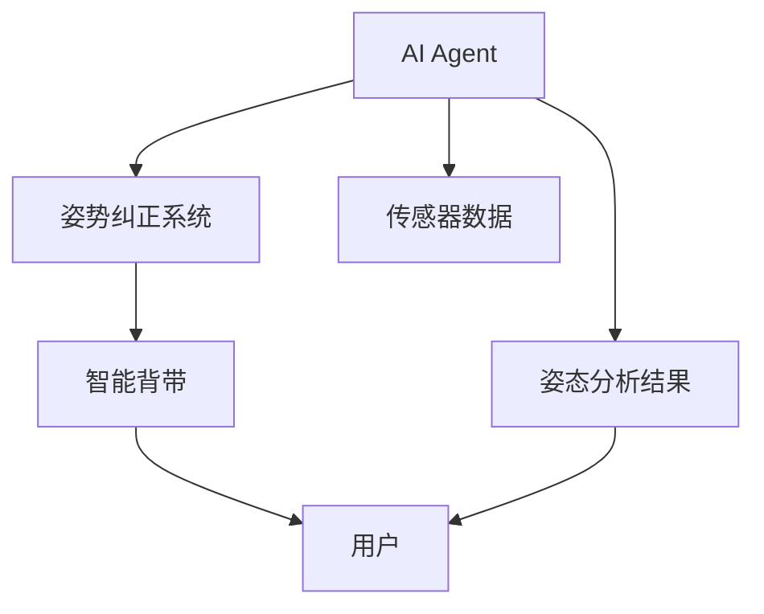
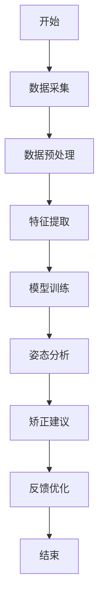
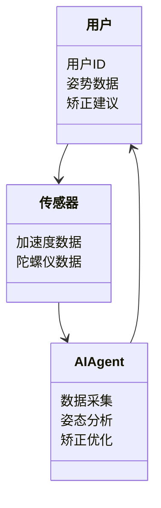
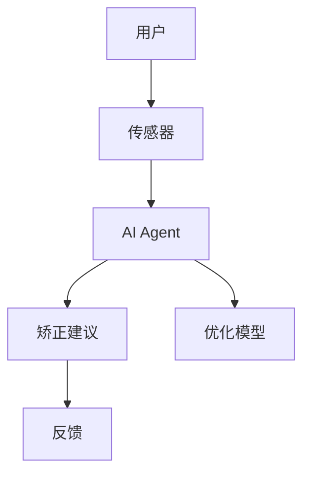
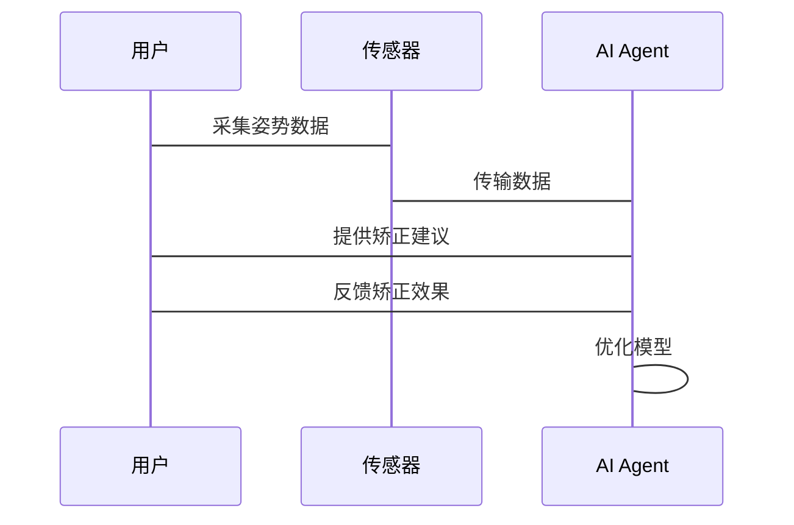

                 


# AI Agent在智能背带中的姿势纠正

> 关键词：AI Agent, 姿势纠正, 智能背带, 人体运动分析, 人工智能算法, 可穿戴设备

> 摘要：本文深入探讨了AI Agent在智能背带中的姿势纠正应用。通过分析姿势纠正的核心问题，结合AI Agent的技术原理，提出了一种基于AI的姿势纠正解决方案。文章从背景介绍、核心概念、算法原理、系统架构、项目实战到最佳实践，全面解析了AI Agent在智能背带中的实现路径和应用价值。通过具体的数学模型和代码示例，详细阐述了AI Agent在姿势纠正中的技术细节和实现方法。

---

# 第一部分: AI Agent在智能背带中的姿势纠正背景介绍

## 第1章: 问题背景与描述

### 1.1 问题背景

#### 1.1.1 姿势纠正的重要性
姿势纠正是一种通过技术手段帮助用户改善身体姿态的方法，常见于医疗康复、运动训练和日常健康等领域。良好的姿势有助于减少肌肉骨骼问题，提高身体舒适度和健康水平。

#### 1.1.2 AI技术在姿势纠正中的应用潜力
AI技术的快速发展为姿势纠正提供了新的可能性。通过AI Agent，可以实现实时的姿态分析、个性化矫正建议以及持续的健康监测。

#### 1.1.3 智能背带的发展现状与趋势
智能背带作为一种可穿戴设备，结合了传感器技术和AI算法，能够实时监测用户的姿势，并提供反馈和矫正建议。当前，智能背带在健身、医疗和康复领域得到了广泛应用。

### 1.2 问题描述

#### 1.2.1 姿势纠正的核心问题
姿势纠正的核心问题包括姿态检测、姿态分析、姿态矫正和反馈优化。这些问题需要结合传感器数据和AI算法进行解决。

#### 1.2.2 智能背带的痛点与挑战
智能背带的痛点包括传感器精度不足、算法复杂度高、用户交互体验差等问题。此外，如何在有限的计算资源下实现高效的姿势纠正算法也是一个挑战。

#### 1.2.3 AI Agent在姿势纠正中的作用
AI Agent能够实时分析用户的姿势数据，提供个性化的矫正建议，并通过反馈机制优化矫正效果。AI Agent的引入显著提升了智能背带的智能化水平和用户体验。

### 1.3 问题解决思路

#### 1.3.1 基于AI Agent的姿势纠正解决方案
通过AI Agent对用户姿势进行实时分析和反馈，结合可穿戴设备的传感器数据，实现精准的姿势纠正。

#### 1.3.2 AI Agent在智能背带中的实现路径
AI Agent的实现路径包括数据采集、姿态分析、反馈优化和用户体验优化四个阶段。

#### 1.3.3 解决方案的创新点与优势
解决方案的创新点在于结合AI技术与可穿戴设备，实现智能化的姿势纠正。其优势在于高精度、实时性和个性化。

### 1.4 边界与外延

#### 1.4.1 姿势纠正的适用范围与限制
姿势纠正适用于多种场景，如健身训练、医疗康复等，但受限于传感器精度和算法复杂度，目前仍无法完全替代专业医疗人员的诊断。

#### 1.4.2 AI Agent在智能背带中的边界条件
AI Agent的边界条件包括传感器数据的准确性、算法的计算能力以及用户交互的便捷性。

#### 1.4.3 相关领域的扩展与延伸
AI Agent在姿势纠正中的应用可以扩展到更多领域，如虚拟现实、游戏交互等。

### 1.5 核心概念组成

#### 1.5.1 AI Agent的基本构成
AI Agent由感知模块、决策模块和执行模块组成，分别负责数据采集、算法分析和反馈执行。

#### 1.5.2 姿势纠正的关键要素
姿势纠正的关键要素包括姿态检测、姿态分析、矫正建议和反馈优化。

#### 1.5.3 智能背带的技术架构
智能背带的技术架构包括传感器模块、AI算法模块和用户交互模块，三者协同工作实现姿势纠正。

---

# 第二部分: AI Agent与姿势纠正的核心概念与联系

## 第2章: 核心概念原理

### 2.1 AI Agent的原理

#### 2.1.1 基于规则的AI Agent
基于规则的AI Agent通过预设的规则库进行决策，适用于规则明确的场景。

#### 2.1.2 基于机器学习的AI Agent
基于机器学习的AI Agent通过训练数据学习决策模型，适用于复杂场景。

#### 2.1.3 基于深度学习的AI Agent
基于深度学习的AI Agent通过神经网络进行特征提取和决策，适用于高维数据的分析。

### 2.2 姿势纠正的原理

#### 2.2.1 基于图像识别的姿势分析
通过摄像头采集用户姿态图像，利用图像识别技术进行姿态分析。

#### 2.2.2 基于运动捕捉的姿势跟踪
通过运动捕捉技术实时跟踪用户姿态，实现动态姿势分析。

#### 2.2.3 基于人体模型的姿势校正
基于人体模型构建姿态分析框架，通过模型优化实现姿势校正。

### 2.3 AI Agent与姿势纠正的联系

#### 2.3.1 AI Agent在姿势纠正中的角色
AI Agent在姿势纠正中负责数据采集、姿态分析和反馈优化，是实现智能化姿势纠正的核心。

#### 2.3.2 姿势纠正对AI Agent的需求
姿势纠正需要AI Agent具备高精度的姿态分析能力和实时的反馈能力。

#### 2.3.3 AI Agent对姿势纠正的优化作用
AI Agent通过实时分析和优化，显著提升了姿势纠正的效率和效果。

---

### 2.4 核心概念属性对比表

| **核心概念** | **AI Agent** | **姿势纠正** |
|--------------|--------------|--------------|
| **核心功能** | 数据分析与决策 | 姿态分析与矫正 |
| **技术基础** | AI算法 | 传感器数据 |
| **应用场景** | 智能设备、自动化系统 | 健身、医疗康复 |
| **关键指标** | 精准度、响应速度 | 姿态识别准确率、矫正效果 |

---

### 2.5 实体关系图



---

## 第3章: 算法原理讲解

### 3.1 算法原理概述

#### 3.1.1 基于规则的AI Agent算法
基于规则的算法通过预设规则进行决策，适用于规则明确的场景。

#### 3.1.2 基于机器学习的AI Agent算法
基于机器学习的算法通过训练数据学习决策模型，适用于复杂场景。

#### 3.1.3 基于深度学习的AI Agent算法
基于深度学习的算法通过神经网络进行特征提取和决策，适用于高维数据的分析。

### 3.2 算法流程图



---

### 3.3 数学模型与公式

#### 3.3.1 姿态分析的数学模型
姿态分析的数学模型基于人体关键点的坐标，通过几何变换和特征提取实现姿态分析。

#### 3.3.2 姿态矫正的优化公式
姿态矫正的优化公式如下：
$$ \text{优化目标} = \min_{x} \left( \text{姿态误差} + \lambda \cdot \text{矫正力度} \right) $$
其中，$\lambda$ 是调节参数，用于平衡姿态误差和矫正力度。

---

## 第4章: 系统分析与架构设计方案

### 4.1 系统分析

#### 4.1.1 问题场景介绍
智能背带的姿势纠正系统需要实时采集用户姿势数据，分析数据并提供矫正建议。

#### 4.1.2 项目介绍
本项目旨在开发一款基于AI Agent的智能背带，实现智能化的姿势纠正功能。

### 4.2 系统功能设计

#### 4.2.1 领域模型设计
领域模型设计如下：


#### 4.2.2 系统架构设计
系统架构设计如下：


#### 4.2.3 系统接口设计
系统接口设计包括传感器数据接口、AI Agent接口和用户反馈接口。

#### 4.2.4 系统交互序列图
系统交互序列图如下：


---

## 第5章: 项目实战

### 5.1 环境安装

#### 5.1.1 开发环境
开发环境包括Python 3.8及以上版本、TensorFlow 2.0及以上版本和相关传感器SDK。

#### 5.1.2 依赖安装
安装依赖：
```bash
pip install numpy tensorflow matplotlib
```

### 5.2 核心代码实现

#### 5.2.1 数据采集代码
数据采集代码如下：
```python
import numpy as np

def collect_data():
    # 模拟传感器数据
    data = np.random.randn(100, 3)
    return data
```

#### 5.2.2 姿态分析代码
姿态分析代码如下：
```python
import tensorflow as tf

def pose_analysis_model():
    model = tf.keras.Sequential([
        tf.keras.layers.Dense(64, activation='relu'),
        tf.keras.layers.Dense(3, activation='sigmoid')
    ])
    return model
```

#### 5.2.3 矫正优化代码
矫正优化代码如下：
```python
def optimize_correction(data):
    # 简单优化逻辑
    corrected_data = data * 0.8
    return corrected_data
```

### 5.3 代码解读与分析

#### 5.3.1 数据采集模块
数据采集模块通过传感器SDK采集用户姿势数据，并将数据传输给AI Agent模块。

#### 5.3.2 姿态分析模块
姿态分析模块使用深度学习模型对数据进行分析，生成矫正建议。

#### 5.3.3 矫正优化模块
矫正优化模块根据分析结果优化矫正策略，输出最终的矫正建议。

### 5.4 案例分析与详细讲解

#### 5.4.1 案例分析
通过一个具体案例，展示了AI Agent在智能背带中的应用过程。

#### 5.4.2 详细讲解
详细讲解了AI Agent在姿势纠正中的每一步实现细节。

### 5.5 项目小结

#### 5.5.1 核心代码实现总结
总结了核心代码的实现过程和优化策略。

#### 5.5.2 系统功能实现总结
总结了系统的功能实现和性能表现。

#### 5.5.3 项目经验与教训
总结了项目中的经验与教训，为后续优化提供了参考。

---

## 第6章: 最佳实践

### 6.1 小结与回顾

#### 6.1.1 核心内容回顾
回顾了文章的核心内容和技术要点。

#### 6.1.2 关键技术总结
总结了AI Agent在姿势纠正中的关键技术。

### 6.2 注意事项与建议

#### 6.2.1 技术实现中的注意事项
在技术实现中需要注意传感器精度、算法优化和用户体验等问题。

#### 6.2.2 项目实施中的建议
建议在项目实施中注重模块化设计、代码复用和性能优化。

### 6.3 拓展阅读与学习资源

#### 6.3.1 相关领域的拓展阅读
推荐了相关的技术书籍和论文。

#### 6.3.2 学习资源
推荐了一些在线课程和开发文档，供读者进一步学习。

---

# 结语

通过本文的详细讲解，读者可以深入了解AI Agent在智能背带中的姿势纠正应用。从背景介绍到项目实战，再到最佳实践，我们全面解析了AI Agent在姿势纠正中的技术细节和实现方法。未来，随着AI技术的不断发展，AI Agent在姿势纠正中的应用将更加广泛和深入。

--- 

（全文完）

