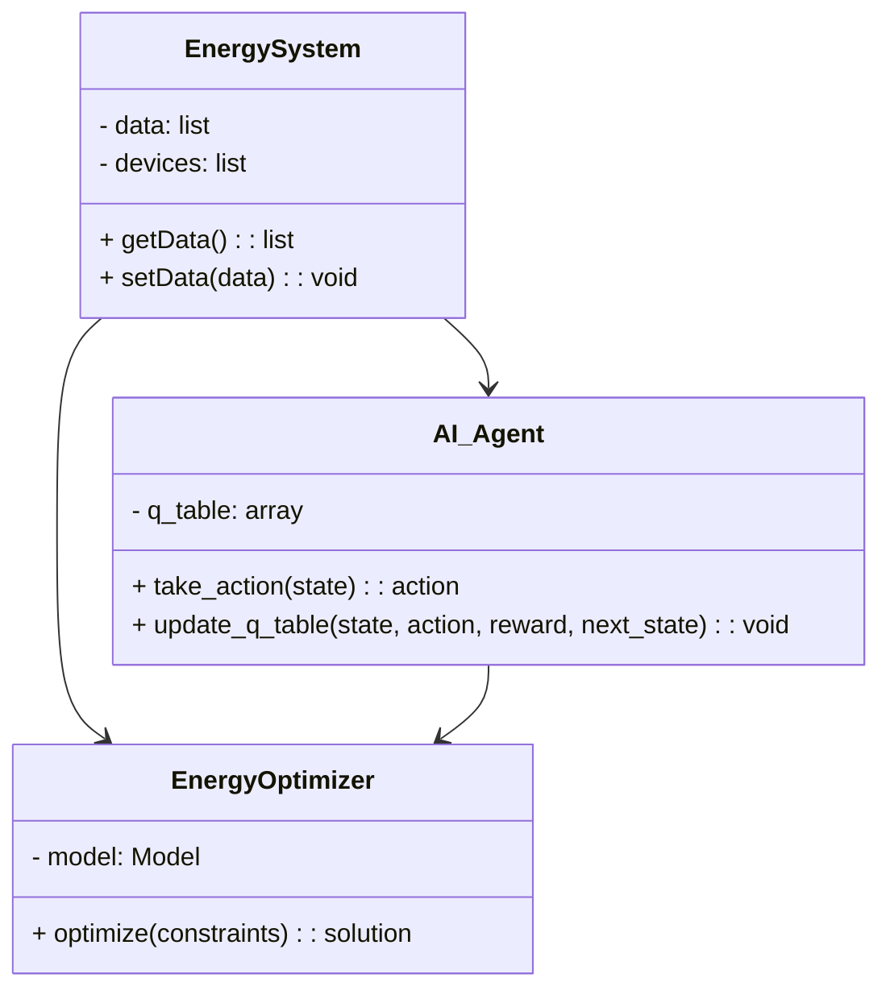
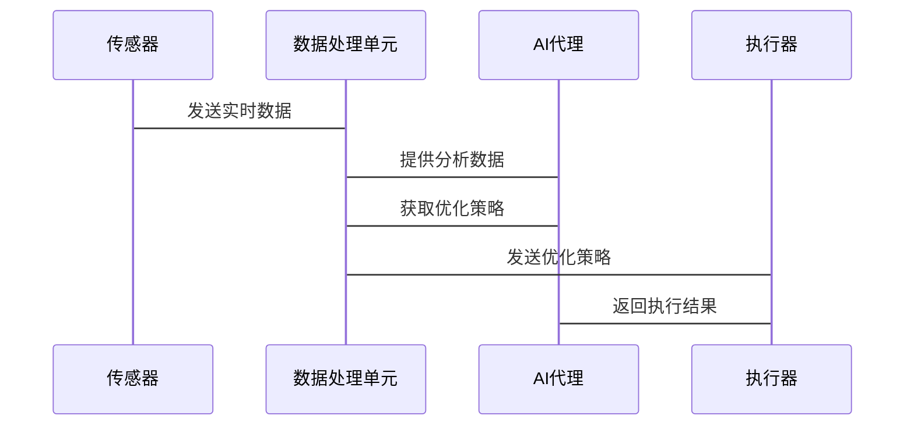

                 


# AI Agent在智能能源管理中的实践

> 关键词：AI Agent，智能能源管理，强化学习，能源优化，系统架构

> 摘要：本文系统地探讨了AI Agent在智能能源管理中的应用，从基本概念到算法原理，再到系统架构设计，详细介绍了如何利用AI技术提升能源管理的效率和优化能力。文章通过实际案例分析和代码实现，展示了AI Agent在智能能源管理中的巨大潜力和实际应用价值。

---

## 第1章: AI Agent与智能能源管理的背景介绍

### 1.1 AI Agent的基本概念

#### 1.1.1 什么是AI Agent
AI Agent（人工智能代理）是指能够感知环境、自主决策并采取行动以实现特定目标的智能实体。AI Agent可以是软件程序，也可以是物理机器人，它能够根据环境信息做出反应，并通过与外部系统的交互来完成任务。

#### 1.1.2 AI Agent的核心特征
- **智能性**：AI Agent具备一定的认知能力，能够理解和处理复杂的信息。
- **反应性**：AI Agent能够实时感知环境变化并做出相应的反应。
- **主动性**：AI Agent能够在没有外部干预的情况下主动采取行动。
- **协作性**：AI Agent能够与其他系统或AI Agent进行协作，共同完成任务。

#### 1.1.3 AI Agent的分类与应用场景
- **软件Agent**：主要用于数据处理、信息检索等领域。
- **物理Agent**：如智能机器人，应用于工业自动化、家庭服务等领域。
- **能源管理Agent**：专门用于能源优化和管理，如负荷预测、资源分配等。

### 1.2 智能能源管理的背景与现状

#### 1.2.1 能源管理的基本概念
能源管理是指对能源的生产、传输、分配和使用进行规划和控制，以提高能源利用效率并降低能源成本。

#### 1.2.2 智能能源管理的发展历程
- **传统能源管理**：基于规则和经验的管理方式，效率较低。
- **智能能源管理**：利用先进的信息技术和人工智能技术，实现能源管理的智能化和自动化。

#### 1.2.3 当前智能能源管理的主要挑战
- 能源资源分配不均。
- 能源消耗的实时监控和预测难度大。
- 多能源系统的协同优化复杂。

### 1.3 AI Agent在智能能源管理中的作用

#### 1.3.1 AI Agent如何提升能源管理效率
- **自动化决策**：AI Agent能够实时分析能源数据并做出最优决策。
- **实时优化**：通过强化学习等技术，AI Agent能够不断优化能源管理策略。
- **数据驱动**：AI Agent能够利用大数据分析技术，发现能源管理中的潜在问题。

#### 1.3.2 AI Agent在能源优化中的应用潜力
- **负荷预测**：通过机器学习模型，AI Agent可以准确预测能源需求，优化能源分配。
- **资源分配**：AI Agent可以根据实时数据，动态调整能源资源的分配。
- **故障预测与修复**：通过异常检测，AI Agent可以提前发现能源系统中的潜在故障并进行修复。

#### 1.3.3 AI Agent与智能能源管理的结合模式
- **协同工作**：AI Agent与传统的能源管理系统协同工作，提升整体效率。
- **数据驱动**：AI Agent通过分析海量数据，提供智能化的能源管理建议。
- **实时反馈**：AI Agent能够实时感知能源系统的运行状态，并做出相应的调整。

---

## 第2章: AI Agent与智能能源管理的核心概念

### 2.1 AI Agent的核心原理

#### 2.1.1 AI Agent的感知与决策机制
AI Agent通过传感器或其他数据源获取环境信息，利用感知模型分析数据，然后基于决策模型做出行动决策。

#### 2.1.2 AI Agent的学习与自适应能力
AI Agent可以通过监督学习、强化学习等方法不断优化自身的决策模型，提高适应能力和智能化水平。

#### 2.1.3 AI Agent的通信与协作能力
AI Agent能够与其他系统或AI Agent进行通信和协作，共同完成复杂的任务。这种协作可以通过多种方式进行，如消息传递、数据共享等。

### 2.2 智能能源管理的系统架构

#### 2.2.1 智能能源管理的分层架构
智能能源管理通常采用分层架构，包括数据采集层、数据处理层、决策层和执行层。每一层都有其特定的功能和职责。

#### 2.2.2 智能能源管理的主要模块
- **数据采集模块**：负责收集能源系统的实时数据。
- **数据处理模块**：对采集的数据进行清洗、转换和存储。
- **优化模块**：利用AI算法对数据进行分析，生成优化策略。
- **执行模块**：根据优化策略，执行具体的能源管理操作。

#### 2.2.3 智能能源管理的交互流程
从数据采集到优化策略的生成，再到策略的执行，整个过程需要各模块之间的高效协作和数据的快速流通。

### 2.3 AI Agent与智能能源管理的实体关系

#### 2.3.1 实体关系图（ER图）展示
通过ER图可以清晰地展示智能能源管理系统中的各个实体及其关系，如能源设备、数据源、优化模型等。

#### 2.3.2 AI Agent与能源设备的关系
AI Agent与能源设备之间通过传感器和执行器进行交互，AI Agent根据设备的状态数据做出决策，并通过执行器调整设备的运行状态。

#### 2.3.3 AI Agent与能源数据的关系
AI Agent通过数据源获取能源数据，分析数据并生成优化策略。数据源可以是数据库、API或其他数据接口。

---

## 第3章: AI Agent在智能能源管理中的算法原理

### 3.1 基于强化学习的AI Agent算法

#### 3.1.1 强化学习的基本原理
强化学习是一种机器学习方法，通过智能体与环境的交互，学习最优策略以最大化累积奖励。

#### 3.1.2 AI Agent在能源管理中的强化学习模型
- **Q-learning算法**：通过状态-动作-奖励的机制，学习最优决策策略。
- **Deep Q-Network (DQN)**：利用深度神经网络近似Q值函数，提高学习效率。

#### 3.1.3 强化学习在能源优化中的应用案例
例如，在电力需求响应中，AI Agent可以通过强化学习优化电力使用策略，降低能源成本。

### 3.2 能源优化的数学模型与算法

#### 3.2.1 能源优化的数学模型构建
- **线性规划模型**：用于优化问题，如最小化成本或最大化效率。
- **动态规划模型**：用于多阶段决策问题，如能源分配的动态优化。

#### 3.2.2 基于动态规划的优化算法
动态规划通过分解问题，逐步优化每个子问题，最终得到全局最优解。

#### 3.2.3 基于遗传算法的优化策略
遗传算法通过模拟自然选择和遗传机制，寻找问题的最优解，适用于复杂的非线性优化问题。

### 3.3 算法实现的代码示例

#### 3.3.1 强化学习算法的Python实现
```python
import numpy as np

class AI_Agent:
    def __init__(self, state_space, action_space):
        self.state_space = state_space
        self.action_space = action_space
        self.q_table = np.zeros((state_space, action_space))
    
    def take_action(self, state):
        # 探索与利用策略
        epsilon = 0.1
        if np.random.random() < epsilon:
            action = np.random.randint(self.action_space)
        else:
            action = np.argmax(self.q_table[state])
        return action
    
    def update_q_table(self, state, action, reward, next_state):
        gamma = 0.9
        self.q_table[state][action] = reward + gamma * np.max(self.q_table[next_state])
```

#### 3.3.2 能源优化算法的Python实现
```python
import numpy as np

def energy_optimization(consumption, cost):
    n = len(consumption)
    c = np.zeros(n)
    c[-1] = 1
    for i in range(n-2, -1, -1):
        c[i] = c[i+1] + 1
    return np.min(np.dot(consumption, cost) + c[-1])
```

#### 3.3.3 算法实现的详细注释与解读
- **强化学习算法**：通过Q-learning算法实现AI Agent的决策过程，epsilon用于平衡探索与利用。
- **动态规划算法**：通过状态转移矩阵和奖励函数，逐步优化每个状态下的最优动作。
- **遗传算法**：通过基因编码、选择、交叉和变异操作，不断进化种群，找到最优解。

---

## 第4章: AI Agent与智能能源管理的系统架构设计

### 4.1 系统场景介绍

#### 4.1.1 智能能源管理的典型场景
- **家庭能源管理**：通过AI Agent优化家庭能源使用，降低电费支出。
- **工业能源管理**：优化工厂能源消耗，提高生产效率。
- **城市能源管理**：通过AI Agent协调城市能源资源，实现绿色低碳。

#### 4.1.2 AI Agent在能源管理中的应用场景
- **实时监控**：AI Agent实时监控能源系统的运行状态，发现异常并及时处理。
- **预测分析**：利用历史数据，预测未来的能源需求和价格，优化能源管理策略。
- **动态调整**：根据实时数据和环境变化，动态调整能源管理策略。

#### 4.1.3 系统的目标与范围
系统的目标是通过AI Agent实现智能能源管理，提高能源利用效率，降低成本。系统范围包括能源数据的采集、处理、优化和执行。

### 4.2 系统功能设计

#### 4.2.1 领域模型（Mermaid类图）


#### 4.2.2 系统功能模块划分
- **数据采集模块**：负责采集能源系统的实时数据。
- **数据处理模块**：对数据进行清洗、转换和存储。
- **优化模块**：利用AI算法对数据进行分析，生成优化策略。
- **执行模块**：根据优化策略，执行具体的能源管理操作。

#### 4.2.3 功能模块之间的交互关系
各模块之间通过数据接口进行交互，数据处理模块向优化模块提供分析数据，优化模块向执行模块发送优化策略。

### 4.3 系统架构设计

#### 4.3.1 系统架构的分层设计
- **数据层**：负责数据的采集和存储。
- **处理层**：负责数据的处理和分析。
- **决策层**：负责优化策略的制定和调整。
- **执行层**：负责策略的执行和反馈。

#### 4.3.2 系统架构的组件设计
- **传感器**：采集能源系统的实时数据。
- **数据处理单元**：对数据进行处理和分析。
- **AI Agent**：根据处理后的数据，制定优化策略。
- **执行器**：根据优化策略，调整能源设备的运行状态。

#### 4.3.3 系统架构的通信机制
- **消息队列**：用于模块之间的异步通信。
- **REST API**：用于模块之间的同步通信。
- **数据库**：用于存储数据和优化策略。

### 4.4 系统接口设计

#### 4.4.1 系统内部接口定义
- **数据采集接口**：定义传感器数据的采集方式和格式。
- **优化接口**：定义优化模块与数据处理模块之间的接口。
- **执行接口**：定义执行模块与AI Agent之间的接口。

#### 4.4.2 系统外部接口设计
- **用户接口**：用户可以通过Web界面查看能源管理的状态和策略。
- **第三方服务接口**：与外部系统（如电网、设备供应商）进行数据交互。

#### 4.4.3 接口的交互流程说明
- 数据采集模块通过接口向数据处理模块发送实时数据。
- 数据处理模块通过接口向优化模块发送分析数据。
- 优化模块通过接口向执行模块发送优化策略。
- 执行模块通过接口向AI Agent发送执行结果。

### 4.5 系统交互流程设计

#### 4.5.1 系统交互的Mermaid序列图


#### 4.5.2 交互流程的具体步骤说明
1. 传感器采集能源系统的实时数据，并通过接口发送给数据处理单元。
2. 数据处理单元对数据进行处理和分析，生成优化所需的输入数据，并通过接口发送给AI Agent。
3. AI Agent根据输入数据，利用强化学习算法生成优化策略，并通过接口将优化策略发送给数据处理单元。
4. 数据处理单元将优化策略通过接口发送给执行器。
5. 执行器根据优化策略调整能源设备的运行状态，并通过接口向数据处理单元反馈执行结果。
6. 数据处理单元将执行结果通过接口发送给AI Agent，供其进一步优化。

#### 4.5.3 交互中的异常处理机制
- **数据异常**：传感器数据异常时，数据处理单元会触发警报，并暂停优化过程，直到数据恢复正常。
- **优化失败**：优化模块生成的策略无法执行时，执行器会反馈错误信息，优化模块重新生成新的策略。
- **通信中断**：系统接口通信中断时，各模块会保留当前状态，待通信恢复后继续处理。

---

## 总结

通过以上章节的内容，我们详细探讨了AI Agent在智能能源管理中的应用，从基本概念到算法原理，再到系统架构设计，全面展示了如何利用AI技术提升能源管理的效率和优化能力。通过实际案例分析和代码实现，我们展示了AI Agent在智能能源管理中的巨大潜力和实际应用价值。

### 最佳实践 Tips

- **数据质量管理**：确保数据的准确性和完整性，是AI Agent正常运行的基础。
- **算法优化**：根据实际需求，选择合适的算法并不断优化，以提高系统的效率和性能。
- **系统集成**：在系统设计中，注重模块之间的协作和接口的标准化，确保系统的可扩展性和可维护性。
- **安全与隐私**：在能源数据的采集和处理过程中，必须注重数据的安全和隐私保护，防止数据泄露和滥用。

### 小结

AI Agent在智能能源管理中的应用前景广阔，随着技术的不断进步，AI Agent将能够更好地适应能源管理的需求，实现更加智能化和个性化的能源管理方案。未来，随着AI技术的不断发展，AI Agent在智能能源管理中的作用将更加重要，能够帮助我们更高效地利用能源资源，推动绿色可持续发展。

### 注意事项

- 在实际应用中，应根据具体需求选择合适的AI Agent算法和系统架构，避免盲目追求复杂度。
- 系统设计时，应充分考虑系统的可扩展性和灵活性，以便未来进行功能扩展和性能优化。
- 数据处理过程中，应注重数据的实时性和准确性，确保AI Agent能够做出及时且准确的决策。

### 拓展阅读

- **《强化学习入门：基于Python的算法实现》**
- **《能源管理系统的优化与设计》**
- **《人工智能在能源领域的应用》**
- **《系统架构设计：从入门到精通》**

通过以上内容，读者可以全面了解AI Agent在智能能源管理中的实践应用，掌握相关的技术细节和系统设计方法，为实际项目提供理论支持和实践指导。

