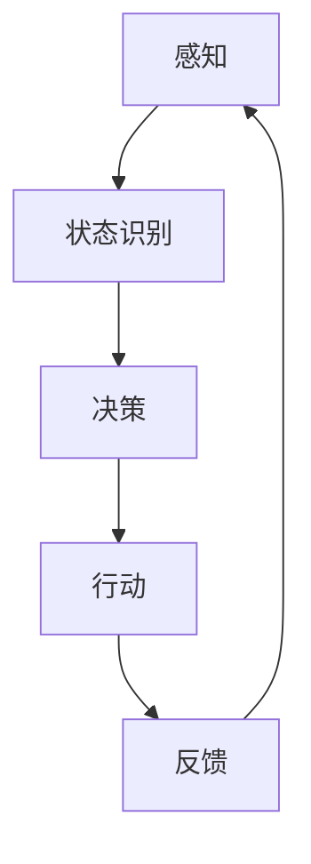
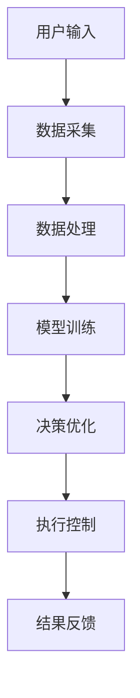

                 


# AI Agent在智能能源管理中的应用

## 关键词：
AI Agent, 智能能源管理, 强化学习, 能源优化, 多智能体协作

## 摘要：
本文探讨了AI Agent在智能能源管理中的应用，分析了AI Agent的核心原理、数学模型、算法流程图，以及其在能源管理中的应用场景。通过实际案例分析，展示了如何利用AI Agent实现能源优化，提高能源使用效率，降低成本，并提出了系统的架构设计与实现方案。最后，本文总结了AI Agent在智能能源管理中的优势与挑战，并展望了未来的发展方向。

---

## 第一部分: AI Agent与智能能源管理的背景与概念

### 第1章: AI Agent与智能能源管理的背景介绍

#### 1.1 AI Agent的基本概念

##### 1.1.1 AI Agent的定义
AI Agent（人工智能代理）是指能够感知环境、自主决策并采取行动以实现特定目标的智能实体。它可以是一个软件程序，也可以是一个物理设备，通过与环境交互来优化其目标的实现。

##### 1.1.2 AI Agent的核心特征
- **自主性**：能够自主决策，无需外部干预。
- **反应性**：能够实时感知环境变化并做出响应。
- **目标导向**：所有行为都围绕实现特定目标展开。
- **协作性**：能够与其他Agent或系统协同工作。

##### 1.1.3 AI Agent与传统算法的区别
| 特性         | 传统算法                 | AI Agent               |
|--------------|--------------------------|-------------------------|
| 决策方式     | 预先编写规则             | 自主学习与优化         |
| 环境适应性   | 静态规则                 | 动态适应环境变化       |
| 应用场景     | 固定任务                 | 多场景、多目标任务     |

#### 1.2 智能能源管理的背景与挑战

##### 1.2.1 能源管理的基本概念
能源管理是指通过优化能源的生成、分配和使用，以提高能源利用效率，降低成本，并减少对环境的影响。智能能源管理则是利用先进的技术手段，如物联网、大数据和人工智能，实现能源管理的智能化和自动化。

##### 1.2.2 智能能源管理的必要性
随着能源需求的不断增长和环境问题的加剧，传统能源管理方式已难以满足需求。智能能源管理能够通过实时数据采集、分析和决策，实现能源的高效利用和优化配置。

##### 1.2.3 当前能源管理的主要挑战
- **数据复杂性**：能源系统涉及多种能源类型和复杂的交互关系。
- **实时性要求高**：需要快速响应环境变化和用户需求。
- **多目标优化**：需要在成本、效率和环保之间找到平衡。

#### 1.3 AI Agent在智能能源管理中的应用前景

##### 1.3.1 AI Agent在能源管理中的潜在价值
- **实时优化**：通过实时数据和动态决策，优化能源使用。
- **多目标协作**：能够协调多个能源设备和系统，实现协同优化。
- **适应性增强**：能够适应环境变化和用户需求的变化。

##### 1.3.2 企业采用AI Agent的优势
- **提高效率**：通过自动化决策减少人工干预，提高能源管理效率。
- **降低成本**：优化能源使用，降低运营成本。
- **增强灵活性**：能够快速适应市场变化和政策调整。

##### 1.3.3 AI Agent应用的挑战与机遇
- **技术挑战**：AI Agent的算法和模型需要不断优化，以应对复杂环境。
- **数据挑战**：需要大量高质量的数据来训练和优化模型。
- **协作挑战**：多智能体协作需要解决通信和协调问题。

---

## 第二部分: AI Agent与智能能源管理的核心概念与联系

### 第2章: AI Agent的核心原理与数学模型

#### 2.1 AI Agent的核心原理

##### 2.1.1 AI Agent的感知与决策机制
AI Agent通过传感器或其他数据源获取环境信息，利用感知数据构建环境模型，并基于模型进行决策和行动。感知数据可以是实时数据，也可以是历史数据。

##### 2.1.2 AI Agent的自主性与适应性
AI Agent能够自主决策，无需外部干预，并能够根据环境变化调整其行为。这种自主性和适应性使得AI Agent能够在动态环境中有效工作。

##### 2.1.3 AI Agent的多智能体协作
在智能能源管理中，通常需要多个AI Agent协作工作，共同完成复杂的任务。多智能体协作需要解决通信、协调和冲突问题。

#### 2.2 AI Agent的数学模型与公式

##### 2.2.1 状态空间模型
状态空间模型描述了AI Agent可能处于的所有状态。状态空间可以是连续的或离散的，具体取决于问题的性质。
$$ S = \{ s_1, s_2, ..., s_n \} $$

##### 2.2.2 行动空间模型
行动空间模型描述了AI Agent在每个状态下可以采取的所有行动。行动空间通常是离散的，但在某些情况下也可以是连续的。
$$ A = \{ a_1, a_2, ..., a_m \} $$

##### 2.2.3 状态转移模型
状态转移模型描述了AI Agent在采取某个行动后，状态从当前状态转移到下一个状态的概率。
$$ P(s' | s, a) $$

#### 2.3 AI Agent的核心算法

##### 2.3.1 强化学习算法
强化学习是一种通过试错机制来学习最优策略的算法。AI Agent通过与环境交互，学习最优的行动策略，以最大化累积奖励。

##### 2.3.2 监督学习算法
监督学习是一种通过标签数据来训练模型的算法。AI Agent可以通过监督学习来预测未来的状态或行动。

##### 2.3.3 混合学习算法
混合学习算法结合了强化学习和监督学习的优点，能够在没有标签数据的情况下，通过与环境交互来学习最优策略。

#### 2.4 AI Agent的决策流程图


### 第3章: 智能能源管理的核心概念与系统架构

#### 3.1 智能能源管理的核心概念

##### 3.1.1 能源数据采集与处理
能源数据采集与处理是智能能源管理的基础。通过传感器和其他数据采集设备，获取能源系统的实时数据，并进行预处理和分析。

##### 3.1.2 能源优化目标
能源优化目标包括降低能源消耗、减少成本、提高效率和减少碳排放等。

##### 3.1.3 能源系统架构
能源系统架构包括能源生成、传输、分配和使用四个环节。智能能源管理需要协调这四个环节，实现整体优化。

#### 3.2 智能能源管理的系统架构

##### 3.2.1 系统功能设计
智能能源管理系统的功能包括数据采集、数据分析、决策优化和执行控制。

##### 3.2.2 系统架构设计
智能能源管理系统的架构通常包括感知层、网络层、计算层和应用层。每一层都有其特定的功能和作用。

##### 3.2.3 系统接口设计
系统接口设计需要考虑不同模块之间的通信方式和接口规范。通常使用API或其他通信协议来实现模块之间的交互。

##### 3.2.4 系统交互流程
系统交互流程包括数据采集、数据传输、数据处理、决策优化和执行控制。每个流程都需要协调不同模块的工作。

---

## 第三部分: AI Agent在智能能源管理中的应用

### 第4章: 项目实战与案例分析

#### 4.1 项目环境安装

##### 4.1.1 系统环境
- 操作系统：Linux/Windows/MacOS
- Python版本：3.6+

##### 4.1.2 依赖库安装
- Python库：numpy、pandas、scikit-learn、matplotlib
- 其他工具：Jupyter Notebook、Git

#### 4.2 系统核心实现源代码

##### 4.2.1 数据采集与处理
```python
import pandas as pd
import numpy as np

# 读取数据
data = pd.read_csv('energy_data.csv')

# 数据预处理
data['timestamp'] = pd.to_datetime(data['timestamp'])
data.set_index('timestamp', inplace=True)
```

##### 4.2.2 AI Agent算法实现
```python
from sklearn.ensemble import RandomForestRegressor
from sklearn.metrics import mean_squared_error

# 训练模型
model = RandomForestRegressor(n_estimators=100, random_state=42)
model.fit(X_train, y_train)

# 模型预测
y_pred = model.predict(X_test)
print('均方误差:', mean_squared_error(y_test, y_pred))
```

##### 4.2.3 系统交互流程


#### 4.3 案例分析与实际应用

##### 4.3.1 案例背景
某企业需要优化其能源使用，降低运营成本。通过部署AI Agent，实现能源消耗的实时监控和优化。

##### 4.3.2 数据分析与建模
通过对历史能源数据进行分析，建立能源消耗预测模型，并优化能源使用策略。

##### 4.3.3 系统实现与效果
通过AI Agent实现能源消耗的实时优化，降低了能源成本，提高了能源使用效率。

#### 4.4 项目小结
通过实际案例分析，展示了AI Agent在智能能源管理中的应用价值。AI Agent能够通过实时数据采集、分析和决策，实现能源的高效利用和优化配置。

---

## 第四部分: 最佳实践与未来展望

### 第5章: 最佳实践与注意事项

#### 5.1 项目开发注意事项
- **数据质量**：确保数据的准确性和完整性。
- **算法选择**：根据具体问题选择合适的算法和模型。
- **系统架构**：设计合理的系统架构，确保系统的稳定性和可扩展性。

#### 5.2 优化建议
- **模型优化**：通过调参和优化算法提高模型的准确性和效率。
- **数据优化**：通过数据清洗和特征工程提高数据质量。
- **系统优化**：通过分布式计算和并行处理提高系统的处理能力。

### 第6章: 小结与未来展望

#### 6.1 小结
本文详细介绍了AI Agent在智能能源管理中的应用，包括核心概念、算法原理、系统架构和项目实战。通过实际案例分析，展示了AI Agent在智能能源管理中的巨大潜力。

#### 6.2 未来展望
随着人工智能技术的不断发展，AI Agent在智能能源管理中的应用将更加广泛和深入。未来的研究方向包括多智能体协作、强化学习算法优化和能源系统智能化。

---

## 参考文献
1. Russell, S., & Norvig, P. (2010). Artificial Intelligence: A Modern Approach.
2. Goodfellow, I., Bengio, Y., & Courville, A. (2016). Deep Learning.
3. Sutton, R. S., & Barto, A. G. (2018). Reinforcement Learning: Theory and Algorithms.

---

通过以上结构，我们可以系统地了解AI Agent在智能能源管理中的应用，从理论到实践，从概念到实现，为读者提供全面的知识和实用的技能。

