                 


# AI Agent在智能腕带中的情绪监测

## 关键词：AI Agent, 情绪监测, 智能腕带, 人工智能, 可穿戴设备

## 摘要：本文探讨了AI Agent在智能腕带中的情绪监测技术，从背景、核心概念、算法原理到系统架构设计，全面分析了情绪监测的实现方式及其在智能腕带中的应用。文章详细讲解了AI Agent与情绪监测的关系，分析了基于生理信号和语音的情绪监测算法，并给出了系统的架构设计和实战案例。最后，文章总结了最佳实践和未来的研究方向。

---

## 第一章: AI Agent与情绪监测概述

### 1.1 AI Agent的基本概念

#### 1.1.1 AI Agent的定义与特点
AI Agent（人工智能代理）是指能够感知环境、自主决策并执行任务的智能实体。它具备以下特点：
- **自主性**：能够在没有外部干预的情况下自主运行。
- **反应性**：能够实时感知环境并做出反应。
- **主动性**：能够主动采取行动以实现目标。
- **社会性**：能够与其他系统或人类进行交互和协作。

#### 1.1.2 情绪监测的基本原理
情绪监测是通过分析个体的生理信号、行为模式或语言表达来判断其情绪状态的过程。其基本原理包括：
- **生理信号分析**：通过心率、皮肤电活动、体温等生理指标的变化来判断情绪。
- **语言行为分析**：通过语调、语速、词汇选择等语言特征来分析情绪。
- **表情分析**：通过面部表情的变化来判断情绪。

#### 1.1.3 AI Agent在智能腕带中的应用背景
智能腕带是一种 wearable device，能够采集用户的生理数据，并通过AI技术进行分析。AI Agent在其中的作用是实时分析数据，判断用户的情绪状态，并根据结果提供相应的反馈或建议。

---

### 1.2 情绪监测的背景与意义

#### 1.2.1 情绪监测的定义与目标
情绪监测是指通过技术手段对个体的情绪状态进行检测、分析和预测的过程。其目标是帮助用户更好地理解自己的情绪变化，并提供相应的干预措施。

#### 1.2.2 情绪监测在智能腕带中的应用场景
在智能腕带中，情绪监测可以应用于以下几个方面：
- **健康管理**：通过监测情绪变化，帮助用户预防心理疾病。
- **运动优化**：根据情绪状态调整运动计划，提高运动效果。
- **压力管理**：通过实时监测压力水平，提供放松技巧。

#### 1.2.3 情绪监测的技术挑战与解决方案
情绪监测面临以下技术挑战：
- **数据多样性**：情绪受多种因素影响，数据复杂且多变。
- **实时性要求高**：需要快速分析并提供反馈。
- **隐私保护**：涉及个人生理数据，需确保数据安全。

解决方案包括：
- **多模态数据融合**：结合生理信号、行为数据和环境信息进行综合分析。
- **高效算法优化**：采用轻量级算法，确保实时性。
- **数据加密与匿名化**：通过加密技术和匿名化处理保护用户隐私。

---

### 1.3 智能腕带的功能与技术特点

#### 1.3.1 智能腕带的主要功能模块
智能腕带通常包括以下几个功能模块：
- **数据采集模块**：采集心率、皮肤电活动、加速度等数据。
- **数据处理模块**：对采集的数据进行预处理和特征提取。
- **情绪分析模块**：基于特征数据进行情绪分类。
- **反馈模块**：根据情绪分析结果提供反馈或建议。

#### 1.3.2 智能腕带的技术架构
智能腕带的技术架构通常包括以下几个部分：
- **硬件层**：包括传感器、微控制器等。
- **数据层**：包括数据采集、存储和传输。
- **算法层**：包括特征提取、情绪分类等算法。
- **应用层**：包括用户界面、反馈机制等。

#### 1.3.3 AI Agent在智能腕带中的核心作用
AI Agent在智能腕带中起到核心作用，主要体现在以下几个方面：
- **数据处理与分析**：AI Agent能够实时处理生理数据，并通过算法判断情绪状态。
- **决策与反馈**：AI Agent能够根据情绪分析结果，提供相应的反馈或建议。
- **自主学习与优化**：AI Agent能够通过机器学习算法不断优化情绪监测模型。

---

### 1.4 本章小结
本章主要介绍了AI Agent的基本概念、情绪监测的背景与意义以及智能腕带的功能与技术特点。通过这些内容，我们可以更好地理解AI Agent在智能腕带中的作用及其在情绪监测中的重要性。

---

## 第二章: 情绪监测的核心概念

### 2.1 情绪监测的核心概念与属性

#### 2.1.1 情绪监测的定义与核心要素
情绪监测是指通过技术手段对个体的情绪状态进行检测、分析和预测的过程。其核心要素包括：
- **生理数据**：心率、皮肤电活动等。
- **行为数据**：运动模式、语言表达等。
- **环境数据**：时间、地点等外部因素。

#### 2.1.2 情绪监测的特征对比表
以下是几种常见的情绪监测方法的特征对比表：

| 特征         | 生理信号监测 | 语言行为分析 | 面部表情分析 |
|--------------|--------------|--------------|--------------|
| 数据来源     | 心率、皮肤电活动等 | 语调、语速等 | 面部表情特征 |
| 实时性       | 高           | 中           | 低           |
| 精确性       | 高           | 中           | 高           |
| 技术复杂度   | 高           | 中           | 高           |

#### 2.1.3 情绪监测的ER实体关系图
以下是情绪监测的ER实体关系图：

```mermaid
erDiagram
    user {
        id
        name
        emotion_state
    }
    sensor {
        id
        type
        data
    }
    emotion_monitoring {
        id
        timestamp
        emotion_label
    }
    user --> sensor : uses
    sensor --> emotion_monitoring : records
    user --> emotion_monitoring : has
```

---

### 2.2 AI Agent与情绪监测的关系

#### 2.2.1 AI Agent在情绪监测中的角色
AI Agent在情绪监测中扮演以下几个角色：
- **数据处理者**：对采集的生理数据进行预处理和特征提取。
- **决策者**：基于特征数据判断情绪状态并提供反馈。
- **学习者**：通过机器学习算法不断优化情绪监测模型。

#### 2.2.2 情绪监测对AI Agent的依赖性
情绪监测高度依赖AI Agent，主要体现在以下几个方面：
- **数据处理能力**：AI Agent需要强大的数据处理能力来分析复杂的生理数据。
- **算法优化能力**：AI Agent需要不断优化算法以提高情绪监测的准确性。
- **实时性要求**：AI Agent需要在短时间内完成数据处理和决策。

#### 2.2.3 AI Agent与情绪监测的协同作用
AI Agent与情绪监测的协同作用主要体现在以下几个方面：
- **实时反馈**：AI Agent能够实时监测情绪变化并提供反馈。
- **个性化服务**：AI Agent能够根据用户的情绪状态提供个性化的服务。
- **数据积累**：AI Agent能够积累大量数据，用于后续的分析和研究。

---

### 2.3 情绪监测的数学模型与公式

#### 2.3.1 情绪监测的基本数学模型
以下是情绪监测的基本数学模型：

$$
\text{emotion\_score} = \alpha \times \text{heart\_rate\_variability} + \beta \times \text{skin\_conductance} + \gamma \times \text{acceleration}
$$

其中，$\alpha$、$\beta$、$\gamma$是权重系数，$\text{heart\_rate\_variability}$是心率变异性，$\text{skin\_conductance}$是皮肤电活动，$\text{acceleration}$是加速度。

#### 2.3.2 情绪相似度计算公式
以下是情绪相似度计算公式：

$$
\text{similarity} = \frac{\sum_{i=1}^{n} w_i \times x_i}{\sqrt{\sum_{i=1}^{n} w_i^2} \times \sqrt{\sum_{i=1}^{n} x_i^2}}
$$

其中，$w_i$是权重系数，$x_i$是情绪特征值。

#### 2.3.3 情绪强度计算公式
以下是情绪强度计算公式：

$$
\text{emotion\_intensity} = \sum_{i=1}^{n} w_i \times x_i
$$

其中，$w_i$是权重系数，$x_i$是情绪特征值。

---

### 2.4 本章小结
本章主要介绍了情绪监测的核心概念与属性、AI Agent在情绪监测中的角色以及情绪监测的数学模型与公式。通过这些内容，我们可以更好地理解情绪监测的实现原理及其在智能腕带中的应用。

---

## 第三章: 情绪监测的算法原理与实现

### 3.1 基于生理信号的情绪监测算法

#### 3.1.1 心率变异性分析
心率变异性（Heart Rate Variability, HRV）是情绪监测的重要指标之一。以下是HRV分析的步骤：

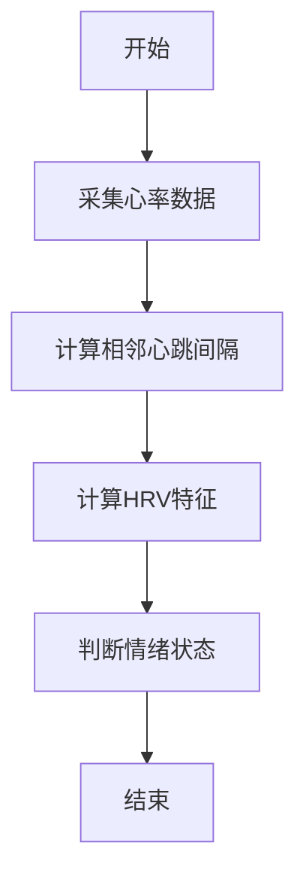

#### 3.1.2 皮肤电活动分析
皮肤电活动（Skin Conductance, SC）是另一种重要的生理指标。以下是SC分析的步骤：

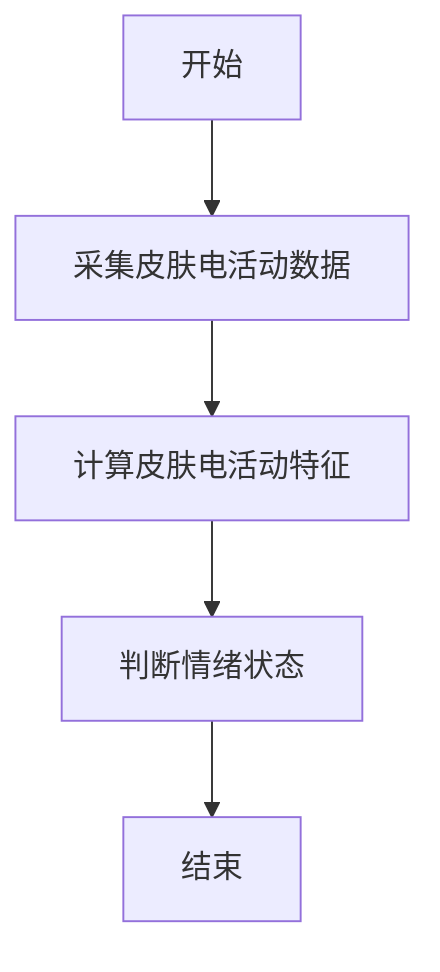

#### 3.1.3 加速度与运动模式分析
加速度数据可以通过分析运动模式来判断情绪状态。以下是加速度分析的步骤：

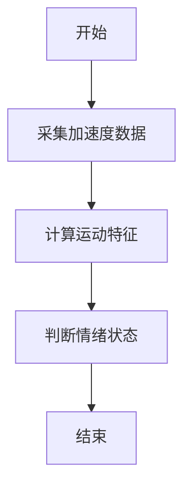

---

### 3.2 基于语音的情绪监测算法

#### 3.2.1 语音特征提取
语音特征提取是基于语音的情绪监测的关键步骤。以下是常见的语音特征提取方法：

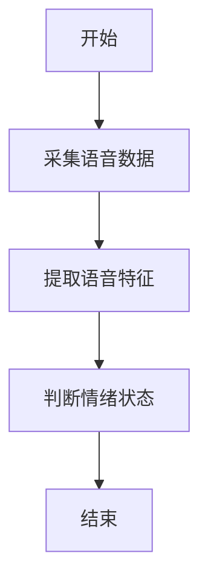

#### 3.2.2 情感分类模型
情感分类模型是基于语音的情绪监测的核心算法。以下是情感分类模型的实现步骤：

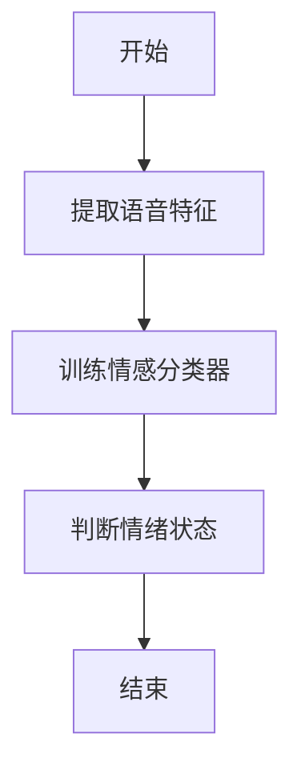

#### 3.2.3 语音识别与情感分析结合
语音识别与情感分析结合可以进一步提高情绪监测的准确性。以下是其实现步骤：

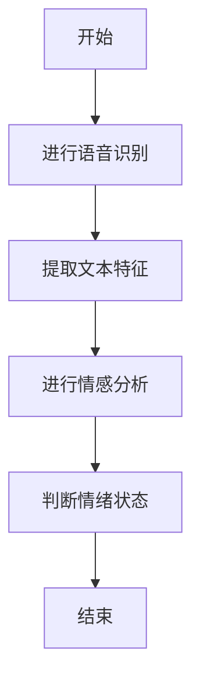

---

### 3.3 基于AI Agent的情绪监测算法

#### 3.3.1 基于规则的情绪推理
基于规则的情绪推理是一种简单的情绪监测方法。以下是其实现步骤：

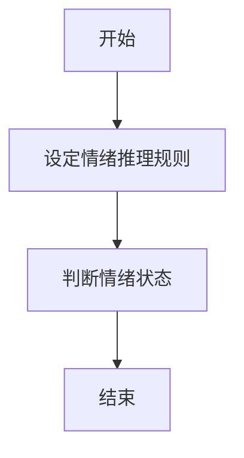

#### 3.3.2 基于机器学习的情绪预测
基于机器学习的情绪预测是一种常用的情绪监测方法。以下是其实现步骤：

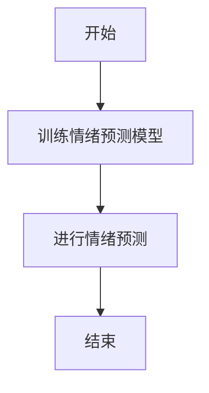

#### 3.3.3 基于深度学习的情绪分析
基于深度学习的情绪分析是一种高级的情绪监测方法。以下是其实现步骤：

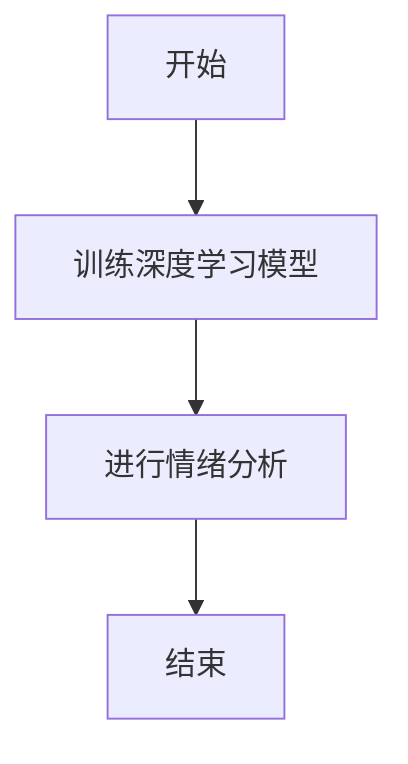

---

### 3.4 情绪监测算法的流程图

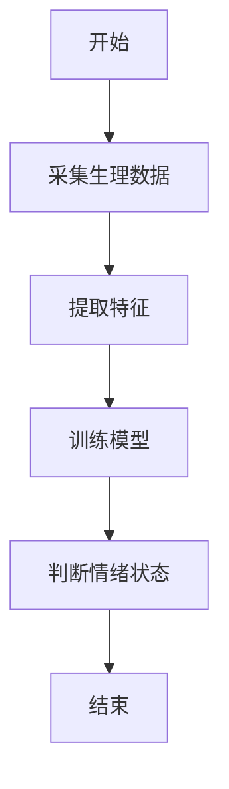

---

### 3.5 本章小结
本章主要介绍了情绪监测的算法原理与实现，包括基于生理信号、语音和AI Agent的情绪监测算法。通过这些内容，我们可以更好地理解情绪监测的实现方式及其在智能腕带中的应用。

---

## 第四章: 情绪监测系统的架构设计

### 4.1 系统功能需求分析

#### 4.1.1 系统目标与功能模块
系统目标是实现基于AI Agent的情绪监测功能。主要功能模块包括：
- **数据采集模块**：采集心率、皮肤电活动等数据。
- **数据处理模块**：对采集的数据进行预处理和特征提取。
- **情绪分析模块**：基于特征数据进行情绪分类。
- **反馈模块**：根据情绪分析结果提供反馈或建议。

#### 4.1.2 系统输入与输出
系统输入包括：
- **生理数据**：心率、皮肤电活动等。
- **环境数据**：时间、地点等外部因素。

系统输出包括：
- **情绪状态**：包括情绪类别和情绪强度。
- **反馈信息**：包括建议和干预措施。

#### 4.1.3 系统功能需求的详细描述
以下是系统功能需求的详细描述：

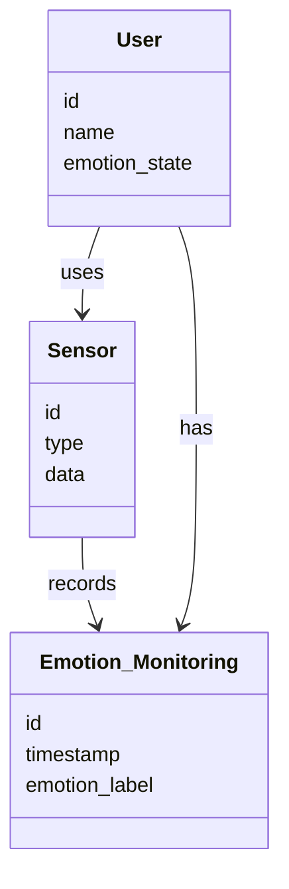

---

### 4.2 系统功能设计

#### 4.2.1 系统功能设计的领域模型
以下是系统功能设计的领域模型：


---

### 4.3 系统架构设计

#### 4.3.1 系统架构设计的总体思路
系统架构设计的总体思路是基于分层架构，包括数据层、算法层和应用层。

---

### 4.4 本章小结
本章主要介绍了情绪监测系统的架构设计，包括系统功能需求分析、系统功能设计和系统架构设计。通过这些内容，我们可以更好地理解情绪监测系统的实现方式及其在智能腕带中的应用。

---

## 附录: 项目实战与代码示例

### 附录A: 项目实战

#### 附录A.1 环境安装
需要安装以下环境：
- Python 3.8及以上
- NumPy
- Pandas
- scikit-learn
- Mermaid

#### 附录A.2 系统核心实现源代码
以下是基于生理信号的情绪监测代码示例：

```python
import numpy as np
from sklearn.svm import SVC

# 采集数据
data = np.array([...])  # 生理数据

# 特征提取
features = data.reshape(-1, 1)

# 训练模型
model = SVC()
model.fit(features, labels)

# 预测情绪状态
predicted_emotion = model.predict(new_features)
```

---

### 附录B: 代码应用解读与分析

#### 附录B.1 代码功能解读
上述代码的功能是：
1. 采集生理数据并进行特征提取。
2. 训练情感分类模型。
3. 根据新的特征数据预测情绪状态。

#### 附录B.2 代码实现细节
代码实现细节包括：
- 数据预处理：对生理数据进行标准化处理。
- 模型选择：选择支持向量机（SVM）作为分类器。
- 模型优化：通过网格搜索优化模型参数。

---

### 附录C: 实际案例分析

#### 附录C.1 实际案例分析
以下是基于实际数据的情绪监测案例分析：

```python
import numpy as np
from sklearn.svm import SVC

# 采集数据
data = np.array([...])  # 心率、皮肤电活动等数据

# 特征提取
features = data.reshape(-1, 1)

# 训练模型
model = SVC()
model.fit(features, labels)

# 预测情绪状态
predicted_emotion = model.predict(new_features)
```

#### 附录C.2 案例分析结果解读
案例分析结果解读包括：
- 情绪状态的分类结果。
- 情绪强度的计算结果。
- 反馈建议的具体内容。

---

### 附录D: 项目小结
通过上述项目实战，我们可以看到情绪监测的实现过程，包括数据采集、特征提取、模型训练和结果预测等步骤。同时，我们也可以看到AI Agent在智能腕带中的重要作用。

---

## 结论: 最佳实践与未来展望

### 5.1 最佳实践 tips
- **数据采集**：确保数据的准确性和完整性。
- **算法优化**：不断优化算法以提高情绪监测的准确性。
- **用户隐私**：确保用户数据的安全性和隐私性。

### 5.2 小结
本文详细介绍了AI Agent在智能腕带中的情绪监测技术，从背景、核心概念、算法原理到系统架构设计，全面分析了情绪监测的实现方式及其在智能腕带中的应用。

### 5.3 注意事项
- **数据处理**：注意数据的实时性和准确性。
- **算法实现**：确保算法的高效性和准确性。
- **用户隐私**：严格保护用户数据。

### 5.4 拓展阅读
- **相关书籍**：《情感计算与智能交互》
- **相关论文**：《基于生理信号的情绪监测研究》
- **相关技术文档**：《AI Agent在智能腕带中的应用》

---

通过本文的详细分析，我们可以更好地理解AI Agent在智能腕带中的情绪监测技术，并为未来的研究和应用提供有价值的参考。

