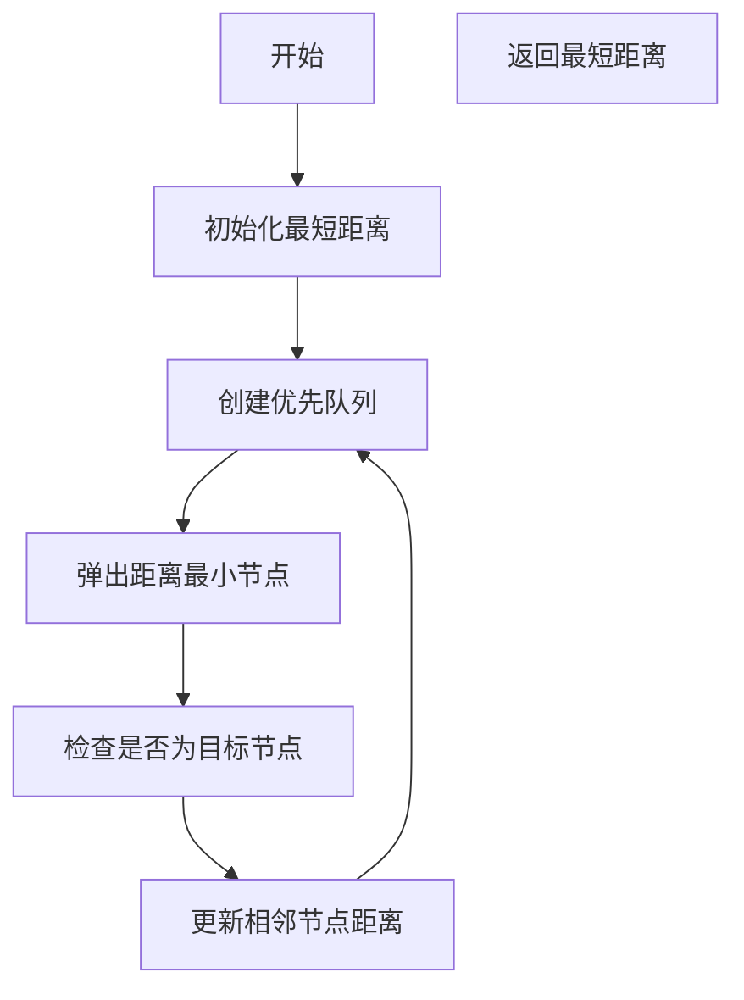
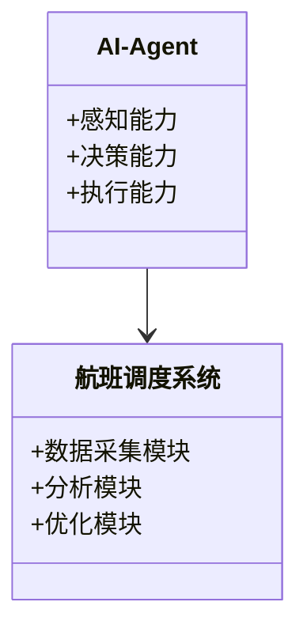
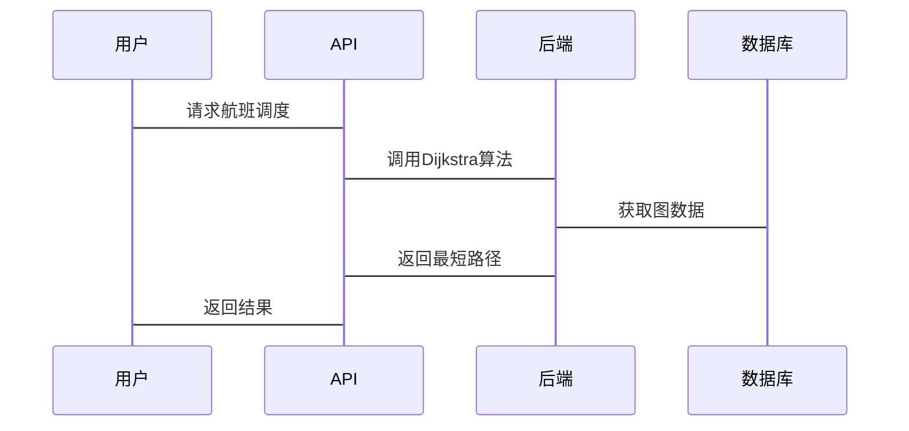

                 


# AI Agent在智能航空管理中的应用

> 关键词：智能航空管理、AI Agent、人工智能、航空管理优化、机场运营、航班调度

> 摘要：本文探讨AI Agent在智能航空管理中的应用，涵盖其核心概念、算法原理、系统架构及实际案例，分析其如何提升航空管理效率与决策能力，展望未来发展。

---

## 第一部分: AI Agent在智能航空管理中的应用概述

### 第1章: AI Agent与智能航空管理概述

#### 1.1 AI Agent的基本概念
##### 1.1.1 AI Agent的定义与特点
AI Agent（人工智能代理）是能够感知环境、自主决策并执行任务的智能体。其特点包括自主性、反应性、目标导向和社会能力。

##### 1.1.2 AI Agent的核心功能与优势
AI Agent通过感知、推理和学习，能够优化资源分配、提高效率，并在动态环境中快速响应。

##### 1.1.3 AI Agent在航空管理中的应用背景
航空管理涉及航班调度、机场运营、客户服务等多个复杂环节，AI Agent可帮助解决资源分配不均、效率低下等问题。

#### 1.2 智能航空管理的定义与特点
##### 1.2.1 智能航空管理的定义
智能航空管理是利用AI、大数据等技术，优化航空运营的决策过程。

##### 1.2.2 智能航空管理的核心要素
包括数据采集、智能分析、动态优化和实时反馈。

##### 1.2.3 智能航空管理与传统航空管理的区别
智能航空管理更具数据驱动、自动化和实时响应的特点。

#### 1.3 AI Agent在智能航空管理中的应用前景
##### 1.3.1 AI Agent在航空管理中的潜在应用领域
涵盖航班调度、机场资源分配、客户服务等方面。

##### 1.3.2 AI Agent应用的行业趋势
随着技术进步，AI Agent在航空管理中的应用将更加广泛和深入。

##### 1.3.3 AI Agent应用的挑战与机遇
挑战包括数据隐私和模型泛化能力，机遇则在于提升效率和用户体验。

---

## 第二部分: AI Agent的核心概念与联系

### 第2章: AI Agent的核心概念与联系

#### 2.1 AI Agent的核心原理
##### 2.1.1 AI Agent的感知能力
AI Agent通过传感器和数据源获取环境信息。

##### 2.1.2 AI Agent的决策能力
基于感知信息，AI Agent运用算法做出决策。

##### 2.1.3 AI Agent的执行能力
通过执行器将决策转化为实际操作。

#### 2.2 AI Agent与智能航空管理的关系
##### 2.2.1 AI Agent在航空管理中的角色
AI Agent作为决策支持系统，优化资源分配。

##### 2.2.2 AI Agent与智能航空管理的联系
AI Agent是实现智能航空管理的核心技术。

#### 2.3 AI Agent在航空管理中的具体应用
##### 2.3.1 航班调度优化
AI Agent帮助航空公司优化航班安排，减少延误。

##### 2.3.2 机场资源分配
AI Agent优化机场设施使用，提高吞吐量。

##### 2.3.3 客户服务提升
通过个性化服务，提升客户满意度。

---

## 第三部分: AI Agent的算法原理

### 第3章: AI Agent的算法原理

#### 3.1 常见AI Agent算法
##### 3.1.1 Dijkstra算法
用于路径规划，寻找最短路径。

##### 3.1.2 线性规划模型
用于资源分配优化。

#### 3.2 Dijkstra算法实现航班调度优化
##### 3.2.1 算法步骤
1. 初始化最短距离。
2. 选择距离最小的节点。
3. 更新相邻节点的距离。

##### 3.2.2 Python代码实现
```python
import heapq

def dijkstra(start, end, graph):
    distances = {node: float('infinity') for node in graph}
    distances[start] = 0
    heap = []
    heapq.heappush(heap, (0, start))
    
    while heap:
        current_dist, current_node = heapq.heappop(heap)
        if current_node == end:
            break
        for neighbor in graph[current_node]:
            new_dist = current_dist + graph[current_node][neighbor]
            if new_dist < distances[neighbor]:
                distances[neighbor] = new_dist
                heapq.heappush(heap, (new_dist, neighbor))
    return distances[end]
```

##### 3.2.3 算法流程图


---

## 第四部分: AI Agent的系统架构与设计

### 第4章: AI Agent的系统架构与设计

#### 4.1 系统功能设计
##### 4.1.1 领域模型设计


#### 4.2 系统架构设计
##### 4.2.1 分层架构


#### 4.3 系统接口设计
##### 4.3.1 REST API设计
```http
POST /api/schedule
{
    "start": "A",
    "end": "B",
    "graph": { ... }
}
```

##### 4.3.2 序列图


---

## 第五部分: AI Agent的项目实战

### 第5章: AI Agent的项目实战

#### 5.1 环境安装与配置
##### 5.1.1 安装Python与相关库
```bash
pip install python
pip install numpy
pip install scikit-learn
```

#### 5.2 核心代码实现
##### 5.2.1 航班调度优化代码
```python
import heapq

def dijkstra(start, end, graph):
    distances = {node: float('infinity') for node in graph}
    distances[start] = 0
    heap = []
    heapq.heappush(heap, (0, start))
    
    while heap:
        current_dist, current_node = heapq.heappop(heap)
        if current_node == end:
            break
        for neighbor in graph[current_node]:
            new_dist = current_dist + graph[current_node][neighbor]
            if new_dist < distances[neighbor]:
                distances[neighbor] = new_dist
                heapq.heappush(heap, (new_dist, neighbor))
    return distances[end]
```

##### 5.2.2 算法应用案例分析
分析某机场航班调度优化案例，详细说明AI Agent的应用过程及其带来的效率提升。

#### 5.3 项目总结与经验分享
##### 5.3.1 项目小结
总结项目成果，强调AI Agent在航空管理中的价值。

##### 5.3.2 经验与教训
分享项目中的挑战与解决方案。

---

## 第六部分: 最佳实践与未来展望

### 第6章: 最佳实践

#### 6.1 小结
AI Agent在智能航空管理中的应用前景广阔，技术实现需结合具体场景。

#### 6.2 注意事项
数据隐私和模型泛化能力是应用中的主要挑战。

#### 6.3 拓展阅读
推荐相关书籍和论文，供读者深入学习。

---

通过以上结构，文章系统地介绍了AI Agent在智能航空管理中的应用，从理论到实践，为读者提供全面的技术解读和应用指导。

