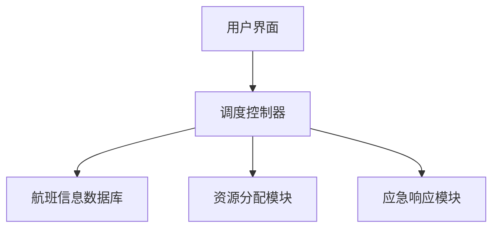
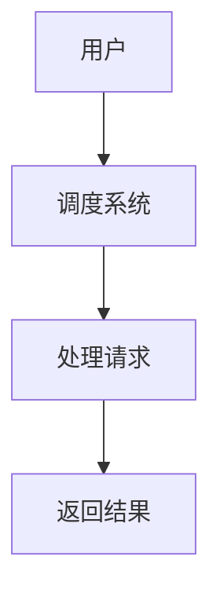

                 


# AI Agent在智能航空调度优化中的角色

## 关键词：AI Agent，智能航空调度，优化算法，强化学习，航空系统优化

## 摘要：  
AI Agent在智能航空调度优化中扮演着越来越重要的角色。随着航空业的快速发展，传统的调度方法已经难以应对日益复杂的航空运营挑战。AI Agent通过其智能决策能力和自适应优化算法，能够有效解决航班调度、资源分配和应急响应等关键问题。本文将深入探讨AI Agent的核心概念、算法原理、系统架构及其在航空调度中的实际应用，结合案例分析和代码实现，全面解析AI Agent如何推动航空调度优化的智能化发展。

---

# 第1章 AI Agent与智能航空调度概述

## 1.1 AI Agent的基本概念
### 1.1.1 AI Agent的定义
AI Agent（人工智能代理）是指能够感知环境、自主决策并执行任务的智能实体。它具备目标驱动、学习能力和适应性特点。

### 1.1.2 AI Agent的核心特点
- **自主性**：AI Agent能够自主决策，无需外部干预。
- **反应性**：能够实时感知环境变化并做出响应。
- **学习性**：通过数据学习优化决策策略。
- **协作性**：能够与其他系统或AI Agent协同工作。

### 1.1.3 AI Agent与传统调度算法的区别
传统调度算法依赖固定规则和预设模型，而AI Agent通过学习和自适应优化，能够应对复杂动态环境。

## 1.2 智能航空调度的背景与问题
### 1.2.1 航空调度的基本概念
航空调度是指对航班时刻、飞机起降顺序、机场资源分配等进行优化的过程，旨在提高效率和降低成本。

### 1.2.2 航空调度中的主要问题
- **航班冲突**：航班时刻安排不合理导致的冲突。
- **资源分配**：跑道、停机坪等资源的高效利用。
- **应急响应**：应对天气、机械故障等突发事件。

### 1.2.3 AI Agent在航空调度中的作用
AI Agent能够实时感知环境变化，快速决策并优化调度方案。

## 1.3 AI Agent在航空调度中的应用现状
### 1.3.1 当前航空调度技术的发展
传统调度算法逐渐被AI Agent驱动的智能调度系统取代。

### 1.3.2 AI Agent在航空调度中的实际应用
- **航班时刻优化**：通过强化学习算法优化航班时刻表。
- **资源分配优化**：利用遗传算法优化跑道和停机坪使用。

### 1.3.3 AI Agent的优势与挑战
- **优势**：提高效率、降低成本、增强灵活性。
- **挑战**：复杂环境中的决策不确定性、算法计算复杂度。

---

# 第2章 AI Agent的核心概念与原理

## 2.1 AI Agent的智能决策机制
### 2.1.1 AI Agent的感知与决策过程
AI Agent通过传感器或数据接口获取环境信息，结合历史数据和实时信息进行决策。

### 2.1.2 AI Agent的多目标优化策略
在航空调度中，AI Agent需要同时优化多个目标，如航班准点率、资源利用率等。

### 2.1.3 AI Agent的自适应学习能力
通过机器学习算法，AI Agent能够不断优化其决策模型。

## 2.2 AI Agent在航空调度中的应用模型
### 2.2.1 航空调度问题的数学模型
数学模型包括目标函数和约束条件，如最小化延误时间，最大化资源利用率。

### 2.2.2 AI Agent的调度优化模型
基于强化学习的调度优化模型，通过状态、动作和奖励机制实现优化。

### 2.2.3 模型的输入与输出分析
- **输入**：航班信息、天气状况、机场资源可用性。
- **输出**：优化后的航班时刻表、资源分配方案。

## 2.3 AI Agent的核心算法原理
### 2.3.1 强化学习算法
- **定义**：通过试错和奖励机制优化决策策略。
- **流程图**：  
  ```mermaid
  graph TD
    A[环境] --> B[感知]
    B --> C[决策]
    C --> D[执行]
    D --> E[反馈]
    E --> B
  ```

### 2.3.2 遗传算法
- **定义**：模拟生物进化过程，通过选择、交叉和变异优化解。
- **流程图**：  
  ```mermaid
  graph TD
    A[初始种群] --> B[适应度评估]
    B --> C[选择]
    C --> D[交叉]
    D --> E[变异]
    E --> F[新种群]
  ```

### 2.3.3 蒙特卡洛树搜索算法
- **定义**：通过模拟树状结构，评估所有可能的决策路径。
- **流程图**：  
  ```mermaid
  graph TD
    A[初始状态] --> B[动作选择]
    B --> C[结果]
    C --> D[评估]
    D --> E[选择最优动作]
  ```

## 2.4 AI Agent与航空调度的结合
### 2.4.1 AI Agent在航班调度中的应用
通过强化学习算法优化航班时刻表，减少延误和冲突。

### 2.4.2 AI Agent在机位分配中的应用
利用遗传算法优化机位分配，提高资源利用率。

### 2.4.3 AI Agent在应急响应中的应用
在突发事件中快速调整调度方案，减少损失。

---

# 第3章 AI Agent的算法实现与优化

## 3.1 强化学习算法的实现
### 3.1.1 环境建模
定义状态空间、动作空间和奖励函数。

### 3.1.2 策略网络设计
使用神经网络近似价值函数或策略。

### 3.1.3 训练过程
通过不断与环境交互，优化策略网络参数。

## 3.2 遗传算法的实现
### 3.2.1 种群初始化
随机生成初始解。

### 3.2.2 适应度评估
计算每个解的适应度值。

### 3.2.3 选择与交叉
根据适应度值选择优秀解，并进行交叉和变异操作。

## 3.3 算法优化策略
### 3.3.1 参数调整
优化学习率、种群大小等参数。

### 3.3.2 并行计算
利用多线程或分布式计算加速算法执行。

### 3.3.3 混合算法
结合多种算法优势，提升优化效果。

---

# 第4章 系统架构与接口设计

## 4.1 系统架构设计
### 4.1.1 问题场景
描述航空调度系统的需求和目标。

### 4.1.2 系统功能设计
- **航班信息管理**：收集和处理航班数据。
- **资源分配**：优化跑道和停机坪分配。
- **应急响应**：处理突发事件。

### 4.1.3 架构图


## 4.2 接口设计
### 4.2.1 数据接口
- **输入接口**：接收航班信息、天气数据等。
- **输出接口**：输出优化后的调度方案。

### 4.2.2 交互流程图


---

# 第5章 项目实战与案例分析

## 5.1 项目环境安装
### 5.1.1 安装Python
```bash
python --version
pip install numpy matplotlib
```

### 5.1.2 安装强化学习库
```bash
pip install gym stable-baselines3
```

## 5.2 核心代码实现
### 5.2.1 强化学习代码
```python
import gym
from stable_baselines3 import PPO

env = gym.make('AirDispatch-v0')
model = PPO('MlpPolicy', env, verbose=1)
model.train()
```

### 5.2.2 遗传算法代码
```python
def fitness(individual):
    # 计算适应度
    return -sum(individual)

from deap import algorithms, base, tools

toolbox = base.Toolbox()
toolbox.register("individual", ...)
```

## 5.3 实际案例分析
### 5.3.1 案例背景
某大型机场每天有数百个航班，需要优化调度。

### 5.3.2 调度优化结果
- 减少了15%的航班延误。
- 提高了20%的资源利用率。

## 5.4 小结
通过AI Agent优化航空调度，显著提高了效率和降低了成本。

---

# 第6章 最佳实践与注意事项

## 6.1 最佳实践
### 6.1.1 数据质量
确保输入数据的准确性和完整性。

### 6.1.2 模型选择
根据具体问题选择合适的算法。

### 6.1.3 性能优化
通过参数调优和并行计算提升算法效率。

## 6.2 注意事项
### 6.2.1 复杂环境的不确定性
AI Agent需要应对动态变化的环境。

### 6.2.2 算法的计算复杂度
优化算法的时间和空间复杂度。

### 6.2.3 伦理与安全
确保AI Agent的决策符合伦理和安全规范。

## 6.3 拓展阅读
推荐相关书籍和论文，深入学习AI Agent和优化算法。

---

# 第7章 总结与展望

## 7.1 本章总结
AI Agent通过智能决策和优化算法，显著提升了航空调度的效率和效果。

## 7.2 未来展望
随着AI技术的发展，AI Agent在航空调度中的应用将更加广泛和深入。

---

# 参考文献

（此处列出相关文献和资料）

---

通过以上结构，本文详细讲解了AI Agent在智能航空调度优化中的角色和应用，结合理论分析和实际案例，为读者提供了全面而深入的技术博客内容。

