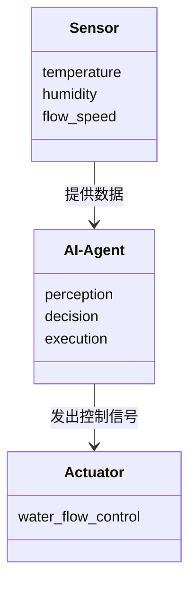

                 


# AI Agent在智能花洒中的水量控制

## 关键词：AI Agent, 智能花洒, 水量控制, 传感器, 机器学习, PID控制, 智能家居

## 摘要：  
本文探讨了AI Agent在智能花洒中的应用，重点分析了AI Agent如何通过感知、决策和执行模块实现智能水量控制。文章从背景介绍、核心概念、算法原理、系统架构设计到项目实战，详细阐述了AI Agent在智能花洒中的技术实现。通过传感器数据采集、机器学习算法优化和PID控制算法的结合，展示了如何实现精准的水量调节。文章还提供了详细的代码实现和实际案例分析，帮助读者理解并应用AI Agent技术在智能花洒中的实际场景。

---

# 第一部分: AI Agent在智能花洒中的背景与概念

## 第1章: AI Agent与智能花洒概述

### 1.1 AI Agent的基本概念

#### 1.1.1 AI Agent的定义
AI Agent（人工智能代理）是指能够感知环境、自主决策并执行任务的智能实体。它能够根据环境信息做出决策，并通过执行动作与环境交互。AI Agent的核心目标是通过智能化的感知和决策，实现对目标系统的优化控制。

#### 1.1.2 AI Agent的核心特征
- **自主性**：AI Agent能够自主感知环境并做出决策，无需外部干预。
- **反应性**：AI Agent能够实时感知环境变化并快速响应。
- **学习能力**：AI Agent能够通过学习优化自身的决策模型。
- **可扩展性**：AI Agent能够适应不同的应用场景和复杂度。

#### 1.1.3 AI Agent的应用场景
AI Agent广泛应用于智能家居、自动驾驶、机器人控制等领域。在智能花洒中的应用，主要体现在通过AI Agent实现对水量的智能调节。

---

### 1.2 智能花洒的背景与需求

#### 1.2.1 智能花洒的发展历程
传统花洒仅能手动调节水量和水温，无法根据环境变化自动调整。随着物联网和人工智能技术的发展，智能花洒逐渐成为智能家居的重要组成部分，能够通过传感器和AI算法实现智能化控制。

#### 1.2.2 智能花洒的功能需求
- **智能调节水量**：根据用户需求和环境数据自动调节出水量。
- **精准控制水温**：通过温度传感器和AI算法实现恒温出水。
- **远程控制**：通过手机APP或其他智能设备远程控制花洒。
- **节能环保**：通过智能调节避免水资源浪费。

#### 1.2.3 智能花洒的用户痛点
- **操作复杂**：传统花洒需要手动调节，使用不便。
- **水资源浪费**：无法根据实际需求精准控制水量。
- **缺乏智能化**：无法根据环境变化自动调整出水参数。

---

### 1.3 AI Agent在智能花洒中的作用

#### 1.3.1 智能花洒水量控制的挑战
- **环境数据的复杂性**：温度、湿度、水流速度等多种因素需要同时考虑。
- **动态调节的实时性**：需要快速响应环境变化，实现实时调节。
- **模型优化的准确性**：需要通过机器学习不断优化水量控制模型。

#### 1.3.2 AI Agent在水量控制中的优势
- **智能化感知**：AI Agent能够实时感知环境数据并做出决策。
- **精准控制**：通过学习优化算法实现对水量的精准调节。
- **节能环保**：通过智能调节减少水资源浪费。

#### 1.3.3 AI Agent与智能花洒的结合场景
- **场景一**：根据用户习惯自动调节出水量。
- **场景二**：根据天气变化自动调整出水温度。
- **场景三**：通过远程控制实现定时开关和水量调节。

---

## 第2章: AI Agent与智能花洒的核心概念

### 2.1 AI Agent的感知模块

#### 2.1.1 传感器数据的采集与处理
AI Agent通过传感器采集环境数据，如温度、湿度、水流速度等。数据采集后需要进行预处理，去除噪声并标准化数据。

#### 2.1.2 数据特征的提取与分析
通过对传感器数据的分析，提取关键特征，如平均水流速度、温度波动幅度等，为后续的决策提供依据。

#### 2.1.3 数据预处理与标准化
为了确保AI Agent能够准确感知环境，需要对传感器数据进行预处理和标准化，消除数据偏差。

---

### 2.2 AI Agent的决策模块

#### 2.2.1 决策算法的选择与实现
选择适合的决策算法，如PID控制算法或机器学习算法，根据环境数据做出决策。

#### 2.2.2 决策模型的训练与优化
通过机器学习训练决策模型，并通过反馈优化模型性能。

#### 2.2.3 决策结果的输出与反馈
将决策结果输出到执行模块，并根据反馈不断优化决策模型。

---

### 2.3 AI Agent的执行模块

#### 2.3.1 执行机构的控制逻辑
通过控制电磁阀或其他执行机构实现对水流的调节。

#### 2.3.2 控制信号的传递与执行
将决策模块输出的控制信号传递给执行机构，实现对水量的实际调节。

#### 2.3.3 执行结果的监测与调整
通过传感器监测执行结果，并根据反馈不断调整控制策略。

---

## 第3章: AI Agent在智能花洒中的算法原理

### 3.1 AI Agent的核心算法

#### 3.1.1 基于PID控制的水量调节算法
PID控制是一种经典的控制算法，适用于线性系统。通过比例、积分和微分三个部分的组合，实现对水量的精准调节。

#### 3.1.2 基于机器学习的水量预测算法
通过机器学习算法，如回归或神经网络，预测未来的水量需求，并做出相应的调整。

#### 3.1.3 PID控制算法的数学模型
PID控制算法的数学模型如下：

$$ u(t) = K_p \cdot e(t) + K_i \cdot \int_{0}^{t} e(\tau) d\tau + K_d \cdot \frac{d e(t)}{dt} $$

其中，$K_p$、$K_i$、$K_d$分别为比例系数、积分系数和微分系数，$e(t)$为误差信号。

---

## 第4章: AI Agent在智能花洒中的系统分析与架构设计

### 4.1 系统功能设计

#### 4.1.1 领域模型设计
通过领域模型（Mermaid类图）展示智能花洒系统的各个模块及其交互关系。



---

### 4.2 系统架构设计

#### 4.2.1 系统架构图
通过Mermaid架构图展示系统的整体架构，包括数据采集、AI算法处理和执行机构三大部分。


---

## 第5章: AI Agent在智能花洒中的项目实战

### 5.1 环境安装

#### 5.1.1 安装Python和相关库
安装Python和必要的库，如TensorFlow、NumPy等。

#### 5.1.2 安装传感器和执行机构
选择适合的传感器和执行机构，并完成硬件连接。

---

### 5.2 系统核心实现源代码

#### 5.2.1 数据采集与预处理代码
```python
import numpy as np
import pandas as pd

# 读取传感器数据
data = pd.read_csv('sensor_data.csv')

# 数据预处理
data_processed = data.dropna()  # 删除缺失值
data_processed = (data_processed - data_processed.mean()) / data_processed.std()  # 标准化
```

#### 5.2.2 PID控制算法实现
```python
class PIDController:
    def __init__(self, Kp, Ki, Kd):
        self.Kp = Kp
        self.Ki = Ki
        self.Kd = Kd
        self.error = 0
        self.integral = 0
        self.derivative = 0

    def compute(self, target, current):
        self.error = target - current
        self.integral += self.error
        self.derivative = self.error - self.error.previous()
        output = self.Kp * self.error + self.Ki * self.integral + self.Kd * self.derivative
        return output
```

---

### 5.3 实际案例分析与代码解读

#### 5.3.1 案例分析
通过实际案例分析，展示AI Agent在智能花洒中的应用效果。

#### 5.3.2 代码实现与分析
详细解读代码实现，分析每部分代码的功能和作用。

---

## 第6章: 最佳实践与总结

### 6.1 小结
总结AI Agent在智能花洒中的应用，强调其在水量控制中的优势和潜力。

### 6.2 注意事项
提醒读者在实际应用中需要注意的问题，如数据隐私、系统稳定性等。

### 6.3 拓展阅读
推荐相关的技术资料和书籍，帮助读者进一步深入学习AI Agent和智能花洒技术。

---

通过以上章节的详细阐述，读者可以全面理解AI Agent在智能花洒中的水量控制技术，从理论到实践，逐步掌握其实现方法和应用技巧。

