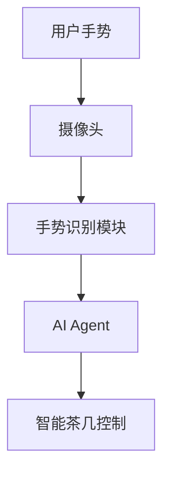
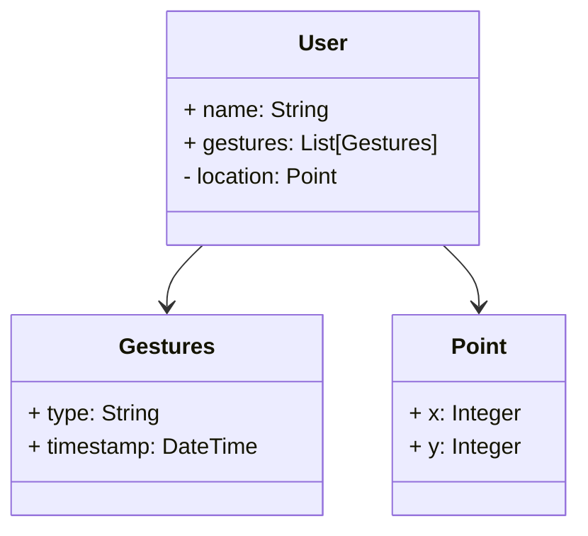
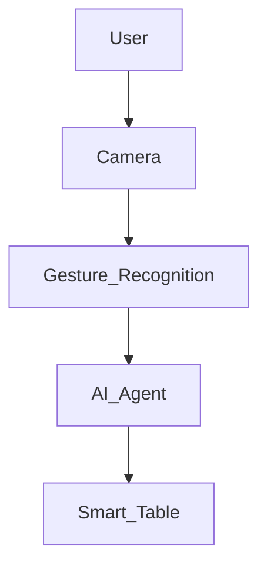
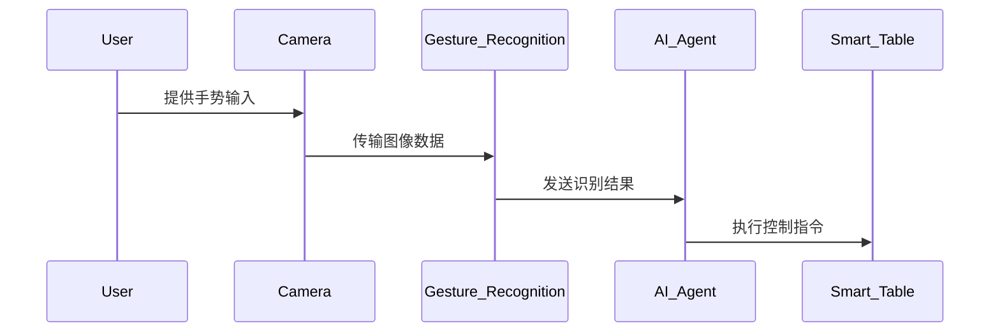

                 


# AI Agent在智能茶几中的手势控制

> 关键词：AI Agent, 智能茶几, 手势控制, 深度学习, 计算机视觉, 机器人技术

> 摘要：本文详细探讨了AI Agent在智能茶几中的手势控制技术，从背景介绍到系统架构设计，再到项目实战，全面解析了手势控制的核心算法、系统实现和应用场景。通过本篇文章，读者将深入了解如何利用AI技术实现智能茶几的手势交互，并掌握相关技术的实现方法和最佳实践。

---

## 第一部分：AI Agent与智能茶几概述

### 第1章：AI Agent与手势控制的背景介绍

#### 1.1 问题背景与描述

##### 1.1.1 智能家居的发展趋势
随着人工智能和物联网技术的快速发展，智能家居已成为现代生活的重要组成部分。智能家居设备通过智能化的交互方式，为用户提供了更加便捷和舒适的生活体验。智能家居的交互方式正在从传统的按钮操作向更自然的语音和手势控制方向发展。

##### 1.1.2 手势控制在智能家居中的应用价值
手势控制作为一种非接触式的交互方式，具有直观、便捷和自然的特点。在智能家居中，手势控制可以实现对设备的精准操作，提升用户体验。特别是在茶几这样的家庭场景中，手势控制可以更自然地融入日常生活，使用户能够轻松地进行娱乐、信息查询和设备控制等操作。

##### 1.1.3 智能茶几的场景化需求
智能茶几作为一种智能家居设备，其核心功能包括娱乐、办公和家庭互动等。在这些场景中，手势控制可以实现对茶几的多模态交互，例如通过手势进行视频播放、网页浏览、文件操作等。智能茶几的手势控制不仅提升了设备的交互能力，还为用户提供了更加智能化的生活体验。

#### 1.2 AI Agent的核心概念

##### 1.2.1 AI Agent的定义与特点
AI Agent（人工智能代理）是一种能够感知环境并采取行动以实现目标的智能实体。AI Agent具有自主性、反应性、目标导向和社会能力等特点。在智能茶几中，AI Agent负责接收和处理用户的输入指令，并通过执行相应动作来实现设备的智能化控制。

##### 1.2.2 手势控制的基本原理
手势控制是一种基于人体动作的交互技术，其核心是通过计算机视觉或传感器技术捕捉用户的肢体动作，并将这些动作转换为可编程的控制指令。手势控制的关键步骤包括数据采集、特征提取、动作识别和指令执行。

##### 1.2.3 智能茶几的功能与交互方式
智能茶几的功能包括娱乐（如播放音乐、视频）、办公（如文件处理、网页浏览）和家庭互动（如游戏互动、智能家居控制）等。在交互方式上，智能茶几支持手势、语音和触控等多种方式，其中手势控制是最具代表性的交互方式之一。

#### 1.3 问题解决与边界

##### 1.3.1 手势控制在智能茶几中的具体应用
手势控制在智能茶几中的具体应用包括视频播放控制、网页浏览、文件操作、智能家居设备控制等。通过手势控制，用户可以更直观地操作智能茶几，提升用户体验。

##### 1.3.2 边界与外延：功能与非功能边界
智能茶几的手势控制功能边界包括设备的物理限制和功能限制。例如，手势控制无法实现复杂的三维操作，且需要在设备摄像头的可视范围内进行。而非功能边界包括设备的硬件限制、网络连接状态等。

##### 1.3.3 核心要素与组成结构
智能茶几的手势控制系统由以下几个核心要素组成：摄像头、手势识别算法、AI Agent和执行机构。这些要素共同协作，实现手势控制功能。

---

## 第二部分：AI Agent与手势控制的核心概念与联系

### 第2章：AI Agent与手势控制的核心概念与联系

#### 2.1 核心概念原理

##### 2.1.1 AI Agent的基本原理
AI Agent通过感知环境、分析目标、制定策略和执行动作来实现智能化控制。在智能茶几中，AI Agent负责接收用户的手势指令，并通过分析指令内容来执行相应的设备操作。

##### 2.1.2 手势控制的技术实现
手势控制的技术实现主要基于计算机视觉和深度学习。通过摄像头采集用户的手势动作，利用图像处理和深度学习算法进行特征提取和动作识别，最终生成控制指令。

##### 2.1.3 两者结合的系统架构
在智能茶几中，AI Agent与手势控制的结合实现了人机交互的智能化。用户通过手势动作输入指令，AI Agent通过分析指令内容并调用相应的服务来实现设备控制。

#### 2.2 概念属性特征对比

##### 2.2.1 手势识别技术对比表格
| 技术类型 | 优点 | 缺点 | 适用场景 |
|----------|------|------|----------|
| 基于深度学习 | 高准确性 | 高计算需求 | 复杂场景 |
| 基于传统CV | 低计算需求 | 低准确性 | 简单场景 |

#### 2.3 系统架构图


---

## 第三部分：手势控制算法原理

### 第3章：手势控制算法原理

#### 3.1 算法流程

##### 3.1.1 数据预处理
在手势识别过程中，首先需要对手势数据进行预处理，包括图像采集、背景分割和数据增强等步骤。预处理的目的是提高手势识别的准确性和鲁棒性。

##### 3.1.2 特征提取
特征提取是手势识别的关键步骤，主要基于深度学习模型（如卷积神经网络）进行。特征提取的目标是从图像中提取出具有判别性的特征，用于后续的分类任务。

##### 3.1.3 分类器设计
分类器的设计基于提取的特征，利用机器学习算法（如支持向量机、随机森林）或深度学习模型（如卷积神经网络）进行分类。分类器的目标是将输入的手势特征映射到具体的动作类别上。

##### 3.1.4 模型训练与优化
通过大量的标注数据对手势识别模型进行训练，并利用交叉验证和调参技术进行模型优化。训练的目标是提高模型的准确性和泛化能力。

#### 3.2 Python实现代码

##### 3.2.1 数据预处理代码
```python
import cv2
import numpy as np

def preprocess_image(image):
    # 背景分割
    bg_model = np.zeros((image.shape[0], image.shape[1], 1), np.float32)
    # 其他预处理操作...
    return processed_image
```

##### 3.2.2 特征提取与分类
```python
def gesture_recognition():
    model = load_model('gesture_model.h5')
    processed_image = preprocess_image(image)
    features = extract_features(processed_image)
    prediction = model.predict(features)
    return prediction
```

#### 3.3 数学公式

##### 3.3.1 损失函数
$$ L = -\frac{1}{N} \sum_{i=1}^{N} y_i \log(p_i) + (1 - y_i) \log(1 - p_i) $$

##### 3.3.2 优化器
$$ \theta_{t+1} = \theta_t - \eta \frac{\partial L}{\partial \theta} $$

---

## 第四部分：系统分析与架构设计

### 第4章：系统分析与架构设计方案

#### 4.1 问题场景介绍
智能茶几的手势控制系统需要在家庭环境中稳定运行，支持多种手势操作，并与智能家居设备进行联动。

#### 4.2 系统功能设计

##### 4.2.1 领域模型


#### 4.3 系统架构设计

##### 4.3.1 系统架构图


#### 4.4 系统交互设计

##### 4.4.1 交互流程


---

## 第五部分：项目实战

### 第5章：项目实战

#### 5.1 环境安装

##### 5.1.1 安装依赖
```bash
pip install opencv-python numpy tensorflow matplotlib
```

#### 5.2 核心代码实现

##### 5.2.1 数据预处理
```python
import cv2

def capture_gesture():
    cap = cv2.VideoCapture(0)
    while cap.isOpened():
        ret, frame = cap.read()
        if not ret:
            break
        # 手势捕捉逻辑
        cv2.imshow('Gesture Capture', frame)
        if cv2.waitKey(1) == ord('q'):
            break
    cap.release()
    cv2.destroyAllWindows()
```

##### 5.2.2 手势识别模型训练
```python
import tensorflow as tf
from tensorflow.keras import layers

def build_model():
    model = tf.keras.Sequential([
        layers.Conv2D(32, (3, 3), activation='relu', input_shape=(224, 224, 3)),
        layers.MaxPooling2D((2, 2)),
        layers.Conv2D(64, (3, 3), activation='relu'),
        layers.MaxPooling2D((2, 2)),
        layers.Flatten(),
        layers.Dense(128, activation='relu'),
        layers.Dense(5, activation='softmax')
    ])
    model.compile(optimizer='adam', loss='sparse_categorical_crossentropy', metrics=['accuracy'])
    return model
```

#### 5.3 实际案例分析

##### 5.3.1 案例一：视频播放控制
用户通过手势“手比V”启动视频播放，手势“暂停”停止播放，手势“快进”加速播放。

##### 5.3.2 案例二：智能家居控制
用户通过手势“握拳”打开灯光，手势“摊手”关闭灯光，手势“旋转手”调节灯光亮度。

---

## 第六部分：最佳实践与扩展阅读

### 第6章：最佳实践

#### 6.1 小结
本文详细介绍了AI Agent在智能茶几中的手势控制技术，从背景介绍到系统实现，再到项目实战，全面解析了手势控制的核心算法和系统架构。

#### 6.2 注意事项
- 确保摄像头的安装位置合理，避免遮挡和干扰。
- 手势识别模型需要进行充分的训练，确保在不同光照和背景下都能准确识别。
- 系统设计时要考虑鲁棒性，避免单一故障点导致系统崩溃。

#### 6.3 拓展阅读
- 《基于深度学习的手势识别技术研究》
- 《智能家具中的多模态交互设计》
- 《AI Agent在智能家居中的应用研究》

---

## 第七部分：扩展阅读

### 第7章：扩展阅读

#### 7.1 手势控制的未来发展趋势
随着技术的进步，手势控制在智能茶几中的应用将更加智能化和多样化。未来的手势控制将更加精准，支持更多复杂的动作识别，并与更多的智能家居设备进行联动。

#### 7.2 AI Agent技术的其他应用场景
AI Agent技术不仅适用于智能茶几，还可以应用于机器人、自动驾驶、智能家居等多种场景，为人类提供更加智能化的服务。

#### 7.3 人工智能技术的伦理与安全
随着AI技术的不断发展，如何确保AI Agent的安全性和伦理性成为一个重要课题。未来的研究需要关注AI的透明性、可解释性和用户隐私保护等问题。

---

通过本文的详细讲解，读者可以深入了解AI Agent在智能茶几中的手势控制技术，并掌握相关技术的实现方法和最佳实践。希望本文能为读者提供有价值的参考，帮助他们更好地理解和应用相关技术。

