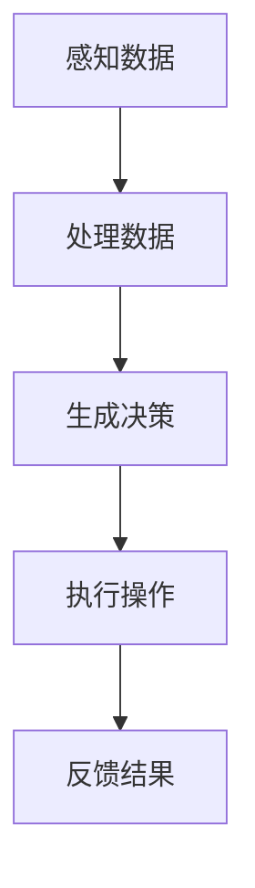
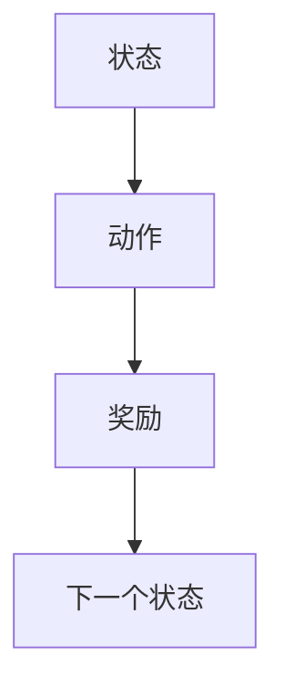
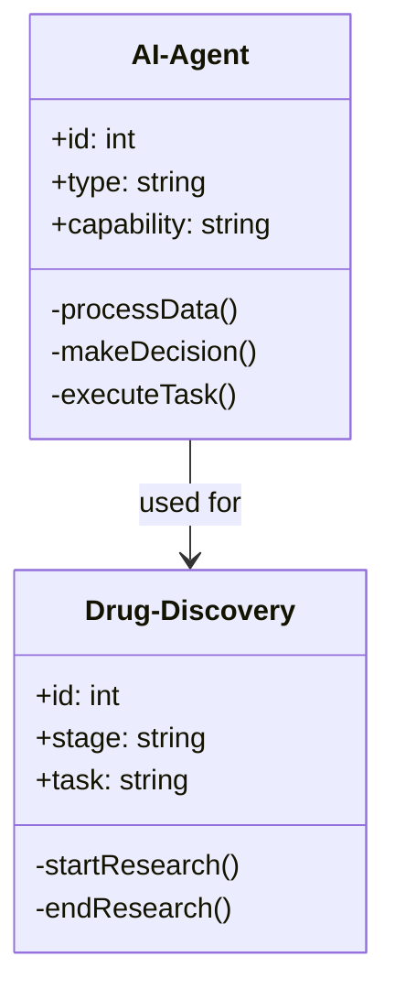

                 


# AI Agent在智能药物研发中的角色

> 关键词：AI Agent，智能药物研发，药物发现，人工智能，机器学习，药物设计

> 摘要：本文探讨了AI Agent在智能药物研发中的角色，从背景、核心概念到算法原理、系统架构、项目实战，再到总结与展望，全面分析AI Agent如何推动药物研发的创新与效率。

---

# 目录

1. **AI Agent与智能药物研发的背景**  
   1.1 AI Agent的基本概念  
   1.2 AI在药物研发中的作用  
   1.3 AI Agent在智能药物研发中的角色  

2. **AI Agent的核心概念与联系**  
   2.1 AI Agent的核心概念  
   2.2 AI Agent的实体关系图  
   2.3 AI Agent的核心算法流程图  

3. **AI Agent的算法原理与数学模型**  
   3.1 强化学习算法  
   3.2 生成模型算法  
   3.3 数学模型与公式  

4. **AI Agent的系统架构设计**  
   4.1 药物研发系统概述  
   4.2 系统架构图  
   4.3 系统接口设计  

5. **AI Agent在药物研发中的项目实战**  
   5.1 靶点预测案例  
   5.2 化合物筛选案例  
   5.3 算法实现与分析  

6. **AI Agent在智能药物研发中的总结与展望**  
   6.1 本章总结  
   6.2 未来展望  

7. **注意事项与拓展阅读**  
   7.1 AI Agent应用的注意事项  
   7.2 拓展阅读推荐  

---

## 1. AI Agent与智能药物研发的背景

### 1.1 AI Agent的基本概念

AI Agent（人工智能代理）是指能够感知环境、做出决策并执行任务的智能体。在药物研发中，AI Agent可以用于数据处理、分子设计、临床试验优化等多个环节。

#### 1.1.1 AI Agent的定义与特点
- **定义**：AI Agent是具备自主决策能力的智能系统，能够根据输入数据做出最优选择。
- **特点**：智能化、自主性、适应性、协作性。

#### 1.1.2 AI Agent在药物研发中的应用背景
- 药物研发的传统流程耗时长、成本高。
- AI技术的应用可以显著提高研发效率和精准度。

#### 1.1.3 药物研发的传统流程与挑战
- **传统流程**：从靶点发现到药物上市，通常需要10-15年时间。
- **挑战**：数据量大、计算复杂、研发成本高等。

### 1.2 AI在药物研发中的作用
- **优势**：加速分子设计、优化实验方案、提高预测准确性。
- **应用场景**：靶点识别、化合物筛选、临床试验设计等。

### 1.3 AI Agent在智能药物研发中的角色
- **多任务处理**：AI Agent可以同时处理数据收集、分析和决策。
- **决策支持**：提供科学依据，优化研发路径。
- **实时反馈**：根据实验结果调整策略。

---

## 2. AI Agent的核心概念与联系

### 2.1 AI Agent的核心概念
- **感知模块**：收集和处理数据。
- **决策模块**：基于数据做出决策。
- **执行模块**：执行决策并输出结果。

### 2.2 AI Agent的实体关系图
```mermaid
er
    entity AI-Agent {
        id
        type
        capability
    }
    entity Drug-Discovery {
        id
        stage
        task
    }
    entity Data {
        id
        type
        source
    }
    AI-Agent --> Drug-Discovery: 用于
    AI-Agent --> Data: 处理
```

### 2.3 AI Agent的核心算法流程图


---

## 3. AI Agent的算法原理与数学模型

### 3.1 强化学习算法
- **Q-learning算法**：通过试错学习优化决策策略。
- **Deep Q-Networks（DQN）算法**：结合深度学习和强化学习。

#### 3.1.1 Q-learning算法


#### 3.1.2 DQN算法
- 使用神经网络近似Q值函数，通过经验回放和目标网络优化。

### 3.2 生成模型算法
- **生成对抗网络（GAN）**：用于生成新化合物结构。

#### 3.2.1 GAN模型
- **生成器**：生成候选化合物。
- **判别器**：评估化合物的真实性。

### 3.3 数学模型与公式
- **Q-learning公式**：
  $$
  Q(s, a) = Q(s, a) + \alpha (r + \max Q(s', a') - Q(s, a))
  $$
- **GAN损失函数**：
  $$
  \mathcal{L}_G = \mathbb{E}_{z}[\log D(G(z))] + \mathbb{E}_{x}[\log(1 - D(x))]
  $$

---

## 4. AI Agent的系统架构设计

### 4.1 药物研发系统概述
- **系统目标**：加速药物研发过程。
- **主要模块**：数据采集、模型训练、决策支持。

### 4.2 系统架构图


### 4.3 系统接口设计
- **输入接口**：接收药物研发数据。
- **输出接口**：输出决策结果和优化建议。

---

## 5. AI Agent在药物研发中的项目实战

### 5.1 靶点预测案例
- **案例背景**：预测某种疾病的关键靶点。
- **算法实现**：使用强化学习优化靶点筛选。

#### 5.1.1 算法实现
```python
def q_learning(env, num_episodes=1000):
    Q = defaultdict(lambda: np.zeros(env.action_space.n))
    for episode in range(num_episodes):
        state = env.reset()
        for _ in range(env.nA):
            action = np.argmax(Q[state])
            next_state, reward, done, _ = env.step(action)
            Q[state][action] += reward
            state = next_state
            if done:
                break
    return Q
```

### 5.2 化合物筛选案例
- **案例背景**：从化合物库中筛选潜在药物。
- **算法实现**：使用生成对抗网络生成新化合物结构。

#### 5.2.1 GAN实现
```python
# 生成器
def generator():
    model = Sequential()
    model.add(Dense(256, activation='relu', input_dim=100))
    model.add(Dense(64, activation='relu'))
    model.add(Dense(1, activation='sigmoid'))
    return model

# 判别器
def discriminator():
    model = Sequential()
    model.add(Dense(64, activation='relu', input_dim=1))
    model.add(Dense(1, activation='sigmoid'))
    return model
```

---

## 6. AI Agent在智能药物研发中的总结与展望

### 6.1 本章总结
- AI Agent在药物研发中的应用显著提高了效率和精准度。
- 强化学习和生成模型是当前研究的热点。

### 6.2 未来展望
- 更多AI Agent技术的集成与优化。
- AI在临床试验中的应用将进一步扩大。

---

## 7. 注意事项与拓展阅读

### 7.1 AI Agent应用的注意事项
- 数据隐私问题需要重视。
- 模型的可解释性需要进一步提升。

### 7.2 拓展阅读推荐
- 《Deep Learning》
- 《Reinforcement Learning》
- 《AI in Drug Discovery》

---

# 附录：AI Agent相关代码示例

```python
# Q-learning实现
import numpy as np
from collections import defaultdict

def q_learning(env, num_episodes=1000):
    Q = defaultdict(lambda: np.zeros(env.action_space.n))
    for episode in range(num_episodes):
        state = env.reset()
        for _ in range(env.nA):
            action = np.argmax(Q[state])
            next_state, reward, done, _ = env.step(action)
            Q[state][action] += reward
            state = next_state
            if done:
                break
    return Q
```

---

通过以上结构，文章将系统地介绍AI Agent在智能药物研发中的角色，从理论到实践，为读者提供全面的视角。

