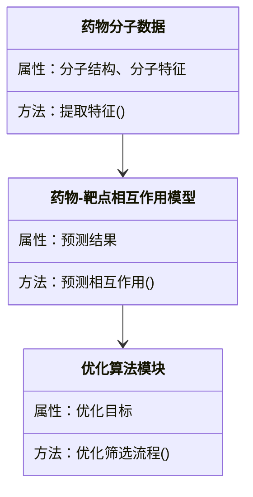
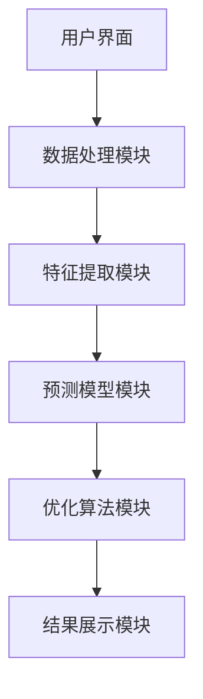
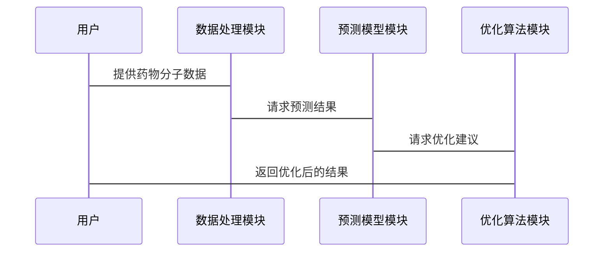

                 


# AI Agent在智能药物筛选中的应用

> 关键词：AI Agent, 智能药物筛选, 药物分子, 药物-靶点相互作用, 机器学习, 深度学习, 群智能算法

> 摘要：本文深入探讨了AI Agent在智能药物筛选中的应用，从AI Agent的基本概念到其在药物筛选中的核心算法，再到系统架构设计与项目实战，全面解析了AI Agent如何助力药物筛选的效率与精准度。通过数学模型、算法实现、系统架构等多个维度的分析，本文为读者提供了从理论到实践的完整指南。

---

# 第一部分: AI Agent与智能药物筛选的背景与基础

# 第1章: AI Agent与智能药物筛选概述

## 1.1 AI Agent的基本概念
### 1.1.1 AI Agent的定义与特点
AI Agent（人工智能代理）是指能够感知环境、自主决策并执行任务的智能体。其特点包括：
- **自主性**：能够独立决策和行动。
- **反应性**：能够实时感知环境并做出反应。
- **目标导向性**：具有明确的目标导向行为。
- **学习能力**：能够通过经验优化自身行为。

### 1.1.2 AI Agent的核心原理
AI Agent的核心原理包括：
1. **知识表示**：将知识以符号或语义网络的形式表示。
2. **推理与规划**：基于知识进行逻辑推理并制定行动计划。
3. **行为选择**：根据目标和环境状态选择最优行为。

### 1.1.3 AI Agent在药物筛选中的应用潜力
AI Agent在药物筛选中的潜力主要体现在：
- **高效数据处理**：能够快速处理海量药物分子数据。
- **精准预测**：通过机器学习模型预测药物与靶点的相互作用。
- **优化筛选流程**：通过智能算法优化药物筛选的流程和效率。

## 1.2 智能药物筛选的背景与挑战
### 1.2.1 药物筛选的传统方法与局限性
传统的药物筛选方法主要包括：
1. **基于实验的筛选**：通过实验室实验筛选潜在药物分子。
2. **基于计算的方法**：利用计算机模拟预测药物分子的性质。

其局限性在于：
- **效率低下**：实验筛选耗时长、成本高。
- **数据依赖性**：计算方法依赖高质量的数据集。
- **模型局限性**：传统模型难以捕捉复杂的药物分子特性。

### 1.2.2 智能药物筛选的发展趋势
随着AI技术的快速发展，智能药物筛选正朝着以下方向发展：
- **深度学习驱动**：利用深度学习模型提高预测精度。
- **多模态数据融合**：结合结构、活性等多种数据源。
- **自动化筛选流程**：通过自动化技术提升筛选效率。

### 1.2.3 AI技术在药物筛选中的优势
AI技术在药物筛选中的优势包括：
- **高效性**：能够快速处理海量数据。
- **精准性**：通过深度学习模型提高预测精度。
- **可扩展性**：能够处理大规模数据集。

## 1.3 本章小结
### 1.3.1 AI Agent的核心作用
AI Agent在药物筛选中起到了桥梁作用，能够连接数据、模型和实际应用。

### 1.3.2 智能药物筛选的关键技术
智能药物筛选的关键技术包括机器学习、深度学习和群智能算法等。

### 1.3.3 未来研究方向
未来的研究方向包括优化AI Agent的算法、提高模型的泛化能力以及探索多模态数据融合方法。

---

# 第2章: AI Agent的核心概念与原理

## 2.1 AI Agent的基本原理
### 2.1.1 知识表示与推理
知识表示是AI Agent的核心，常用方法包括符号逻辑、语义网络和概率图模型。推理过程包括逻辑推理和概率推理。

### 2.1.2 行为选择与优化
行为选择是AI Agent的核心决策过程，常用算法包括贪心算法、动态规划和强化学习。

### 2.1.3 环境交互与反馈
AI Agent通过感知环境、执行行为并获得反馈，形成闭环的交互过程。

## 2.2 AI Agent在药物筛选中的应用模型
### 2.2.1 药物分子的表示与特征提取
药物分子的表示方法包括分子指纹、药效团和深度学习表示。

### 2.2.2 药物-靶点相互作用的预测模型
药物-靶点相互作用的预测模型包括基于机器学习的模型和基于深度学习的模型。

### 2.2.3 药物筛选的优化算法
药物筛选的优化算法包括遗传算法、粒子群优化和模拟退火等。

## 2.3 AI Agent的核心算法与工具
### 2.3.1 机器学习算法在AI Agent中的应用
常用机器学习算法包括支持向量机、随机森林和朴素贝叶斯。

### 2.3.2 深度学习模型在药物筛选中的作用
深度学习模型包括卷积神经网络（CNN）、循环神经网络（RNN）和图神经网络（GNN）。

### 2.3.3 开源工具与平台介绍
常用工具包括RDKit、OpenEye和DeepLearning4DrugDiscovery。

## 2.4 本章小结
### 2.4.1 AI Agent的核心算法总结
AI Agent的核心算法包括知识表示、推理与行为选择。

### 2.4.2 药物筛选中的关键模型
药物筛选中的关键模型包括机器学习模型和深度学习模型。

### 2.4.3 技术工具的选择与应用
选择合适的技术工具能够提高药物筛选的效率和精度。

---

# 第3章: AI Agent在药物筛选中的数学模型与算法

## 3.1 药物分子的特征表示
### 3.1.1 分子指纹的计算方法
分子指纹的计算方法包括基于药效团的指纹和基于机器学习的指纹。

### 3.1.2 深度学习模型在分子表示中的应用
深度学习模型包括图神经网络（GNN）和变分自编码器（VAE）。

### 3.1.3 特征向量的维度优化
特征向量的维度优化方法包括主成分分析（PCA）和t-SNE。

## 3.2 药物-靶点相互作用的预测模型
### 3.2.1 支持向量机（SVM）模型
SVM模型通过构建分类器预测药物-靶点相互作用。

### 3.2.2 神经网络模型（如CNN、RNN）
深度学习模型能够捕捉药物分子的复杂特征。

### 3.2.3 图神经网络（GNN）的应用
GNN能够处理药物分子的图结构数据。

## 3.3 药物筛选的优化算法
### 3.3.1 遗传算法（GA）在药物筛选中的应用
遗传算法通过模拟生物进化过程优化药物分子。

### 3.3.2 群智能算法（如蚁群算法、粒子群优化）
群智能算法能够解决复杂的优化问题。

### 3.3.3 近似算法与启发式方法
近似算法能够快速找到近似最优解。

## 3.4 数学模型与算法的实现
### 3.4.1 算法的数学推导与公式
例如，SVM的优化目标函数：
$$
\min_{w,b,\xi} \frac{1}{2}\|w\|^2 + C\sum_{i=1}^n \xi_i
$$
满足：
$$
y_i(w\cdot x_i + b) \geq 1 - \xi_i
$$

### 3.4.2 算法的代码实现与优化
例如，使用Python实现SVM模型：

```python
from sklearn import svm

# 训练SVM模型
model = svm.SVC(kernel='linear')
model.fit(X_train, y_train)

# 预测结果
y_pred = model.predict(X_test)
```

### 3.4.3 算法性能的评估与比较
算法性能的评估指标包括准确率、召回率和F1分数。

## 3.5 本章小结
### 3.5.1 数学模型的核心作用
数学模型是AI Agent的核心工具，能够帮助我们理解和解决实际问题。

### 3.5.2 算法优化的关键点
算法优化的关键点包括选择合适算法、优化参数和提高计算效率。

### 3.5.3 算法实现的注意事项
算法实现的注意事项包括数据预处理、模型调优和结果分析。

---

# 第4章: AI Agent驱动的智能药物筛选系统架构设计

## 4.1 系统功能模块设计
### 4.1.1 数据采集与预处理模块
数据采集与预处理模块负责获取和处理药物分子数据。

### 4.1.2 药物分子特征提取模块
药物分子特征提取模块通过算法提取分子特征。

### 4.1.3 药物-靶点相互作用预测模块
药物-靶点相互作用预测模块基于模型预测相互作用。

### 4.1.4 药物筛选结果优化模块
药物筛选结果优化模块通过优化算法提升筛选效率。

## 4.2 系统架构设计
### 4.2.1 领域模型（Mermaid类图）


### 4.2.2 系统架构（Mermaid架构图）


### 4.2.3 系统交互（Mermaid序列图）


## 4.3 系统接口设计
### 4.3.1 数据接口
数据接口包括输入接口和输出接口。

### 4.3.2 模型接口
模型接口包括特征提取接口和预测接口。

### 4.3.3 优化接口
优化接口包括优化算法调用接口和结果反馈接口。

## 4.4 本章小结
### 4.4.1 系统功能模块总结
系统功能模块包括数据处理、特征提取、预测模型和优化算法模块。

### 4.4.2 系统架构设计的关键点
系统架构设计的关键点包括模块划分、接口设计和流程优化。

### 4.4.3 系统交互的注意事项
系统交互的注意事项包括用户体验设计和接口兼容性。

---

# 第5章: AI Agent驱动的智能药物筛选系统实战

## 5.1 项目环境安装与配置
### 5.1.1 安装Python与相关库
安装Python和机器学习库（如scikit-learn、Keras、TensorFlow）。

### 5.1.2 数据集获取与预处理
获取药物分子数据集并进行预处理。

## 5.2 系统核心实现
### 5.2.1 药物分子特征提取
使用RDKit库提取分子特征。

### 5.2.2 药物-靶点相互作用预测
基于深度学习模型（如CNN）进行预测。

### 5.2.3 优化算法实现
实现遗传算法优化药物筛选流程。

## 5.3 代码实现与解读
### 5.3.1 特征提取代码
```python
from rdkit import Chem
from rdkit.ML.Descriptors import GetDescriptor

def extract_features(molecule):
    mol = Chem.MolFromSmiles(molecule)
    features = GetDescriptor(mol)
    return features
```

### 5.3.2 深度学习模型代码
```python
from tensorflow.keras import layers, models

def build_model(input_shape):
    model = models.Sequential()
    model.add(layers.Conv2D(32, (3,3), activation='relu', input_shape=input_shape))
    model.add(layers.MaxPooling2D((2,2)))
    model.add(layers.Flatten())
    model.add(layers.Dense(64, activation='relu'))
    model.add(layers.Dense(1, activation='sigmoid'))
    return model
```

### 5.3.3 遗传算法代码
```python
import numpy as np

def fitness_function(population):
    # 计算适应度
    pass

def genetic_algorithm(population_size, generations):
    population = initialize_population(population_size)
    for _ in range(generations):
        population = evolve_population(population)
    return best_individual(population)
```

## 5.4 实际案例分析与结果解读
### 5.4.1 案例分析
通过实际案例分析验证系统的效果。

### 5.4.2 结果解读
解读模型预测结果并分析优化算法的效果。

## 5.5 本章小结
### 5.5.1 项目环境与工具选择
项目环境包括Python和相关机器学习库。

### 5.5.2 系统核心实现的关键点
系统核心实现的关键点包括特征提取、模型构建和算法实现。

### 5.5.3 实际案例分析的启示
实际案例分析表明AI Agent在药物筛选中具有显著优势。

---

# 第6章: AI Agent驱动的智能药物筛选系统的优化与扩展

## 6.1 系统优化策略
### 6.1.1 模型优化
通过调参和模型融合优化预测精度。

### 6.1.2 算法优化
优化算法的运行效率和预测精度。

### 6.1.3 系统性能优化
通过并行计算和分布式处理提高系统性能。

## 6.2 系统扩展方向
### 6.2.1 多模态数据融合
结合结构、活性等多种数据源提高预测精度。

### 6.2.2 跨平台应用
开发跨平台的应用程序，支持不同环境的运行。

### 6.2.3 云计算与边缘计算
利用云计算和边缘计算提升系统的扩展性和计算能力。

## 6.3 最佳实践与注意事项
### 6.3.1 数据预处理的注意事项
数据预处理的关键点包括数据清洗和特征选择。

### 6.3.2 模型训练的注意事项
模型训练的注意事项包括数据均衡和模型过拟合。

### 6.3.3 系统部署的注意事项
系统部署的注意事项包括环境配置和性能监控。

## 6.4 本章小结
### 6.4.1 系统优化的关键点
系统优化的关键点包括模型优化、算法优化和系统性能优化。

### 6.4.2 系统扩展的潜力
系统扩展的潜力包括多模态数据融合和云计算的应用。

### 6.4.3 最佳实践的总结
最佳实践的总结包括数据处理、模型训练和系统部署的注意事项。

---

# 第7章: 总结与展望

## 7.1 本章总结
### 7.1.1 AI Agent的核心作用
AI Agent在智能药物筛选中起到了关键作用。

### 7.1.2 系统架构设计的成果
系统架构设计为药物筛选提供了高效的解决方案。

### 7.1.3 项目实战的经验总结
项目实战积累了丰富的实践经验。

## 7.2 未来展望
### 7.2.1 技术发展趋势
AI Agent和深度学习技术将继续推动药物筛选的发展。

### 7.2.2 应用前景
AI Agent在药物筛选中的应用前景广阔，未来将更加智能化和自动化。

### 7.2.3 研究方向
未来的研究方向包括优化算法、多模态数据融合和系统扩展性。

## 7.3 本章小结
### 7.3.1 AI Agent在智能药物筛选中的地位
AI Agent是智能药物筛选的核心技术之一。

### 7.3.2 系统架构设计的重要性
系统架构设计是实现高效药物筛选的关键。

### 7.3.3 未来研究方向的总结
未来的研究方向包括技术优化和应用扩展。

---

# 结语

AI Agent在智能药物筛选中的应用不仅提高了药物筛选的效率，还为新药研发提供了新的可能性。通过本文的系统分析和实践，读者可以全面了解AI Agent的核心原理和实际应用，为未来的药物筛选研究提供理论和实践的双重指导。

---

通过以上目录和内容设计，本文从AI Agent的基本概念到其在智能药物筛选中的实际应用，进行了全面而深入的探讨，结合理论分析和代码实现，为读者提供了一个从入门到实践的完整指南。

