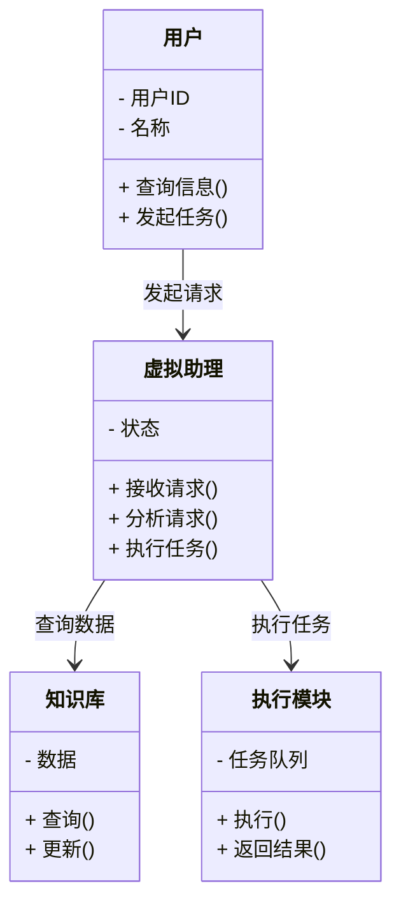
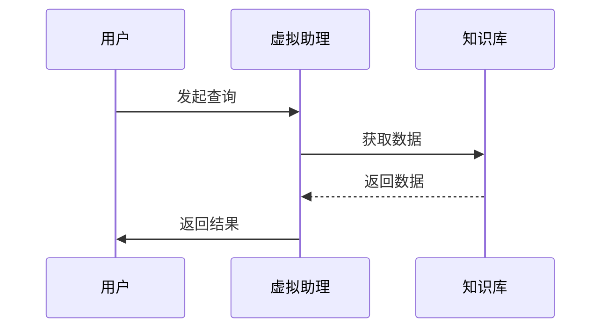

                 


# AI Agent 在智能虚拟助理中的角色

> 关键词：AI Agent, 智能虚拟助理, 人工智能, 自然语言处理, 机器学习, 系统架构, 项目实战

> 摘要：本文探讨了AI Agent在智能虚拟助理中的核心角色，从背景、概念、算法到系统架构和项目实战，全面分析其在智能虚拟助理中的应用。通过详细讲解AI Agent的原理、算法实现、系统设计和实际案例，展示了AI Agent在智能虚拟助理中的重要性。

---

# 第1章: AI Agent 的基础与背景

## 1.1 AI Agent 的基本概念

### 1.1.1 AI Agent 的定义与特点
AI Agent（人工智能代理）是指能够感知环境、自主决策并执行任务的智能实体。其特点包括主动性、反应性、社会性和持续性。

### 1.1.2 智能虚拟助理的定义与分类
智能虚拟助理是一种基于AI技术的交互系统，能够通过自然语言处理与用户进行对话，提供信息查询、任务执行等服务。常见的虚拟助理包括Siri、Alexa和Google Assistant。

### 1.1.3 AI Agent 在智能虚拟助理中的角色
AI Agent在智能虚拟助理中扮演着核心角色，负责处理用户的请求、执行任务和提供反馈。

---

## 1.2 AI Agent 的核心概念与原理

### 1.2.1 AI Agent 的感知与决策机制
AI Agent通过感知环境、分析信息并做出决策来完成任务。感知层利用传感器或API获取数据，决策层基于知识库和推理引擎制定行动计划。

### 1.2.2 AI Agent 的行为模式
AI Agent的行为模式包括基于规则的行为、基于学习的行为和基于推理的行为，分别适用于不同的应用场景。

### 1.2.3 AI Agent 的知识表示与推理
知识表示采用谓词逻辑、描述逻辑和语义网络等方法，推理引擎则通过逻辑推理或概率推理来得出结论。

---

## 1.3 AI Agent 在智能虚拟助理中的应用
AI Agent在智能虚拟助理中的应用包括信息查询、任务调度、情感分析和多轮对话等场景。

---

# 第2章: AI Agent 的算法原理

## 2.1 AI Agent 的感知算法

### 2.1.1 自然语言处理算法
自然语言处理算法如分词、句法分析和实体识别，用于理解用户的输入。

### 2.1.2 语音识别算法
通过语音识别技术将用户的语音输入转换为文本。

### 2.1.3 图像识别算法
利用图像识别技术分析视觉信息，如识别用户提供的图片内容。

## 2.2 AI Agent 的决策算法

### 2.2.1 基于规则的决策算法
通过预定义的规则进行判断，适用于任务简单的情况。

### 2.2.2 基于机器学习的决策算法
使用分类、回归等机器学习模型进行预测，适用于复杂场景。

### 2.2.3 基于强化学习的决策算法
通过奖励机制优化决策策略，适用于动态环境。

## 2.3 AI Agent 的执行算法

### 2.3.1 动作规划算法
规划最优动作序列以实现目标。

### 2.3.2 行为调度算法
根据优先级调度不同的行为执行。

### 2.3.3 任务分配算法
将任务分配给不同的子系统或外部服务。

---

## 2.4 AI Agent 的数学模型与公式

### 2.4.1 概率论基础
贝叶斯定理用于计算条件概率，公式为：
$$ P(A|B) = \frac{P(B|A)P(A)}{P(B)} $$

### 2.4.2 马尔可夫决策过程
马尔可夫决策过程用于描述序列决策问题，公式为：
$$ V(s) = \max_a \sum_{s'} P(s'|s,a) V(s') $$

---

# 第3章: AI Agent 的系统分析与架构设计

## 3.1 项目背景与需求分析

### 3.1.1 项目背景
开发一个智能虚拟助理系统，旨在为用户提供高效便捷的服务。

### 3.1.2 功能需求
系统需支持信息查询、任务执行、多轮对话等功能。

## 3.2 系统功能设计

### 3.2.1 领域模型设计
使用Mermaid类图展示领域模型，包括用户、虚拟助理、知识库和执行模块。



### 3.2.2 系统架构设计
采用分层架构，包括表现层、业务逻辑层和数据访问层。

### 3.2.3 接口设计
定义RESTful API接口，如`/api/v1/query`用于处理查询请求。

### 3.2.4 交互流程设计
使用Mermaid序列图展示用户与虚拟助理的交互流程。



---

# 第4章: AI Agent 的项目实战

## 4.1 环境搭建

### 4.1.1 安装Python
安装Python 3.8及以上版本，并配置虚拟环境。

### 4.1.2 安装依赖
使用pip安装所需的库，如`numpy`、`pandas`和`spacy`.

## 4.2 核心功能实现

### 4.2.1 自然语言处理实现
使用spaCy进行文本处理，代码如下：

```python
import spacy

nlp = spacy.load("en_core_web_sm")
doc = nlp("What is the weather in Beijing?")
for token in doc:
    print(token.text, token.pos_)
```

### 4.2.2 任务调度实现
实现任务队列管理，代码如下：

```python
import queue

tasks = queue.Queue()
tasks.put("search_weather")
tasks.put("get_result")
```

### 4.2.3 知识库查询实现
使用数据库查询用户数据，代码如下：

```python
import sqlite3

conn = sqlite3.connect("user.db")
cursor = conn.cursor()
cursor.execute("SELECT * FROM users WHERE id = 1")
result = cursor.fetchone()
print(result)
conn.close()
```

## 4.3 系统测试与优化

### 4.3.1 功能测试
测试各功能模块的正确性，确保系统稳定运行。

### 4.3.2 性能优化
优化数据库查询速度和任务调度效率。

## 4.4 实际案例分析

### 4.4.1 案例背景
开发一个智能日历管理虚拟助理，帮助用户管理日程安排。

### 4.4.2 案例实现
实现添加、查询和提醒功能，代码如下：

```python
def add_event(event):
    # 添加事件到数据库
    pass

def query_events(date):
    # 查询指定日期的事件
    pass

def remind(event):
    # 提醒用户事件
    print(f"提醒：{event}")
```

### 4.4.3 案例分析
分析系统在实际应用中的表现，总结经验教训。

---

# 第5章: 总结与展望

## 5.1 最佳实践 tips

### 5.1.1 技术选型
根据需求选择合适的AI技术和工具。

### 5.1.2 系统设计
注重系统的可扩展性和可维护性。

### 5.1.3 安全性
确保系统的数据安全和用户隐私。

## 5.2 小结
本文详细讲解了AI Agent在智能虚拟助理中的角色，从理论到实践，全面分析了其在系统设计中的重要性。

## 5.3 注意事项

### 5.3.1 系统维护
定期更新模型和优化算法。

### 5.3.2 用户体验
注重交互设计，提升用户体验。

## 5.4 拓展阅读

### 5.4.1 推荐书籍
推荐阅读《人工智能：一种现代方法》和《机器学习实战》。

### 5.4.2 推荐博客
推荐关注相关技术博客和社区，获取最新技术动态。

---

# 结语
通过本文的学习，读者可以深入了解AI Agent在智能虚拟助理中的角色，并掌握相关技术的实现方法。希望本文能为读者在AI Agent和智能虚拟助理的开发中提供有价值的参考。

