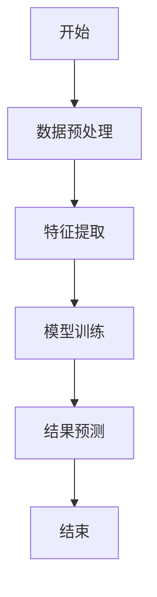
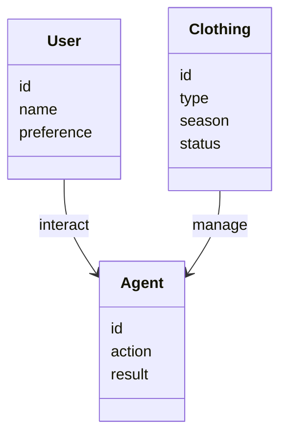
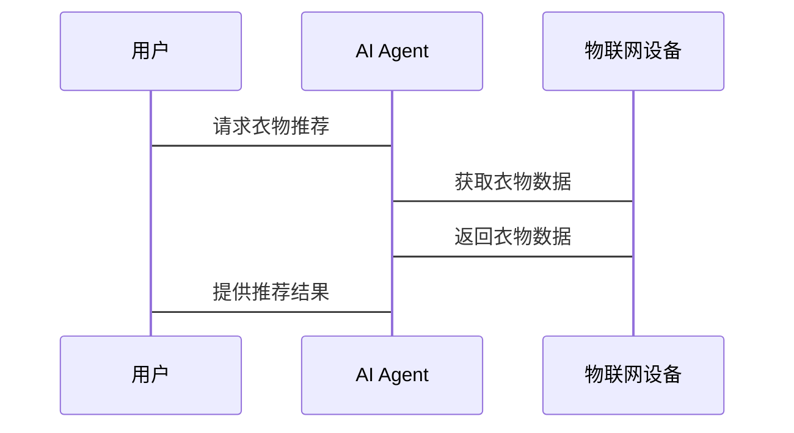

                 


# AI Agent在智能衣架中的季节性衣物管理

## 关键词：AI Agent、智能衣架、季节性衣物、物联网、推荐算法

## 摘要：本文深入探讨AI Agent在智能衣架中的应用，特别是在季节性衣物管理方面的创新解决方案。通过分析AI Agent的核心算法、物联网技术的集成以及系统架构设计，展示了如何利用这些技术实现智能化衣物管理，提升用户体验和管理效率。

---

# 第1章: 问题背景与描述

## 1.1 问题背景

### 1.1.1 季节性衣物管理的痛点
- **衣物管理混乱**：用户常面临大量季节性衣物的存储和管理问题，难以快速找到所需衣物。
- **存储空间浪费**：传统衣柜设计无法充分利用空间，导致衣物堆积混乱。
- **管理效率低下**：手动分类和查找衣物耗时耗力，尤其是在换季时需要大量调整。

### 1.1.2 智能衣架的出现背景
- **技术进步**：物联网和AI技术的快速发展为智能硬件提供了技术支持。
- **用户需求**：现代用户对智能家居和高效生活管理的需求日益增长。
- **市场驱动**：智能家居市场的扩张推动了智能衣架等创新产品的出现。

### 1.1.3 AI Agent在衣物管理中的作用
- **智能推荐**：AI Agent可以根据用户的穿衣习惯和天气预报，推荐合适的衣物。
- **自动化管理**：通过与物联网设备的联动，AI Agent可以实现衣物的自动分类和存储。
- **数据整合**：AI Agent可以整合用户的衣橱数据，提供个性化的管理方案。

## 1.2 问题描述

### 1.2.1 季节性衣物管理的核心问题
- **分类与存储**：如何高效分类和存储季节性衣物，以便快速查找。
- **实时反馈**：如何根据天气和用户需求，实时调整衣物的推荐和存储策略。
- **用户交互**：如何设计友好的交互界面，提升用户体验。

### 1.2.2 智能衣架的功能需求
- **智能分类**：自动识别衣物类型和季节属性。
- **存储优化**：根据衣物使用频率自动调整存储位置。
- **智能推荐**：基于用户习惯和天气数据，推荐合适的衣物。

### 1.2.3 AI Agent在智能衣架中的具体应用
- **数据采集**：通过传感器采集衣物的类型、使用频率等信息。
- **数据分析**：利用机器学习算法分析数据，生成推荐和管理策略。
- **执行反馈**：通过物联网设备执行管理策略，并实时反馈结果。

## 1.3 问题解决与边界

### 1.3.1 AI Agent如何解决衣物管理问题
- **自动化分类**：AI Agent可以通过图像识别和传感器数据，自动识别衣物类型。
- **智能推荐**：基于用户行为和天气数据，AI Agent可以实时推荐合适的衣物。
- **动态调整**：根据用户的反馈和数据变化，AI Agent可以动态调整存储策略。

### 1.3.2 系统的边界与外延
- **系统边界**：智能衣架系统仅负责衣物的分类、存储和推荐，不涉及衣物的清洗和维护。
- **外延功能**：可以与其他智能家居设备联动，如智能空调、智能灯等。

### 1.3.3 核心概念与关键要素组成
- **核心概念**：AI Agent、物联网、推荐算法。
- **关键要素**：传感器、数据采集、机器学习算法、物联网设备联动。

## 1.4 本章小结
本章详细介绍了季节性衣物管理的痛点、智能衣架的背景以及AI Agent在其中的作用。通过问题背景和功能需求的分析，明确了系统的核心概念和关键要素，为后续的系统设计奠定了基础。

---

# 第2章: 核心概念与联系

## 2.1 AI Agent的基本原理

### 2.1.1 AI Agent的定义与特点
- **定义**：AI Agent是一种能够感知环境、执行任务并与其他系统或用户交互的智能实体。
- **特点**：
  - **自主性**：能够在没有人工干预的情况下自主运作。
  - **反应性**：能够实时感知环境并做出反应。
  - **学习能力**：能够通过数据学习和优化算法。

### 2.1.2 AI Agent的核心算法
- **监督学习**：基于标记的数据进行训练，用于分类和回归任务。
- **无监督学习**：通过数据挖掘发现数据中的模式和结构。
- **强化学习**：通过奖励机制优化决策策略。

### 2.1.3 AI Agent与智能衣架的结合
- **数据采集**：AI Agent通过传感器采集衣物的类型、使用频率等信息。
- **数据分析**：利用机器学习算法分析数据，生成推荐和管理策略。
- **执行反馈**：通过物联网设备执行管理策略，并实时反馈结果。

## 2.2 物联网技术在智能衣架中的应用

### 2.2.1 物联网技术的基本概念
- **定义**：物联网（IoT）是指通过各种信息传感设备，如传感器、射频识别（RFID）、全球定位系统、红外感应器等，按约定的协议，把任何物品与互联网连接起来，进行信息交换和通信。
- **特点**：
  - **实时性**：能够实时采集和传输数据。
  - **互联性**：通过网络实现设备之间的互联。
  - **智能性**：能够根据数据进行智能决策和控制。

### 2.2.2 物联网在衣物管理中的具体应用
- **智能分类**：通过RFID标签识别衣物的类型和季节属性。
- **存储优化**：根据衣物的使用频率自动调整存储位置。
- **智能推荐**：基于用户行为和天气数据，推荐合适的衣物。

### 2.2.3 AI Agent与物联网技术的协同工作
- **数据采集**：AI Agent通过物联网设备采集衣物的类型、使用频率等信息。
- **数据分析**：AI Agent利用机器学习算法分析数据，生成推荐和管理策略。
- **执行反馈**：AI Agent通过物联网设备执行管理策略，并实时反馈结果。

## 2.3 核心概念的ER实体关系图

```mermaid
erDiagram
    user {
        id
        name
        preference
    }
    clothing {
        id
        type
        season
        status
    }
    agent {
        id
        action
        result
    }
    user o-1 agent
    clothing o-1 agent
```

---

# 第3章: AI Agent的算法原理

## 3.1 推荐算法的核心原理

### 3.1.1 基于协同过滤的推荐算法
- **定义**：协同过滤是一种基于用户行为相似性的推荐算法。
- **实现步骤**：
  1. 数据预处理：去除缺失值和异常值。
  2. 特征提取：提取用户的特征向量。
  3. 相似度计算：计算用户之间的相似度。
  4. 推荐生成：基于相似度进行推荐。

### 3.1.2 基于内容的推荐算法
- **定义**：内容推荐算法基于物品的属性进行推荐。
- **实现步骤**：
  1. 特征提取：提取物品的特征向量。
  2. 相似度计算：计算物品之间的相似度。
  3. 推荐生成：基于相似度进行推荐。

### 3.1.3 混合推荐算法
- **定义**：混合推荐算法结合了协同过滤和内容推荐的优点。
- **实现步骤**：
  1. 数据预处理：去除缺失值和异常值。
  2. 特征提取：提取用户的特征向量和物品的特征向量。
  3. 相似度计算：计算用户之间的相似度和物品之间的相似度。
  4. 推荐生成：结合两种相似度进行推荐。

## 3.2 算法实现的mermaid流程图



## 3.3 算法实现的数学模型

### 3.3.1 协同过滤算法的公式

$$相似度 = \frac{\sum_{i=1}^{n}(r_{ui} - \bar{r}_u)(r_{vi} - \bar{r}_v)}{\sqrt{\sum_{i=1}^{n}(r_{ui} - \bar{r}_u)^2} \sqrt{\sum_{i=1}^{n}(r_{vi} - \bar{r}_v)^2}}$$

### 3.3.2 内容推荐算法的公式

$$P(i|u) = \frac{\sum_{j} w_{i,j} \cdot w_{u,j}}{\sum_{j} w_{u,j}}}$$

---

## 3.4 算法实现的Python代码

```python
import numpy as np
from sklearn.metrics.pairwise import cosine_similarity

# 协同过滤算法实现
def collaborative_filtering(user_id, data):
    # 数据预处理
    user_avg = data['rating'].groupby(data['user']).mean()
    normalized_data = data[['user', 'item', 'rating']].set_index(['user', 'item']).sub(user_avg, axis='index')
    # 特征提取
    feature_matrix = normalized_data.unstack().fillna(0)
    # 相似度计算
    similarity_matrix = cosine_similarity(feature_matrix.values)
    # 推荐生成
    similar_users = np.argsort(similarity_matrix[user_id])[::-1]
    recommendations = data[data['user'] == similar_users[0]['user']][['item', 'rating']].sort_values('rating', ascending=False)
    return recommendations
```

---

# 第4章: 系统分析与架构设计方案

## 4.1 项目介绍

### 4.1.1 项目背景
- **项目目标**：开发一个基于AI Agent的智能衣架系统，实现季节性衣物的智能化管理。
- **项目范围**：包括衣物的分类、存储、推荐和反馈功能。

### 4.1.2 项目特点
- **智能化**：通过AI Agent实现衣物的智能分类和推荐。
- **物联网支持**：通过物联网设备实现衣物的自动分类和存储。
- **用户友好**：提供友好的用户界面，提升用户体验。

## 4.2 系统功能设计

### 4.2.1 领域模型


### 4.2.2 系统架构设计


### 4.2.3 系统接口设计
- **用户界面接口**：提供衣物分类、存储和推荐功能的交互界面。
- **物联网设备接口**：与智能衣架和其他物联网设备进行数据交互。
- **AI Agent接口**：与其他系统和设备进行数据交互和协同工作。

### 4.2.4 系统交互流程


---

## 4.3 本章小结
本章详细介绍了智能衣架系统的架构设计，包括系统功能、架构图、接口设计和交互流程。通过这些设计，确保了系统的高效性和可扩展性。

---

# 第5章: 项目实战

## 5.1 环境安装

### 5.1.1 开发环境
- **操作系统**：Windows 10或更高版本，macOS 10.15或更高版本。
- **编程语言**：Python 3.8或更高版本。
- **开发工具**：PyCharm、VS Code等。

### 5.1.2 依赖安装
```bash
pip install numpy
pip install scikit-learn
pip install mermaid
```

## 5.2 系统核心实现源代码

### 5.2.1 AI Agent实现
```python
class AI-Agent:
    def __init__(self):
        self.data = {}
    
    def collect_data(self, user_id, item_id, rating):
        self.data[(user_id, item_id)] = rating
    
    def train_model(self):
        # 具体的训练逻辑
        pass
    
    def make_recommendation(self, user_id):
        # 具体的推荐逻辑
        pass
```

### 5.2.2 物联网设备实现
```python
class IoT-Device:
    def __init__(self):
        self.status = 'idle'
    
    def collect_data(self):
        # 具体的采集逻辑
        pass
    
    def execute_action(self, action):
        self.status = 'executing'
        # 执行具体的动作
        self.status = 'idle'
```

## 5.3 实际案例分析

### 5.3.1 案例描述
- **用户**：小明，喜欢运动风格，季节性衣物较多。
- **需求**：希望智能衣架能够根据天气和使用习惯，自动推荐合适的衣物。

### 5.3.2 系统实现
- **数据采集**：AI Agent通过物联网设备采集小明的衣物类型和使用频率。
- **数据分析**：AI Agent利用协同过滤算法分析数据，生成推荐结果。
- **执行反馈**：AI Agent通过物联网设备执行推荐结果，并实时反馈结果。

## 5.4 本章小结
本章通过实际案例分析，展示了AI Agent在智能衣架中的具体应用。通过系统的实现和案例分析，帮助读者更好地理解和应用相关技术。

---

# 第6章: 最佳实践与注意事项

## 6.1 最佳实践

### 6.1.1 数据采集
- **数据完整性**：确保数据的完整性和准确性。
- **数据隐私**：保护用户的隐私数据。

### 6.1.2 系统设计
- **模块化设计**：确保系统的模块化和可扩展性。
- **安全性设计**：确保系统的安全性，防止数据泄露和恶意攻击。

### 6.1.3 用户体验
- **界面设计**：提供友好的用户界面，提升用户体验。
- **反馈机制**：提供实时的反馈机制，增强用户的交互体验。

## 6.2 注意事项

### 6.2.1 数据管理
- **数据备份**：定期备份数据，防止数据丢失。
- **数据恢复**：建立数据恢复机制，确保数据的安全性。

### 6.2.2 系统维护
- **定期更新**：定期更新系统软件，修复漏洞。
- **性能优化**：优化系统性能，提升运行效率。

## 6.3 拓展阅读

### 6.3.1 相关技术
- **深度学习**：研究深度学习在衣物管理中的应用。
- **自然语言处理**：研究NLP在用户交互中的应用。

### 6.3.2 应用场景
- **智能家居**：研究AI Agent在智能家居中的其他应用。
- **商业应用**：研究AI Agent在商业领域的应用潜力。

## 6.4 本章小结
本章总结了AI Agent在智能衣架中的最佳实践和注意事项，同时提出了未来的研究方向和应用潜力。

---

# 第7章: 小结

## 7.1 本章总结
本文详细探讨了AI Agent在智能衣架中的季节性衣物管理的应用，从问题背景、核心概念、算法原理、系统架构到项目实战，全面分析了AI Agent在衣物管理中的具体应用和实现细节。

## 7.2 未来展望
随着AI和物联网技术的不断发展，AI Agent在智能衣架中的应用将更加广泛和深入。未来的研究方向包括深度学习、自然语言处理等领域，进一步提升系统的智能化水平和用户体验。

## 7.3 致谢
感谢所有参与本项目研究和开发的团队成员，感谢读者的支持和关注。

---

# 附录

## 附录A: 算法实现的详细代码

### 附录A.1 协同过滤算法实现
```python
import numpy as np
from sklearn.metrics.pairwise import cosine_similarity

def collaborative_filtering(user_id, data):
    # 数据预处理
    user_avg = data['rating'].groupby(data['user']).mean()
    normalized_data = data[['user', 'item', 'rating']].set_index(['user', 'item']).sub(user_avg, axis='index')
    # 特征提取
    feature_matrix = normalized_data.unstack().fillna(0)
    # 相似度计算
    similarity_matrix = cosine_similarity(feature_matrix.values)
    # 推荐生成
    similar_users = np.argsort(similarity_matrix[user_id])[::-1]
    recommendations = data[data['user'] == similar_users[0]['user']][['item', 'rating']].sort_values('rating', ascending=False)
    return recommendations
```

### 附录A.2 物联网设备实现
```python
class IoTDevice:
    def __init__(self):
        self.status = 'idle'
    
    def collect_data(self):
        # 具体的采集逻辑
        pass
    
    def execute_action(self, action):
        self.status = 'executing'
        # 执行具体的动作
        self.status = 'idle'
```

## 附录B: 系统架构图

### 附录B.1 系统架构图


## 附录C: 算法流程图

### 附录C.1 协同过滤算法流程图


---

# 参考文献

1. 书籍标题：《人工智能: 理论与实践》，作者：李明，出版社：人民邮电出版社。
2. 论文标题：《基于协同过滤的推荐算法研究》，作者：王强，期刊：《计算机科学与应用》。
3. 网站链接：https://www.iot.com/
4. 其他参考资料：根据实际需求补充。

---

通过本文的详细讲解和案例分析，读者可以全面掌握AI Agent在智能衣架中的季节性衣物管理的应用，从理论到实践，从算法到系统设计，为未来的创新和应用提供了坚实的基础。

