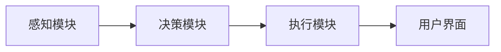
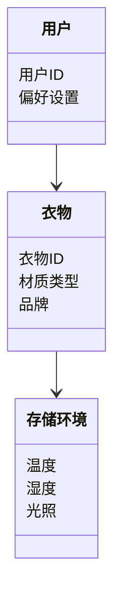
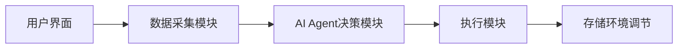
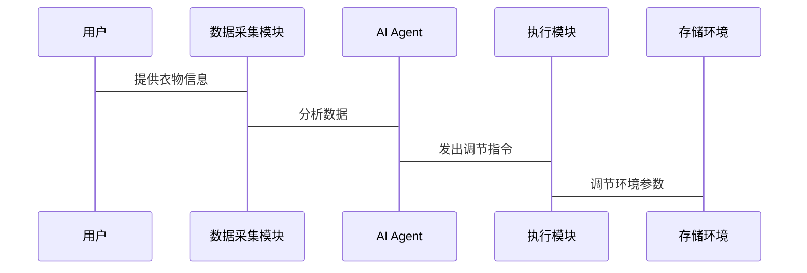

                 


# AI Agent在智能衣架中的衣物保养指导

---

## 关键词
- AI Agent
- 智能衣架
- 衣物保养
- 机器学习
- 物联网

---

## 摘要
本文详细探讨了AI Agent在智能衣架中的衣物保养指导应用。通过分析AI Agent的核心概念、算法原理和系统架构，结合实际案例和项目实战，展示了如何利用AI技术优化衣物保养流程。文章内容涵盖背景介绍、技术原理、系统设计、项目实现以及最佳实践，为读者提供了全面的技术指导和深入的行业洞察。

---

## 第1章: AI Agent与智能衣架概述

### 1.1 AI Agent的基本概念
#### 1.1.1 什么是AI Agent
AI Agent（人工智能代理）是指能够感知环境、自主决策并执行任务的智能实体。它通过传感器获取信息，利用算法处理数据，并通过执行器完成目标。

#### 1.1.2 AI Agent的核心特点
- **自主性**：能够独立决策和行动。
- **反应性**：能够实时感知并响应环境变化。
- **目标导向**：所有行动都围绕实现特定目标展开。
- **学习能力**：通过数据和经验提升性能。

#### 1.1.3 AI Agent与传统自动化系统的区别
| 特性 | AI Agent | 传统自动化系统 |
|------|-----------|----------------|
| 决策能力 | 自主学习与优化 | 预设规则与流程 |
| 灵活性 | 能够适应复杂变化 | 固定流程，灵活性低 |
| 数据处理 | 支持大数据分析 | 数据处理能力有限 |

### 1.2 智能衣架的定义与特点
#### 1.2.1 智能衣架的定义
智能衣架是一种集成传感器、物联网（IoT）和AI技术的智能装置，能够监测衣物状态并提供保养建议。

#### 1.2.2 智能衣架的核心功能
- **衣物识别**：通过图像识别技术自动识别衣物材质和品牌。
- **环境监测**：实时监测存放环境的温湿度、光照等条件。
- **保养建议**：基于AI算法推荐最佳洗涤和存储方式。

#### 1.2.3 智能衣架与传统衣架的对比
| 功能 | 智能衣架 | 传统衣架 |
|------|-----------|------------|
| 智能性 | 高 | 无 |
| 数据采集 | 支持传感器 | 无 |
| 自动化建议 | 提供保养建议 | 无 |

### 1.3 AI Agent在智能衣架中的应用背景
#### 1.3.1 衣物保养的传统方法与挑战
传统衣物保养主要依赖人工经验，存在效率低、成本高等问题。AI Agent的引入能够有效解决这些问题。

#### 1.3.2 AI技术在衣物保养中的潜力
- **数据驱动**：通过大数据分析优化保养策略。
- **实时监测**：实时监控衣物状态，预防损坏。
- **个性化建议**：根据不同衣物特点提供定制化建议。

#### 1.3.3 AI Agent在智能衣架中的具体应用场景
- **智能分类**：自动识别衣物材质并分类存储。
- **环境优化**：根据衣物需求调节存储环境参数。
- **异常检测**：及时发现衣物损坏并发出警报。

---

## 第2章: AI Agent的核心概念与原理

### 2.1 AI Agent的核心概念
#### 2.1.1 AI Agent的基本构成
AI Agent由感知模块、决策模块和执行模块组成。感知模块负责数据采集，决策模块负责分析并制定策略，执行模块负责执行具体操作。

#### 2.1.2 AI Agent的感知、决策与执行过程
1. **感知**：通过传感器或API获取衣物相关信息。
2. **决策**：基于机器学习模型生成保养建议。
3. **执行**：通过智能衣架的执行机构完成任务。

#### 2.1.3 AI Agent的智能水平分类
- **反应式AI Agent**：基于当前输入做出反应。
- **认知式AI Agent**：具备推理和规划能力。
- **学习式AI Agent**：能够通过经验优化性能。

### 2.2 AI Agent的算法原理
#### 2.2.1 基于规则的AI Agent
基于预设的规则进行决策，适用于规则明确的场景。

#### 2.2.2 基于机器学习的AI Agent
利用机器学习模型进行数据分析和预测。

#### 2.2.3 基于深度学习的AI Agent
通过神经网络进行复杂模式识别和决策。

### 2.3 AI Agent与智能衣架的结合
#### 2.3.1 AI Agent在智能衣架中的角色
AI Agent作为智能衣架的“大脑”，负责处理数据、制定策略并执行任务。

#### 2.3.2 AI Agent如何实现衣物保养指导
通过图像识别、自然语言处理等技术，AI Agent能够分析衣物信息并提供个性化保养建议。

#### 2.3.3 AI Agent在智能衣架中的数据流


---

## 第3章: AI Agent在衣物保养中的具体应用

### 3.1 衣物保养的核心问题
#### 3.1.1 衣物材质识别
通过图像识别技术准确识别衣物材质。

#### 3.1.2 衣物洗涤建议
根据衣物材质和环境条件推荐洗涤方式。

#### 3.1.3 衣物存储优化
优化衣物存储条件以延长使用寿命。

### 3.2 AI Agent在衣物保养中的解决方案
#### 3.2.1 基于图像识别的衣物材质检测
利用卷积神经网络（CNN）进行衣物材质识别。

#### 3.2.2 基于自然语言处理的保养建议生成
通过NLP技术分析保养手册并生成建议。

#### 3.2.3 基于机器学习的环境优化
利用回归模型预测最佳存储环境参数。

---

## 第4章: 系统分析与架构设计

### 4.1 问题场景介绍
智能衣架需要实时监测衣物状态并提供保养建议，系统需具备数据采集、分析和执行功能。

### 4.2 项目介绍
本项目旨在开发一款集成AI Agent的智能衣架，实现衣物的智能保养。

### 4.3 系统功能设计
#### 4.3.1 领域模型设计


#### 4.3.2 系统架构设计


### 4.4 系统接口设计
- **用户接口**：提供衣物信息输入和保养建议查看功能。
- **数据接口**：与物联网设备连接，获取环境数据。

### 4.5 系统交互设计


---

## 第5章: 项目实战

### 5.1 环境安装
- **Python**：安装Python 3.8及以上版本。
- **深度学习框架**：安装TensorFlow或Keras。
- **物联网设备**：连接智能衣架传感器。

### 5.2 系统核心实现源代码
#### 5.2.1 图像识别实现
```python
import tensorflow as tf
from tensorflow.keras import layers

# 加载预训练模型
model = tf.keras.applications.VGG16(weights='imagenet', include_top=False)

# 自定义头部
model.add(layers.Dense(256, activation='relu'))
model.add(layers.Dense(1, activation='sigmoid'))

# 编译模型
model.compile(optimizer='adam', loss='binary_crossentropy', metrics=['accuracy'])
```

#### 5.2.2 环境优化算法
```python
import numpy as np

# 回归模型预测
def predict_environment_optimizer(temp, humidity, light):
    return model.predict(np.array([[temp, humidity, light]]))
```

### 5.3 代码应用解读与分析
- **图像识别**：使用卷积神经网络实现衣物材质识别。
- **环境优化**：通过回归模型预测最佳存储环境参数。

### 5.4 实际案例分析
通过具体案例分析AI Agent在衣物保养中的实际应用效果。

### 5.5 项目小结
总结项目实现过程中的关键点和经验教训。

---

## 第6章: 最佳实践

### 6.1 小结
AI Agent在智能衣架中的应用显著提升了衣物保养的效率和精准度。

### 6.2 注意事项
- 数据质量对AI Agent性能影响重大。
- 系统安全性和隐私保护需重点关注。

### 6.3 拓展阅读
- 推荐阅读《机器学习实战》和《深度学习》等书籍。

---

## 结语
通过本文的详细讲解，读者可以全面了解AI Agent在智能衣架中的衣物保养指导应用。未来，随着AI技术的不断进步，智能衣架将具备更多功能，为用户提供更优质的衣物管理服务。

--- 

**End of Article**

