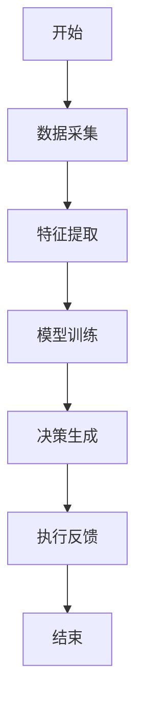
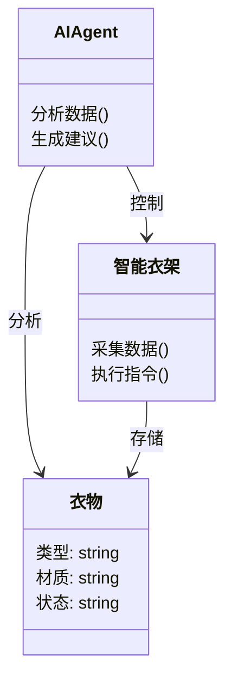
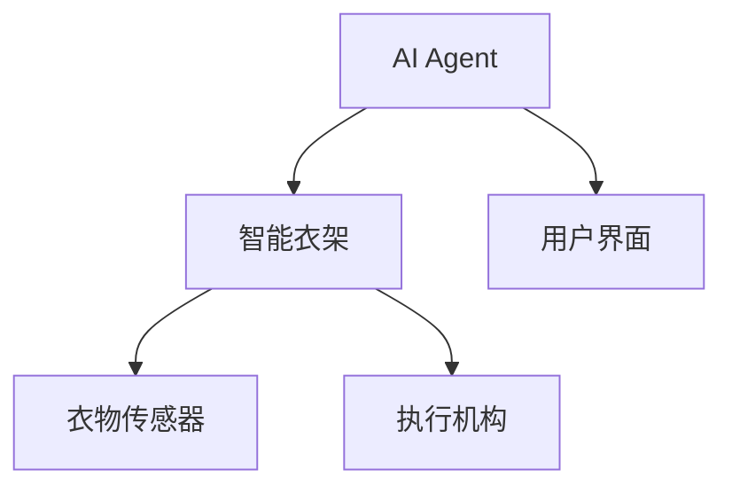
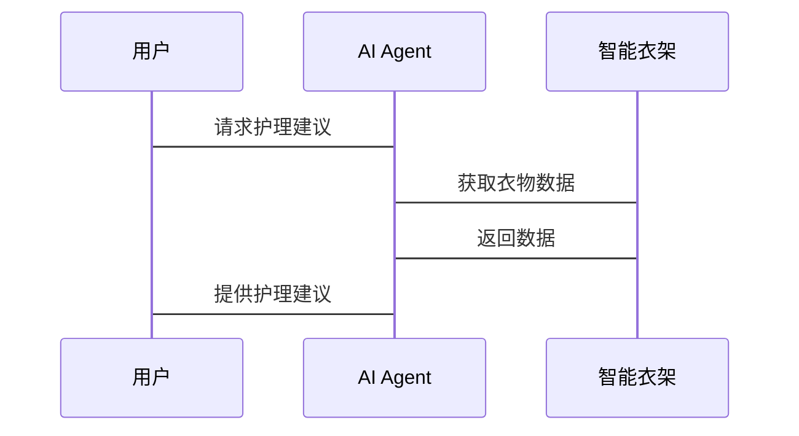

                 


# AI Agent在智能衣架中的衣物护理建议

> 关键词：AI Agent, 智能衣架, 衣物护理, 算法原理, 系统架构

> 摘要：本文探讨了AI Agent在智能衣架中的应用，重点分析了其在衣物分类、护理建议生成和异常处理中的算法原理，结合系统架构设计和项目实战，提供了详细的实现方案和案例分析，总结了最佳实践经验和注意事项。

---

# 第一部分: AI Agent与智能衣架的背景介绍

## 第1章: AI Agent与智能衣架的背景

### 1.1 AI Agent的基本概念

#### 1.1.1 AI Agent的定义
AI Agent（人工智能代理）是指能够感知环境、执行任务以实现目标的智能实体。它可以自主决策、解决问题，并与外部系统或用户交互。

#### 1.1.2 智能衣架的定义与特点
智能衣架是一种结合了物联网（IoT）和AI技术的智能设备，用于管理和护理衣物。其特点包括：
- 自动化分类和存储衣物
- 智能监测衣物状态（如湿度、温度）
- 提供基于AI的护理建议

#### 1.1.3 AI Agent在智能衣架中的作用
AI Agent在智能衣架中负责数据分析、决策制定和任务执行，帮助用户优化衣物护理流程。

### 1.2 问题背景与描述

#### 1.2.1 衣物护理的常见问题
- 衣物分类不当导致损坏
- 缺乏科学的洗涤和存储建议
- 无法及时发现衣物异常情况

#### 1.2.2 AI Agent如何解决衣物护理问题
AI Agent通过实时数据分析，提供个性化护理建议，避免衣物损坏，并优化存储空间。

#### 1.2.3 智能衣架的边界与外延
智能衣架的边界包括设备本身和连接的传感器，外延则涉及与家庭物联网的集成。

### 1.3 核心概念与联系

#### 1.3.1 AI Agent的核心概念原理
AI Agent通过感知环境、分析数据、制定决策和执行任务来实现目标。

#### 1.3.2 智能衣架的系统架构
智能衣架由硬件设备和软件系统组成，硬件包括传感器和执行机构，软件包括数据处理和AI算法。

#### 1.3.3 AI Agent与智能衣架的实体关系图

```mermaid
entity Relationship
    entity AI Agent
    entity 智能衣架
    entity 衣物
    AI Agent --> 智能衣架: 控制
    智能衣架 --> 衣物: 存储
    AI Agent --> 衣物: 分析
```

---

## 第2章: AI Agent的核心概念与联系

### 2.1 AI Agent的核心原理

#### 2.1.1 数据采集与处理
AI Agent通过传感器采集衣物的状态数据，如湿度、温度等。

#### 2.1.2 智能分析与决策
基于机器学习模型，AI Agent分析数据并生成护理建议。

#### 2.1.3 行为执行与反馈
AI Agent通过智能衣架执行决策，并根据反馈调整策略。

### 2.2 AI Agent与智能衣架的关系

#### 2.2.1 AI Agent在智能衣架中的功能模块
- 数据采集模块
- 分析决策模块
- 执行控制模块

#### 2.2.2 智能衣架的系统功能分解
- 衣物分类
- 湿度监测
- 温度监测

#### 2.2.3 AI Agent与智能衣架的协同工作流程
AI Agent接收传感器数据，分析后生成指令，控制智能衣架执行操作。

---

## 第3章: AI Agent在智能衣架中的算法原理

### 3.1 算法原理概述

#### 3.1.1 基于深度学习的衣物分类算法
使用卷积神经网络（CNN）对衣物进行分类，训练数据包括不同衣物类型。

#### 3.1.2 基于规则的护理建议生成算法
根据衣物材质和环境条件，生成洗涤和存储建议。

#### 3.1.3 基于强化学习的异常处理算法
通过强化学习优化异常情况下的处理策略。

### 3.2 算法实现细节

#### 3.2.1 深度学习分类算法



#### 3.2.2 算法数学公式

分类模型的损失函数：
$$ L = -\frac{1}{n}\sum_{i=1}^{n} y_i \log(p_i) + (1 - y_i)\log(1 - p_i) $$

---

# 第四部分: 系统分析与架构设计方案

## 第4章: 系统分析与架构设计

### 4.1 问题场景介绍
智能衣架需要实时监测衣物状态，并根据环境变化提供护理建议。

### 4.2 系统功能设计

#### 4.2.1 领域模型类图



### 4.3 系统架构设计

#### 4.3.1 系统架构图



### 4.4 系统接口设计

#### 4.4.1 API接口设计
- `/api/data`：接收衣物数据
- `/api/suggest`：获取护理建议

### 4.5 系统交互序列图



---

# 第五部分: 项目实战

## 第5章: 项目实战

### 5.1 环境安装

#### 5.1.1 硬件安装
- 安装智能衣架硬件
- 连接传感器和执行机构

#### 5.1.2 软件安装
- 安装AI Agent软件
- 配置数据接口

### 5.2 核心代码实现

#### 5.2.1 数据采集模块

```python
def collect_data():
    # 采集衣物状态数据
    return {
        'humidity': 60,
        'temperature': 25
    }
```

#### 5.2.2 分析决策模块

```python
def generate_suggestion(data):
    # 根据数据生成护理建议
    return "建议在30℃下洗涤，避免阳光直射。"
```

### 5.3 实际案例分析

#### 5.3.1 案例1：湿度异常处理
- 数据：湿度=75%
- 建议：增加通风，降低湿度。

#### 5.3.2 案例2：温度过高处理
- 数据：温度=35℃
- 建议：降低环境温度，避免衣物变黄。

---

# 第六部分: 总结与展望

## 第6章: 总结与展望

### 6.1 最佳实践 tips
- 定期更新AI模型，保持分类准确率
- 及时维护硬件设备，确保传感器正常工作

### 6.2 项目小结
本文详细介绍了AI Agent在智能衣架中的应用，从算法原理到系统架构，再到项目实战，为读者提供了全面的技术指导。

### 6.3 注意事项
- 数据隐私保护
- 系统稳定性保障

### 6.4 拓展阅读
- 探索更多AI在智能家居中的应用
- 深入研究强化学习在衣物护理中的应用

---

# 结语

通过本文的详细分析，读者可以全面了解AI Agent在智能衣架中的应用，从理论到实践，掌握其在衣物护理中的重要作用。希望本文能为相关领域的研究和开发提供有价值的参考。

