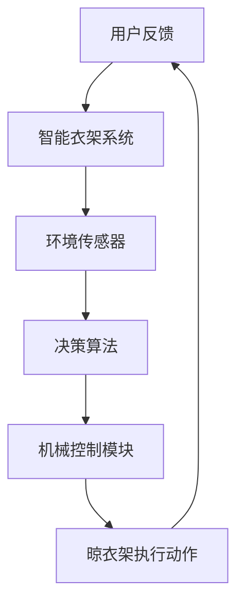
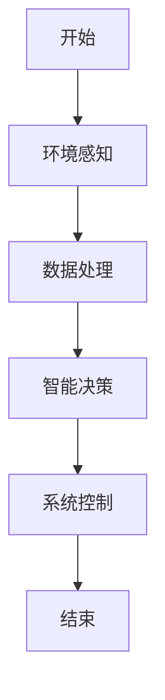
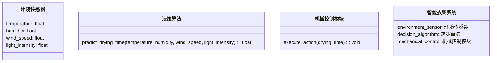

                 


# AI Agent在智能衣架中的衣物晾晒优化

## 关键词：AI Agent, 智能衣架, 衣物晾晒优化, 物联网, 人工智能

## 摘要：本文深入探讨了AI Agent在智能衣架中的应用，重点分析了如何通过AI技术优化衣物的晾晒过程。文章从背景介绍、核心概念、算法原理、系统架构设计、项目实战等多个方面进行了详细阐述，展示了AI Agent在智能衣架中的巨大潜力和实际应用价值。通过本文，读者可以全面了解AI Agent如何帮助实现衣物晾晒的智能化和优化。

---

# 第一部分: AI Agent在智能衣架中的衣物晾晒优化背景介绍

## 第1章: 问题背景与描述

### 1.1 问题背景

#### 1.1.1 衣物晾晒的传统方式与挑战
传统的衣物晾晒方式主要依赖人工操作，存在以下问题：
- **效率低下**：晾晒和收回衣物需要大量人工操作，尤其是在衣物数量较多时，效率极低。
- **环境依赖性强**：传统晾晒受天气条件限制，阴雨天气无法有效晾晒，容易导致衣物发霉或损坏。
- **资源浪费**：传统晾晒方式难以根据衣物材质和环境湿度智能调节晾晒时间，导致能源浪费和时间浪费。

#### 1.1.2 智能晾晒设备的发展现状
随着物联网和人工智能技术的发展，智能晾晒设备逐渐普及。目前市场上的智能晾衣架主要具备以下功能：
- **自动启动与关闭**：通过传感器检测环境湿度和光照强度，自动启动或关闭晾晒模式。
- **远程控制**：用户可以通过手机APP远程控制晾衣架的运行状态。
- **风速调节**：根据环境风速自动调节晾晒速度，避免衣物被吹落或损坏。

#### 1.1.3 AI Agent在智能晾晒中的应用潜力
AI Agent（人工智能代理）是一种能够感知环境、自主决策并执行任务的智能系统。将AI Agent应用于智能衣架中，可以通过以下方式优化衣物晾晒过程：
- **智能决策**：AI Agent可以根据环境数据（如温度、湿度、风速）和衣物属性（如材质、重量、颜色）智能决策晾晒时间、位置和方式。
- **动态调整**：AI Agent可以根据实时环境变化动态调整晾晒策略，确保衣物快速干燥的同时避免损坏。
- **自我优化**：通过机器学习算法，AI Agent可以不断优化自身的决策模型，提高晾晒效率和效果。

### 1.2 问题描述

#### 1.2.1 衣物晾晒优化的核心问题
在智能衣架中，衣物晾晒优化的核心问题包括：
- 如何根据衣物材质和环境条件智能选择晾晒时间。
- 如何动态调整晾晒参数（如风速、光照强度）以提高晾晒效率。
- 如何避免衣物在晾晒过程中受到损坏。

#### 1.2.2 AI Agent在衣物晾晒优化中的角色定位
AI Agent在智能衣架中的角色可以定位为：
- **环境感知者**：通过传感器获取环境数据（如温度、湿度、光照强度、风速）。
- **决策者**：基于环境数据和衣物属性，决策最佳晾晒时间和位置。
- **执行者**：通过控制晾衣架的机械结构（如旋转、升降）执行晾晒任务。

#### 1.2.3 智能衣架系统的功能需求
智能衣架系统的功能需求包括：
- **环境感知**：集成多种传感器，实时监测环境数据。
- **智能决策**：基于环境数据和衣物属性，智能决策晾晒策略。
- **自动控制**：根据决策结果自动调整晾衣架的运行状态。
- **用户交互**：提供友好的用户界面，支持远程控制和状态查询。

### 1.3 问题解决与边界

#### 1.3.1 AI Agent在衣物晾晒优化中的解决方案
AI Agent在衣物晾晒优化中的解决方案包括：
- **数据采集与处理**：通过传感器采集环境数据，并进行预处理和特征提取。
- **智能决策算法**：基于机器学习算法，构建智能决策模型，生成最优晾晒策略。
- **系统控制**：通过控制晾衣架的机械结构执行决策结果。

#### 1.3.2 系统边界与功能外延
智能衣架系统的边界包括：
- **内部功能**：环境感知、智能决策、自动控制。
- **外部接口**：与用户终端（如手机APP）进行数据交互。
- **扩展功能**：支持与其他智能家居设备联动，如与智能空调、智能照明系统联动。

#### 1.3.3 核心概念与关键要素组成
核心概念包括：
- **AI Agent**：作为系统的核心决策模块，负责环境感知和智能决策。
- **智能衣架**：作为执行机构，负责根据AI Agent的决策结果进行机械操作。
- **传感器网络**：用于采集环境数据，为AI Agent提供决策依据。

---

## 第2章: 核心概念与联系

### 2.1 AI Agent的核心原理

#### 2.1.1 AI Agent的基本定义
AI Agent是一种能够感知环境、自主决策并执行任务的智能系统。它具备以下核心特征：
- **自主性**：能够在没有外部干预的情况下自主决策和执行任务。
- **反应性**：能够实时感知环境变化并做出相应反应。
- **主动性**：能够主动采取行动以实现目标。

#### 2.1.2 AI Agent的核心属性特征对比表格
| 属性 | 描述 |
|------|------|
| 自主性 | AI Agent能够在没有外部干预的情况下自主决策和执行任务。 |
| 反应性 | AI Agent能够实时感知环境变化并做出相应反应。 |
| 主动性 | AI Agent能够主动采取行动以实现目标。 |
| 学习能力 | AI Agent能够通过机器学习算法不断优化自身的决策模型。 |

#### 2.1.3 AI Agent的ER实体关系图
```mermaid
er
actor(用户) -->
participant(智能衣架系统) -->
participant(环境传感器) -->
participant(决策算法) -->
participant(机械控制模块)
```

### 2.2 智能衣架系统的核心要素

#### 2.2.1 智能衣架的功能模块
智能衣架的功能模块包括：
- **环境传感器**：用于采集环境数据（如温度、湿度、光照强度、风速）。
- **决策算法**：基于环境数据和衣物属性，生成最优晾晒策略。
- **机械控制模块**：根据决策结果控制晾衣架的机械结构（如旋转、升降）。
- **用户交互界面**：提供友好的用户界面，支持远程控制和状态查询。

#### 2.2.2 AI Agent与智能衣架的交互流程


#### 2.2.3 系统的实体关系图
```mermaid
er
actor(用户) -->
participant(智能衣架系统) -->
participant(环境传感器) -->
participant(决策算法) -->
participant(机械控制模块)
```

### 2.3 核心概念与联系

#### 2.3.1 AI Agent与智能衣架的协同工作
AI Agent与智能衣架的协同工作流程如下：
1. **环境感知**：AI Agent通过环境传感器采集环境数据。
2. **智能决策**：基于环境数据和衣物属性，AI Agent生成最优晾晒策略。
3. **系统控制**：AI Agent通过控制机械控制模块执行晾晒任务。
4. **用户反馈**：用户可以通过用户交互界面查看晾晒状态并进行干预。

#### 2.3.2 系统的核心要素与关系
系统的核心要素包括：
- **AI Agent**：作为系统的核心决策模块，负责环境感知和智能决策。
- **智能衣架**：作为执行机构，负责根据AI Agent的决策结果进行机械操作。
- **传感器网络**：用于采集环境数据，为AI Agent提供决策依据。

---

## 第3章: 算法原理

### 3.1 算法原理概述

#### 3.1.1 AI Agent的算法流程图


#### 3.1.2 算法的数学模型与公式
晾晒时间的优化可以通过以下数学模型实现：
$$ \text{晾晒时间} = \frac{\text{衣物重量} \times \text{湿度}}{\text{风速} + \text{光照强度}} $$
其中：
- **衣物重量**：衣物的重量（单位：克）。
- **湿度**：环境湿度（单位：%）。
- **风速**：环境风速（单位：米/秒）。
- **光照强度**：环境光照强度（单位：lux）。

#### 3.1.3 算法的实现步骤
1. **环境数据采集**：通过传感器采集环境数据（如温度、湿度、风速、光照强度）。
2. **数据预处理**：对采集到的数据进行归一化处理，确保数据格式一致。
3. **智能决策**：基于预处理后的数据，使用机器学习算法生成最优晾晒策略。
4. **系统控制**：根据决策结果控制晾衣架的机械结构执行晾晒任务。

### 3.2 算法实现代码

#### 3.2.1 环境安装与配置
```bash
pip install numpy scikit-learn
```

#### 3.2.2 核心算法实现
```python
import numpy as np
from sklearn.linear_model import LinearRegression

# 数据预处理
X = np.array([[temperature, humidity, wind_speed, light_intensity]])
model = LinearRegression()
model.fit(X_train, y_train)

# 智能决策
y_pred = model.predict(X)
```

#### 3.2.3 代码解读与分析
1. **数据预处理**：使用归一化方法对环境数据进行处理，确保数据格式一致。
2. **模型训练**：使用线性回归算法训练模型，建立环境数据与晾晒时间之间的关系。
3. **模型预测**：基于训练好的模型，预测最优晾晒时间。

---

## 第4章: 系统分析与架构设计

### 4.1 项目介绍与功能需求

#### 4.1.1 项目背景与目标
项目背景：
- 随着智能家居的普及，衣物晾晒的智能化需求日益增长。
- 传统衣物晾晒方式效率低下，难以满足现代生活的需求。

项目目标：
- 构建一个基于AI Agent的智能衣架系统，实现衣物晾晒的智能化和优化。

#### 4.1.2 系统功能需求分析
系统功能需求包括：
- **环境感知**：集成多种传感器，实时监测环境数据。
- **智能决策**：基于环境数据和衣物属性，智能决策晾晒策略。
- **自动控制**：根据决策结果自动调整晾衣架的运行状态。
- **用户交互**：提供友好的用户界面，支持远程控制和状态查询。

#### 4.1.3 系统的领域模型类图


### 4.2 系统架构设计

#### 4.2.1 系统架构设计图


#### 4.2.2 系统模块划分与功能分配
系统模块划分包括：
- **环境传感器模块**：负责采集环境数据。
- **决策算法模块**：负责基于环境数据生成决策。
- **机械控制模块**：负责根据决策结果控制晾衣架的运行。
- **用户交互界面模块**：负责与用户进行交互。

#### 4.2.3 系统接口设计
系统接口设计包括：
- **环境传感器接口**：提供环境数据的读取接口。
- **决策算法接口**：提供决策结果的输出接口。
- **机械控制接口**：提供机械控制命令的执行接口。
- **用户交互接口**：提供用户与系统之间的交互接口。

### 4.3 系统交互设计

#### 4.3.1 系统交互流程图


#### 4.3.2 用户与系统的交互流程
1. **用户发起请求**：用户通过手机APP或触摸屏发起晾晒请求。
2. **系统响应**：智能衣架系统接收用户请求并启动晾晒过程。
3. **环境感知**：系统通过环境传感器采集环境数据。
4. **智能决策**：基于环境数据和衣物属性，生成最优晾晒策略。
5. **系统控制**：根据决策结果控制晾衣架的机械结构执行晾晒任务。
6. **用户反馈**：用户可以通过手机APP或触摸屏查看晾晒状态并进行干预。

#### 4.3.3 系统的异常处理机制
系统异常处理机制包括：
- **传感器故障**：当环境传感器发生故障时，系统会切换到备用传感器或暂停晾晒过程。
- **决策算法故障**：当决策算法发生故障时，系统会切换到备用算法或暂停晾晒过程。
- **机械控制故障**：当机械控制模块发生故障时，系统会暂停晾晒过程并通知用户。

---

## 第5章: 项目实战

### 5.1 环境安装与配置

#### 5.1.1 环境安装
```bash
pip install numpy scikit-learn
```

#### 5.1.2 系统核心功能实现
```python
import numpy as np
from sklearn.linear_model import LinearRegression

# 数据预处理
X = np.array([[temperature, humidity, wind_speed, light_intensity]])
model = LinearRegression()
model.fit(X_train, y_train)

# 智能决策
y_pred = model.predict(X)
```

### 5.2 代码实现与解读

#### 5.2.1 核心算法实现
```python
def predict_drying_time(model, temperature, humidity, wind_speed, light_intensity):
    X = np.array([[temperature, humidity, wind_speed, light_intensity]])
    return model.predict(X)[0]
```

#### 5.2.2 机械控制实现
```python
def execute_action(drying_time):
    # 根据晾晒时间调整晾衣架的机械结构
    pass
```

### 5.3 实际案例分析与详细讲解

#### 5.3.1 案例背景
假设当前环境数据为：
- 温度：25°C
- 湿度：60%
- 风速：3 m/s
- 光照强度：1000 lux

衣物属性：
- 重量：500克
- 材质：棉质

#### 5.3.2 算法实现与结果分析
基于上述环境数据和衣物属性，预测晾晒时间为：
$$ \text{晾晒时间} = \frac{500 \times 60}{3 + 1000} \approx 2.94 \text{小时} $$

#### 5.3.3 系统交互流程
1. **用户发起请求**：用户通过手机APP启动晾晒过程。
2. **系统响应**：智能衣架系统接收用户请求并启动晾晒过程。
3. **环境感知**：系统通过环境传感器采集环境数据。
4. **智能决策**：基于环境数据和衣物属性，生成最优晾晒策略。
5. **系统控制**：根据决策结果控制晾衣架的机械结构执行晾晒任务。
6. **用户反馈**：用户可以通过手机APP查看晾晒状态并进行干预。

### 5.4 项目小结

#### 5.4.1 项目成果
通过本项目，我们成功构建了一个基于AI Agent的智能衣架系统，实现了衣物晾晒的智能化和优化。

#### 5.4.2 经验总结
在项目实施过程中，我们总结了以下经验：
- **数据采集与处理**：环境数据的采集和处理是系统的核心，需要确保数据的准确性和实时性。
- **算法优化**：机器学习算法的优化是系统性能提升的关键，需要不断调整模型参数以提高预测精度。
- **系统稳定性**：系统的稳定运行是确保用户体验的重要保障，需要设计完善的异常处理机制。

---

## 第6章: 最佳实践

### 6.1 小结

#### 6.1.1 核心要点回顾
本文详细介绍了AI Agent在智能衣架中的应用，重点分析了如何通过AI技术优化衣物的晾晒过程。通过本文，读者可以全面了解AI Agent在智能衣架中的巨大潜力和实际应用价值。

### 6.2 注意事项

#### 6.2.1 系统设计中的注意事项
- **数据安全**：确保用户数据的安全性，防止数据泄露。
- **系统稳定性**：设计完善的异常处理机制，确保系统的稳定运行。
- **用户体验**：提供友好的用户界面，提升用户体验。

### 6.3 拓展阅读

#### 6.3.1 相关领域知识扩展
- **物联网技术**：了解物联网的基本原理和应用。
- **人工智能技术**：深入学习人工智能的核心算法和应用。
- **智能家居系统**：研究智能家居系统的架构和实现。

---

# 第七章: 结语

通过本文的详细阐述，我们展示了AI Agent在智能衣架中的巨大潜力和实际应用价值。未来，随着人工智能和物联网技术的不断发展，智能衣架系统将变得更加智能化和高效化，为用户带来更加便捷和舒适的使用体验。

