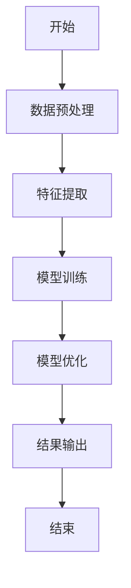
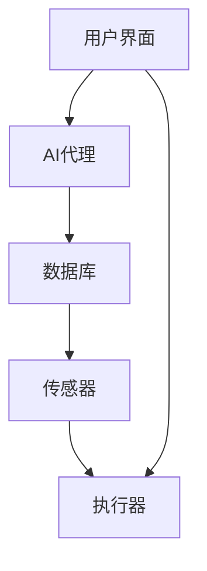
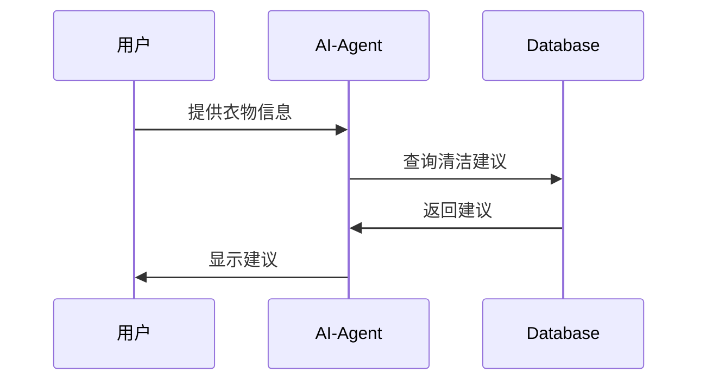

                 


# AI Agent在智能衣架中的衣物清洁建议

> 关键词：AI Agent，智能衣架，衣物清洁，算法原理，系统架构，项目实战

> 摘要：本文探讨AI Agent在智能衣架中的应用，重点分析其如何通过感知、学习和决策机制优化衣物清洁建议。文章详细讲解了AI Agent的核心原理，系统架构设计，以及实际项目中的实现细节，帮助读者全面理解AI技术在智能衣架中的创新应用。

---

## 第一部分: AI Agent与智能衣架的背景介绍

### 第1章: AI Agent与智能衣架的基本概念

#### 1.1 AI Agent的基本概念
- 1.1.1 什么是AI Agent
- 1.1.2 AI Agent的核心特征
- 1.1.3 AI Agent的应用场景

#### 1.2 智能衣架的定义与特点
- 1.2.1 智能衣架的基本概念
- 1.2.2 智能衣架的功能特点
- 1.2.3 智能衣架与传统衣架的主要区别

#### 1.3 AI Agent在智能衣架中的作用
- 1.3.1 AI Agent在智能衣架中的核心功能
- 1.3.2 AI Agent如何优化衣物清洁建议
- 1.3.3 AI Agent在智能衣架中的未来发展

---

## 第二部分: AI Agent与智能衣架的核心概念与联系

### 第2章: AI Agent的核心原理
- 2.1 AI Agent的感知与学习机制
- 2.2 AI Agent的决策与执行流程
- 2.3 AI Agent的自适应能力

### 第3章: AI Agent与智能衣架的实体关系图

#### 3.1 ER实体关系图的构建
```mermaid
erDiagram
    actor 用户 {
        string 用户ID
        string 用户名
        string 密码
    }
    smart_hanger {
        string 设备ID
        string 设备名称
        date 初始安装日期
    }
    cloth {
        string 衣物ID
        string 衣物类型
        string 布料材质
    }
    cleaning_suggestion {
        string 建议ID
        date 建议时间
        string 清洁建议内容
    }
    用户 --> smart_hanger : 操作
    用户 --> cloth : 穿着
    smart_hanger --> cleaning_suggestion : 提供
    cloth --> cleaning_suggestion : 关联
```

---

### 第4章: AI Agent的算法原理

#### 4.1 机器学习算法在AI Agent中的应用
- 4.1.1 算法流程图


#### 4.2 神经网络算法的实现
- 4.2.1 神经网络结构
- 4.2.2 算法实现步骤

#### 4.3 自然语言处理算法的应用
- 4.3.1 NLP算法在清洁建议中的作用
- 4.3.2 示例代码片段

---

## 第三部分: 智能衣架系统的架构设计

### 第5章: 系统架构设计
- 5.1 系统整体架构


### 第6章: 系统接口设计
- 6.1 系统接口的定义
- 6.2 接口交互流程


---

## 第四部分: 项目实战与实现

### 第7章: 项目实战
- 7.1 环境安装
- 7.2 核心代码实现
```python
# 示例代码
class AI-Agent:
    def __init__(self):
        self.data = {}

    def perceive(self, input_data):
        # 感知数据并处理
        pass

    def decide(self):
        # 基于数据的决策
        pass
```

- 7.3 代码应用与解读
- 7.4 实际案例分析

---

## 第五部分: 总结与展望

### 第8章: 总结与小结
- 8.1 本文的核心内容回顾
- 8.2 AI Agent在智能衣架中的未来发展方向
- 8.3 最佳实践与注意事项

### 第9章: 拓展阅读
- 9.1 推荐的书籍和资源
- 9.2 相关领域的最新研究

---

通过以上目录结构，文章将系统地介绍AI Agent在智能衣架中的应用，从理论到实践，为读者提供全面的知识和见解。

