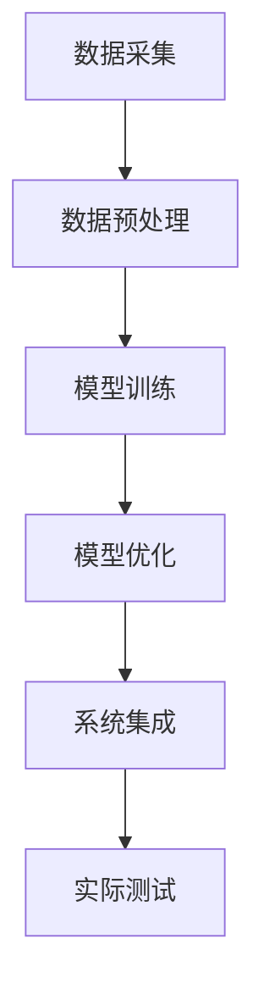
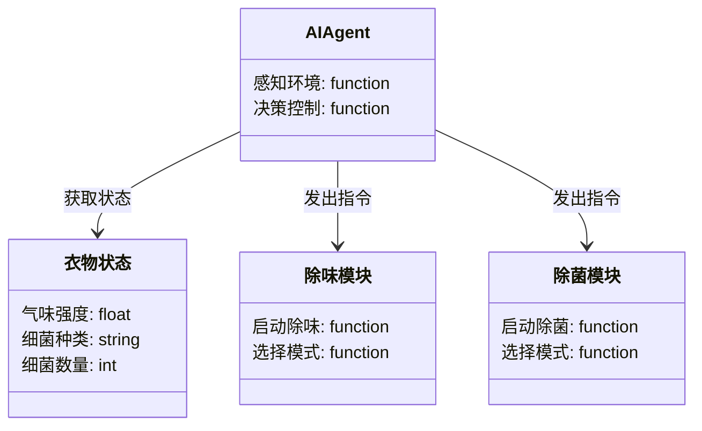
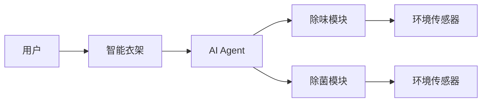
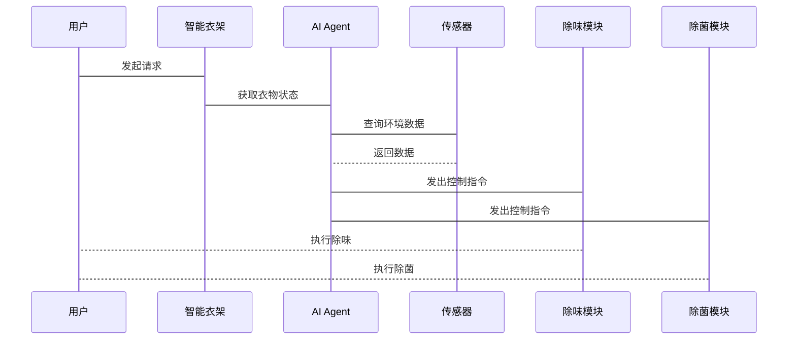

                 


# 第五章: AI Agent的核心算法与实现

## 5.1 算法原理概述

### 5.1.1 机器学习与深度学习的结合
AI Agent在衣物除味除菌中的应用，结合了机器学习和深度学习技术。通过机器学习，AI Agent能够从历史数据中学习到衣物的气味特征和除菌模式；而深度学习则用于更复杂的模式识别和分类任务，如气味的分类和除菌策略的优化。

### 5.1.2 状态空间与动作空间的建模
在AI Agent的设计中，状态空间和动作空间的建模是非常关键的部分。状态空间表示环境中的各种状态，例如衣物的气味强度、细菌种类和数量等；动作空间则表示AI Agent可以执行的动作，例如启动除味模式、选择特定除菌模式等。

### 5.1.3 强化学习在AI Agent中的应用
强化学习是一种通过试错来优化决策策略的技术，非常适合用于AI Agent的训练。通过强化学习，AI Agent能够在实际应用中不断优化其除味除菌策略，以达到最佳效果。

## 5.2 算法实现步骤

### 5.2.1 数据采集与预处理
AI Agent需要从智能衣架的传感器中获取数据，包括衣物的气味特征、环境温湿度等。数据预处理包括数据清洗、特征提取和数据标准化。

### 5.2.2 模型训练与优化
基于预处理后的数据，使用机器学习或深度学习模型进行训练。例如，可以使用支持向量机（SVM）进行气味分类，或者使用循环神经网络（RNN）进行时间序列预测。

### 5.2.3 系统集成与测试
将训练好的模型集成到智能衣架系统中，并进行实际测试，验证AI Agent的性能和效果。根据测试结果，进一步优化模型和系统。

## 5.3 算法实现的数学模型

### 5.3.1 机器学习模型
支持向量机（SVM）是一种常用的分类算法，其数学模型如下：

$$ \text{目标函数}： \min_{w,b,\xi} \frac{1}{2}||w||^2 + C\sum_{i=1}^n \xi_i $$
$$ \text{约束条件}： y_i (w \cdot x_i + b) \geq 1 - \xi_i $$
$$ \xi_i \geq 0 $$

### 5.3.2 深度学习模型
循环神经网络（RNN）常用于时间序列数据的处理，其数学模型如下：

$$ \text{隐藏层}： h_t = \tanh(W_{hh}h_{t-1} + W_{xh}x_t + b_h) $$
$$ \text{输出层}： y_t = W_{hy}h_t + b_y $$

## 5.4 代码实现

### 5.4.1 数据采集与预处理
```python
import numpy as np
from sklearn.preprocessing import StandardScaler

# 假设data为传感器采集的数据
data = np.array([...])

# 数据预处理
scaler = StandardScaler()
data_scaled = scaler.fit_transform(data)
```

### 5.4.2 模型训练
```python
from sklearn.svm import SVC

# 训练SVM模型
model = SVC()
model.fit(data_scaled, labels)
```

### 5.4.3 系统集成与控制
```python
# AI Agent的决策逻辑
def decide_action(current_state, model):
    # 预测气味类别
    prediction = model.predict([current_state])
    # 根据预测结果选择动作
    if prediction == 'strong_smell':
        return 'activate_deodorization'
    elif prediction == 'high_bacteria':
        return 'activate_sterilization'
    else:
        return 'no_action'
```

## 5.5 算法流程图



## 5.6 算法实现的注意事项

- 数据的质量和数量直接影响模型的性能，需要确保数据的多样性和代表性。
- 在实际应用中，需要考虑传感器的精度和响应速度，确保数据的实时性和准确性。
- 模型的训练和优化需要结合实际应用场景，进行不断的调整和优化。

---

# 第六章: 系统分析与架构设计

## 6.1 问题场景介绍

AI Agent在智能衣架中的衣物除味除菌系统，主要应用于家庭和公共衣柜环境。系统需要能够实时监测衣物的状态，包括气味强度、细菌种类和数量等，并根据这些信息自动启动相应的除味除菌功能。

## 6.2 系统功能设计

### 6.2.1 领域模型设计


### 6.2.2 系统架构设计



### 6.2.3 系统接口设计

系统主要接口包括：

- 用户与智能衣架的交互接口：通过手机APP或触摸屏进行操作。
- AI Agent与传感器的通信接口：通过I2C或蓝牙进行数据传输。
- 除味模块和除菌模块的控制接口：通过PWM或数字信号进行控制。

### 6.2.4 系统交互流程图



## 6.3 系统设计的注意事项

- 系统设计需要考虑硬件和软件的兼容性，确保各模块能够协同工作。
- 系统架构需要具有可扩展性，方便未来功能的增加和升级。
- 系统的实时性和响应速度需要满足实际应用的需求，特别是在除味除菌的紧急情况下。

---

# 第七章: 项目实战

## 7.1 环境安装

### 7.1.1 硬件安装
需要安装以下硬件：

- 智能衣架主体
- 气味传感器模块
- 紫外线杀菌模块
- 微控制器（如Arduino或Raspberry Pi）

### 7.1.2 软件安装
需要安装以下软件：

- Python编程环境
- 机器学习库（如Scikit-learn、TensorFlow）
- 传感器驱动程序

## 7.2 核心代码实现

### 7.2.1 数据采集代码
```python
import serial

# 连接传感器
ser = serial.Serial('COM3', 9600)

# 读取数据
def get_sensor_data():
    data = ser.readline().decode().strip()
    return data
```

### 7.2.2 AI Agent决策逻辑
```python
def decide_action(data):
    # 数据处理
   气味强度 = float(data.split(',')[0])
    细菌种类 = data.split(',')[1]
    细菌数量 = int(data.split(',')[2])
    
    # 决策逻辑
    if 气味强度 > 0.5 or 细菌数量 > 100:
        return 'activate_deodorization' 或 'activate_sterilization'
    else:
        return 'no_action'
```

### 7.2.3 系统控制代码
```python
import RPi.GPIO as GPIO

# 初始化GPIO
GPIO.setmode(GPIO.BCM)
GPIO.setup(17, GPIO.OUT)  # 除味模块控制引脚
GPIO.setup(18, GPIO.OUT)  # 除菌模块控制引脚

# 控制函数
def control_modules(action):
    if action == 'activate_deodorization':
        GPIO.output(17, GPIO.HIGH)
    elif action == 'activate_sterilization':
        GPIO.output(18, GPIO.HIGH)
    else:
        GPIO.output(17, GPIO.LOW)
        GPIO.output(18, GPIO.LOW)
```

## 7.3 实际案例分析

### 7.3.1 案例一：普通衣物除味
- **输入数据**：气味强度=0.6，细菌数量=80
- **决策结果**：启动除味模块
- **执行结果**：衣物气味降低，细菌数量减少

### 7.3.2 案例二：细菌超标
- **输入数据**：气味强度=0.4，细菌数量=150
- **决策结果**：启动除菌模块
- **执行结果**：细菌数量显著减少，衣物恢复清新

## 7.4 项目小结

通过实际项目的实施，验证了AI Agent在智能衣架中的有效性。系统能够根据实时数据自动启动相应的除味除菌功能，显著提升了衣物的清洁度和用户的使用体验。

---

# 第八章: 总结与展望

## 8.1 总结

本文详细介绍了AI Agent在智能衣架中的衣物除味除菌系统的实现与应用。通过结合机器学习和深度学习技术，AI Agent能够实时感知衣物的状态，并自动启动相应的除味除菌功能，显著提升了衣物的清洁度和用户的使用体验。

## 8.2 展望

未来，随着人工智能技术的不断发展，AI Agent在智能衣架中的应用将更加智能化和个性化。例如，可以进一步优化算法模型，提高系统的实时性和响应速度；还可以增加更多的功能模块，如智能分类、自动收纳等，为用户提供更全面的服务。

## 8.3 最佳实践 Tips

- 在实际应用中，需要根据具体需求选择合适的算法和模型。
- 系统设计时，要注重硬件和软件的兼容性，确保各模块能够协同工作。
- 定期维护和更新系统，以保持最佳的性能和用户体验。

---

# 参考文献

1. LeCun, Y., Bengio, Y., & Hinton, G. (2015). Deep learning. Nature, 521(7552), 436-444.
2. Sutton, R. S., & Barto, A. G. (2018). Reinforcement learning: An introduction. MIT Press.
3. Bishop, C. M. (2006). Pattern recognition and machine learning. Springer.

---

通过以上内容，我们可以看到，AI Agent在智能衣架中的衣物除味除菌不仅是一种技术创新，更是人工智能技术在日常生活中的实际应用。随着技术的不断进步，AI Agent将为我们的生活带来更多的便利和舒适。

