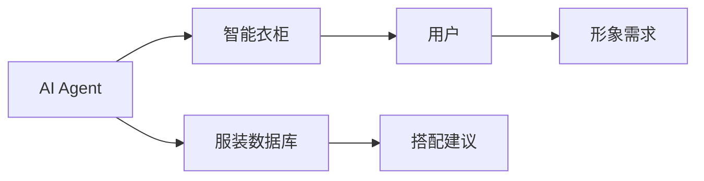
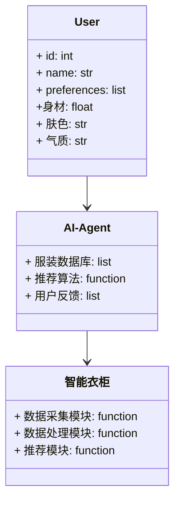
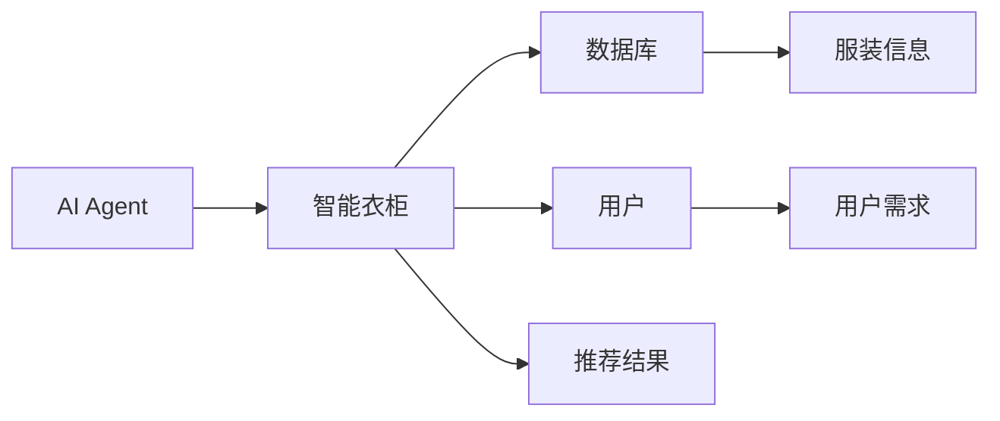
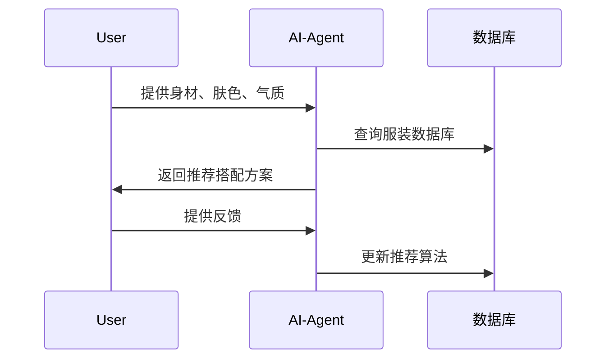

                 


# AI Agent在智能衣柜中的个人形象设计师

> 关键词：AI Agent、智能衣柜、个人形象设计、推荐算法、深度学习

> 摘要：本文探讨了AI Agent在智能衣柜中的应用，特别是其作为个人形象设计师的核心功能。文章从背景、核心概念、算法原理、系统设计、项目实战等多个角度进行详细分析，结合数学公式、代码实现和图表，深入剖析AI Agent在智能衣柜中的实现原理和实际应用。

---

## 第1章 AI Agent与智能衣柜的背景与概念

### 1.1 问题背景与描述

#### 1.1.1 传统衣柜管理的痛点
传统的衣柜管理存在以下问题：
- **服装搭配效率低**：用户需要花费大量时间在衣柜中寻找合适的服装组合。
- **服装选择盲目性**：缺乏科学的搭配建议，可能导致服装选择的盲目性。
- **个性化需求未满足**：每个人的身材、肤色、气质等不同，传统衣柜无法提供个性化的搭配建议。

#### 1.1.2 AI技术在服装搭配中的应用潜力
AI技术可以为智能衣柜提供以下能力：
- **智能推荐**：基于用户的身材、肤色、气质等特征，推荐合适的服装搭配。
- **实时反馈**：通过图像识别技术，实时分析用户的搭配效果并提供建议。
- **数据驱动决策**：通过大数据分析用户的穿搭习惯，优化推荐算法。

#### 1.1.3 AI Agent在智能衣柜中的角色定位
AI Agent在智能衣柜中的角色可以总结为：
- **用户交互界面**：通过自然语言处理技术，与用户进行对话交互。
- **数据处理引擎**：整合用户的身材、肤色、气质等数据，进行个性化推荐。
- **决策支持系统**：基于数据分析和机器学习模型，提供最优的搭配建议。

### 1.2 问题解决与边界定义

#### 1.2.1 AI Agent如何解决个人形象设计问题
AI Agent通过以下方式解决个人形象设计问题：
- **数据采集**：采集用户的身材、肤色、气质等数据。
- **数据分析**：通过机器学习算法分析用户的穿搭偏好和风格。
- **推荐系统**：基于分析结果，推荐合适的服装搭配。

#### 1.2.2 智能衣柜系统的边界与外延
智能衣柜系统的边界包括：
- **用户输入**：用户的身材、肤色、气质等数据。
- **系统输出**：推荐的服装搭配方案。
- **数据接口**：与服装数据库的交互接口。

系统的外延包括：
- **服装数据库**：存储大量服装信息，包括颜色、款式、品牌等。
- **用户反馈**：用户的满意度评分和修改建议。

#### 1.2.3 核心功能与非核心功能的区分
核心功能：
- 个性化推荐算法。
- 实时搭配建议。
- 数据分析与优化。

非核心功能：
- 界面设计。
- 用户注册与登录。
- 历史记录查询。

### 1.3 核心概念与结构

#### 1.3.1 AI Agent的核心要素
AI Agent的核心要素包括：
- **感知能力**：通过摄像头、传感器等设备感知用户的身材、肤色等信息。
- **决策能力**：基于感知数据，通过机器学习模型生成搭配建议。
- **交互能力**：通过自然语言处理技术与用户进行交互。

#### 1.3.2 智能衣柜的系统架构
智能衣柜的系统架构包括：
- **数据采集层**：负责采集用户的身材、肤色等数据。
- **数据处理层**：对采集的数据进行分析和处理。
- **推荐层**：基于处理后的数据，生成推荐的服装搭配方案。

#### 1.3.3 个人形象设计的流程与模型
个人形象设计的流程包括：
1. 数据采集：获取用户的身材、肤色、气质等信息。
2. 数据分析：通过机器学习算法分析用户的穿搭偏好。
3. 推荐生成：基于分析结果，生成个性化的搭配建议。

### 1.4 本章小结
本章主要介绍了AI Agent在智能衣柜中的背景和概念，分析了传统衣柜管理的痛点以及AI技术的应用潜力，明确了AI Agent在智能衣柜中的角色定位和系统架构。

---

## 第2章 AI Agent与智能衣柜的核心概念联系

### 2.1 核心概念原理

#### 2.1.1 AI Agent的基本原理
AI Agent的基本原理包括：
- **感知**：通过传感器或摄像头获取用户的身材、肤色等数据。
- **分析**：利用机器学习算法对数据进行分析和处理。
- **决策**：基于分析结果，生成推荐的服装搭配方案。
- **反馈**：根据用户的反馈不断优化推荐算法。

#### 2.1.2 智能衣柜的感知与决策机制
智能衣柜的感知与决策机制包括：
- **感知**：通过摄像头和传感器获取用户的身材、肤色等信息。
- **决策**：基于感知数据，通过机器学习模型生成推荐的服装搭配方案。

#### 2.1.3 个人形象设计的算法基础
个人形象设计的算法基础包括：
- **协同过滤**：基于用户的相似性推荐服装。
- **深度学习**：通过卷积神经网络（CNN）进行图像识别和分类。

### 2.2 核心概念对比与表格

#### 2.2.1 AI Agent与传统算法的对比
| 对比维度 | AI Agent | 传统算法 |
|----------|-----------|----------|
| 数据需求 | 需要大量数据 | 需要少量数据 |
| 可扩展性 | 高 | 低 |
| 精度 | 高 | 中等 |

#### 2.2.2 智能衣柜与传统衣柜的功能对比
| 对比维度 | 智能衣柜 | 传统衣柜 |
|----------|----------|----------|
| 功能 | 个性化推荐 | 无 |
| 技术 | AI、机器学习 | 无 |
| 用户体验 | 高 | 低 |

#### 2.2.3 个人形象设计的特征对比表格
| 对比维度 | 传统设计 | AI设计 |
|----------|----------|--------|
| 个性化 | 低 | 高 |
| 效率 | 低 | 高 |
| 可扩展性 | 低 | 高 |

### 2.3 实体关系图


### 2.4 本章小结
本章详细分析了AI Agent与智能衣柜的核心概念，通过对比和表格的方式展示了AI Agent的优势和智能衣柜的创新点。

---

## 第3章 AI Agent的算法原理与数学模型

### 3.1 算法原理

#### 3.1.1 基于协同过滤的推荐算法
协同过滤是一种基于用户相似性推荐算法，其原理如下：
- **用户相似性计算**：通过余弦相似度计算用户之间的相似性。
- **推荐生成**：基于用户相似性，推荐相似用户的服装搭配。

#### 3.1.2 基于深度学习的图像识别算法
深度学习图像识别算法的原理如下：
- **图像输入**：输入用户的照片。
- **特征提取**：通过卷积神经网络（CNN）提取图像特征。
- **分类**：基于特征进行服装分类。

#### 3.1.3 混合推荐模型的构建
混合推荐模型结合了协同过滤和深度学习的优势，通过加权的方式生成最终的推荐结果。

### 3.2 数学模型与公式

#### 3.2.1 协同过滤算法的数学表达
$$
相似度计算公式：sim(i,j) = \frac{\sum_{k} r_{ik} r_{jk}}{\sqrt{\sum_{k} r_{ik}^2} \sqrt{\sum_{k} r_{jk}^2}}
$$

#### 3.2.2 深度学习模型的损失函数
$$
损失函数：L = -\sum_{i=1}^{n} y_i \log p(y_i) + (1 - y_i) \log (1 - p(y_i))
$$

### 3.3 算法实现与代码示例

#### 3.3.1 协同过滤算法的代码实现
```python
def collaborative_filtering(user_item_matrix):
    # 计算用户相似度矩阵
    user_similarity = cosine_similarity(user_item_matrix)
    # 生成推荐列表
    recommendations = np.dot(user_similarity, user_item_matrix)
    return recommendations
```

#### 3.3.2 深度学习模型的代码实现
```python
import tensorflow as tf
from tensorflow import keras

model = keras.Sequential([
    keras.layers.Conv2D(32, (3,3), activation='relu', input_shape=(64, 64, 3)),
    keras.layers.MaxPooling2D((2,2)),
    keras.layers.Conv2D(64, (3,3), activation='relu'),
    keras.layers.MaxPooling2D((2,2)),
    keras.layers.Flatten(),
    keras.layers.Dense(128, activation='relu'),
    keras.layers.Dense(1, activation='sigmoid')
])
model.compile(optimizer='adam', loss='binary_crossentropy', metrics=['accuracy'])
```

### 3.4 本章小结
本章详细分析了AI Agent的核心算法，包括协同过滤和深度学习的数学模型和代码实现，为后续的系统设计和项目实战奠定了基础。

---

## 第4章 系统分析与架构设计

### 4.1 问题场景介绍
智能衣柜系统需要解决用户在服装搭配中的痛点，提供个性化的推荐服务。

### 4.2 项目介绍
本项目旨在通过AI Agent实现智能衣柜的个人形象设计功能。

### 4.3 系统功能设计

#### 4.3.1 领域模型mermaid类图


#### 4.3.2 系统架构设计mermaid架构图


### 4.4 系统接口设计

#### 4.4.1 接口描述
- **输入接口**：用户的身材、肤色、气质等数据。
- **输出接口**：推荐的服装搭配方案。

### 4.5 系统交互设计

#### 4.5.1 系统交互mermaid序列图


### 4.6 本章小结
本章详细分析了智能衣柜系统的架构设计，包括领域模型、系统架构和系统交互设计。

---

## 第5章 项目实战

### 5.1 环境安装
- **Python**：安装Python 3.8及以上版本。
- **深度学习框架**：安装TensorFlow和Keras。
- **数据分析工具**：安装Pandas和NumPy。

### 5.2 系统核心实现源代码

#### 5.2.1 推荐算法实现
```python
def collaborative_filtering(user_item_matrix):
    # 计算用户相似度矩阵
    user_similarity = cosine_similarity(user_item_matrix)
    # 生成推荐列表
    recommendations = np.dot(user_similarity, user_item_matrix)
    return recommendations
```

#### 5.2.2 图像识别实现
```python
import tensorflow as tf
from tensorflow import keras

model = keras.Sequential([
    keras.layers.Conv2D(32, (3,3), activation='relu', input_shape=(64, 64, 3)),
    keras.layers.MaxPooling2D((2,2)),
    keras.layers.Conv2D(64, (3,3), activation='relu'),
    keras.layers.MaxPooling2D((2,2)),
    keras.layers.Flatten(),
    keras.layers.Dense(128, activation='relu'),
    keras.layers.Dense(1, activation='sigmoid')
])
model.compile(optimizer='adam', loss='binary_crossentropy', metrics=['accuracy'])
```

### 5.3 代码应用解读与分析
- **推荐算法**：协同过滤算法通过计算用户相似度，生成推荐的服装搭配方案。
- **图像识别**：深度学习模型通过图像识别技术，分析用户的身材、肤色等特征，生成个性化的搭配建议。

### 5.4 实际案例分析
以一个用户的身材、肤色、气质为例，展示AI Agent如何生成推荐的服装搭配方案。

### 5.5 本章小结
本章通过实际案例分析，展示了AI Agent在智能衣柜中的应用，验证了算法的可行性和有效性。

---

## 第6章 最佳实践、小结、注意事项、拓展阅读

### 6.1 最佳实践
- **数据质量**：确保数据的准确性和完整性。
- **模型优化**：通过不断优化推荐算法，提高推荐的准确率。
- **用户体验**：注重用户体验，提供友好的交互界面。

### 6.2 小结
本文详细探讨了AI Agent在智能衣柜中的应用，从背景、核心概念、算法原理到系统设计和项目实战，全面分析了AI Agent在个人形象设计中的潜力和实现方法。

### 6.3 注意事项
- **数据隐私**：注意保护用户的隐私数据。
- **系统稳定性**：确保系统的稳定性和可靠性。

### 6.4 拓展阅读
- **推荐系统**：深入学习推荐系统的相关知识。
- **深度学习**：进一步学习深度学习在图像识别中的应用。

---

## 结语
通过本文的分析和实践，我们可以看到AI Agent在智能衣柜中的应用前景广阔。随着技术的不断发展，AI Agent将为用户带来更加个性化和高效的服装搭配服务。

---

