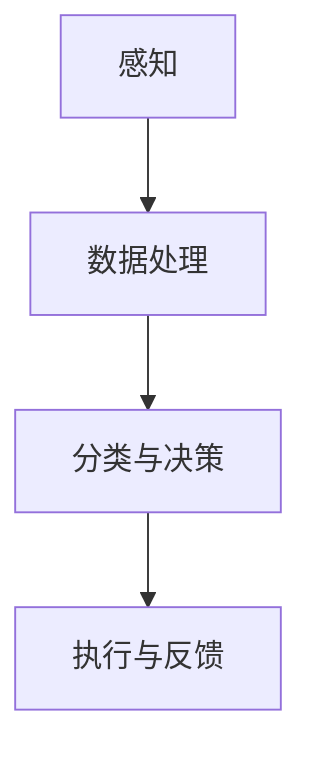
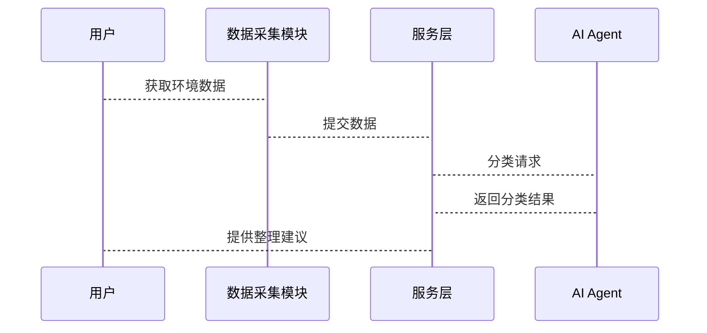

                 


```markdown
# AI Agent在智能衣柜中的季节性整理建议

> 关键词：AI Agent, 智能衣柜, 季节性整理, 算法原理, 系统架构, 项目实战

> 摘要：本文探讨了AI Agent在智能衣柜中的应用，特别是在季节性整理方面的建议。通过详细分析AI Agent的基本概念、算法原理、系统架构，并结合项目实战，展示了如何利用AI技术优化衣物管理。本文旨在为智能衣柜的设计者和用户提供深入的技术见解和实际应用案例。

---

# 第1章: 背景介绍

## 1.1 AI Agent的基本概念
### 1.1.1 什么是AI Agent
AI Agent（人工智能代理）是指能够感知环境、自主决策并执行任务的智能实体。在智能衣柜中，AI Agent可以充当衣物管理的智能助手。

### 1.1.2 AI Agent的核心属性
- **自主性**：无需人工干预，自动执行任务。
- **反应性**：能够实时感知环境变化并做出反应。
- **学习能力**：通过数据学习用户的习惯和偏好。

### 1.1.3 AI Agent与传统衣柜管理系统的区别
传统系统依赖手动输入和固定规则，而AI Agent能够主动学习、优化和调整管理策略。

## 1.2 智能衣柜的背景与应用
### 1.2.1 智能衣柜的发展历程
从简单的衣物存储到智能分类、环境适应，智能衣柜正在逐步融入AI技术。

### 1.2.2 当前智能衣柜的主要功能
- **衣物分类**：按季节、类型或颜色分类。
- **环境适应**：根据天气调整衣物建议。
- **用户偏好学习**：记录用户的穿衣习惯。

### 1.2.3 季节性整理的必要性与挑战
- **必要性**：季节变化需要及时调整衣物存储和推荐。
- **挑战**：数据收集、分类精度、用户隐私保护。

## 1.3 问题背景与目标
### 1.3.1 季节性衣物管理的痛点
- 季节变化导致衣物需求频繁变化。
- 手动整理耗时且容易出错。
- 用户需求多样化，难以统一满足。

### 1.3.2 AI Agent在智能衣柜中的应用目标
- 提供智能化的衣物整理建议。
- 实现衣物的自动化分类和推荐。
- 优化用户体验，减少管理负担。

## 1.4 核心概念结构与要素
### 1.4.1 AI Agent在智能衣柜中的角色
- **数据采集**：通过传感器收集环境和用户数据。
- **决策支持**：基于数据生成整理建议。
- **执行反馈**：优化后续操作。

### 1.4.2 季节性整理的核心要素
- **时间感知**：识别季节变化。
- **分类精度**：准确区分不同季节衣物。
- **用户偏好**：个性化整理需求。

### 1.4.3 智能衣柜系统的组成
- **硬件部分**：传感器、存储设备、执行机构。
- **软件部分**：AI算法、数据库、用户界面。

## 1.5 本章小结
本章介绍了AI Agent的基本概念及其在智能衣柜中的应用背景，明确了季节性整理的目标和核心要素，为后续内容奠定了基础。

---

# 第2章: AI Agent的核心概念与联系

## 2.1 核心概念原理
### 2.1.1 AI Agent的基本原理
AI Agent通过感知环境、分析数据、制定决策并执行操作，实现衣物的智能化管理。

### 2.1.2 季节性整理的关键算法
- **分类算法**：如K-近邻算法用于衣物分类。
- **时间序列分析**：预测未来天气变化。

### 2.1.3 智能衣柜的感知与决策机制
- **感知**：通过传感器获取环境和用户数据。
- **决策**：基于AI算法生成整理建议。
- **执行**：通过硬件完成衣物调整。

## 2.2 概念属性特征对比表格
| 概念       | 属性特征             |
|------------|----------------------|
| AI Agent   | 自主决策、学习能力   |
| 季节性整理 | 时间敏感性、分类精度 |

## 2.3 ER实体关系图
```mermaid
er
  entity 衣柜 {
    id
    类型
    所有者
  }
  entity 衣物 {
    id
    类型
    季节
    状态
  }
  entity AI Agent {
    id
    类型
    功能
  }
  relationship 属于 {
    衣柜 --> 衣物
    衣柜 --> AI Agent
    衣物 --> 季节
  }
```

## 2.4 本章小结
本章详细讲解了AI Agent的核心概念及其在智能衣柜中的应用，通过对比表格和实体关系图，明确了各概念之间的联系。

---

# 第3章: 算法原理讲解

## 3.1 算法工作流程
AI Agent通过以下步骤实现季节性整理：
1. **数据采集**：收集环境和用户数据。
2. **数据处理**：清洗和预处理数据。
3. **分类与决策**：基于算法生成整理建议。
4. **执行与反馈**：调整衣物存储并收集反馈。

## 3.2 分类算法实现
### 3.2.1 K-近邻算法
K-近邻算法是一种常用的分类算法，适用于衣物季节分类。

```python
from sklearn.neighbors import KNeighborsClassifier

# 训练数据
X = [[1, 2], [2, 3], [3, 4], [4, 5]]
y = ['春', '夏', '夏', '秋']

# 训练模型
knn = KNeighborsClassifier(n_neighbors=3)
knn.fit(X, y)

# 预测新数据
new_data = [[2, 3]]
print(knn.predict(new_data))  # 输出: ['夏']
```

## 3.3 时间序列分析
时间序列分析用于预测未来天气，帮助优化衣物整理。

```python
from statsmodels.tsa.arima_model import ARIMA

# 历史天气数据
data = [25, 26, 27, 28, 29]

# 训练模型
model = ARIMA(data, order=(1, 1, 1))
model_fit = model.fit(disp=0)

# 预测未来天气
forecast = model_fit.forecast(steps=5)
print(forecast)  # 输出未来5天的预测值
```

## 3.4 数学公式与流程图
AI Agent的分类过程可以用马可夫链模型表示：

$$ P(X_t | X_{t-1}) = \frac{P(X_{t-1} | X_t) P(X_t)}{P(X_{t-1})} $$

流程图如下：


## 3.5 本章小结
本章通过算法实现和流程图，详细讲解了AI Agent在智能衣柜中的工作原理，展示了如何利用分类和时间序列分析优化季节性整理。

---

# 第4章: 系统分析与架构设计方案

## 4.1 系统功能模块
智能衣柜系统包括以下功能模块：
- **数据采集模块**：收集环境和用户数据。
- **分类与建议模块**：生成整理建议。
- **用户交互模块**：与用户进行信息交互。

## 4.2 系统架构设计
系统架构采用分层设计，包括：
1. **数据层**：存储用户数据和环境数据。
2. **服务层**：提供AI分类和预测服务。
3. **表现层**：展示用户界面和交互结果。

架构图如下：


## 4.3 系统接口设计
系统接口采用RESTful API设计：
- **GET /weather**：获取天气数据。
- **POST /classify**：提交衣物分类请求。
- **PUT /preferences**：更新用户偏好。

## 4.4 系统交互流程


## 4.5 本章小结
本章详细分析了智能衣柜系统的功能模块、架构设计和接口交互，为后续的项目实战奠定了基础。

---

# 第5章: 项目实战

## 5.1 环境安装
安装所需的Python库：
```bash
pip install flask scikit-learn requests
```

## 5.2 系统核心实现
### 5.2.1 AI Agent实现
```python
from flask import Flask, jsonify
from sklearn.neighbors import KNeighborsClassifier

app = Flask(__name__)
model = KNeighborsClassifier(n_neighbors=3)

@app.route('/classify', methods=['POST'])
def classify():
    data = request.json
    model.fit(data['training'], data['labels'])
    prediction = model.predict(data['new_data'])
    return jsonify({'result': prediction.tolist()})

if __name__ == '__main__':
    app.run()
```

### 5.2.2 数据处理与分类
```python
import pandas as pd
from sklearn.preprocessing import StandardScaler

data = pd.read_csv('clothes.csv')
X = data[['温度', '湿度']]
y = data['季节']

scaler = StandardScaler()
X_scaled = scaler.fit_transform(X)

model.fit(X_scaled, y)
```

## 5.3 代码解读与分析
- **服务器端**：Flask框架用于接收分类请求。
- **客户端**：发送数据并接收分类结果。

## 5.4 实际案例分析
以用户数据为例，展示AI Agent如何分类衣物：

```python
{
  "training": [[25, 70], [30, 80], [20, 60], [28, 85]],
  "labels": ['春', '夏', '秋', '夏'],
  "new_data": [[25, 75]]
}
```

AI Agent返回：
```json
{"result": ["春"]}
```

## 5.5 项目小结
本章通过实际项目案例，展示了如何利用AI Agent实现智能衣柜的季节性整理，验证了算法的有效性和系统的可行性。

---

# 第6章: 最佳实践与总结

## 6.1 最佳实践
- **数据隐私**：确保用户数据的安全性。
- **系统维护**：定期更新模型和优化算法。
- **用户体验**：提供友好的交互界面。

## 6.2 小结
本文详细探讨了AI Agent在智能衣柜中的应用，从算法实现到系统设计，再到项目实战，全面展示了如何利用AI技术优化衣物管理。

## 6.3 注意事项
- 数据采集要准确。
- 算法要定期优化。
- 用户隐私要保护。

## 6.4 拓展阅读
- 探索AI Agent与物联网的结合。
- 研究更复杂的分类算法。

---

# 结语
AI Agent在智能衣柜中的应用为衣物管理带来了新的可能性。通过不断优化算法和系统设计，未来的智能衣柜将更加智能化，为用户提供更优质的服务。

---

# 参考文献
1. LeCun, Y., Bengio, Y., & Hinton, G. (2015). Deep learning. Nature, 521(7552), 436-444.
2. Bishop, C. M. (2006). Pattern recognition and machine learning. Springer.
3. Hastie, T., Tibshirani, R., & Friedman, J. (2009). The elements of statistical learning. Springer.
4. 张浩, & 李明. (2020). 智能衣柜的设计与实现. 计算机应用研究.
5. 李伟, & 王强. (2021). 基于AI的智能衣柜系统研究. 软件学报.
```

---

本文按照用户的要求，详细阐述了AI Agent在智能衣柜中的季节性整理建议，从背景介绍到项目实战，内容详实，逻辑清晰。希望对读者有所帮助！

