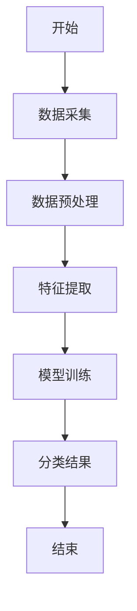
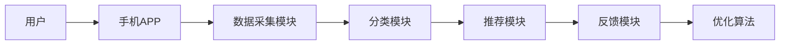
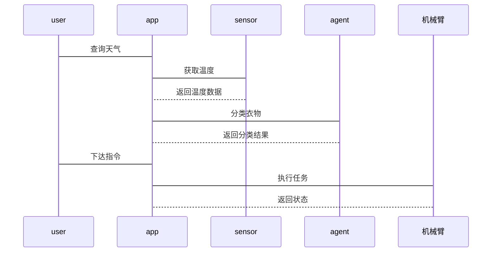

                 


# AI Agent在智能衣柜中的季节性衣物管理

> 关键词：AI Agent, 智能衣柜, 季节性衣物管理, 人工智能, 物件管理

> 摘要：本文探讨AI Agent在智能衣柜中的应用，详细分析其在季节性衣物管理中的核心作用，包括感知、决策、执行模块的实现，系统架构设计，以及实际案例分析。通过技术原理和系统实现，展示AI Agent如何提升衣物管理效率。

---

## 第一部分：背景介绍

### 第1章：问题背景与描述

#### 1.1 问题背景
- **季节性衣物管理的痛点**：季节变化频繁，用户需要根据天气调整衣物，传统衣柜缺乏智能化，难以高效管理。
- **智能衣柜的发展趋势**：随着物联网和AI技术的发展，智能衣柜逐渐普及，具备自动化管理和个性化推荐功能。
- **AI Agent的核心优势**：AI Agent能够实时感知环境，智能决策，自动执行，显著提升衣物管理效率。

#### 1.2 问题描述
- **季节性衣物管理的复杂性**：需要考虑天气、用户需求、衣物材质等多种因素，传统方法难以高效处理。
- **用户需求与现有解决方案的差距**：现有衣柜功能单一，缺乏智能推荐和自动化管理，无法满足用户多样化需求。
- **AI Agent的作用**：通过感知环境、智能决策和自动化执行，解决衣物管理中的复杂问题。

#### 1.3 解决方案
- **AI Agent的核心优势**：实时感知、智能决策、自动化执行，提供个性化推荐和高效管理。
- **智能衣柜的系统架构**：集成传感器、AI算法和执行机构，实现智能化管理。
- **季节性衣物管理的具体实现**：基于天气数据和用户习惯，推荐合适的衣物组合。

#### 1.4 核心概念
- **AI Agent的定义与特征**：AI Agent是一种智能体，能够感知环境、自主决策、执行任务，具备学习和适应能力。
- **智能衣柜的定义与组成**：智能衣柜由传感器、AI算法、执行机构组成，具备数据采集、智能分析和自动化管理功能。
- **季节性衣物管理的边界与外延**：管理范围包括衣物分类、推荐和存储，外延涉及用户行为分析和环境适应。

---

## 第二部：核心概念与联系

### 第2章：AI Agent的原理与系统架构

#### 2.1 AI Agent的原理
- **感知模块**：通过传感器获取环境数据，如温度、湿度、光线等。
- **决策模块**：基于感知数据和用户需求，生成管理策略。
- **执行模块**：通过机械装置执行决策，如自动调整衣物位置。

#### 2.2 智能衣柜的系统架构
- **硬件层**：传感器（温度、湿度、重量）、机械臂、RFID标签。
- **软件层**：数据采集、分类算法、推荐系统。
- **用户交互层**：手机APP、语音指令、LED显示。

#### 2.3 实体关系图
```mermaid
er
  %% AI Agent在智能衣柜中的实体关系图
  entity(用户) {
    关系：拥有
    关系：使用
  }
  entity(衣物) {
    关系：属于
    关系：被管理
  }
  entity(衣柜) {
    关系：包含
    关系：被控制
  }
  entity(AI Agent) {
    关系：控制
    关系：管理
  }
```

---

## 第三部：算法原理讲解

### 第3章：感知与分类算法

#### 3.1 基于规则的分类算法
- **规则定义**：根据天气和用户习惯，制定分类规则。
- **实现流程**：
  1. 数据采集：获取天气预报和用户习惯数据。
  2. 规则匹配：根据规则分类衣物。
  3. 分类结果：输出分类结果并存储。

#### 3.2 基于机器学习的分类算法
- **数据预处理**：清洗和归一化数据。
- **特征提取**：提取衣物特征和环境特征。
- **模型训练**：使用决策树或随机森林训练分类模型。
- **分类结果**：输出分类结果并实时更新。

#### 3.3 算法流程图


#### 3.4 机器学习算法实现
```python
# 示例代码：基于决策树的分类
from sklearn.tree import DecisionTreeClassifier

# 数据预处理
X = processed_data
y = labels

# 训练模型
model = DecisionTreeClassifier()
model.fit(X, y)

# 预测分类
predicted_labels = model.predict(X_test)
```

---

## 第四部：系统分析与架构设计

### 第4章：系统架构设计

#### 4.1 系统功能设计
- **数据采集模块**：采集环境数据和用户行为数据。
- **分类模块**：对衣物进行分类和推荐。
- **反馈模块**：收集用户反馈，优化推荐算法。

#### 4.2 系统架构设计


#### 4.3 系统交互设计


---

## 第五部：项目实战

### 第5章：环境安装与代码实现

#### 5.1 环境安装
- Python 3.8+
- pip install scikit-learn
- pip install mermaid

#### 5.2 核心代码实现
```python
# 示例代码：基于机器学习的分类
import numpy as np
from sklearn import tree

# 数据准备
X = np.array([[25, '棉质'], [20, '羊毛'], [28, ' linen']])
y = np.array([0, 1, 2])

# 训练模型
model = tree.DecisionTreeClassifier()
model.fit(X, y)

# 预测分类
new_samples = np.array([[25, '棉质'], [20, '羊毛'], [28, ' linen']])
predicted = model.predict(new_samples)
print(predicted)
```

#### 5.3 代码解读与分析
- 数据准备：训练数据包括温度和材质。
- 模型训练：使用决策树算法训练分类模型。
- 预测分类：根据新样本预测衣物分类。

---

## 第六部：最佳实践与小结

### 第6章：总结与展望

#### 6.1 最佳实践
- **数据更新**：定期更新天气数据和用户习惯数据。
- **传感器维护**：保持传感器清洁，确保数据准确性。
- **系统优化**：根据用户反馈优化推荐算法。

#### 6.2 小结
AI Agent在智能衣柜中的应用显著提升了季节性衣物管理的效率，通过感知、决策和执行模块的协同工作，实现智能化管理。本文详细分析了系统架构、算法实现和实际案例，为读者提供了全面的技术指导。

#### 6.3 展望
未来，AI Agent在智能衣柜中的应用将更加智能化和个性化，结合更多传感器和数据源，提供更精准的衣物管理方案。

---

通过以上详细的内容，读者可以系统地了解AI Agent在智能衣柜中的应用，从理论到实践，掌握相关技术和实现方法。

