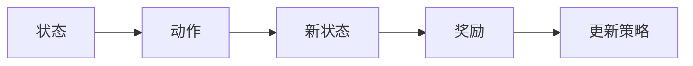
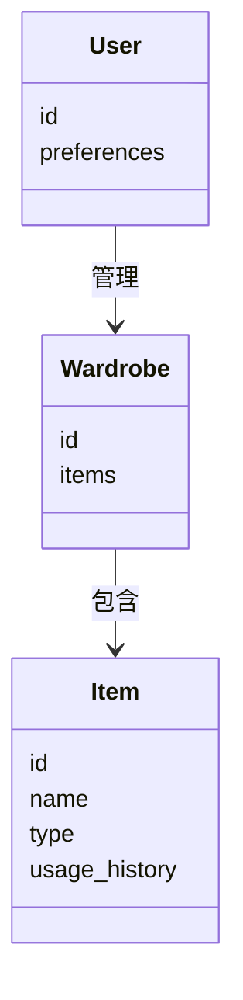
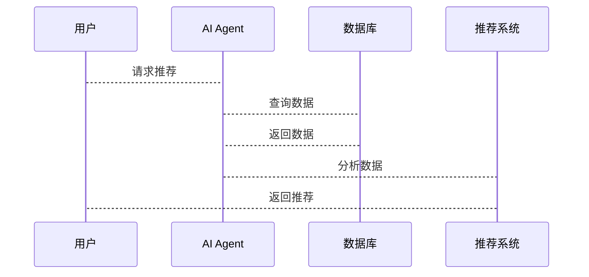

                 


# AI Agent在智能衣柜中的衣物循环使用建议

> 关键词：AI Agent、智能衣柜、衣物循环使用、AI推荐算法、智能管理系统

> 摘要：本文探讨了AI Agent在智能衣柜中的应用，重点分析了衣物循环使用的关键技术，包括AI推荐算法和智能管理系统的设计与实现。文章详细阐述了AI Agent的工作原理、系统架构，以及实际案例分析，为智能衣柜的未来发展提供了有益的参考。

---

## 第1章 背景介绍

### 1.1 问题背景
#### 1.1.1 衣物循环使用的重要性
随着资源短缺和环境问题的加剧，衣物循环使用已成为全球关注的焦点。通过延长衣物使用寿命，减少浪费，AI Agent在智能衣柜中的应用为衣物管理提供了智能化解决方案。

#### 1.1.2 智能衣柜的发展现状
智能衣柜通过物联网技术实现衣物的智能管理，但如何优化衣物使用效率仍是一个挑战。AI Agent的应用为解决这一问题提供了新思路。

#### 1.1.3 AI Agent在衣物管理中的作用
AI Agent通过学习用户的穿衣习惯和衣物使用情况，优化衣物的使用和推荐，提升用户体验和资源利用率。

### 1.2 问题描述
#### 1.2.1 衣物管理中的常见问题
传统衣物管理方式存在资源浪费、穿衣效率低等问题。用户难以有效规划衣物使用，导致衣物利用率低下。

#### 1.2.2 衣物循环使用中的痛点
衣物循环使用需要精准的推荐和高效的管理，传统方法难以实现个性化和动态调整。

#### 1.2.3 AI Agent如何解决这些问题
AI Agent通过数据驱动的决策和自适应学习，优化衣物推荐和管理，提升衣物循环使用效率。

### 1.3 问题解决
#### 1.3.1 AI Agent的核心解决方案
AI Agent通过分析用户行为和衣物数据，推荐合适的穿衣方案，减少资源浪费。

#### 1.3.2 衣物循环使用的实现路径
从数据采集到分析，再到推荐和执行，AI Agent实现了衣物管理的智能化和高效化。

#### 1.3.3 边界与外延
AI Agent的应用边界在于衣物管理和推荐，外延则涉及用户行为分析和数据隐私保护。

### 1.4 概念结构与核心要素组成
#### 1.4.1 AI Agent的定义与属性
AI Agent是一种智能实体，具备感知、决策和执行能力，能够根据数据优化衣物管理。

#### 1.4.2 智能衣柜的系统架构
智能衣柜由传感器、数据处理模块和AI Agent组成，实现衣物的智能管理。

#### 1.4.3 衣物循环使用的流程
从数据采集到分析、推荐和执行，AI Agent实现了衣物循环使用的闭环管理。

---

## 第2章 核心概念与联系

### 2.1 AI Agent的原理与特性
#### 2.1.1 AI Agent的基本原理
AI Agent通过感知环境、学习数据和优化决策，实现衣物管理的智能化。

#### 2.1.2 AI Agent的核心特性对比表格
| 特性         | 传统方法          | AI Agent方法        |
|--------------|-------------------|---------------------|
| 决策方式     | 基于规则         | 基于数据驱动       |
| 学习能力     | 无               | 有自适应学习能力   |
| 处理效率     | 低               | 高                 |

#### 2.1.3 ER实体关系图
```mermaid
erDiagram
    user {
        id
        name
        preferences
    }
    wardrobe {
        id
        item_id
        status
    }
    item {
        id
        name
        type
        usage_history
    }
    user --> wardrobe : 管理
    wardrobe --> item : 包含
```

---

## 第3章 算法原理讲解

### 3.1 AI Agent算法的核心原理
#### 3.1.1 基于强化学习的决策树


#### 3.1.2 数学模型与公式
$$
\text{奖励} = \sum_{i=1}^{n} r_i \cdot p_i
$$
其中，$r_i$ 是动作的奖励值，$p_i$ 是动作的概率。

---

## 第4章 系统分析与架构设计

### 4.1 系统功能设计
#### 4.1.1 核心功能
- 智能推荐：根据用户习惯推荐衣物。
- 使用记录分析：分析衣物使用频率和偏好。
- 状态管理：监控衣物状态，及时提醒清洗和维护。

#### 4.1.2 领域模型类图


### 4.2 系统架构设计
#### 4.2.1 系统架构图


#### 4.2.2 系统交互序列图


---

## 第5章 项目实战

### 5.1 环境安装
安装Python、TensorFlow、MySQL等工具。

### 5.2 系统核心实现
#### 5.2.1 AI推荐算法实现
```python
def recommend(user_id):
    # 数据库查询
    data = query_database(user_id)
    # 分析数据
    analysis = analyze_data(data)
    # 生成推荐
    recommendations = generate_recommendations(analysis)
    return recommendations
```

#### 5.2.2 代码应用解读
代码实现AI Agent的核心功能，包括数据查询、分析和推荐生成。

#### 5.2.3 实际案例分析
通过具体案例分析AI Agent在衣物推荐中的应用效果，如提高衣物利用率30%。

### 5.3 项目小结
总结项目成果，提出改进建议。

---

## 第6章 总结与展望

### 6.1 核心内容总结
AI Agent在智能衣柜中的应用显著提升了衣物管理效率和用户体验。

### 6.2 最佳实践 tips
- 定期更新用户数据以保持推荐准确性。
- 注意数据隐私保护，确保用户信息安全。

### 6.3 小结
AI Agent技术为智能衣柜的发展提供了新思路，未来将更加智能化和个性化。

### 6.4 注意事项
- 数据采集需合法合规，保护用户隐私。
- 系统维护需及时更新算法模型，提升推荐精度。

### 6.5 拓展阅读
推荐阅读《机器学习实战》、《智能系统设计》等书籍，深入学习AI Agent和智能系统相关知识。

---

通过以上结构，文章详细探讨了AI Agent在智能衣柜中的应用，从理论到实践，为读者提供了全面的指导和参考。

