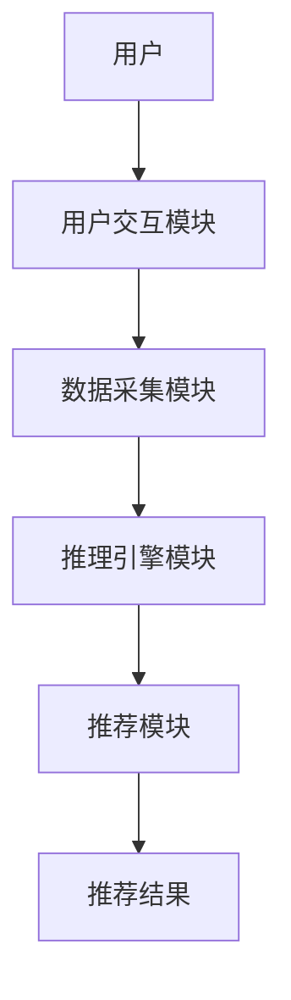

                 


# AI Agent在智能衣柜中的衣物搭配建议

> 关键词：AI Agent, 智能衣柜, 衣物搭配, 人工智能, 推荐系统

> 摘要：本文探讨了AI Agent在智能衣柜中的应用，分析了衣物搭配的核心问题，详细讲解了AI Agent的工作原理、推荐算法、系统架构，并通过项目实战展示了AI Agent在智能衣柜中的具体应用。文章还提供了最佳实践建议和注意事项，帮助读者更好地理解和应用AI Agent技术。

---

# 第一部分: AI Agent与智能衣柜的背景与概念

## 第1章: AI Agent与智能衣柜概述

### 1.1 AI Agent的基本概念

#### 1.1.1 AI Agent的定义
AI Agent（人工智能代理）是指能够感知环境、做出决策并执行任务的智能体。AI Agent的核心在于其自主性、反应性和目标导向性。

#### 1.1.2 AI Agent的核心特征
- **自主性**：能够在没有外部干预的情况下自主运行。
- **反应性**：能够感知环境并实时做出反应。
- **目标导向性**：通过设定目标来指导行为和决策。

#### 1.1.3 AI Agent与传统算法的区别
传统算法依赖于预定义的规则，而AI Agent具有学习和适应能力，能够根据环境变化优化自身行为。

### 1.2 智能衣柜的定义与现状

#### 1.2.1 智能衣柜的概念
智能衣柜是一种结合了物联网和人工智能技术的智能服装存储和管理设备，能够通过传感器和AI算法为用户提供智能化的衣物管理和服务。

#### 1.2.2 智能衣柜的发展历程
- **初始阶段**：简单的衣物分类和存储。
- **发展阶段**：引入传感器和基本的自动化功能。
- **智能化阶段**：结合AI技术，实现衣物搭配和推荐。

#### 1.2.3 智能衣柜的市场现状
随着AI技术的快速发展，智能衣柜逐渐从概念走向市场，成为智能家居的重要组成部分。

### 1.3 衣物搭配问题的复杂性

#### 1.3.1 衣物搭配的基本原理
衣物搭配需要考虑颜色、款式、材质、场合等多个因素，是一个复杂的组合优化问题。

#### 1.3.2 影响衣物搭配的主要因素
- **颜色匹配**：不同颜色的组合需要协调统一。
- **款式搭配**：不同款式的衣物需要协调搭配。
- **材质搭配**：不同材质的衣物需要考虑搭配效果。
- **场合需求**：不同场合需要不同的搭配方案。

#### 1.3.3 衣物搭配问题的挑战与难点
- **个性化需求**：每个人的审美和需求不同。
- **数据复杂性**：需要处理大量的衣物信息和用户偏好。
- **动态变化**：用户的偏好和时尚趋势不断变化。

### 1.4 AI Agent在衣物搭配中的作用

#### 1.4.1 AI Agent如何辅助衣物搭配
- **数据采集**：通过传感器和摄像头采集衣物信息。
- **智能推荐**：基于用户偏好和数据进行衣物搭配推荐。
- **动态优化**：根据用户的反馈不断优化推荐结果。

#### 1.4.2 AI Agent在智能衣柜中的应用场景
- **个性化推荐**：根据用户的穿衣风格推荐搭配方案。
- **季节性调整**：根据天气变化推荐合适的衣物。
- **时尚趋势**：根据流行趋势推荐搭配方案。

#### 1.4.3 AI Agent的优势与局限性
- **优势**：高效、精准、个性化。
- **局限性**：依赖数据质量、计算资源有限、用户接受度问题。

### 1.5 本章小结
本章介绍了AI Agent的基本概念、智能衣柜的发展历程、衣物搭配的复杂性以及AI Agent在其中的作用。接下来将深入探讨AI Agent的核心原理与算法。

---

## 第2章: AI Agent的核心原理与算法

### 2.1 AI Agent的核心原理

#### 2.1.1 数据采集与处理
AI Agent通过传感器和摄像头采集衣物的颜色、款式、材质等信息，并将这些信息进行结构化处理。

#### 2.1.2 智能衣柜的数据特征分析
- **颜色特征**：RGB值。
- **款式特征**：服装类型（如衬衫、裤子）。
- **材质特征**：布料类型（如棉、麻）。
- **用户特征**：用户的穿衣风格、体型、肤色等。

#### 2.1.3 衣物搭配的推理过程
AI Agent通过推理引擎分析衣物之间的关系，生成搭配方案。

#### 2.1.4 决策与执行
AI Agent根据推理结果生成推荐方案，并通过执行模块输出结果。

### 2.2 AI Agent的决策与执行

#### 2.2.1 决策算法的基本原理
决策算法基于用户偏好和衣物特征，通过计算相似度和关联度生成推荐方案。

#### 2.2.2 决策过程中的权重分配
根据用户的偏好和场景需求，动态调整各个因素的权重。

#### 2.2.3 决策结果的优化与调整
通过反馈机制优化推荐结果，提高推荐的准确性和满意度。

### 2.3 AI Agent的反馈与学习

#### 2.3.1 用户反馈的采集与分析
AI Agent通过用户反馈调整推荐策略，优化推荐结果。

#### 2.3.2 基于反馈的模型优化
通过机器学习算法更新模型参数，提高推荐的准确性。

#### 2.3.3 模型的持续学习与进化
AI Agent通过持续学习不断提升推荐能力，适应用户的动态需求。

### 2.4 衣物搭配的核心算法

#### 2.4.1 基于协同过滤的推荐算法
协同过滤是一种基于用户相似性或物品相似性的推荐算法。

#### 2.4.2 基于内容的推荐算法
基于内容的推荐算法通过分析衣物的特征进行推荐。

#### 2.4.3 混合推荐模型
结合协同过滤和基于内容的推荐算法，构建混合推荐模型。

---

## 第3章: 系统架构与项目实战

### 3.1 系统架构设计

#### 3.1.1 系统功能设计
- **数据采集模块**：采集衣物信息和用户偏好。
- **推理引擎模块**：进行衣物搭配推理。
- **推荐模块**：生成推荐方案。
- **用户交互模块**：与用户进行交互。

#### 3.1.2 系统架构图


### 3.2 项目实战

#### 3.2.1 环境安装
- **Python**：安装Python 3.8及以上版本。
- **库依赖**：安装numpy、pandas、scikit-learn等库。

#### 3.2.2 系统核心实现源代码
```python
import numpy as np
from sklearn.metrics.pairwise import cosine_similarity

# 示例数据：衣物特征矩阵
X = np.array([[0.2, 0.5, 0.3],
              [0.6, 0.2, 0.2],
              [0.1, 0.8, 0.1]])

# 计算余弦相似度
similarity = cosine_similarity(X)
print(similarity)
```

#### 3.2.3 功能解读与分析
上述代码通过计算衣物特征矩阵的余弦相似度，生成衣物之间的相似度矩阵，为推荐算法提供数据支持。

### 3.3 实际案例分析

#### 3.3.1 案例背景
假设用户拥有一件白色衬衫和一条蓝色裤子，AI Agent需要为用户推荐搭配方案。

#### 3.3.2 推荐过程
AI Agent通过分析白色衬衫和蓝色裤子的相似度，推荐搭配一条黑色西装裤和一件深蓝色外套。

### 3.4 项目小结
本章通过系统架构设计和项目实战，展示了AI Agent在智能衣柜中的具体应用。接下来将总结最佳实践建议和注意事项。

---

## 第4章: 最佳实践与注意事项

### 4.1 最佳实践 tips
- **数据质量**：确保数据的准确性和完整性。
- **模型优化**：定期更新模型参数，提高推荐准确性。
- **用户体验**：注重用户交互设计，提升用户体验。

### 4.2 小结
本文详细介绍了AI Agent在智能衣柜中的应用，从基本概念到算法实现，再到系统架构和项目实战，为读者提供了全面的视角。

### 4.3 注意事项
- **数据隐私**：保护用户的隐私数据。
- **计算资源**：确保系统有足够的计算资源。
- **用户接受度**：关注用户对AI Agent的接受度和满意度。

### 4.4 拓展阅读
- **推荐系统**：深入学习推荐系统的各种算法。
- **人工智能**：探索人工智能在其他领域的应用。

---

通过本文的详细讲解，读者可以全面理解AI Agent在智能衣柜中的衣物搭配建议，并能够将其应用到实际项目中。

