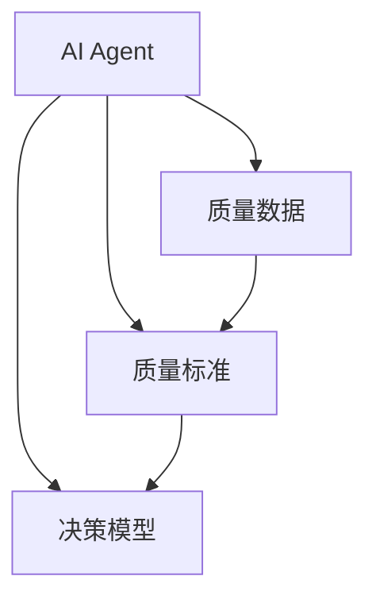
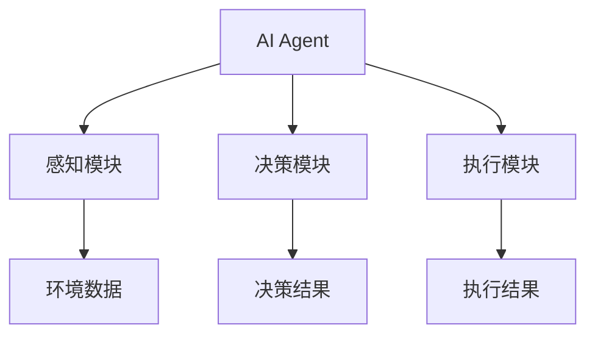

                 


# AI Agent在智能质量控制中的应用

> 关键词：AI Agent，智能质量控制，算法原理，系统架构，项目实战，质量优化

> 摘要：本文详细探讨了AI Agent在智能质量控制中的应用，从基本概念到算法原理，再到系统架构和项目实战，全面解析了AI Agent如何提升质量控制的效率和准确性。文章通过丰富的图表和详细的代码示例，帮助读者理解AI Agent在质量控制中的核心作用，并提供了实际案例和最佳实践建议。

---

## 第一章: AI Agent与智能质量控制概述

### 1.1 AI Agent的基本概念
#### 1.1.1 什么是AI Agent
AI Agent（人工智能代理）是一种能够感知环境、自主决策并执行任务的智能实体。它通过传感器获取信息，利用算法进行分析，并通过执行器完成目标。AI Agent的核心在于其智能性和自主性，能够适应复杂多变的环境。

#### 1.1.2 AI Agent的核心特征
- **自主性**：AI Agent能够在没有外部干预的情况下独立运行。
- **反应性**：能够实时感知环境变化并做出响应。
- **目标导向**：具有明确的目标，能够优化决策以实现目标。
- **学习能力**：通过机器学习算法不断优化自身性能。

#### 1.1.3 AI Agent的分类与应用场景
- **简单反射型**：基于规则的反应式AI Agent，适用于简单的决策场景。
- **基于模型的反应型**：利用内部模型进行推理和决策，适用于复杂环境。
- **目标驱动型**：以目标为导向，通过规划实现目标。
- **实用驱动型**：以效用函数为驱动，通过优化实现目标。

应用场景包括工业自动化、智能监控、机器人控制等领域。

---

### 1.2 智能质量控制的背景与意义
#### 1.2.1 质量控制的传统方法与挑战
传统质量控制依赖人工检查和固定规则，存在效率低、成本高、适应性差的问题。随着生产复杂度的增加，传统方法难以满足现代化生产的需求。

#### 1.2.2 智能化质量控制的必要性
智能化质量控制能够通过AI技术实现自动化、实时化和精准化的质量监控，显著提升生产效率和产品质量。

#### 1.2.3 AI Agent在质量控制中的优势
- **高效性**：AI Agent能够快速处理大量数据，实现实时监控。
- **准确性**：通过机器学习算法，AI Agent能够识别复杂质量问题。
- **适应性**：能够根据环境变化自动调整策略。

---

### 1.3 AI Agent与质量控制的结合
#### 1.3.1 AI Agent在质量控制中的角色
AI Agent作为智能质量控制的核心，负责数据采集、分析、决策和执行。

#### 1.3.2 AI Agent如何提升质量控制效率
通过实时数据分析和智能决策，AI Agent能够快速识别问题并优化生产流程。

#### 1.3.3 AI Agent与传统质量控制方法的对比
| 对比维度       | AI Agent                         | 传统方法                     |
|----------------|----------------------------------|------------------------------|
| 数据处理能力   | 强大的机器学习能力               | 依赖固定规则                 |
| 灵活性          | 高，能够适应复杂环境             | 低，适应性差                 |
| 效率            | 高，快速响应                     | 低，依赖人工干预             |

---

## 第二章: AI Agent的核心概念与联系

### 2.1 AI Agent的核心概念
#### 2.1.1 AI Agent的感知机制
AI Agent通过传感器或数据接口获取环境信息，如图像、声音、温度等。感知机制是AI Agent与环境交互的基础。

#### 2.1.2 AI Agent的决策机制
基于感知到的信息，AI Agent利用算法进行分析和推理，制定最优决策。

#### 2.1.3 AI Agent的执行机制
通过执行器或系统接口，AI Agent将决策结果转化为具体动作，如调整设备参数、发出警报等。

---

### 2.2 AI Agent的核心属性特征对比
| 属性         | AI Agent                          | 传统自动化                  |
|--------------|-----------------------------------|-----------------------------|
| 智能性        | 高，具备学习和推理能力            | 低，依赖预设规则             |
| 灵活性        | 高，能够适应变化                 | 低，固定流程                 |
| 决策能力      | 强，基于数据驱动决策             | 弱，基于固定逻辑             |

---

### 2.3 AI Agent的ER实体关系图


---

## 第三章: AI Agent的算法原理与数学模型

### 3.1 AI Agent的算法原理
#### 3.1.1 感知算法
感知算法用于从环境中获取信息并进行特征提取。常用算法包括卷积神经网络（CNN）和循环神经网络（RNN）。

#### 3.1.2 决策算法
决策算法基于感知到的信息进行分析，常用算法包括决策树、随机森林和深度学习模型。

#### 3.1.3 执行算法
执行算法将决策结果转化为具体动作，通常涉及优化算法如遗传算法和模拟退火。

---

### 3.2 AI Agent的数学模型
#### 3.2.1 感知模型
$$ P(y|x) = \frac{P(x|y)P(y)}{P(x)} $$
其中，$P(y|x)$表示给定输入$x$时输出$y$的概率。

#### 3.2.2 决策模型
$$ Q(a|s) = \max_a \sum_{s'} P(s'|a) Q(s') $$
其中，$Q(a|s)$表示在状态$s$下选择动作$a$的最优值。

#### 3.2.3 执行模型
$$ R = \sum_{t=1}^{T} r_t $$
其中，$R$表示累积奖励，$r_t$表示第$t$步的奖励。

---

## 第四章: AI Agent的系统架构设计

### 4.1 系统架构设计
#### 4.1.1 系统架构图


#### 4.1.2 系统功能模块
- **感知模块**：负责数据采集和特征提取。
- **决策模块**：负责分析数据并制定决策。
- **执行模块**：负责执行决策并反馈结果。

---

## 第五章: AI Agent的项目实战

### 5.1 项目环境配置
#### 5.1.1 环境安装
安装Python、TensorFlow、Keras等工具。

#### 5.1.2 核心代码实现
```python
import numpy as np
from tensorflow.keras.models import Sequential
from tensorflow.keras.layers import Dense, Conv2D, MaxPooling2D, Flatten

# 感知模型
model = Sequential([
    Conv2D(32, (3,3), activation='relu', input_shape=(64,64,3)),
    MaxPooling2D((2,2)),
    Flatten(),
    Dense(128, activation='relu'),
    Dense(1, activation='sigmoid')
])

model.compile(optimizer='adam', loss='binary_crossentropy', metrics=['accuracy'])
model.fit(x_train, y_train, epochs=10, batch_size=32)
```

---

## 第六章: 总结与展望

### 6.1 最佳实践
- 选择适合的AI框架，如TensorFlow或PyTorch。
- 数据预处理是关键，确保数据质量和多样性。
- 定期更新模型，以适应环境变化。

### 6.2 小结
本文详细探讨了AI Agent在智能质量控制中的应用，从理论到实践，全面解析了其核心概念、算法原理和系统架构。通过实际案例，展示了AI Agent在提升质量控制效率和准确性方面的巨大潜力。

### 6.3 注意事项
- 数据隐私和安全问题需要高度重视。
- 确保模型的可解释性，便于问题排查。
- 定期维护和优化模型，确保其稳定性和性能。

### 6.4 拓展阅读
- 《强化学习：算法与应用》
- 《深度学习与计算机视觉》
- 《智能系统架构设计》

---

通过本文的学习，读者可以全面理解AI Agent在智能质量控制中的应用，并能够将其应用到实际项目中，推动质量控制的智能化和高效化。

