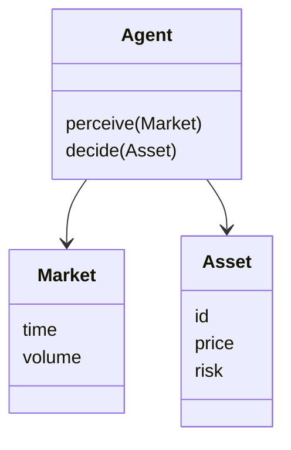
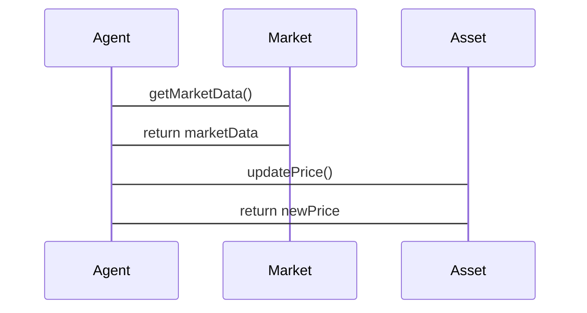

                 


# AI Agent在智能资产定价模型中的应用

> 关键词：AI Agent, 智能资产定价, 机器学习, 强化学习, 系统架构设计, 金融模型, 数学建模

> 摘要：本文探讨AI Agent在智能资产定价模型中的应用，从概念、算法、系统设计到实战案例，全面解析如何利用AI Agent提升资产定价的准确性和效率。通过详细分析，本文展示了如何结合强化学习和监督学习等算法，构建高效的定价模型，并通过系统架构设计确保模型的可扩展性和稳定性。

---

# 第一部分: AI Agent与智能资产定价模型的背景与基础

## 第1章: AI Agent与智能资产定价模型概述

### 1.1 AI Agent的基本概念

#### 1.1.1 AI Agent的定义与分类
AI Agent（人工智能代理）是指能够感知环境、自主决策并执行任务的智能实体。根据功能和智能水平，AI Agent可以分为以下几类：
- **反应式Agent**：基于当前感知做出反应，适用于简单环境。
- **认知式Agent**：具备推理、规划能力，适用于复杂环境。
- **学习式Agent**：能够通过经验改进性能。

#### 1.1.2 AI Agent的核心特征
- **自主性**：无需外部干预，自主决策。
- **反应性**：实时感知环境并做出反应。
- **学习能力**：通过数据和经验优化性能。
- **社交能力**：与其他Agent或人类交互协作。

#### 1.1.3 AI Agent在金融领域的应用潜力
在金融领域，AI Agent可以用于实时市场监控、智能投资决策、风险控制等场景，显著提升资产定价的效率和准确性。

### 1.2 智能资产定价模型的背景

#### 1.2.1 资产定价的传统方法
传统资产定价模型（如CAPM、APT）依赖于历史数据和统计分析，但难以捕捉市场动态和非线性关系。

#### 1.2.2 传统定价模型的局限性
- **数据稀疏性**：难以处理小样本数据。
- **非线性关系**：传统模型难以捕捉复杂的市场规律。
- **实时性不足**：无法快速响应市场变化。

#### 1.2.3 智能资产定价的定义与目标
智能资产定价通过AI技术，利用大数据和机器学习算法，动态调整定价策略，目标是提高定价的准确性和实时性。

### 1.3 AI Agent在资产定价中的作用

#### 1.3.1 数据驱动的定价优势
AI Agent能够处理海量非结构化数据，提取有价值的信息，提升定价模型的精度。

#### 1.3.2 AI Agent在复杂市场中的决策能力
通过强化学习和博弈论，AI Agent可以在复杂市场中做出最优决策。

#### 1.3.3 智能资产定价的创新点
- **动态调整**：实时更新定价模型。
- **个性化定价**：根据不同投资者行为定制价格。
- **风险控制**：通过预测市场波动降低风险。

### 1.4 本章小结
本章介绍了AI Agent的基本概念及其在金融领域的应用潜力，分析了传统定价模型的局限性，并提出了智能资产定价的目标和创新点。

---

## 第2章: AI Agent与智能资产定价模型的核心概念

### 2.1 AI Agent的基本原理

#### 2.1.1 知识表示与推理
知识表示是将领域知识转化为计算机可理解的形式，推理是通过逻辑规则得出结论的过程。

#### 2.1.2 行为决策机制
基于感知信息和内部知识，AI Agent选择最优行为。

#### 2.1.3 状态感知与反馈
通过传感器或数据源获取环境信息，并根据反馈调整行为。

### 2.2 智能资产定价模型的构建要素

#### 2.2.1 数据来源与特征提取
- 数据来源：市场数据、公司财报、新闻等。
- 特征提取：通过NLP提取文本特征，通过统计方法提取数值特征。

#### 2.2.2 模型训练与优化
使用机器学习算法训练定价模型，并通过交叉验证优化参数。

#### 2.2.3 模型评估与验证
通过回测和风险指标评估模型性能。

### 2.3 AI Agent与资产定价模型的关系

#### 2.3.1 功能模块的协同作用
AI Agent作为模型的核心，负责数据处理、特征提取和定价决策。

#### 2.3.2 数据流与信息交互
数据流从市场环境流向AI Agent，AI Agent根据数据生成定价策略。

#### 2.3.3 系统整体架构
整体架构包括数据源、AI Agent、定价模型和反馈机制。

### 2.4 核心概念对比表

| **对比维度** | **AI Agent** | **传统定价模型**
|--------------|---------------|-----------------
| 数据处理     | 结构化与非结构化数据 | 主要处理结构化数据 |
| 决策方式     | 自主决策         | 依赖人工规则     |
| 灵活性       | 高             | 低               |

### 2.5 本章小结
本章分析了AI Agent的基本原理，探讨了智能资产定价模型的构建要素，并通过对比分析明确了AI Agent的优势。

---

## 第3章: AI Agent的算法原理与数学模型

### 3.1 AI Agent的核心算法

#### 3.1.1 强化学习算法
- **算法原理**：通过与环境交互，学习最优策略。
- **数学模型**：定义状态、动作、奖励和策略，通过Q-learning更新Q值。

#### 3.1.2 监督学习算法
- **算法原理**：基于标记数据，训练定价模型。
- **数学模型**：通过损失函数优化模型参数。

#### 3.1.3 聚类与分类
- **聚类**：将资产分为不同类别。
- **分类**：预测资产类别或风险等级。

### 3.2 算法实现

#### 3.2.1 强化学习代码示例

```python
import numpy as np
import gym

# 初始化环境
env = gym.make('CartPole-v0')
env.seed(1)

# 策略参数
alpha = 0.01
gamma = 0.99

# 状态空间维度
state_size = env.observation_space.shape[0]
# 动作空间维度
action_size = env.action_space.n

# 初始化策略参数
theta = np.random.randn(state_size, action_size)

def get_action(state):
    return np.argmax(theta.dot(state))

# 训练过程
for episode in range(1000):
    state = env.reset()
    total_reward = 0
    while True:
        action = get_action(state)
        next_state, reward, done, _ = env.step(action)
        # 更新Q值
        theta += alpha * (reward + gamma * np.max(theta.dot(next_state)) - theta.dot(state)) * state
        state = next_state
        total_reward += reward
        if done:
            break
    print(f'Episode {episode}, Reward: {total_reward}')
```

#### 3.2.2 监督学习代码示例

```python
from sklearn.linear_model import LinearRegression

# 数据准备
X = np.random.rand(100, 1) * 10
y = 2 * X + 1 + np.random.randn(100, 1)

# 训练模型
model = LinearRegression()
model.fit(X, y)

# 预测
print(model.predict([[5]]))
```

### 3.3 数学模型

#### 3.3.1 强化学习的数学模型
- **状态空间**：S
- **动作空间**：A
- **奖励函数**：R: S × A → ℝ
- **策略**：π: S → A

#### 3.3.2 监督学习的数学模型
- **损失函数**：L(y, y_hat)
- **优化目标**：min L(y, y_hat)

### 3.4 本章小结
本章详细介绍了AI Agent的核心算法，包括强化学习和监督学习，并通过代码示例展示了算法实现。

---

## 第4章: 系统分析与架构设计方案

### 4.1 问题场景介绍

#### 4.1.1 业务背景
某金融机构希望利用AI技术提升资产定价效率。

#### 4.1.2 需求分析
- 实时定价
- 风险控制
- 数据驱动决策

### 4.2 系统功能设计

#### 4.2.1 领域模型设计



#### 4.2.2 系统架构设计


#### 4.2.3 系统接口设计



### 4.3 本章小结
本章通过系统分析和架构设计，明确了AI Agent在智能资产定价系统中的角色和功能。

---

## 第5章: 项目实战

### 5.1 环境安装

```bash
pip install gym numpy matplotlib scikit-learn
```

### 5.2 核心代码实现

#### 5.2.1 强化学习定价模型

```python
import gym
import numpy as np

class Agent:
    def __init__(self, state_space, action_space):
        self.theta = np.random.randn(state_space, action_space)
    
    def get_action(self, state):
        return np.argmax(self.theta.dot(state))
    
    def update(self, state, action, reward, next_state):
        self.theta += 0.01 * (reward + 0.99 * np.max(self.theta.dot(next_state)) - self.theta.dot(state)) * state

# 初始化环境和代理
env = gym.make('CartPole-v0')
agent = Agent(env.observation_space.shape[0], env.action_space.n)

# 训练过程
for episode in range(1000):
    state = env.reset()
    total_reward = 0
    while True:
        action = agent.get_action(state)
        next_state, reward, done, _ = env.step(action)
        agent.update(state, action, reward, next_state)
        state = next_state
        total_reward += reward
        if done:
            break
    print(f'Episode {episode}, Reward: {total_reward}')
```

#### 5.2.2 监督学习定价模型

```python
from sklearn.linear_model import LinearRegression

# 数据准备
X = np.random.rand(100, 1) * 10
y = 2 * X + 1 + np.random.randn(100, 1)

# 训练模型
model = LinearRegression()
model.fit(X, y)

# 预测
print(model.predict([[5]]))
```

### 5.3 案例分析与详细解读

#### 5.3.1 数据预处理
- 清洗数据：处理缺失值和异常值。
- 特征工程：提取关键特征。

#### 5.3.2 模型训练
- 使用训练数据训练模型。
- 调参优化：通过交叉验证选择最优参数。

#### 5.3.3 模型评估
- 回测：在历史数据上验证模型性能。
- 风险评估：计算VaR、最大回撤等风险指标。

### 5.4 项目小结
本章通过实战案例，展示了如何利用AI Agent构建智能资产定价模型，并通过代码实现和案例分析加深了对模型的理解。

---

## 第6章: 最佳实践与拓展阅读

### 6.1 最佳实践 tips

1. **数据质量**：确保数据的完整性和准确性。
2. **模型解释性**：选择可解释的模型，便于分析和优化。
3. **实时性优化**：采用流处理技术，提升实时性。

### 6.2 小结
AI Agent在智能资产定价中的应用前景广阔，通过算法优化和系统设计，可以显著提升定价效率和准确性。

### 6.3 注意事项

1. **模型风险**：避免过度依赖模型，保持人工监控。
2. **数据隐私**：确保数据安全和合规性。
3. **计算资源**：保证充足的计算资源，支持实时处理。

### 6.4 拓展阅读

- 《强化学习入门》
- 《机器学习实战》
- 《金融风险管理》

---

## 附录: 更多资源与工具

### 附录A: 常用工具

- **Python库**：TensorFlow、PyTorch、Scikit-learn
- **可视化工具**：Matplotlib、Seaborn
- **环境管理**：Anaconda

### 附录B: 参考文献
- Russell, S. J., & Norvig, P. (2010). Artificial Intelligence: A Modern Approach.
- Goodfellow, I., Bengio, Y., & Courville, A. (2016). Deep Learning.

---

# 结语

通过本文的详细讲解，读者可以全面了解AI Agent在智能资产定价模型中的应用，并掌握从理论到实践的完整流程。未来，随着AI技术的不断发展，AI Agent将在金融领域发挥更大的作用。

