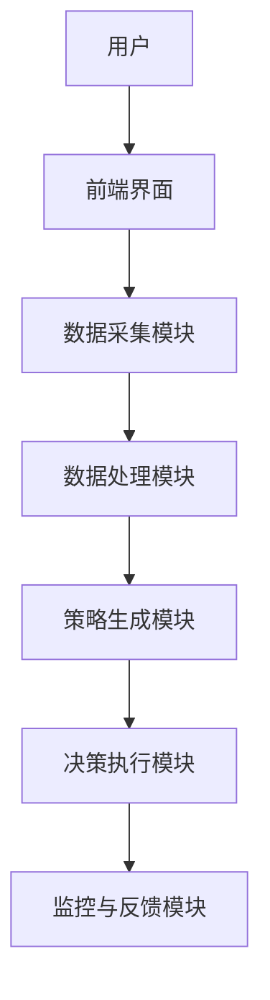
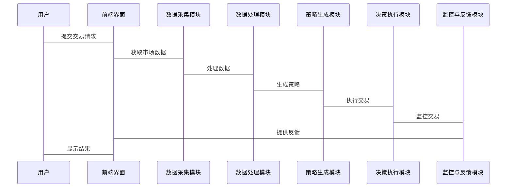
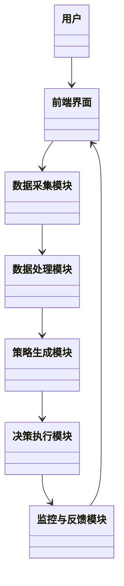

                 


# AI Agent在智能资产管理中的实践

## 关键词：AI Agent, 智能资产管理, 算法原理, 系统架构, 项目实战

## 摘要：AI Agent作为一种智能实体，正在 revolutionize 资产管理行业。本文详细探讨了AI Agent在智能资产管理中的应用，从背景、核心概念、算法原理到系统设计和项目实战，为读者提供了全面的解析。

---

## 第一章: AI Agent与智能资产管理概述

### 1.1 AI Agent的基本概念

#### 1.1.1 什么是AI Agent
AI Agent（智能体）是能够感知环境并采取行动以实现目标的实体。在资产管理中，AI Agent通过分析市场数据，执行交易决策，优化投资组合。

#### 1.1.2 AI Agent的核心特征
- **自主性**：无需外部干预，自主决策。
- **反应性**：实时感知环境变化，及时响应。
- **目标导向**：所有行动基于明确的目标。

#### 1.1.3 AI Agent在资产管理中的作用
- 数据处理：分析市场数据，识别投资机会。
- 自动交易：执行买卖指令，优化投资组合。
- 风险管理：识别并规避潜在风险。

### 1.2 智能资产管理的背景与挑战

#### 1.2.1 资产管理的传统模式
依赖人工分析，决策过程耗时且容易受主观因素影响，难以应对市场波动。

#### 1.2.2 数字化转型的驱动因素
技术进步、数据量增加和投资者需求变化推动资产管理行业向智能化转型。

#### 1.2.3 当前资产管理中的主要挑战
- **数据复杂性**：海量数据处理难度大。
- **决策速度**：需要快速响应市场变化。
- **风险管理**：需实时监控并应对风险。

### 1.3 AI Agent在资产管理中的应用前景

#### 1.3.1 AI Agent的优势
- **高效决策**：快速处理数据，做出最优决策。
- **24/7运行**：全天候监控市场，不错过任何机会。
- **适应性**：能够根据市场变化自适应调整策略。

#### 1.3.2 应用场景分析
- **股票交易**：实时监控市场，自动执行交易。
- **风险管理**：实时监控投资组合，识别潜在风险。
- **组合优化**：根据市场变化，动态调整投资组合。

#### 1.3.3 未来发展趋势
AI Agent将更加智能化、自主化，并与区块链等技术结合，推动资产管理行业进入新纪元。

---

## 第二章: AI Agent的核心概念与联系

### 2.1 AI Agent的定义与分类

#### 2.1.1 AI Agent的定义
AI Agent是能够感知环境并采取行动以实现目标的智能实体。

#### 2.1.2 基于智能水平的分类
- **反应式AI Agent**：根据当前感知做出反应，不依赖历史数据。
- **认知式AI Agent**：具备推理和规划能力，能够处理复杂任务。

#### 2.1.3 基于应用场景的分类
- **交易型AI Agent**：专注于执行交易。
- **管理型AI Agent**：负责整体投资组合管理。
- **风险型AI Agent**：专注于风险管理。

### 2.2 AI Agent的核心能力

#### 2.2.1 感知能力
AI Agent通过传感器或API获取市场数据，如价格、成交量等。

#### 2.2.2 学习能力
通过机器学习算法，AI Agent能够从历史数据中学习，提升决策能力。

#### 2.2.3 决策能力
基于感知数据和学习成果，AI Agent制定最优决策。

#### 2.2.4 执行能力
AI Agent能够通过API或其他接口，执行交易指令。

### 2.3 AI Agent的工作原理

#### 2.3.1 信息感知
AI Agent通过数据接口获取市场数据，如股票价格、市场新闻等。

#### 2.3.2 知识表示
将市场数据转化为知识，如关联分析、趋势预测。

#### 2.3.3 战略规划
基于知识表示，AI Agent制定投资策略。

#### 2.3.4 执行控制
根据策略，AI Agent执行交易指令，并监控执行情况。

### 2.4 AI Agent与传统自动化系统的区别

#### 2.4.1 智能性对比
AI Agent具备学习和推理能力，而传统系统仅执行预设指令。

#### 2.4.2 自适应能力对比
AI Agent能够根据环境变化调整策略，传统系统则固定不变。

#### 2.4.3 交互方式对比
AI Agent能够与人类交互，理解并执行复杂任务，而传统系统仅执行预设任务。

### 2.5 本章小结

---

## 第三章: AI Agent的算法原理

### 3.1 基于规则的AI Agent算法

#### 3.1.1 算法原理
基于预设规则，如“如果价格下跌，卖出股票”，AI Agent做出决策。

#### 3.1.2 算法实现
```python
def rule_based_decision(price, trend):
    if trend == 'down' and price < 100:
        return 'sell'
    elif trend == 'up' and price > 200:
        return 'buy'
    else:
        return 'hold'
```

#### 3.1.3 实例分析
当股票价格低于100且趋势为下降时，AI Agent发出卖出指令。

### 3.2 基于模型的AI Agent算法

#### 3.2.1 算法原理
利用统计模型或机器学习模型，预测市场走势，做出决策。

#### 3.2.2 算法实现
```python
from sklearn.linear_model import LinearRegression

model = LinearRegression()
model.fit(X, y)
prediction = model.predict(new_data)
```

#### 3.2.3 实例分析
使用线性回归模型预测股票价格走势，指导投资决策。

### 3.3 基于强化学习的AI Agent算法

#### 3.3.1 算法原理
通过试错学习，AI Agent在与环境的交互中优化决策策略。

#### 3.3.2 算法实现
```python
def q_learning(state, action, reward, next_state):
    current_q = q_table[state][action]
    next_max_q = max(q_table[next_state])
    new_q = current_q + learning_rate * (reward + discount_factor * next_max_q - current_q)
    q_table[state][action] = new_q
```

#### 3.3.3 实例分析
使用Q-learning算法，AI Agent在股票交易中学习最优策略，最大化收益。

### 3.4 算法对比与选择

#### 3.4.1 各种算法的优缺点
| 算法类型 | 优点 | 缺点 |
|----------|------|------|
| 基于规则 | 简单易懂，可解释性高 | 无法应对复杂市场情况 |
| 基于模型 | 高准确性，适合趋势分析 | 需大量数据，计算复杂 |
| 强化学习 | 自适应性强，适合动态环境 | 需大量试验，计算资源消耗大 |

#### 3.4.2 算法选择的依据
- 数据量：强化学习需要大量数据，而规则型算法数据需求较低。
- 环境复杂度：复杂环境适合强化学习，简单环境适合基于规则的算法。
- 计算资源：强化学习需要更多计算资源。

#### 3.4.3 实际应用中的权衡
在实际应用中，通常会结合多种算法，形成混合策略，以提高准确性和鲁棒性。

### 3.5 本章小结

---

## 第四章: AI Agent在智能资产管理中的系统设计

### 4.1 系统功能模块划分

#### 4.1.1 数据采集模块
- 负责收集市场数据，如股票价格、新闻等。

#### 4.1.2 数据处理模块
- 对采集的数据进行清洗、转换和特征提取。

#### 4.1.3 策略生成模块
- 根据数据分析结果，生成交易策略。

#### 4.1.4 决策执行模块
- 根据生成的策略，执行交易指令。

#### 4.1.5 监控与反馈模块
- 监控交易执行情况，提供反馈信息，优化策略。

### 4.2 系统架构设计

#### 4.2.1 系统架构图


#### 4.2.2 系统接口设计
- **API接口**：用于数据采集和交易执行。
- **用户界面**：供用户查看和管理交易策略。

#### 4.2.3 系统交互流程图


### 4.3 系统功能设计

#### 4.3.1 领域模型类图


### 4.4 系统架构设计

#### 4.4.1 系统架构图


#### 4.4.2 系统接口设计
- **数据接口**：与数据源（如API）连接，获取市场数据。
- **交易接口**：与交易系统连接，执行交易指令。
- **用户界面**：供用户管理策略和查看结果。

#### 4.4.3 系统交互流程图


### 4.5 本章小结

---

## 第五章: 项目实战

### 5.1 环境安装

#### 5.1.1 安装Python
```bash
python --version
pip install --upgrade pip
```

#### 5.1.2 安装依赖库
```bash
pip install numpy pandas scikit-learn matplotlib
```

### 5.2 系统核心实现

#### 5.2.1 核心代码实现
```python
import numpy as np
import pandas as pd
from sklearn.linear_model import LinearRegression

# 数据处理模块
def process_data(data):
    # 数据预处理代码
    return processed_data

# 策略生成模块
model = LinearRegression()
processed_data = process_data(data)
model.fit(processed_data[['price', 'volume']], processed_data['label'])
predictions = model.predict(new_data)

# 决策执行模块
def execute_trade(prediction):
    if prediction > 0.5:
        return 'buy'
    elif prediction < 0.5:
        return 'sell'
    else:
        return 'hold'

# 监控与反馈模块
def monitor_trade(trade_result):
    # 监控代码
    pass
```

#### 5.2.2 代码应用解读与分析
- **数据处理模块**：对原始数据进行清洗和特征提取，确保模型输入数据的质量。
- **策略生成模块**：使用机器学习模型生成交易策略，预测市场走势。
- **决策执行模块**：根据生成的策略，执行具体的交易操作。
- **监控与反馈模块**：监控交易执行情况，提供反馈信息，优化后续决策。

### 5.3 实际案例分析

#### 5.3.1 股票交易系统案例
```python
# 示例代码
data = pd.read_csv('stock_data.csv')
processed_data = process_data(data)
model.fit(processed_data[['open', 'high', 'low']], processed_data['close'])
predictions = model.predict(new_data[['open', 'high', 'low']])
action = execute_trade(predictions)
print(f"交易指令：{action}")
```

#### 5.3.2 案例分析与解读
通过实际案例分析，展示了AI Agent如何在股票交易中应用，以及如何根据市场变化优化交易策略。

### 5.4 项目小结

---

## 第六章: 总结与展望

### 6.1 最佳实践 tips

#### 6.1.1 算法选择
根据具体应用场景和数据量选择合适的算法，避免过度复杂化。

#### 6.1.2 数据质量
确保数据的准确性和完整性，数据预处理是关键。

#### 6.1.3 模型解释性
选择可解释的模型，便于分析和优化。

#### 6.1.4 模型更新
定期更新模型，确保其适应市场变化。

#### 6.1.5 风险管理
建立有效的风险管理机制，控制交易风险。

### 6.2 小结

AI Agent在智能资产管理中的应用前景广阔，通过合理选择算法和系统设计，能够显著提升投资效率和收益。

### 6.3 注意事项

- **数据隐私**：确保数据处理符合隐私保护法规。
- **模型解释性**：选择可解释的模型，便于分析和优化。
- **风险管理**：建立有效的风险管理机制，控制交易风险。

### 6.4 拓展阅读

#### 6.4.1 推荐书籍
- 《机器学习实战》
- 《Python机器学习》

#### 6.4.2 推荐在线资源
- [Towards Data Science](https://towardsdatascience.com/)
- [Kaggle](https://www.kaggle.com/)

---

## 附录

### 附录A: AI Agent算法实现代码

```python
# 附录A: 基于规则的AI Agent实现
def rule_based_strategy(price, volume):
    if price > 100 and volume > 1000:
        return 'buy'
    elif price < 90 and volume < 500:
        return 'sell'
    else:
        return 'hold'

# 附录B: 基于强化学习的AI Agent实现
def q_learning_example():
    import numpy as np
    np.random.seed(1)
    env = TradingEnvironment()
    agent = QLearningAgent(env.observation_space, env.action_space)
    for episode in range(1000):
        state = env.reset()
        while True:
            action = agent.act(state)
            next_state, reward, done = env.step(action)
            agent.remember(state, action, reward, next_state, done)
            agent.replay()
            if done:
                break
            state = next_state
```

### 附录B: 图表解释

#### 附录B.1: AI Agent工作流程图


#### 附录B.2: 系统架构图


---

通过以上详细的章节内容，您可以深入了解AI Agent在智能资产管理中的实践应用。每个部分都提供了丰富的细节和实际案例，帮助您全面掌握相关知识。

