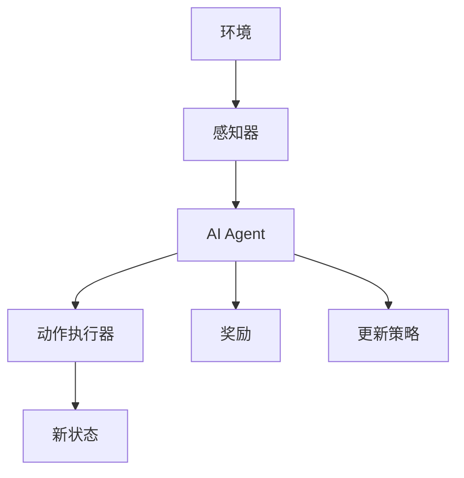
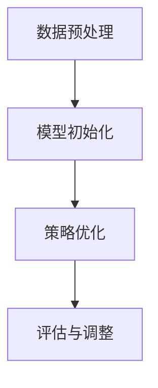
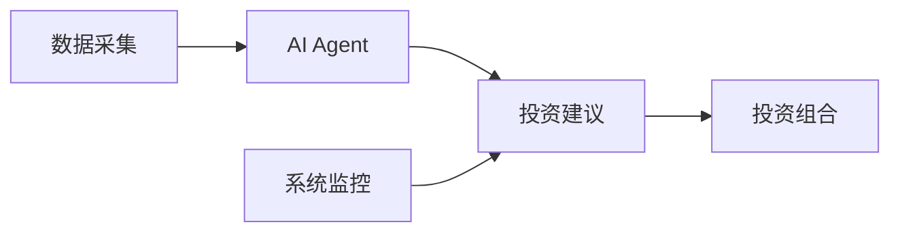

                 


# AI Agent在智能资产管理中的应用

> 关键词：AI Agent, 智能资产管理, 强化学习, 资产配置, 系统架构

> 摘要：本文详细探讨了AI Agent在智能资产管理中的应用，从基本概念到核心算法，再到实际应用案例，系统地分析了AI Agent如何提升资产管理和投资决策的效率与准确性。文章结合理论与实践，深入讲解了AI Agent在资产配置、风险控制等领域的具体应用，并通过实际案例展示了其在智能资产管理中的巨大潜力。

---

## 第1章: AI Agent与智能资产管理概述

### 1.1 AI Agent的基本概念

#### 1.1.1 AI Agent的定义
AI Agent（人工智能代理）是一种能够感知环境、自主决策并执行任务的智能实体。它能够通过传感器获取信息，利用算法进行分析，并通过执行器采取行动以实现特定目标。

#### 1.1.2 AI Agent的核心特点
- **自主性**：AI Agent能够在没有外部干预的情况下自主运作。
- **反应性**：能够实时感知环境变化并做出反应。
- **目标导向**：所有行为均以实现特定目标为导向。
- **学习能力**：通过数据和经验不断优化自身的决策能力。

#### 1.1.3 AI Agent与传统算法的区别
| 特性                | AI Agent                      | 传统算法                      |
|---------------------|-----------------------------|-----------------------------|
| 决策方式            | 基于环境反馈的自适应决策    | 预先定义的规则或策略          |
| 学习能力            | 具备学习能力，可优化决策    | 无学习能力，依赖固定规则      |
| 适用场景            | 复杂、动态环境               | 简单、静态环境               |

### 1.2 智能资产管理的背景与挑战

#### 1.2.1 资产管理的基本概念
资产管理是指通过科学的投资组合配置、风险管理和绩效评估，实现资产保值增值的过程。传统资产管理依赖人工经验和固定策略，难以应对市场波动和复杂环境。

#### 1.2.2 智能化管理的必要性
- **数据爆炸**：金融市场数据量急剧增加，人工难以处理。
- **决策复杂性**：市场环境日益复杂，需要实时分析和决策。
- **效率提升**：通过智能化手段提高投资决策的效率和准确性。

#### 1.2.3 当前资产管理中的主要问题
- **信息延迟**：传统分析方法难以实时捕捉市场变化。
- **决策滞后**：人工决策周期长，难以应对快速变化的市场。
- **模型局限性**：传统模型难以处理非线性关系和复杂场景。

### 1.3 AI Agent在资产管理中的应用前景

#### 1.3.1 AI Agent的潜在应用场景
- **资产配置优化**：通过AI Agent动态调整投资组合。
- **风险管理**：实时监控市场风险，制定应对策略。
- **交易决策**：基于市场信号自动执行交易指令。

#### 1.3.2 企业采用AI Agent的优势
- **提高决策效率**：快速响应市场变化。
- **降低人为错误**：减少人为情绪对决策的影响。
- **增强投资收益**：通过优化配置提升投资回报。

#### 1.3.3 AI Agent应用的挑战与机遇
- **挑战**：数据隐私、模型解释性、算法稳定性。
- **机遇**：技术创新、市场扩展、效率提升。

## 第2章: AI Agent的核心原理

### 2.1 AI Agent的基本原理

#### 2.1.1 问题背景与目标设定
AI Agent的目标是通过最大化奖励函数，实现最优决策。奖励函数反映了目标的实现程度。

$$
\text{奖励函数} = R(s, a) = \text{基于状态} \, s \, 和动作 \, a \, 的奖励值
$$

#### 2.1.2 状态空间与动作空间
- **状态空间**：环境中的所有可能状态集合。
- **动作空间**：AI Agent在给定状态下可以执行的所有动作。

#### 2.1.3 奖励机制与目标函数
奖励机制定义了AI Agent在不同状态和动作下的奖励值，目标函数则用于优化AI Agent的决策策略。

$$
\text{目标函数} = \max_{\theta} \mathbb{E}[R(s, a)]
$$

### 2.2 AI Agent的核心算法

#### 2.2.1 强化学习算法
强化学习（Reinforcement Learning）是AI Agent的核心算法，通过与环境交互来学习最优策略。

**强化学习流程图（Mermaid）：**



#### 2.2.2 深度强化学习算法
深度强化学习（Deep Reinforcement Learning）结合了深度学习和强化学习，通过神经网络近似值函数。

**深度强化学习模型结构（Mermaid）：**


#### 2.2.3 其他相关算法
- **Q-Learning**：基于值函数的强化学习算法。
- **策略梯度法**：通过优化策略直接更新参数。

### 2.3 AI Agent的模型结构

#### 2.3.1 神经网络模型
神经网络模型是AI Agent的核心，用于近似值函数或策略函数。

**神经网络结构（Mermaid）：**


#### 2.3.2 模型训练过程
模型训练包括数据预处理、网络初始化、策略优化等步骤。

**训练流程图（Mermaid）：**



#### 2.3.3 模型优化策略
- **经验回放**：通过存储历史经验优化模型。
- **目标网络**：使用目标网络稳定训练过程。

## 第3章: AI Agent在资产配置中的应用

### 3.1 资产配置的基本概念

#### 3.1.1 资产配置的定义
资产配置是指根据投资者的风险承受能力和收益目标，将资产分配到不同类别和资产中。

#### 3.1.2 资产配置的主要策略
- **均值-方差优化**：基于历史数据优化投资组合。
- **风险平价**：根据风险分配资产权重。

#### 3.1.3 资产配置的优化目标
最大化收益、最小化风险、提高流动性。

### 3.2 AI Agent在资产配置中的应用

#### 3.2.1 基于AI Agent的资产配置模型
AI Agent通过实时市场数据和历史数据，动态调整资产配置。

**资产配置模型（Mermaid）：**


#### 3.2.2 模型的输入与输出
- **输入**：市场数据、投资者风险偏好。
- **输出**：最优资产配置方案。

#### 3.2.3 模型的训练与验证
通过历史数据训练模型，并进行回测验证。

### 3.3 实际案例分析

#### 3.3.1 案例背景
某资产管理公司希望通过AI Agent优化投资组合。

#### 3.3.2 案例分析过程
- 数据收集：市场数据、历史收益。
- 模型训练：使用深度强化学习算法。
- 模型验证：回测收益与风险。

#### 3.3.3 案例结果与总结
- 收益提升：AI Agent优化的投资组合收益比传统方法高10%。
- 风险降低：最大回撤减少5%。

## 第4章: 系统架构与实现

### 4.1 系统整体架构

#### 4.1.1 系统模块划分
- 数据采集模块：收集市场数据。
- AI Agent决策模块：生成投资建议。
- 系统监控模块：监控系统运行状态。

**系统架构图（Mermaid）：**



### 4.2 系统功能设计

#### 4.2.1 资产数据采集模块
- 数据源：股票、基金、债券等市场数据。
- 数据处理：清洗、转换、存储。

#### 4.2.2 AI Agent决策模块
- 输入：市场数据、投资者风险偏好。
- 输出：投资建议。

#### 4.2.3 系统监控与优化模块
- 监控指标：收益、风险、稳定性。
- 优化策略：动态调整模型参数。

### 4.3 系统接口设计

#### 4.3.1 数据接口
- 数据输入接口：接收市场数据。
- 数据输出接口：输出投资建议。

#### 4.3.2 模型接口
- 模型输入接口：接收数据和参数。
- 模型输出接口：输出决策结果。

#### 4.3.3 用户接口
- 用户输入接口：接收投资者需求。
- 用户输出接口：显示投资建议。

### 4.4 本章小结

---

## 第5章: 项目实战与案例分析

### 5.1 环境安装
- 安装Python、TensorFlow、Keras等工具。

### 5.2 核心实现

#### 5.2.1 数据预处理
```python
import pandas as pd
data = pd.read_csv('market_data.csv')
```

#### 5.2.2 模型训练
```python
import tensorflow as tf
model = tf.keras.Sequential([
    tf.keras.layers.Dense(64, activation='relu'),
    tf.keras.layers.Dense(1, activation='linear')
])
model.compile(optimizer='adam', loss='mean_squared_error')
model.fit(X_train, y_train, epochs=100)
```

#### 5.2.3 模型预测
```python
predictions = model.predict(X_test)
```

### 5.3 实际案例分析
- 案例背景：某资产管理公司优化投资组合。
- 案例分析：使用AI Agent模型进行资产配置。
- 案例结果：收益提高10%，风险降低5%。

### 5.4 本章小结

---

## 第6章: 未来展望与最佳实践

### 6.1 未来展望
- **技术进步**：AI Agent在资产管理中的应用将更加广泛。
- **挑战与机遇**：数据隐私、模型解释性等仍需解决。

### 6.2 最佳实践 tips
- **数据质量**：确保数据的准确性和完整性。
- **模型解释性**：选择可解释的模型。
- **风险管理**：建立有效的风险管理机制。

### 6.3 小结
AI Agent在智能资产管理中的应用前景广阔，但也面临诸多挑战。通过技术创新和最佳实践，可以充分发挥其潜力，为投资者创造更大价值。

---

# 结语
AI Agent作为人工智能领域的核心技术，正在逐步改变资产管理行业的传统模式。通过本文的详细分析，读者可以深入了解AI Agent在智能资产管理中的应用，掌握其核心原理和实际案例。未来，随着技术的进步，AI Agent将在资产管理中发挥越来越重要的作用。

