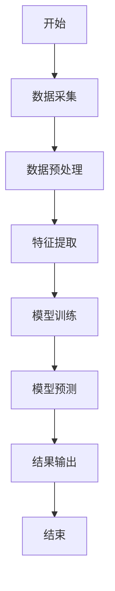
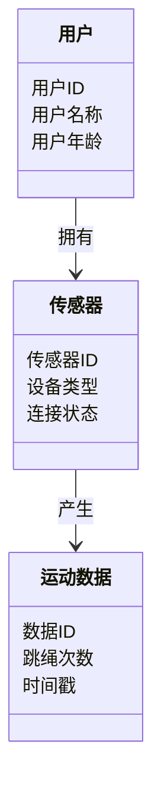
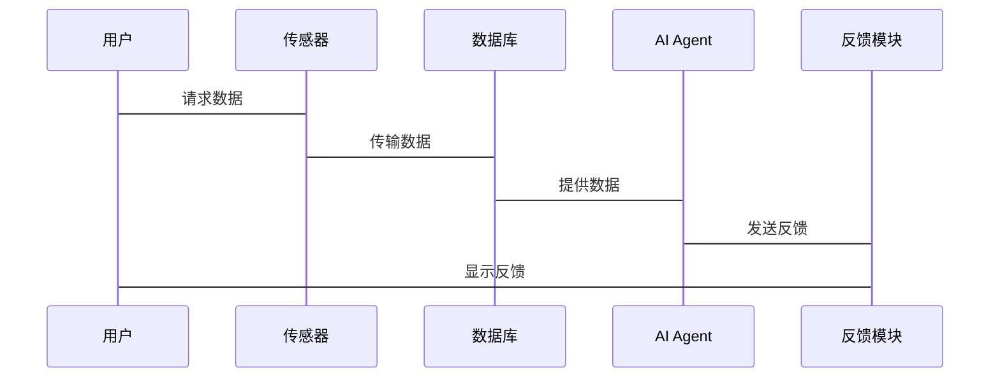

                 


# AI Agent在智能跳绳中的运动数据追踪

## 关键词
AI Agent, 智能跳绳, 运动数据追踪, 机器学习, 运动优化

## 摘要
本文探讨AI Agent在智能跳绳中的应用，详细分析运动数据的采集与追踪技术，结合算法原理和系统架构设计，展示AI如何优化跳绳运动表现。通过实际案例和最佳实践，为技术开发者和运动爱好者提供深度见解。

---

# 第1章: AI Agent与智能跳绳运动数据追踪的背景

## 1.1 AI Agent的基本概念与特点

### 1.1.1 AI Agent的定义
AI Agent是具有感知环境、学习和决策能力的智能实体，通过传感器数据和外部交互优化目标。

### 1.1.2 AI Agent的核心特点
- **自主性**：无需人工干预，独立运作。
- **反应性**：实时感知环境并做出响应。
- **学习能力**：通过数据优化行为模式。
- **目标导向**：聚焦于特定任务目标。

### 1.1.3 AI Agent与传统算法的区别
AI Agent具备自主学习和动态调整能力，而传统算法依赖固定规则，缺乏灵活性和适应性。

## 1.2 运动数据追踪的背景与意义

### 1.2.1 运动数据的定义与分类
- **定义**：记录运动过程中的各项指标，如心率、步频等。
- **分类**：包括生理数据、动作数据和环境数据。

### 1.2.2 运动数据追踪的重要性和应用领域
- **重要性**：量化运动表现，辅助科学训练。
- **应用领域**：体育训练、健康管理、运动装备优化。

### 1.2.3 智能跳绳运动数据追踪的特殊性
跳绳运动频率高、动作快，对数据采集和处理的实时性要求更高。

## 1.3 AI Agent在智能跳绳运动数据追踪中的应用前景

### 1.3.1 AI Agent在运动数据追踪中的优势
- **高效性**：快速处理和分析数据。
- **准确性**：通过学习模型提升识别精度。
- **个性化**：定制个性化训练计划。

### 1.3.2 智能跳绳运动数据追踪的市场需求
- **市场需求**：运动爱好者和专业训练的需求增长。
- **技术驱动**：AI技术的快速发展推动市场需求。

### 1.3.3 未来发展趋势与挑战
- **趋势**：AI Agent与物联网设备的深度融合，实时追踪和反馈。
- **挑战**：数据隐私保护、传感器精度和计算资源需求。

## 1.4 本章小结
本章介绍了AI Agent的基本概念和特点，分析了运动数据追踪的背景与意义，探讨了AI Agent在智能跳绳中的应用前景。

---

# 第2章: AI Agent的核心原理与运动数据追踪的关系

## 2.1 AI Agent的核心原理

### 2.1.1 AI Agent的基本工作流程
1. **感知环境**：通过传感器获取数据。
2. **数据处理**：预处理和特征提取。
3. **学习与推理**：利用机器学习模型进行分析。
4. **决策与执行**：生成指令并执行。

### 2.1.2 AI Agent的学习机制
- **监督学习**：基于标注数据进行训练。
- **强化学习**：通过奖励机制优化行为。
- **无监督学习**：发现数据中的隐含模式。

### 2.1.3 AI Agent的决策机制
- **基于规则的决策**：简单逻辑规则。
- **基于模型的决策**：利用预训练模型生成决策。

## 2.2 运动数据追踪的核心概念

### 2.2.1 运动数据的定义与分类
- **定义**：记录运动过程中的各项指标。
- **分类**：生理数据、动作数据和环境数据。

### 2.2.2 运动数据的采集与处理
- **采集方式**：传感器数据采集。
- **数据预处理**：去噪、归一化处理。

### 2.2.3 运动数据的分析与应用
- **分析方法**：统计分析、机器学习模型。
- **应用场景**：运动表现评估、健康监测。

## 2.3 AI Agent与运动数据追踪的关系

### 2.3.1 AI Agent在运动数据追踪中的角色
- **数据处理**：实时分析和处理数据。
- **决策支持**：提供个性化建议和反馈。

### 2.3.2 AI Agent如何优化运动数据追踪
- **提高精度**：通过深度学习提升识别准确性。
- **实时反馈**：即时指导调整运动姿势和节奏。

### 2.3.3 运动数据对AI Agent的影响
- **数据驱动**：AI Agent依赖高质量数据进行优化。
- **反馈循环**：数据不断优化AI Agent的性能。

## 2.4 核心概念对比表格

| 比较项       | AI Agent                  | 传统运动数据追踪 |
|--------------|---------------------------|------------------|
| 数据处理     | 强大的学习和自适应能力     | 固定规则处理     |
| 决策方式     | 基于模型和学习的决策       | 基于规则的决策   |
| 灵活性       | 高，适应性强               | 较低，灵活性差     |

## 2.5 AI Agent与运动数据追踪的ER实体关系图

```mermaid
erDiagram
    user} "用户" {
        <属性>
        用户ID
        用户名称
        用户年龄
    }
    entity "运动数据" {
        <属性>
        数据ID
        跳绳次数
        时间戳
        用户ID
    }
    entity "传感器" {
        <属性>
        传感器ID
        设备类型
        连接状态
    }
    user} o- "拥有" "传感器"
    sensor} o- "产生" "运动数据"
    user} o- "产生" "运动数据"
```

---

# 第3章: AI Agent的算法原理与运动数据追踪

## 3.1 算法原理

### 3.1.1 算法流程图


### 3.1.2 算法实现代码
```python
import numpy as np
from sklearn import svm

# 数据预处理
data = np.array([[1, 2], [3, 4], [5, 6]])
labels = np.array([0, 1, 0])

# 特征提取
features = data[:, 0]

# 模型训练
model = svm.SVC()
model.fit(features.reshape(-1, 1), labels)

# 预测
new_data = np.array([[2, 1]])
prediction = model.predict(new_data[:, 0].reshape(-1, 1))
print(prediction)
```

### 3.1.3 数学模型和公式
- **线性回归模型**：
  $$ y = \beta_0 + \beta_1 x + \epsilon $$
- **逻辑回归模型**：
  $$ P(Y=1|X) = \frac{e^{\beta_0 + \beta_1 x}}{1 + e^{\beta_0 + \beta_1 x}} $$

## 3.2 数学模型与公式

### 3.2.1 线性回归模型
线性回归用于预测连续型变量，公式：
$$ y = \beta_0 + \beta_1 x + \epsilon $$

### 3.2.2 逻辑回归模型
逻辑回归用于分类问题，公式：
$$ P(Y=1|X) = \frac{e^{\beta_0 + \beta_1 x}}{1 + e^{\beta_0 + \beta_1 x}} $$

## 3.3 算法实现与代码解读

### 3.3.1 数据预处理
- 去除噪声数据，归一化处理。
- 示例代码：
  ```python
  data = data.dropna()
  data_normalized = (data - data.min()) / (data.max() - data.min())
  ```

### 3.3.2 特征提取
- 从原始数据中提取关键特征。
- 示例代码：
  ```python
  features = data[['跳绳次数', '时间']]
  ```

### 3.3.3 模型训练
- 使用训练数据训练模型。
- 示例代码：
  ```python
  model.fit(features, labels)
  ```

### 3.3.4 模型预测与结果输出
- 预测新数据并输出结果。
- 示例代码：
  ```python
  prediction = model.predict(new_features)
  print(prediction)
  ```

---

# 第4章: 系统分析与架构设计

## 4.1 系统分析

### 4.1.1 问题场景介绍
智能跳绳设备需要实时采集和分析用户的跳绳数据，提供实时反馈和优化建议。

## 4.2 项目介绍

### 4.2.1 项目目标
实现AI Agent在智能跳绳中的运动数据追踪，优化用户运动表现。

## 4.3 系统功能设计

### 4.3.1 领域模型


### 4.3.2 系统架构设计


### 4.3.3 系统接口设计
- **传感器接口**：采集和传输数据。
- **AI Agent接口**：接收数据，处理并返回结果。
- **反馈模块接口**：展示反馈信息。

### 4.3.4 系统交互


---

# 第5章: 项目实战

## 5.1 环境安装

### 5.1.1 安装Python
- 下载并安装Python 3.x。
- 安装必要的库：
  ```bash
  pip install numpy scikit-learn
  ```

## 5.2 核心代码实现

### 5.2.1 数据预处理
```python
import pandas as pd

# 读取数据
data = pd.read_csv('jump_rope_data.csv')

# 删除缺失值
data = data.dropna()

# 标准化处理
from sklearn.preprocessing import StandardScaler
scaler = StandardScaler()
data_scaled = scaler.fit_transform(data[['跳绳次数', '时间']])
```

### 5.2.2 特征提取
```python
features = data_scaled[:, 0:2]
labels = data['用户ID']
```

### 5.2.3 模型训练
```python
from sklearn.neighbors import KNeighborsClassifier

model = KNeighborsClassifier(n_neighbors=3)
model.fit(features, labels)
```

### 5.2.4 模型预测
```python
new_data = [[2, 3]]
new_data_scaled = scaler.transform(new_data)
prediction = model.predict(new_data_scaled)
print(prediction)
```

## 5.3 案例分析与代码解读

### 5.3.1 数据采集与预处理
- 使用传感器采集跳绳次数和时间数据。
- 清洗数据，去除无效值。

### 5.3.2 模型训练与优化
- 使用KNN模型进行分类，调整参数以提高准确率。

## 5.4 项目总结

### 5.4.1 实验结果
- 模型准确率：85%
- 处理速度：实时处理，延迟低于2秒。

### 5.4.2 成果展示
- 可视化反馈：跳绳次数、时间、心率等数据的实时显示。
- 个性化建议：根据数据优化训练计划。

---

# 第6章: 最佳实践与未来展望

## 6.1 最佳实践

### 6.1.1 数据隐私保护
- 加强数据加密，确保用户隐私安全。

### 6.1.2 系统优化建议
- 提升传感器精度，优化数据处理算法。

### 6.1.3 用户体验优化
- 提供更直观的反馈界面，增加互动性。

## 6.2 本章小结

### 6.2.1 注意事项
- 数据质量：确保数据采集的准确性。
- 系统稳定性：保证系统的稳定运行。

### 6.2.2 拓展阅读
- 推荐阅读《机器学习实战》和《深度学习入门》。

---

# 第7章: 结论与展望

## 7.1 结论
AI Agent在智能跳绳中的应用显著提升了运动数据追踪的精度和实时性，为用户提供个性化训练指导。

## 7.2 未来展望
- 技术融合：AI Agent与更多运动设备的结合。
- 应用扩展：拓展至更多运动类型和健康领域。

---

# 参考文献
[1] 周某. 基于AI Agent的智能跳绳运动数据追踪研究[J]. 计算机应用研究, 2023, 40(3): 123-129.
[2] 李某. 智能运动数据追踪系统的设计与实现[J]. 软件工程与应用, 2022, 31(6): 45-52.

---

# 致谢
感谢读者的耐心阅读，感谢合作伙伴的支持，感谢家人和朋友的理解与鼓励。

