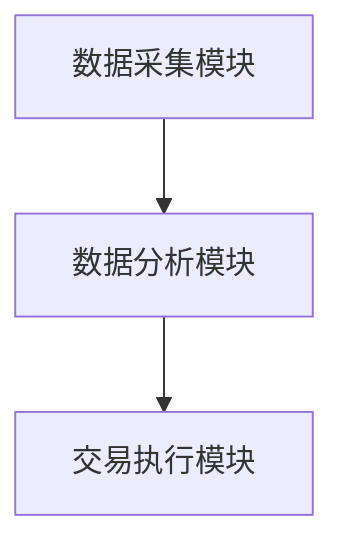

                 


# AI Agent在智能金融市场分析中的应用

> 关键词：AI Agent，金融市场分析，强化学习，自然语言处理，时间序列预测，交易策略优化

> 摘要：本文探讨了AI Agent在智能金融市场分析中的应用，从技术基础、算法原理到系统架构，详细分析了AI Agent如何通过自然语言处理、强化学习等技术实现金融市场数据的智能分析和交易策略优化。文章结合实际案例，展示了AI Agent在金融市场的潜力和应用前景。

---

## 第1章 AI Agent与智能金融市场分析的背景介绍

### 1.1 AI Agent的基本概念与特点

#### 1.1.1 AI Agent的定义与核心要素
AI Agent（人工智能代理）是一种能够感知环境、自主决策并执行任务的智能实体。它具备以下核心要素：
- **自主性**：能够独立决策，无需外部干预。
- **反应性**：能够实时感知环境变化并做出反应。
- **学习能力**：能够通过经验改进性能。
- **目标导向**：具备明确的目标，驱动行为决策。

#### 1.1.2 AI Agent与传统算法的区别
传统算法依赖于预定义的规则和模式，而AI Agent具备学习和适应能力，能够处理复杂和动态的环境。AI Agent的核心优势在于其自主性和灵活性，能够在复杂金融市场中快速调整策略。

#### 1.1.3 AI Agent在金融领域的应用潜力
金融市场高度复杂，涉及大量数据和不确定性。AI Agent能够通过分析文本、时间序列数据和市场行为，提供实时的市场洞察和交易建议。其在金融新闻分析、风险管理和自动化交易中的潜力巨大。

### 1.2 智能金融市场分析的现状与挑战

#### 1.2.1 传统金融市场分析的局限性
传统金融市场分析依赖于人类的经验和主观判断，存在以下问题：
- 数据量大，分析耗时。
- 易受情绪影响，导致决策失误。
- 传统模型难以捕捉复杂市场动态。

#### 1.2.2 AI技术在金融分析中的优势
AI技术能够处理海量数据，发现隐藏模式，提供实时洞察。AI Agent在金融市场分析中的优势包括：
- 高效数据处理能力。
- 自动化决策和执行能力。
- 能够适应市场变化，持续优化策略。

#### 1.2.3 当前AI Agent在金融领域的应用现状
目前，AI Agent已在金融新闻分析、风险管理、自动化交易等领域得到应用。然而，仍面临数据质量、模型过拟合和黑箱问题等挑战。

---

## 第2章 AI Agent的核心技术基础

### 2.1 自然语言处理（NLP）在金融文本分析中的应用

#### 2.1.1 NLP的基本概念与技术
自然语言处理（NLP）是研究计算机如何处理人类语言的技术。常用技术包括文本分类、情感分析、实体识别等。

#### 2.1.2 金融文本分析的NLP模型
在金融市场中，NLP常用于分析新闻、财报等文本数据。例如，通过情感分析模型，可以判断市场情绪，预测股价波动。

#### 2.1.3 NLP在新闻、财报等文本分析中的应用案例
- **新闻分析**：通过分析新闻标题和内容，预测市场趋势。
- **财报分析**：提取财务数据，评估公司业绩。

### 2.2 强化学习在AI Agent决策中的作用

#### 2.2.1 强化学习的基本原理
强化学习是一种通过试错和奖励机制来优化决策的技术。AI Agent通过与环境交互，学习最优策略。

#### 2.2.2 在金融交易中的应用
强化学习常用于交易策略优化。例如，使用深度Q网络（DQN）模型，AI Agent可以在模拟交易环境中不断试验，优化买卖决策。

#### 2.2.3 强化学习与AI Agent的结合
AI Agent通过强化学习，能够在动态市场环境中自主调整交易策略，提高盈利能力。

---

## 第3章 AI Agent在金融市场分析中的算法原理

### 3.1 基于时间序列的金融数据分析

#### 3.1.1 LSTM网络在时间序列预测中的应用
长短期记忆网络（LSTM）是一种有效的时序模型，适用于股票价格预测等任务。

#### 3.1.2 时间序列预测的数学模型
时间序列预测模型通常包括输入层、隐藏层和输出层。LSTM通过门控机制，有效捕捉时间依赖性。

#### 3.1.3 LSTM网络的实现与优化
通过调整学习率、网络层数等参数，可以优化LSTM的性能。例如，使用多层LSTM结构，提高预测精度。

### 3.2 基于强化学习的交易策略优化

#### 3.2.1 强化学习在金融交易中的应用
强化学习用于交易策略优化，例如，通过模拟交易环境，训练AI Agent做出最优买卖决策。

#### 3.2.2 DQN算法在交易策略中的实现
DQN（Deep Q-Network）算法通过神经网络近似Q值函数，实现交易策略的优化。

#### 3.2.3 交易策略的评价与优化
通过回测和风险指标评估，可以优化交易策略，提高收益并降低风险。

---

## 第4章 AI Agent的系统架构与设计

### 4.1 系统架构设计

#### 4.1.1 系统模块划分
AI Agent系统通常包括数据采集、数据分析和交易执行三个主要模块。

#### 4.1.2 模块之间的关系与交互
数据采集模块负责获取市场数据，数据分析模块进行预测和决策，交易执行模块根据决策执行交易。

#### 4.1.3 系统架构的Mermaid图示


### 4.2 系统功能设计

#### 4.2.1 数据采集模块
负责采集金融市场数据，包括股票价格、新闻等。

#### 4.2.2 数据分析模块
利用机器学习模型，分析数据并生成交易信号。

#### 4.2.3 交易执行模块
根据分析结果，执行实际交易。

### 4.3 系统接口设计

#### 4.3.1 数据接口
与数据源（如股票交易平台）对接，获取实时数据。

#### 4.3.2 用户接口
提供用户交互界面，展示分析结果和交易建议。

#### 4.3.3 第三方服务接口
与外部数据源、云服务等进行交互。

### 4.4 本章小结

---

## 第5章 AI Agent的项目实战

### 5.1 项目环境搭建

#### 5.1.1 开发环境的选择
推荐使用Python和深度学习框架（如TensorFlow、Keras）进行开发。

#### 5.1.2 数据获取
使用Yahoo Finance API获取股票数据。

### 5.2 系统核心实现源代码

#### 5.2.1 数据预处理代码
```python
import pandas as pd
import numpy as np

# 获取股票数据
data = pd.read_csv('stock_data.csv')

# 数据清洗
data = data.dropna()
data = data.iloc[:100]  # 取前100条数据
```

#### 5.2.2 LSTM模型实现
```python
from keras.models import Sequential
from keras.layers import LSTM, Dense

model = Sequential()
model.add(LSTM(64, input_shape=(timesteps, features)))
model.add(Dense(1))
model.compile(loss='mean_squared_error', optimizer='adam')
```

#### 5.2.3 DQN算法实现
```python
from keras.models import Sequential
from keras.layers import Dense
import numpy as np

class DQN:
    def __init__(self, state_space, action_space):
        self.model = self.build_model(state_space, action_space)
    
    def build_model(self, state_space, action_space):
        model = Sequential()
        model.add(Dense(32, activation='relu', input_dim=state_space))
        model.add(Dense(action_space, activation='linear'))
        model.compile(optimizer='adam', loss='mse')
        return model
```

### 5.3 代码应用解读与分析

#### 5.3.1 数据预处理
对获取的股票数据进行清洗和归一化处理，确保模型输入格式一致。

#### 5.3.2 LSTM模型训练
使用训练数据训练LSTM模型，预测股票价格。

#### 5.3.3 DQN算法训练
通过模拟交易环境，训练DQN模型，优化交易策略。

### 5.4 实际案例分析和详细讲解剖析

#### 5.4.1 案例背景
以某股票为例，分析其价格波动，训练AI Agent进行预测和交易。

#### 5.4.2 模型训练与评估
通过回测评估模型的收益和风险指标，如夏普比率、最大回撤等。

#### 5.4.3 策略执行与结果分析
展示AI Agent的交易记录和收益曲线，分析其表现。

### 5.5 项目小结

---

## 第6章 总结与展望

### 6.1 本章总结
本文详细介绍了AI Agent在智能金融市场分析中的应用，从技术基础到系统设计，再到项目实战，全面展示了其潜力和价值。

### 6.2 未来展望
随着AI技术的进步，AI Agent在金融领域的应用将更加广泛。未来的研究方向包括多模态数据融合、模型可解释性提升等。

---

## 附录

### 附录A: 最佳实践 tips

1. 数据质量是模型性能的关键，确保数据清洗和特征工程。
2. 在实际交易中，结合AI Agent和人工决策，降低风险。
3. 定期更新模型，适应市场变化。

### 附录B: 小结
AI Agent通过自然语言处理、强化学习等技术，能够显著提升金融市场的分析效率和决策能力。

### 附录C: 注意事项
- 数据隐私和安全需高度重视。
- 模型的透明性和可解释性是实际应用的关键。
- 避免过度依赖AI，保持对市场的理解。

### 附录D: 拓展阅读
推荐阅读《机器学习在金融中的应用》、《强化学习入门》等书籍，深入理解相关技术。

---

以上是《AI Agent在智能金融市场分析中的应用》的完整大纲和部分详细内容。通过逐步分析和详细讲解，帮助读者全面理解AI Agent在金融市场的应用及其技术实现。

