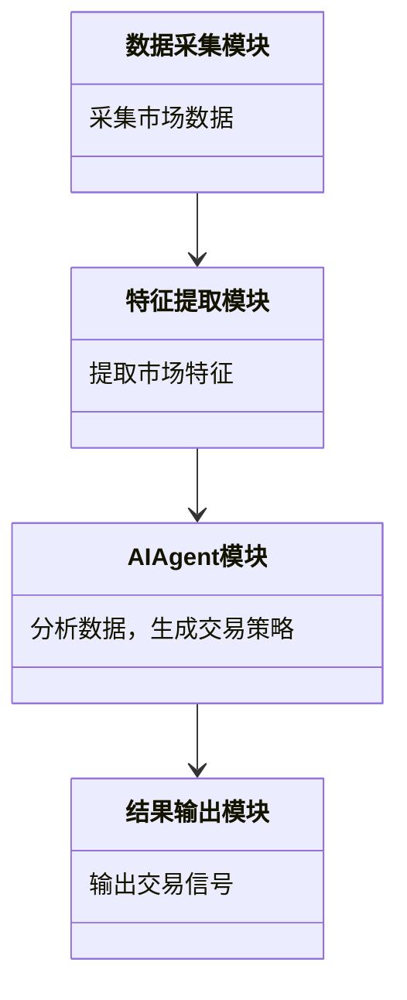
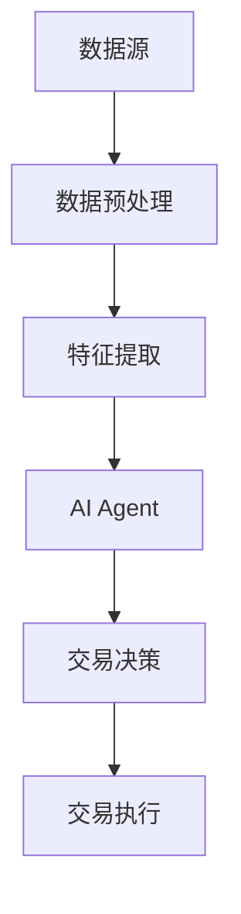
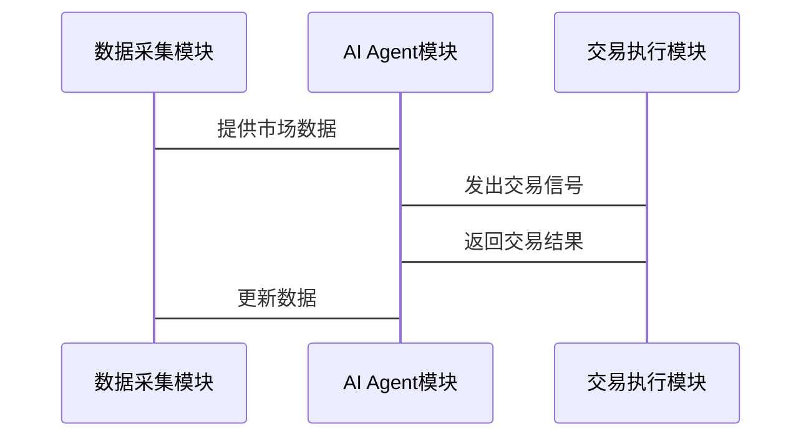

                 


# AI Agent在智能金融市场预测中的应用

> 关键词：AI Agent, 金融市场预测, 强化学习, 深度学习, 多智能体系统

> 摘要：本文探讨AI Agent在智能金融市场预测中的应用，分析其核心概念、算法原理、系统架构设计及实际案例，揭示AI Agent如何通过强化学习、深度学习等技术提升金融市场预测的准确性和效率。

---

# 第1章: AI Agent与智能金融市场的背景介绍

## 1.1 AI Agent的基本概念

### 1.1.1 什么是AI Agent
AI Agent（人工智能代理）是一种能够感知环境、自主决策并执行任务的智能实体。它通过传感器接收信息，利用算法处理数据，做出决策并采取行动。

### 1.1.2 AI Agent的核心特征
- **自主性**：无需外部干预，自主决策。
- **反应性**：实时感知环境变化并做出响应。
- **目标导向**：以目标为导向，优化决策以实现目标。
- **学习能力**：通过经验改进性能。

### 1.1.3 AI Agent与传统算法的区别
| 特性       | AI Agent                          | 传统算法                          |
|------------|-----------------------------------|------------------------------------|
| 自主性      | 高                                | 低                                |
| 环境适应性  | 强                                | 弱                                |
| 决策能力    | 强                                | 依赖预设规则                      |

---

## 1.2 智能金融市场的定义与特点

### 1.2.1 什么是智能金融市场
智能金融市场是利用人工智能技术，通过智能代理进行数据处理、分析和预测的金融交易市场。

### 1.2.2 智能金融市场的核心特征
- **数据驱动**：依赖大数据分析。
- **实时性**：需要快速决策和执行。
- **智能化**：利用AI技术优化交易策略。

### 1.2.3 智能金融市场与传统金融市场的区别
| 特性         | 智能金融市场                | 传统金融市场                |
|--------------|-----------------------------|-----------------------------|
| 决策方式     | AI代理自主决策              | 依赖人工或固定规则          |
| 数据处理     | 高效且实时                  | 程序化处理                  |
| 精准度       | 高，基于复杂模型            | 有限，依赖经验                |

---

## 1.3 AI Agent在智能金融中的应用背景

### 1.3.1 金融市场的复杂性与不确定性
金融市场受到多种因素影响，如经济指标、政策变化等，具有高度不确定性。

### 1.3.2 AI Agent在金融预测中的优势
- **高效性**：快速处理大量数据。
- **精准性**：通过机器学习提高预测准确性。
- **适应性**：能自适应市场变化。

### 1.3.3 当前AI Agent在金融领域的研究现状
AI Agent在股票预测、风险评估等领域应用广泛，但仍有提升空间。

---

## 1.4 本章小结
本章介绍了AI Agent的基本概念、特征及其在智能金融中的应用背景，为后续章节奠定基础。

---

# 第2章: AI Agent的核心概念与原理

## 2.1 AI Agent的组成与功能

### 2.1.1 知识库
存储金融市场数据、历史交易记录等信息。

### 2.1.2 感知模块
通过数据接口获取市场数据，如股票价格、交易量等。

### 2.1.3 决策模块
基于感知数据，利用算法生成交易策略。

### 2.1.4 执行模块
根据决策模块的指令执行交易操作。

---

## 2.2 AI Agent的决策机制

### 2.2.1 基于规则的决策
通过预设规则（如价格突破关键位）做出交易决策。

### 2.2.2 基于机器学习的决策
利用回归、分类等机器学习模型进行预测。

### 2.2.3 基于强化学习的决策
通过试错学习，优化交易策略。

---

## 2.3 AI Agent的通信与协作

### 2.3.1 多智能体系统
多个AI Agent协同工作，共同完成复杂任务。

### 2.3.2 智能体之间的通信协议
定义智能体之间的信息传递规则。

### 2.3.3 智能体协作的挑战与解决方案
- **挑战**：信息过载、协调困难。
- **解决方案**：采用分布式计算和事件驱动机制。

---

## 2.4 AI Agent的数学模型与算法

### 2.4.1 状态空间模型
定义智能体可能的状态，如当前股价、市场情绪等。

### 2.4.2 动作空间模型
定义智能体可执行的动作，如买入、卖出、持有。

### 2.4.3 奖励函数设计
设计合理的奖励机制，引导智能体优化决策。

---

## 2.5 本章小结
本章详细介绍了AI Agent的组成、决策机制、通信协作及数学模型，为后续章节的算法实现奠定基础。

---

# 第3章: AI Agent在金融市场预测中的算法原理

## 3.1 基于强化学习的AI Agent

### 3.1.1 强化学习的基本原理
通过试错学习，智能体在环境中不断尝试，通过奖励机制优化策略。

### 3.1.2 Q-learning算法
- **定义**：智能体通过Q值表记录状态-动作对的价值。
- **公式**：
$$ Q(s,a) = Q(s,a) + \alpha [r + \max Q(s',a')] $$

### 3.1.3 Deep Q-Network (DQN)算法
- **原理**：利用神经网络近似Q值函数。
- **流程图**：如图1所示。


---

## 3.2 基于深度学习的AI Agent

### 3.2.1 卷积神经网络（CNN）
- **应用**：处理图像数据，如K线图。
- **结构**：如图2所示。


### 3.2.2 循环神经网络（RNN）
- **应用**：处理时间序列数据，如历史股价。
- **结构**：如图3所示。


### 3.2.3 变体网络（Transformer）
- **应用**：处理多维度市场数据。

---

## 3.3 基于集成学习的AI Agent

### 3.3.1 Bagging算法
- **原理**：通过 Bootstrap 技术生成多个训练集，集成多个模型的预测结果。

### 3.3.2 Boosting算法
- **原理**：通过加权训练数据，逐步优化模型性能。

### 3.3.3 Stacking算法
- **原理**：通过多层模型进行预测，提高整体准确率。

---

## 3.4 算法的数学模型与公式

### 3.4.1 Q-learning的数学模型
$$ Q(s,a) = Q(s,a) + \alpha [r + \gamma \max Q(s',a')] $$

### 3.4.2 DQN算法的损失函数
$$ \text{损失} = \frac{1}{2} [r + \gamma Q(s',a') - Q(s,a)]^2 $$

---

## 3.5 本章小结
本章详细介绍了AI Agent在金融市场预测中的算法原理，包括强化学习、深度学习和集成学习的方法。

---

# 第4章: AI Agent的系统架构设计

## 4.1 问题场景介绍
金融市场预测系统需要实时处理大量数据，快速做出交易决策。

## 4.2 系统功能设计

### 4.2.1 领域模型类图


## 4.3 系统架构设计

### 4.3.1 系统架构图


### 4.3.2 接口设计
- **输入接口**：接收市场数据。
- **输出接口**：发送交易信号。

## 4.4 系统交互序列图



---

## 4.5 本章小结
本章通过系统架构设计，展示了AI Agent在金融市场预测中的实现方式，包括模块划分和交互流程。

---

# 第5章: AI Agent的项目实战

## 5.1 环境安装

### 5.1.1 安装Python
```bash
python --version
pip install --upgrade pip
```

### 5.1.2 安装依赖库
```bash
pip install numpy pandas scikit-learn tensorflow matplotlib
```

---

## 5.2 系统核心实现源代码

### 5.2.1 数据采集模块
```python
import pandas as pd
import numpy as np

def fetch_data(ticker, start_date, end_date):
    # 模拟数据获取
    data = pd.DataFrame(np.random.randn(100, 4), columns=['open', 'high', 'low', 'close'])
    return data
```

### 5.2.2 AI Agent实现
```python
import tensorflow as tf
from tensorflow.keras import layers

model = tf.keras.Sequential([
    layers.Dense(64, activation='relu'),
    layers.Dense(1, activation='linear')
])
model.compile(optimizer='adam', loss='mse')
```

---

## 5.3 实际案例分析
### 5.3.1 数据分析
分析历史股价数据，提取特征。

### 5.3.2 模型训练
使用历史数据训练AI Agent，优化交易策略。

### 5.3.3 测试与评估
在测试数据上评估模型性能，计算准确率和收益。

---

## 5.4 项目小结
本章通过实战项目，展示了AI Agent在金融市场预测中的具体实现，包括环境配置、代码实现和案例分析。

---

# 第6章: 总结与展望

## 6.1 总结
AI Agent通过强化学习、深度学习等技术，显著提升了金融市场预测的准确性和效率。

## 6.2 展望
未来，AI Agent在金融市场中的应用将更加广泛，技术也将更加成熟，如多智能体协作和边缘计算的应用。

---

## 6.3 最佳实践 Tips
- **数据质量**：确保数据准确、完整。
- **模型优化**：定期更新模型，适应市场变化。
- **风险管理**：制定风险管理策略，控制交易风险。

---

# 结语
AI Agent在智能金融市场预测中的应用前景广阔，随着技术进步，其在金融领域的应用将更加深入和多样化。

--- 

**全文完**

