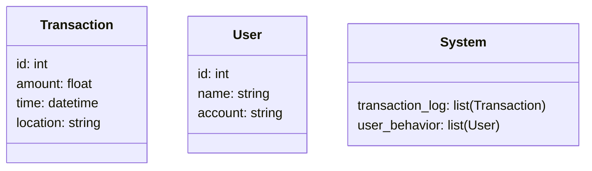
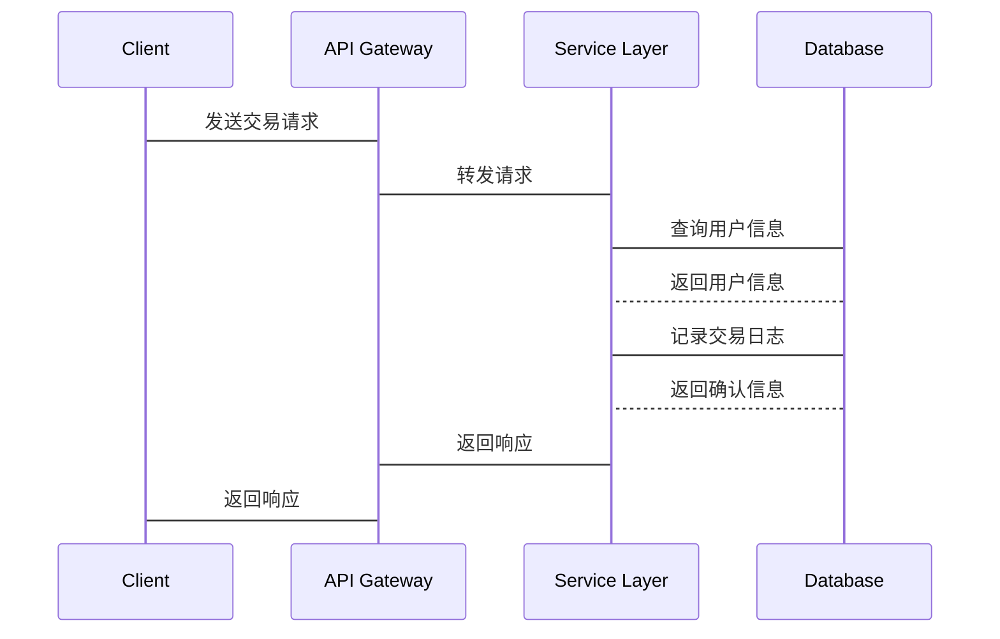

                 


# AI Agent在智能金融欺诈检测中的应用

## 关键词：
AI Agent，金融欺诈检测，机器学习，异常检测，实时监控

## 摘要：
本文详细探讨了AI Agent在智能金融欺诈检测中的应用。首先，介绍了AI Agent的基本概念及其在金融欺诈检测中的重要性。接着，分析了传统金融欺诈检测的局限性，并提出了AI Agent的优势与解决方案。然后，深入讲解了AI Agent的核心算法原理，包括监督学习、无监督学习和强化学习，并通过具体案例展示了这些算法在欺诈检测中的应用。最后，结合实际场景，详细设计了AI Agent驱动的金融欺诈检测系统的架构，并通过代码实现和案例分析，展示了系统的实际应用效果和优化方向。

---

# 第一部分: AI Agent与金融欺诈检测的背景介绍

## 第1章: 问题背景

### 1.1 传统金融欺诈检测的局限性
传统金融欺诈检测主要依赖于规则-based系统和简单统计方法，这些方法在面对日益复杂的欺诈手段时显得力不从心。例如，基于规则的系统难以应对新型欺诈模式，且需要频繁手动调整规则，效率低下。

### 1.2 AI Agent的引入及其优势
AI Agent（智能体）通过自主学习和实时决策，能够有效识别复杂模式和异常行为。AI Agent在金融欺诈检测中的优势包括：
- **实时监控**：能够快速响应交易中的异常行为。
- **自适应性**：通过机器学习模型不断优化检测算法。
- **多模态数据处理**：能够整合交易数据、用户行为数据等多种信息源。

### 1.3 当前金融欺诈检测的挑战与机遇
- **挑战**：欺诈手段多样化、隐蔽性增强，传统方法难以应对。
- **机遇**：AI技术的快速发展为金融欺诈检测提供了新的解决方案。

---

## 第2章: 问题描述

### 2.1 金融欺诈的主要类型
- **信用卡欺诈**：未经授权的交易。
- **洗钱**：通过复杂交易将非法资金合法化。
- ** insider trading**：内部交易操纵市场。

### 2.2 每种欺诈类型的特点与风险
- **信用卡欺诈**：通常表现为短时间内多笔小额交易。
- **洗钱**：交易金额分散，时间跨度长，涉及多个账户。
- ** insider trading**：依赖内部信息，交易行为异常。

### 2.3 数据特征与行为模式分析
- **交易频率**：异常交易往往集中在短时间内。
- **金额大小**：异常交易金额与用户历史交易习惯不符。
- **交易地点**：短时间内多次交易来自不同地理位置。

---

# 第二部分: AI Agent的核心概念与原理

## 第3章: AI Agent的基本原理

### 3.1 AI Agent的定义与分类
- **定义**：AI Agent是一种能够感知环境并采取行动以实现目标的智能体。
- **分类**：
  - **简单反射型**：基于规则的简单反应。
  - **基于模型的反应型**：基于内部模型做出决策。
  - **目标驱动型**：以目标为导向采取行动。

### 3.2 AI Agent在金融欺诈检测中的任务
- **实时监控**：监控交易数据，识别异常行为。
- **异常检测**：通过机器学习模型识别潜在欺诈交易。
- **决策优化**：优化欺诈检测模型的性能。

---

## 第4章: 金融欺诈检测的核心原理

### 4.1 数据采集与特征提取
- **数据源**：交易数据、用户行为数据、地理位置数据。
- **特征提取**：提取交易金额、时间间隔、交易地点等特征。

### 4.2 异常检测算法
- **监督学习**：如逻辑回归、随机森林。
- **无监督学习**：如聚类算法、孤立森林。

### 4.3 预测与决策模型
- **监督学习模型**：用于分类欺诈交易。
- **无监督学习模型**：用于发现异常模式。

---

# 第三部分: AI Agent在金融欺诈检测中的算法原理

## 第5章: 监督学习算法

### 5.1 线性回归与逻辑回归
- **线性回归**：用于预测连续变量。
- **逻辑回归**：用于分类问题，适用于二分类欺诈检测。

### 5.2 支持向量机（SVM）
- **原理**：通过构建超平面将数据分为两类。
- **应用**：适用于高维数据的分类。

### 5.3 随机森林与梯度提升树
- **随机森林**：通过投票机制提高模型鲁棒性。
- **梯度提升树**：通过迭代优化模型性能。

---

## 第6章: 无监督学习算法

### 6.1 K-means聚类
- **原理**：将数据划分为簇，识别异常簇。

### 6.2 DBSCAN密度聚类
- **原理**：基于密度的聚类算法，适用于异常点检测。

### 6.3 Isolation Forest异常检测
- **原理**：通过构建隔离树将异常点隔离出来。

---

## 第7章: 强化学习算法

### 7.1 Q-Learning
- **原理**：通过状态-动作-奖励机制优化决策。

### 7.2 Deep Q-Networks (DQN)
- **原理**：使用深度神经网络近似Q值函数。

### 7.3 策略梯度方法
- **原理**：通过优化策略函数直接更新策略。

---

# 第四部分: 系统分析与架构设计

## 第8章: 问题场景介绍

### 8.1 项目背景
- **目标**：构建一个实时金融欺诈检测系统。
- **需求**：实时性、准确性、可扩展性。

### 8.2 系统功能设计
- **数据采集**：实时采集交易数据。
- **特征提取**：提取交易特征。
- **模型训练**：训练监督学习和无监督学习模型。
- **异常检测**：识别异常交易。
- **决策优化**：优化模型性能。

---

## 第9章: 系统架构设计

### 9.1 领域模型类图


### 9.2 系统架构图


### 9.3 系统接口设计


---

# 第五部分: 项目实战

## 第10章: 环境安装与代码实现

### 10.1 环境安装
```bash
pip install numpy scikit-learn tensorflow
```

### 10.2 核心代码实现
```python
import numpy as np
from sklearn.ensemble import IsolationForest

# 示例数据
X = np.random.randn(100, 2)
outliers = np.random.uniform(low=-4, high=-2, size=(20, 2))
X = np.concatenate([X, outliers])

# 训练模型
model = IsolationForest(contamination=0.2)
model.fit(X)

# 预测异常点
y_pred = model.predict(X)
print(y_pred)
```

### 10.3 代码解读与分析
- **数据准备**：生成正常数据和异常数据。
- **模型训练**：使用Isolation Forest训练模型。
- **异常检测**：通过预测结果识别异常点。

---

## 第11章: 实际案例分析

### 11.1 案例背景
- **用户**：某银行客户。
- **交易记录**：多笔小额交易，短时间内集中发生。

### 11.2 模型预测结果
- **预测结果**：识别出异常交易。
- **决策优化**：调整模型参数以提高准确率。

---

## 第12章: 项目小结

### 12.1 项目总结
- **成果**：成功构建了一个实时金融欺诈检测系统。
- **经验**：AI Agent在金融欺诈检测中具有巨大潜力。

### 12.2 项目优化方向
- **模型优化**：引入更先进的机器学习算法。
- **数据优化**：增加更多维度的数据源。
- **系统优化**：提高系统的实时性和可扩展性。

---

# 第六部分: 最佳实践、小结、注意事项、拓展阅读

## 第13章: 最佳实践 tips

### 13.1 数据处理
- **数据清洗**：处理缺失值和异常值。
- **数据增强**：增加数据的多样性和平衡性。

### 13.2 模型优化
- **超参数调优**：使用网格搜索或随机搜索。
- **模型融合**：结合多种模型的优势。

### 13.3 系统部署
- **微服务架构**：提高系统的可扩展性和维护性。
- **自动化监控**：实时监控系统的性能和异常。

---

## 第14章: 小结

### 14.1 项目总结
通过AI Agent在金融欺诈检测中的应用，我们成功实现了实时监控和异常检测，提高了欺诈检测的准确性和效率。

### 14.2 经验与教训
- **经验**：AI技术的强大能力。
- **教训**：模型的选择和优化至关重要。

---

## 第15章: 注意事项

### 15.1 数据隐私
- **数据加密**：保护用户隐私。
- **合规性**：遵守相关法律法规。

### 15.2 模型解释性
- **可解释性**：确保模型的决策过程可解释。
- **透明性**：提高系统的透明度。

---

## 第16章: 拓展阅读

### 16.1 推荐书籍
- 《Hands-On Machine Learning with Scikit-Learn, Keras, and TensorFlow》
- 《Deep Learning》

### 16.2 推荐博客与资源
- [Towards Data Science](https://towardsdatascience.com)
- [Kaggle](https://www.kaggle.com)

---

# 结语
AI Agent在智能金融欺诈检测中的应用前景广阔，随着技术的不断发展，AI Agent将在金融安全领域发挥越来越重要的作用。

