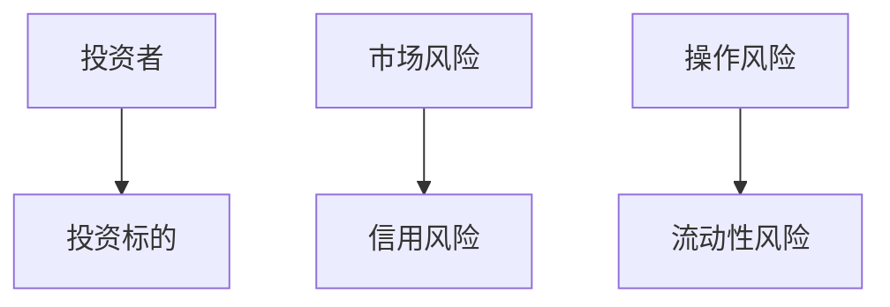
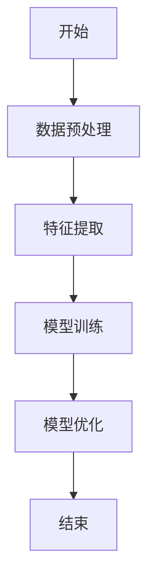

                 

# AI Agent在智能金融风险评估中的应用

> 关键词：AI Agent，金融风险评估，概率论，图论，知识图谱，贝叶斯网络

> 摘要：本文深入探讨了AI Agent在智能金融风险评估中的应用，从核心概念、算法原理、系统架构到项目实战，全面分析了AI Agent如何通过概率论和图论等技术手段，实现对金融风险的智能识别与评估。文章结合实际案例，详细解读了AI Agent在金融领域的优势与挑战，为金融从业者和技术开发者提供了深刻的理论指导和实践参考。

---

## 第1章: AI Agent与金融风险评估的背景

### 1.1 AI Agent的基本概念

#### 1.1.1 AI Agent的定义
AI Agent（人工智能代理）是指能够感知环境、自主决策并执行任务的智能实体。与传统算法不同，AI Agent具有主动性、目标导向性和适应性，能够根据环境反馈动态调整行为。

#### 1.1.2 AI Agent的核心特征
- **主动性**：AI Agent能够主动感知环境并采取行动。
- **目标导向性**：AI Agent的行为以实现特定目标为导向。
- **自主性**：AI Agent能够在无外部干预的情况下完成任务。
- **适应性**：AI Agent能够根据环境变化调整策略。

#### 1.1.3 AI Agent与传统算法的区别
| 特性 | AI Agent | 传统算法 |
|------|-----------|-----------|
| 主动性 | 主动感知环境 | 被动处理数据 |
| 目标导向性 | 以目标为导向 | 以任务为导向 |
| 适应性 | 具有适应性 | 固定规则 |

### 1.2 金融风险评估的基本概念

#### 1.2.1 金融风险的定义
金融风险是指在金融活动中，由于市场波动、信用违约、操作失误等因素导致的损失可能性。

#### 1.2.2 金融风险的主要类型
- **市场风险**：由于市场波动导致的资产价格变化。
- **信用风险**：由于债务人违约导致的损失。
- **流动性风险**：资产难以快速变现的风险。
- **操作风险**：由于人为错误或系统故障导致的风险。

#### 1.2.3 金融风险评估的挑战
- 数据多样性：金融数据涵盖市场、信用、操作等多种类型。
- 数据动态性：金融市场数据实时变化，需要快速响应。
- 数据复杂性：金融风险涉及多维度的复杂关系。

### 1.3 AI Agent在金融领域的应用前景

#### 1.3.1 AI Agent在金融领域的应用场景
- 风险评估：通过AI Agent实时分析市场数据，评估潜在风险。
- 投资决策：AI Agent辅助投资者制定最优投资策略。
- 风险监控：实时监控市场动态，及时发现潜在风险。

#### 1.3.2 金融风险评估中的AI Agent优势
- **实时性**：AI Agent能够实时感知市场变化。
- **智能性**：AI Agent能够自主决策，优化风险评估过程。
- **适应性**：AI Agent能够根据市场变化动态调整评估策略。

#### 1.3.3 AI Agent在金融风险评估中的边界与外延
AI Agent在金融风险评估中的应用边界在于其感知和决策能力，外延则涉及数据源、模型复杂度和决策权限等。

---

## 第2章: AI Agent在金融风险评估中的核心概念

### 2.1 AI Agent的核心原理

#### 2.1.1 知识表示与推理
AI Agent通过知识图谱表示金融领域的知识，并利用推理算法（如逻辑推理和概率推理）进行决策。

#### 2.1.2 行为决策与优化
AI Agent通过强化学习和优化算法（如Q-learning）实现行为决策的优化。

#### 2.1.3 多智能体协同
AI Agent在金融风险评估中需要与多个智能体协同工作，如市场监控智能体和投资决策智能体。

### 2.2 AI Agent与金融风险评估的关系

#### 2.2.1 AI Agent在风险评估中的角色
AI Agent作为风险评估的核心引擎，负责数据处理、模型训练和决策输出。

#### 2.2.2 金融风险评估中的数据流与信息处理
- 数据输入：AI Agent接收金融市场数据、历史数据和实时数据。
- 数据处理：AI Agent对数据进行清洗、特征提取和数据建模。
- 决策输出：AI Agent输出风险评估结果和优化建议。

#### 2.2.3 AI Agent与金融风险评估的系统架构
- **数据层**：数据存储和数据处理。
- **模型层**：AI Agent的算法实现和模型训练。
- **决策层**：风险评估结果和优化建议。

### 2.3 核心概念对比分析

#### 2.3.1 AI Agent与传统统计模型的对比
| 特性 | AI Agent | 传统统计模型 |
|------|-----------|---------------|
| 知识表示 | 基于知识图谱 | 基于统计特征 |
| 决策能力 | 具有自主决策能力 | 依赖人工干预 |
| 灵活性 | 高度灵活 | 较低灵活性 |

#### 2.3.2 不同AI Agent算法的特征对比
| 算法 | 基于概率论 | 基于图论 | 基于强化学习 |
|------|------------|------------|---------------|
| 核心原理 | 贝叶斯网络 | 图嵌入 | Q-learning |
| 优势 | 概率推理能力强 | 图结构表示能力强 | 决策优化能力强 |

#### 2.3.3 金融风险评估中的实体关系图

---

## 第3章: AI Agent的核心算法原理

### 3.1 基于概率论的AI Agent算法

#### 3.1.1 贝叶斯网络在AI Agent中的应用
贝叶斯网络是一种有向无环图，用于表示变量之间的概率关系。在金融风险评估中，贝叶斯网络可以用于预测市场波动和信用违约概率。

**数学模型：**
$$ P(A|B) = \frac{P(B|A)P(A)}{P(B)} $$

#### 3.1.2 马尔可夫决策过程的数学模型
马尔可夫决策过程（MDP）用于描述AI Agent在不确定环境中的决策过程。其数学模型包括状态、动作、奖励和转移概率。

**数学模型：**
$$ V(s) = r + \gamma \max_{a} V(s') $$

#### 3.1.3 隐马尔可夫模型的实现原理
隐马尔可夫模型（HMM）用于处理序列数据，常用于时间序列金融数据分析。

**数学模型：**
$$ P(Y|X) = \prod_{t=1}^{n} P(y_t|x_t) $$
$$ P(X) = \prod_{t=1}^{n} P(x_t|x_{t-1}) $$

### 3.2 基于图论的AI Agent算法

#### 3.2.1 知识图谱的构建与表示
知识图谱通过实体和关系构建金融领域的知识网络，用于支持AI Agent的推理和决策。

#### 3.2.2 图嵌入算法的原理与实现
图嵌入算法将图结构转化为低维向量表示，用于支持AI Agent的特征提取和模型训练。

**数学模型：**
$$ E(v_i) = f(v_i) $$

#### 3.2.3 图神经网络在AI Agent中的应用
图神经网络（GNN）用于处理图结构数据，常用于金融风险评估中的关联分析。

**数学模型：**
$$ h_v = \text{AGGREGATE}(\{h_u | u \in N(v)\}) $$

### 3.3 算法流程图

---

## 第4章: 数学模型与公式

### 4.1 概率论基础

#### 4.1.1 贝叶斯定理
贝叶斯定理用于计算条件概率，公式如下：
$$ P(A|B) = \frac{P(B|A)P(A)}{P(B)} $$

#### 4.1.2 马尔可夫链
马尔可夫链描述了状态转移的过程，公式如下：
$$ P(s_{t+1} | s_t) $$

---

通过以上章节的分析与讲解，我们可以看到AI Agent在智能金融风险评估中的应用具有广阔前景。AI Agent通过结合概率论、图论和强化学习等技术手段，能够有效提高金融风险评估的准确性和实时性。

