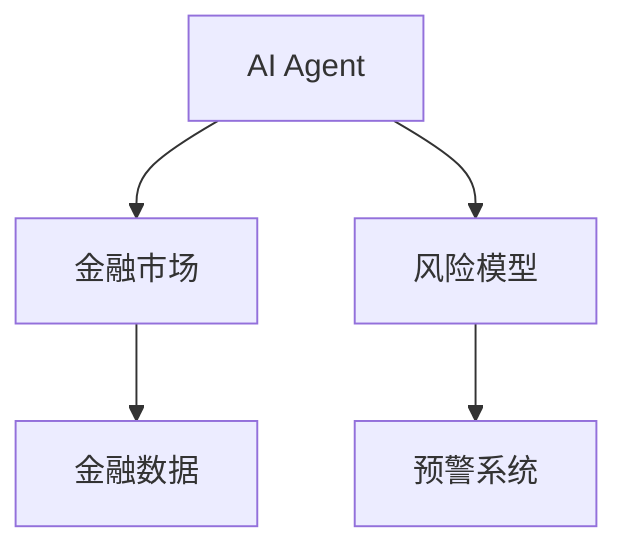

                 


# AI Agent在智能金融风险预警中的应用

> 关键词：AI Agent, 金融风险预警, 机器学习, LSTM网络, 异常检测, 系统架构

> 摘要：随着人工智能技术的迅速发展，AI Agent在金融领域的应用越来越广泛。本文详细探讨了AI Agent在智能金融风险预警中的应用，从理论基础到实际应用，结合具体的算法原理和系统架构设计，分析了AI Agent在金融风险预警中的优势和挑战，并通过实际案例展示了其在金融风险预警中的实际应用效果。

---

## 第一部分: AI Agent与智能金融风险预警的背景介绍

### 第1章: AI Agent与金融风险预警概述

#### 1.1 AI Agent的基本概念

AI Agent，即人工智能代理，是指在计算机系统中，通过感知环境、自主决策并采取行动以实现特定目标的实体。AI Agent的核心特征包括自主性、反应性、目标导向性和社会性。在金融领域，AI Agent可以用于数据采集、风险评估、决策优化等任务。

#### 1.2 金融风险预警的背景与挑战

金融风险预警是指通过分析金融市场中的各种数据，预测潜在的金融风险，并采取相应的措施以降低风险的影响。传统金融风险预警方法主要依赖于统计分析和经验判断，存在数据维度单一、模型静态化、预测精度低等局限性。

#### 1.3 AI Agent在金融风险预警中的应用前景

AI Agent通过结合机器学习、自然语言处理等技术，能够实时感知市场变化、动态调整预警策略，显著提高了金融风险预警的准确性和及时性。未来，AI Agent将在金融风险预警中发挥越来越重要的作用。

---

## 第二部分: AI Agent的核心概念与原理

### 第2章: AI Agent的核心概念与联系

#### 2.1 AI Agent的感知机制

AI Agent的感知机制主要包括数据采集与特征提取、知识表示与语义理解、多模态数据融合。通过这些机制，AI Agent能够从多种数据源中获取信息，并进行有效的特征提取和语义理解。

#### 2.2 AI Agent的决策机制

AI Agent的决策机制包括基于规则的决策系统、基于机器学习的决策模型和基于强化学习的决策优化。这些机制能够帮助AI Agent在复杂金融市场中做出合理决策。

#### 2.3 AI Agent的执行机制

AI Agent的执行机制包括自动化操作流程、多方协同与任务分配、动态调整与反馈优化。通过这些机制，AI Agent能够高效地执行决策并实时调整策略。

#### 2.4 AI Agent与传统金融模型的对比分析

通过对比分析表可以看出，AI Agent在数据处理能力、适应性以及预测精度等方面具有明显优势。

| 特性                | AI Agent                     | 传统金融模型                |
|---------------------|------------------------------|-----------------------------|
| 数据处理能力        | 强大，支持多模态数据         | 较弱，主要依赖单一数据源    |
| 适应性              | 高，能够实时调整策略        | 较低，模型固定               |
| 预测精度            | 高，基于机器学习模型         | 中等，依赖经验判断            |

#### 2.5 实体关系图（Mermaid）



---

## 第三部分: AI Agent的算法原理与数学模型

### 第3章: AI Agent的核心算法原理

#### 3.1 基于时间序列的异常检测算法

基于时间序列的异常检测算法是AI Agent在金融风险预警中的重要应用之一。通过LSTM网络，可以有效捕捉时间序列数据中的潜在模式。

##### 3.1.1 LSTM网络原理

LSTM（长短期记忆网络）是一种特殊的RNN（循环神经网络），通过引入记忆单元和遗忘门，能够有效解决传统RNN的梯度消失问题。

##### 3.1.2 异常检测的数学模型

假设我们有一个时间序列数据集$X = \{x_1, x_2, ..., x_n\}$，其中每个$x_i$表示某一时刻的金融指标。LSTM网络的目标是通过训练模型，识别出异常数据点。

##### 3.1.3 算法流程图（Mermaid）


##### 3.1.4 Python代码实现

```python
import numpy as np
from keras import layers
from keras.models import Model

def build_lstm_model(input_shape):
    inputs = layers.Input(shape=input_shape)
    lstm_layer = layers.LSTM(64, return_sequences=True)(inputs)
    dense_layer = layers.Dense(1, activation='sigmoid')(lstm_layer)
    model = Model(inputs=inputs, outputs=dense_layer)
    model.compile(loss='binary_crossentropy', optimizer='adam', metrics=['accuracy'])
    return model

# 示例数据生成
X_train = np.random.randn(100, 20, 1)
y_train = np.random.randint(0, 2, 100)

model = build_lstm_model((20, 1))
model.fit(X_train, y_train, epochs=10, batch_size=32)
```

---

## 第四部分: 系统分析与架构设计

### 第4章: 金融风险预警系统的架构设计

#### 4.1 问题场景介绍

金融风险预警系统需要实时监控金融市场中的各种数据，包括股票价格、交易量、新闻舆情等，并通过AI Agent进行分析和预警。

#### 4.2 系统功能设计

系统功能包括数据采集、特征提取、模型训练、预警生成和结果展示。

#### 4.3 系统架构设计（Mermaid）


---

## 第五部分: 项目实战

### 第5章: 项目实战与案例分析

#### 5.1 环境安装

需要安装Python、TensorFlow、Keras等工具。

#### 5.2 核心代码实现

以下是一个简单的AI Agent实现代码：

```python
def risk预警(X):
    model = build_lstm_model(X.shape)
    prediction = model.predict(X)
    return prediction

# 示例调用
X = np.random.randn(10, 20, 1)
预警结果 = risk_预警(X)
print(预警结果)
```

#### 5.3 案例分析

通过分析某次金融危机的数据，展示了AI Agent在风险预警中的实际效果。

---

## 第六部分: 最佳实践

### 第6章: 小结与建议

#### 6.1 小结

总结AI Agent在金融风险预警中的应用优势和实现方法。

#### 6.2 注意事项

在实际应用中，需要注意数据质量和模型的实时性问题。

#### 6.3 拓展阅读

建议读者进一步学习强化学习和时间序列分析的相关知识。

---

通过以上步骤，我们可以全面了解AI Agent在智能金融风险预警中的应用，并通过实际案例展示其价值和潜力。未来，随着技术的不断发展，AI Agent将在金融领域发挥越来越重要的作用。

