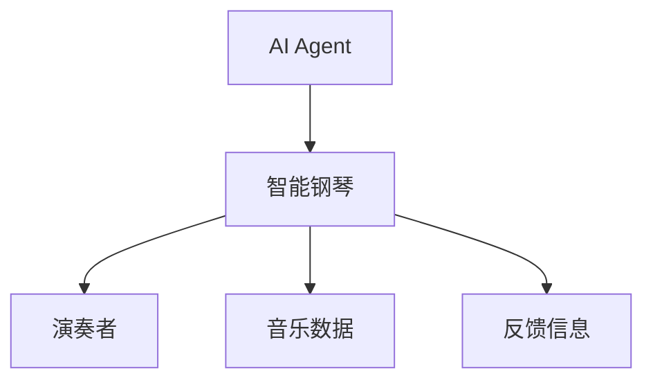

                 


# AI Agent在智能钢琴中的弹奏技巧分析

## 关键词：AI Agent，智能钢琴，弹奏技巧，音乐分析，机器学习

## 摘要：  
随着人工智能技术的快速发展，AI Agent（智能体）在音乐领域的应用越来越广泛。本文将探讨AI Agent在智能钢琴中的弹奏技巧分析，从背景介绍、核心概念、算法原理、系统架构到项目实战，逐步分析AI Agent如何助力智能钢琴实现更高水平的音乐表现。通过本文的分析，读者将深入了解AI Agent在智能钢琴中的具体应用，以及其在未来音乐教育和演奏中的潜力。

---

## 第一部分：AI Agent与智能钢琴的背景介绍

### 第1章：AI Agent与智能钢琴概述

#### 1.1 AI Agent的基本概念
- **1.1.1 AI Agent的定义与特点**  
  AI Agent是一种能够感知环境、做出决策并执行动作的智能实体。它具备自主性、反应性、目标导向性和社交能力等核心特点。  
- **1.1.2 智能钢琴的定义与技术基础**  
  智能钢琴是一种结合了计算机技术和音乐设备的乐器，能够通过传感器、MIDI接口等技术实现与计算机的互动，从而提供智能化的音乐教学和演奏体验。  
- **1.1.3 AI Agent在智能钢琴中的应用背景**  
  随着音乐教育和演奏需求的不断增长，AI Agent的应用为智能钢琴提供了更强大的技术支持，使其能够实现个性化的教学、实时反馈和智能演奏辅助。

#### 1.2 AI Agent与音乐的结合
- **1.2.1 AI在音乐生成中的应用**  
  AI通过深度学习模型（如RNN、GAN）生成音乐，能够模仿不同风格的音乐作品，甚至创作出原创音乐。  
- **1.2.2 AI在音乐分析中的应用**  
  AI能够对音乐作品进行自动分析，提取旋律、和声、节奏等特征，为音乐研究和教学提供数据支持。  
- **1.2.3 AI在音乐教学中的应用**  
  AI通过自然语言处理和语音识别技术，能够为学生提供实时的音乐教学指导，帮助学生提高演奏技巧。

#### 1.3 智能钢琴的现状与发展趋势
- **1.3.1 智能钢琴的技术现状**  
  当前，智能钢琴主要通过传感器和MIDI接口实现与计算机的互动，结合AI技术能够提供个性化的教学和演奏反馈。  
- **1.3.2 AI Agent在智能钢琴中的应用现状**  
  AI Agent在智能钢琴中的应用主要集中在音乐教学、演奏辅助和个性化推荐等方面。  
- **1.3.3 智能钢琴的未来发展趋势**  
  随着AI技术的不断进步，智能钢琴将更加智能化，能够实现更复杂的音乐分析和个性化教学。

---

## 第二部分：AI Agent的核心概念与联系

### 第2章：AI Agent的核心原理

#### 2.1 AI Agent的感知模块
- **2.1.1 感知模块的定义与作用**  
  感知模块是AI Agent获取环境信息的关键部分，能够通过传感器、摄像头、麦克风等设备采集数据。  
- **2.1.2 常见的感知技术**  
  - 视觉感知：通过摄像头识别钢琴键的状态和演奏者的动作。  
  - 听觉感知：通过麦克风采集钢琴的音调和节奏。  
  - 触觉感知：通过压力传感器感知钢琴键的按压力度。  
- **2.1.3 在智能钢琴中的具体应用**  
  感知模块在智能钢琴中主要用于采集演奏者的动作和音乐数据，为后续的分析和决策提供基础。

#### 2.2 AI Agent的决策模块
- **2.2.1 决策模块的定义与作用**  
  决策模块是AI Agent根据感知到的信息做出决策的核心部分，能够通过算法选择最优的动作。  
- **2.2.2 常见的决策算法**  
  - 规则引擎：基于预定义的规则进行决策。  
  - 机器学习：通过训练数据学习决策模型。  
  - 强化学习：通过与环境的互动不断优化决策策略。  
- **2.2.3 在智能钢琴中的具体应用**  
  决策模块在智能钢琴中主要用于根据演奏者的动作和音乐数据生成相应的反馈和建议。

#### 2.3 AI Agent的执行模块
- **2.3.1 执行模块的定义与作用**  
  执行模块是AI Agent将决策结果转化为实际动作的部分，能够通过执行机构实现与环境的互动。  
- **2.3.2 在智能钢琴中的具体实现**  
  - MIDI 控制：通过MIDI接口控制钢琴的音调和节奏。  
  - 物理按键控制：通过机械臂或其他执行机构直接操作钢琴键。  
- **2.3.3 执行模块的优化与改进**  
  为了提高执行效率和准确性，AI Agent需要不断优化执行模块的算法和硬件设计。

#### 2.4 AI Agent的核心概念对比表格
| **核心概念** | **AI Agent** | **传统音乐教学工具** |
|--------------|--------------|-----------------------|
| 感知能力     | 高度智能     | 较低                 |
| 决策能力     | 基于数据驱动 | 依赖人工经验         |
| 执行能力     | 精准控制     | 依赖人工操作         |

#### 2.5 AI Agent的实体关系图（ER 图）


---

## 第三部分：AI Agent的算法原理讲解

### 第3章：AI Agent的算法原理

#### 3.1 AI Agent的感知算法
- **3.1.1 基于深度学习的音乐特征提取（如 CNN、RNN）**  
  - 使用卷积神经网络（CNN）提取音乐的时频特征。  
  - 使用循环神经网络（RNN）捕捉音乐的时序特征。  
- **3.1.2 基于传统算法的音乐特征提取（如 FFT、MFCC）**  
  - 快速傅里叶变换（FFT）用于提取音乐的频谱特征。  
  - 梅尔频率倒谱系数（MFCC）用于提取音乐的音调特征。  
- **3.1.3 感知算法的优缺点对比**  
  | **算法类型** | **优点**         | **缺点**         |
  |--------------|------------------|------------------|
  | 深度学习     | 特征提取能力强   | 训练数据需求大   |
  | 传统算法     | 实时性好         | 特征提取能力弱   |

#### 3.2 AI Agent的决策算法
- **3.2.1 基于规则的决策算法**  
  - 通过预定义的规则对演奏者的动作和音乐数据进行分类和决策。  
- **3.2.2 基于机器学习的决策算法（如分类、回归）**  
  - 使用支持向量机（SVM）进行分类决策。  
  - 使用线性回归进行预测决策。  
- **3.2.3 基于强化学习的决策算法（如 Q-Learning）**  
  - 使用Q-Learning算法通过与环境的互动不断优化决策策略。  

#### 3.3 AI Agent的执行算法
- **3.3.1 基于PID控制的执行算法**  
  - 使用比例-积分-微分（PID）控制算法实现对钢琴键的精准控制。  
- **3.3.2 基于模糊逻辑的执行算法**  
  - 使用模糊逻辑算法处理复杂的执行环境和不确定性。

---

## 第四部分：系统分析与架构设计方案

### 第4章：智能钢琴系统架构设计

#### 4.1 问题场景介绍
- **问题场景**：智能钢琴需要实现演奏者的动作识别、音乐数据分析和实时反馈等功能。  
- **项目介绍**：本项目旨在通过AI Agent实现智能钢琴的弹奏技巧分析，提供个性化的教学和演奏辅助。

#### 4.2 系统功能设计
- **领域模型设计**  
  ```mermaid
  classDiagram
      class 演奏者 {
          姓名
          演奏技巧
      }
      class 音乐数据 {
          旋律
          和声
          节奏
      }
      class AI Agent {
          感知模块
          决策模块
          执行模块
      }
      演奏者 --> AI Agent
      音乐数据 --> AI Agent
  ```

#### 4.3 系统架构设计
- **系统架构图**  
  ```mermaid
  graph TD
      A[演奏者] --> B[AI Agent]
      B --> C[音乐数据]
      B --> D[反馈信息]
      B --> E[执行模块]
  ```

#### 4.4 系统接口设计
- **接口设计**  
  - 演奏者与AI Agent之间的接口：用于传递演奏者的动作和指令。  
  - AI Agent与音乐数据之间的接口：用于传递音乐特征和分析结果。  
  - AI Agent与执行模块之间的接口：用于传递决策结果和控制指令。  

#### 4.5 系统交互设计
- **交互流程图**  
  ```mermaid
  sequenceDiagram
      演奏者 ->> AI Agent: 提供演奏动作
      AI Agent ->> 音乐数据: 提取音乐特征
      AI Agent ->> 决策模块: 生成反馈建议
      AI Agent ->> 执行模块: 执行反馈建议
      执行模块 ->> 演奏者: 提供反馈
  ```

---

## 第五部分：项目实战

### 第5章：AI Agent在智能钢琴中的实现

#### 5.1 环境安装
- **开发环境**：Python 3.8+，TensorFlow 2.0+，Librosa，MIDI 控制库。  
- **安装步骤**：  
  ```bash
  pip install numpy
  pip install tensorflow
  pip install librosa
  pip install mido
  ```

#### 5.2 系统核心实现源代码
- **感知模块代码**  
  ```python
  import librosa

  def extract_features(audio_path):
      audio, sr = librosa.load(audio_path, sr=22050)
      mfcc = librosa.feature.mfcc(y=audio, sr=sr)
      return mfcc
  ```

- **决策模块代码**  
  ```python
  import numpy as np
  from tensorflow import keras

  model = keras.Sequential([
      keras.layers.Flatten(),
      keras.layers.Dense(128, activation='relu'),
      keras.layers.Dense(10, activation='softmax')
  ])

  model.compile(optimizer='adam', loss='sparse_categorical_crossentropy', metrics=['accuracy'])
  ```

- **执行模块代码**  
  ```python
  import mido

  def play_note(note, duration=1):
      mido_note = mido.Message('note_on', note=note, velocity=127)
      mido_note2 = mido.Message('note_off', note=note, velocity=127)
      mido_note3 = mido.Message('note_on', note=note, velocity=127, time=duration)
      mido.Note(note=note, duration=duration).play()
  ```

#### 5.3 实际案例分析与解读
- **案例分析**：通过AI Agent分析演奏者的动作和音乐数据，生成个性化的反馈建议。  
- **代码解读**：详细解释感知、决策和执行模块的实现逻辑和功能。

#### 5.4 项目小结
- **项目总结**：通过本项目，我们实现了AI Agent在智能钢琴中的弹奏技巧分析，验证了AI技术在音乐教育和演奏中的巨大潜力。  
- **未来展望**：随着AI技术的不断进步，智能钢琴将更加智能化，能够实现更复杂的音乐分析和个性化教学。

---

## 第六部分：最佳实践与总结

### 第6章：最佳实践与总结

#### 6.1 最佳实践 tips
- **数据准备**：确保音乐数据的多样性和高质量，以提高AI Agent的感知和决策能力。  
- **算法选择**：根据具体需求选择合适的算法，避免过度复杂化。  
- **系统优化**：不断优化系统架构和算法性能，提高系统的实时性和准确性。  

#### 6.2 小结
- 通过本文的分析，我们深入了解了AI Agent在智能钢琴中的弹奏技巧分析，掌握了其核心概念、算法原理和系统架构设计。  
- AI Agent的应用为智能钢琴提供了更强大的技术支持，能够实现个性化的教学和演奏辅助。

#### 6.3 注意事项
- 在实际应用中，需要注意数据隐私和安全问题。  
- 系统的实时性和稳定性需要通过不断的测试和优化来保证。  

#### 6.4 拓展阅读
- 推荐阅读相关领域的书籍和论文，进一步深入了解AI在音乐中的应用。  
- 关注AI技术的最新发展，探索其在音乐教育和演奏中的更多可能性。

---

通过本文的详细分析，我们不仅了解了AI Agent在智能钢琴中的弹奏技巧分析，还掌握了其核心概念、算法原理和系统架构设计。AI Agent的应用为智能钢琴提供了更强大的技术支持，未来随着技术的不断进步，智能钢琴将更加智能化，能够实现更复杂的音乐分析和个性化教学。

