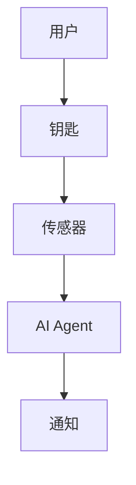
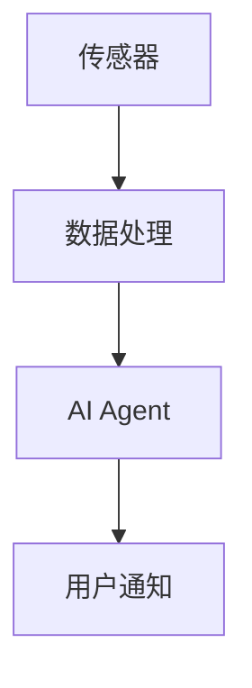
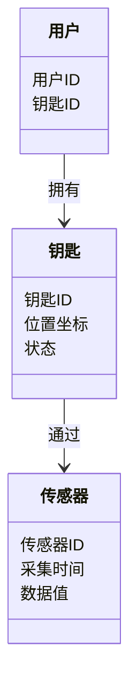
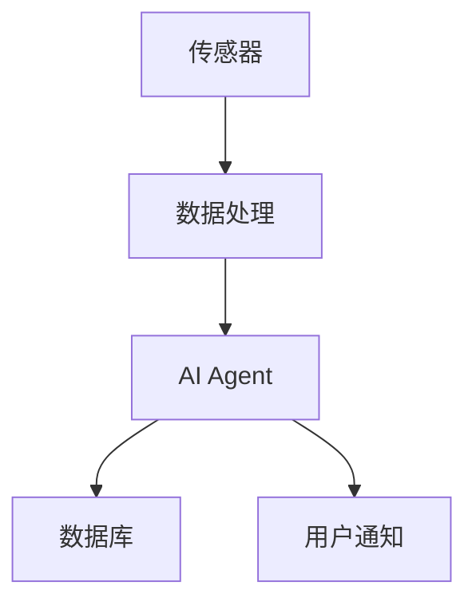

                 


# AI Agent在智能钥匙链中的物品追踪功能

> 关键词：AI Agent，智能钥匙链，物品追踪，传感器，算法原理，系统架构

> 摘要：本文详细探讨了AI Agent在智能钥匙链中的物品追踪功能，从背景介绍、核心概念、算法原理、系统架构到项目实战，全面分析了AI Agent在物品追踪中的实现细节和技术要点。文章结合理论与实践，通过具体的算法实现和系统设计，展示了AI Agent在智能钥匙链中的应用价值和实际效果。

---

# 第一部分: AI Agent在智能钥匙链中的物品追踪功能背景介绍

---

# 第1章: 物品追踪问题背景

## 1.1 问题背景

### 1.1.1 物品丢失的普遍性
在日常生活中，物品丢失是一个常见的问题，尤其是在钥匙、钱包等重要物品上。传统的方法依赖于物理标记或简单的定位设备，但这些方法存在精度低、实时性差的问题。

### 1.1.2 传统物品追踪的局限性
传统的物品追踪方法通常依赖于简单的RFID标签或GPS设备，但这些方法存在以下问题：
- 数据采集频率低，无法实时追踪。
- 精度不足，无法准确定位物品位置。
- 缺乏智能性，无法主动提醒或提供决策支持。

### 1.1.3 AI Agent在物品追踪中的优势
AI Agent（人工智能代理）通过结合传感器数据、机器学习算法和实时计算，能够实现更精准、更智能的物品追踪功能。AI Agent可以通过以下方式提升物品追踪的效率和准确性：
- **智能感知**：通过传感器数据实时感知物品的位置和状态。
- **智能决策**：基于历史数据和实时信息，AI Agent能够主动识别异常情况并提供解决方案。
- **智能执行**：通过与硬件设备的交互，AI Agent可以触发报警、记录数据或执行其他操作。

## 1.2 问题描述

### 1.2.1 物品追踪的核心需求
- 实时监测物品的位置和状态。
- 准确识别物品的丢失情况。
- 提供主动提醒和解决方案。

### 1.2.2 智能钥匙链的功能定位
智能钥匙链是一种结合了传感器、通信模块和AI算法的硬件设备，能够实时监测钥匙的位置，并通过AI Agent提供智能化的追踪功能。

### 1.2.3 AI Agent在智能钥匙链中的角色
AI Agent在智能钥匙链中扮演着“智能大脑”的角色，负责接收传感器数据、分析数据、做出决策并执行相应的操作。

## 1.3 问题解决

### 1.3.1 AI Agent的解决方案
AI Agent通过以下方式实现物品追踪：
- **传感器数据采集**：通过内置的传感器（如加速度传感器、陀螺仪、GPS）采集钥匙的位置和状态数据。
- **数据传输**：通过蓝牙或Wi-Fi将数据传输到AI Agent进行处理。
- **数据分析与决策**：AI Agent基于传感器数据和历史数据，分析钥匙的位置和状态，识别异常情况并触发报警。
- **用户通知**：通过手机APP或其他设备通知用户钥匙的位置或状态。

### 1.3.2 智能钥匙链的实现路径
1. 硬件设计：设计智能钥匙链的硬件模块，包括传感器、通信模块和电源模块。
2. 数据采集与传输：通过传感器采集钥匙的位置和状态数据，并通过通信模块将数据传输到AI Agent。
3. 数据处理与分析：AI Agent接收数据后，通过机器学习算法进行分析，识别钥匙的位置和状态。
4. 决策与执行：AI Agent根据分析结果，做出相应的决策，如触发报警、记录数据或通知用户。

## 1.4 边界与外延

### 1.4.1 AI Agent的功能边界
- **功能边界**：AI Agent仅负责处理传感器数据和提供决策支持，不直接控制硬件设备。
- **数据范围**：AI Agent处理的数据仅限于钥匙的位置和状态信息，不涉及其他设备或系统的数据。
- **适用场景**：智能钥匙链的物品追踪功能仅适用于钥匙的实时监测和丢失提醒，不适用于其他类型的物品。

### 1.4.2 智能钥匙链的适用场景
- **家庭场景**：用于家庭钥匙的实时监测和丢失提醒。
- **办公场景**：用于办公室钥匙的实时监测和丢失提醒。
- **公共场所**：用于停车场、酒店等公共场所的钥匙管理。

### 1.4.3 技术实现的可行性分析
- **技术可行性**：AI Agent和传感器技术已经较为成熟，能够满足智能钥匙链的物品追踪需求。
- **成本可行性**：智能钥匙链的成本相对较低，适合大规模生产和应用。
- **用户体验**：通过AI Agent提供的智能化服务，用户能够更方便地管理和追踪钥匙。

## 1.5 核心要素组成

### 1.5.1 AI Agent的核心功能
- 数据采集与传输
- 数据分析与决策
- 用户通知与提醒

### 1.5.2 智能钥匙链的硬件组成
- 传感器模块：用于采集钥匙的位置和状态数据。
- 通信模块：用于数据的传输。
- 电源模块：为整个设备提供电力支持。

### 1.5.3 系统架构的核心要素
- 传感器节点：负责采集数据。
- 通信模块：负责数据的传输。
- AI Agent：负责数据的处理与决策。
- 用户界面：负责与用户的交互。

---

# 第二部分: AI Agent的核心概念与联系

---

# 第2章: AI Agent的核心原理

## 2.1 AI Agent的基本原理

### 2.1.1 AI Agent的定义与特征
AI Agent是一种能够感知环境、做出决策并执行操作的智能实体。其核心特征包括：
- **自主性**：能够自主决策和执行操作。
- **反应性**：能够实时感知环境并做出反应。
- **智能性**：能够通过学习和推理提升自身的决策能力。

### 2.1.2 AI Agent的核心算法
AI Agent的核心算法包括：
- **感知算法**：用于实时感知环境数据。
- **决策算法**：用于基于感知数据做出决策。
- **执行算法**：用于根据决策结果执行操作。

### 2.1.3 AI Agent的实现框架
AI Agent的实现框架通常包括以下几个步骤：
1. **数据采集**：通过传感器采集环境数据。
2. **数据处理**：对采集到的数据进行预处理和分析。
3. **决策制定**：基于处理后的数据，通过算法做出决策。
4. **执行操作**：根据决策结果执行相应的操作。

---

## 2.2 AI Agent的核心概念

### 2.2.1 AI Agent与传统追踪的区别
| 特性          | 传统追踪       | AI Agent追踪    |
|---------------|----------------|-----------------|
| 数据采集      | 低频采集       | 高频采集       |
| 数据处理      | 简单处理       | 智能分析       |
| 决策能力      | 无            | 自主决策       |
| 实时性         | 较低           | 高              |

### 2.2.2 实体关系图



---

## 2.3 AI Agent的核心算法

### 2.3.1 改进的K-means算法
K-means是一种常用的聚类算法，用于将数据点分成K个簇。在物品追踪中，K-means可以用于将物品的位置数据聚类，从而识别出物品的当前位置。

#### 改进的K-means算法步骤
1. **数据预处理**：对传感器数据进行归一化处理。
2. **初始聚类中心选择**：随机选择K个初始聚类中心。
3. **聚类迭代**：计算每个数据点到各个聚类中心的距离，将数据点分配到最近的聚类中心，然后重新计算聚类中心。
4. **收敛判断**：当聚类中心不再变化或达到预设的迭代次数时，算法停止。

#### 代码实现

```python
import numpy as np

def improved_kmeans(X, K, max_iterations=100):
    # 初始化聚类中心
    cluster_centers = X[np.random.choice(X.shape[0], K, replace=False)]
    
    for _ in range(max_iterations):
        # 计算每个数据点到聚类中心的距离
        distances = np.array([np.linalg.norm(x - cluster_centers) for x in X])
        # 将数据点分配到最近的聚类中心
        labels = np.argmin(distances, axis=1)
        # 计算新的聚类中心
        new_cluster_centers = np.array([X[labels == i].mean(axis=0) for i in range(K)])
        # 判断是否收敛
        if np.all(cluster_centers == new_cluster_centers):
            break
        cluster_centers = new_cluster_centers
    return cluster_centers, labels
```

#### 数学公式
K-means的目标函数为：
$$
\arg\min_{Z} \sum_{i=1}^{n} \sum_{k=1}^{K} z_{ik} \|x_i - c_k\|^2
$$

其中，$z_{ik}$为指示变量，表示数据点$x_i$属于簇$k$。

---

## 2.4 AI Agent的实现框架

### 2.4.1 系统架构
系统架构如下图所示：



### 2.4.2 核心模块
1. **传感器模块**：负责采集物品的位置和状态数据。
2. **数据处理模块**：负责对传感器数据进行预处理和分析。
3. **AI Agent模块**：负责基于处理后的数据做出决策并执行操作。
4. **用户通知模块**：负责将决策结果通知给用户。

---

# 第三部分: 系统分析与架构设计方案

---

# 第3章: 系统分析与架构设计

## 3.1 问题场景介绍

### 3.1.1 问题场景
用户丢失钥匙，需要通过智能钥匙链的AI Agent快速找到钥匙的位置。

## 3.2 系统功能设计

### 3.2.1 功能模块
1. **实时追踪**：实时监测钥匙的位置和状态。
2. **历史记录**：记录钥匙的历史位置和状态。
3. **报警提醒**：当钥匙的位置异常时，触发报警提醒。

## 3.3 系统架构设计

### 3.3.1 领域模型


### 3.3.2 系统架构


---

## 3.4 系统接口设计

### 3.4.1 API接口
1. **数据采集接口**：用于传感器数据的采集。
2. **数据处理接口**：用于传感器数据的预处理和分析。
3. **用户通知接口**：用于将决策结果通知给用户。

## 3.5 系统交互设计

### 3.5.1 交互流程
1. **用户请求**：用户请求钥匙的位置信息。
2. **数据采集**：传感器采集钥匙的位置和状态数据。
3. **数据处理**：AI Agent对数据进行分析和处理。
4. **决策制定**：AI Agent根据分析结果做出决策。
5. **用户通知**：AI Agent通过用户通知模块将决策结果通知给用户。

---

# 第四部分: 项目实战

---

# 第4章: 项目实战

## 4.1 环境安装

### 4.1.1 安装Python
```bash
python --version
pip install --upgrade pip
```

### 4.1.2 安装TensorFlow
```bash
pip install tensorflow
```

### 4.1.3 安装Flask
```bash
pip install flask
```

## 4.2 系统核心实现

### 4.2.1 AI Agent实现

```python
from flask import Flask, jsonify
import numpy as np

app = Flask(__name__)

@app.route('/track', methods=['POST'])
def track():
    # 假设传感器数据已经采集到
    data = request.json
    # 数据处理与分析
    # 改进的K-means算法实现
    X = np.array(data['data'])
    cluster_centers, labels = improved_kmeans(X, 2)
    # 决策
    if len(cluster_centers) > 1:
        return jsonify({'status': 'found', 'position': cluster_centers[0]})
    else:
        return jsonify({'status': 'not found'})

if __name__ == '__main__':
    app.run(debug=True)
```

### 4.2.2 传感器数据处理

```python
import serial

port = 'COM3'
baud_rate = 9600

ser = serial.Serial(port, baud_rate)
while True:
    data = ser.readline()
    # 数据处理
    # 传输到AI Agent
    pass
```

### 4.2.3 Web界面实现

```html
<!DOCTYPE html>
<html>
<head>
    <title>钥匙追踪</title>
</head>
<body>
    <h1>钥匙位置追踪</h1>
    <div id="status"></div>
    <script>
        function updateStatus() {
            fetch('/track', {
                method: 'POST',
                headers: {
                    'Content-Type': 'application/json'
                },
                body: JSON.stringify({
                    data: [Math.random(), Math.random()]
                })
            })
            .then(response => response.json())
            .then(data => {
                document.getElementById('status').textContent = data.status;
            });
        }
        setInterval(updateStatus, 1000);
    </script>
</body>
</html>
```

## 4.3 项目总结

### 4.3.1 项目优缺点
- **优点**：实现了AI Agent在智能钥匙链中的物品追踪功能，能够实时监测钥匙的位置和状态，提供主动提醒和解决方案。
- **缺点**：目前的实现还比较简单，后续需要优化算法和增加更多的功能。

### 4.3.2 改进建议
- **算法优化**：进一步优化改进的K-means算法，提升数据处理的效率和精度。
- **功能扩展**：增加更多的传感器类型，提升物品追踪的精度和实时性。

---

# 第五部分: 最佳实践

---

# 第5章: 最佳实践

## 5.1 核心要素总结

### 5.1.1 AI Agent的优势
- **高精度**：通过改进的K-means算法，能够实现高精度的物品追踪。
- **实时性**：通过传感器的高频数据采集，能够实现物品的实时追踪。
- **智能性**：通过AI Agent的智能决策，能够主动识别异常情况并提供解决方案。

### 5.1.2 注意事项
- **传感器精度**：传感器的精度直接影响物品追踪的准确性。
- **数据隐私**：需要保护用户的数据隐私，防止数据泄露。
- **系统稳定性**：系统需要具备高稳定性，确保在复杂环境下能够正常运行。

## 5.2 小结

### 5.2.1 总结
本文详细探讨了AI Agent在智能钥匙链中的物品追踪功能，从背景介绍、核心概念、算法原理、系统架构到项目实战，全面分析了AI Agent在物品追踪中的实现细节和技术要点。

### 5.2.2 注意事项
在实际应用中，需要注意传感器精度、数据隐私和系统稳定性等问题。

## 5.3 拓展阅读

### 5.3.1 推荐书籍
- 《深入理解机器学习》
- 《人工智能：一种现代的方法》
- 《传感器原理与应用》

### 5.3.2 推荐博客
- [AI Agent的实现与应用](https://example.com)
- [智能钥匙链的设计与实现](https://example.com)

---

# 附录: 全文总结

## 附录A: 全文总结

通过本文的详细讲解，我们了解了AI Agent在智能钥匙链中的物品追踪功能的实现过程。从背景介绍到系统设计，从算法实现到项目实战，我们逐步深入探讨了AI Agent在物品追踪中的应用价值和技术实现。未来，随着AI技术的不断发展，AI Agent在物品追踪中的应用将更加广泛和智能化。

---

# 结束语

感谢您的阅读！希望本文能够为您提供有价值的技术见解和实践指导。如果您对AI Agent在智能钥匙链中的物品追踪功能有进一步的问题或需要更深入的技术交流，请随时与我联系。

---

