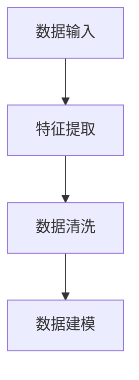
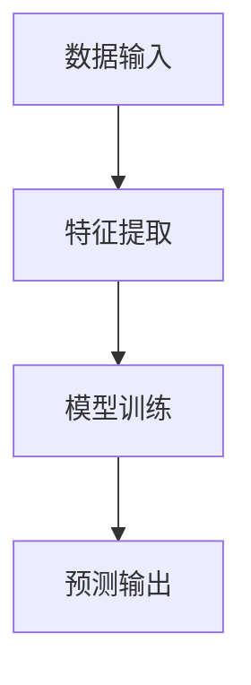
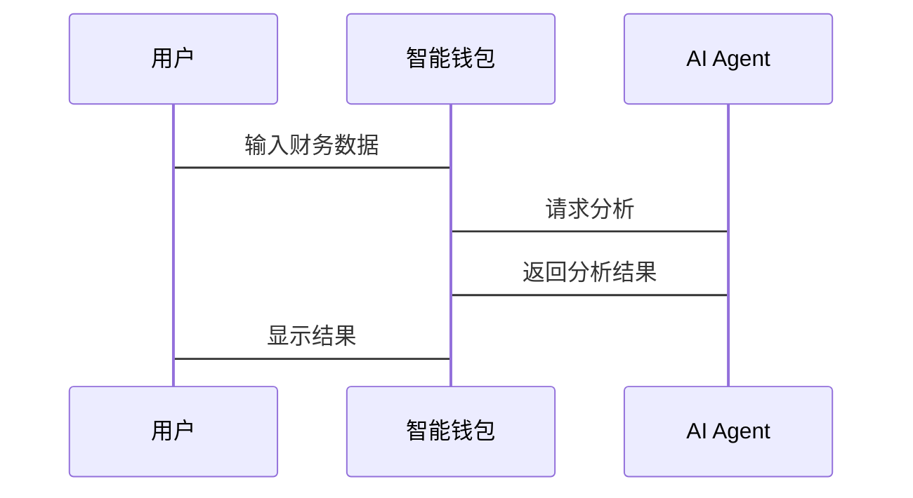

                 


# AI Agent在智能钱包中的个人财务管理

> 关键词：AI Agent, 智能钱包, 个人财务管理, 机器学习, 算法原理, 系统架构, 项目实战

> 摘要：本文详细探讨了AI Agent在智能钱包中的个人财务管理应用，从核心概念、算法原理到系统架构设计，再到项目实战和实际案例分析，深入剖析了AI Agent在智能钱包中的工作原理及其在财务管理中的实际应用价值。

---

## 第一部分: 引言

### 1.1 问题背景

随着人工智能技术的飞速发展，AI Agent（人工智能代理）在各个领域的应用日益广泛。个人财务管理作为日常生活的重要组成部分，也在逐步拥抱智能化技术。传统的财务管理方式存在效率低、数据处理复杂、决策依赖人工判断等问题。而AI Agent的引入，为智能钱包的财务管理带来了新的可能性。

#### 1.1.1 传统财务管理的局限性

传统财务管理主要依赖人工记录和分析，存在以下问题：
- 数据处理效率低，难以实时监控财务状况。
- 人工分析容易出错，且难以覆盖所有财务细节。
- 缺乏智能化的决策支持，难以应对复杂的财务问题。

#### 1.1.2 AI技术在财务管理中的应用潜力

AI技术在财务管理中的应用潜力主要体现在：
- 数据处理自动化：AI可以快速处理大量财务数据，提供实时分析。
- 智能化决策：基于机器学习算法，AI可以预测财务风险，优化投资组合。
- 个性化服务：根据用户的财务状况和需求，提供个性化的财务管理建议。

#### 1.1.3 智能钱包的概念与特点

智能钱包是一种结合了AI技术的数字化钱包，能够实现以下功能：
- 自动记录和分类财务数据。
- 实时监控财务状况，提供风险预警。
- 自动生成财务报告和优化建议。

### 1.2 问题描述

在智能钱包中，AI Agent需要解决的核心问题是：
- 如何高效地处理和分析用户的财务数据。
- 如何利用AI技术实现智能化的财务管理决策。
- 如何确保财务数据的安全性和隐私性。

### 1.3 核心概念与联系

以下是AI Agent与智能钱包的核心概念对比：

| 概念 | 描述 |
|------|------|
| AI Agent | 能够感知环境并采取行动以实现目标的智能体。 |
| 智能钱包 | 结合AI技术，能够实现智能化财务管理的数字钱包。 |
| 财务管理 | 对个人或组织的财务活动进行计划、执行和监控。 |

### 1.4 本章小结

本章介绍了AI Agent在智能钱包中的应用背景，分析了传统财务管理的局限性，阐述了AI技术在财务管理中的潜力，并提出了智能钱包的核心概念和功能特点。

---

## 第二部分: AI Agent的核心原理与技术

### 2.1 AI Agent的基本原理

#### 2.1.1 AI Agent的定义与分类

AI Agent可以分为以下几类：
- **简单反射Agent**：基于简单的规则进行决策。
- **基于模型的反射Agent**：利用环境模型进行决策。
- **目标驱动的Agent**：基于目标进行决策和行动。
- **实用驱动的Agent**：基于效用函数进行决策。

#### 2.1.2 AI Agent的核心算法

AI Agent的核心算法包括：
- **监督学习**：用于分类和回归任务。
- **无监督学习**：用于聚类和降维任务。
- **强化学习**：用于决策优化任务。

#### 2.1.3 AI Agent的决策机制

AI Agent的决策机制通常包括以下几个步骤：
1. 数据采集与预处理。
2. 数据分析与建模。
3. 模型训练与优化。
4. 决策输出与反馈。

### 2.2 AI Agent在财务管理中的应用

#### 2.2.1 数据采集与处理

AI Agent需要处理以下类型的财务数据：
- 收支流水记录。
- 账户余额。
- 消费分类。

数据处理流程如下：



#### 2.2.2 财务分析与预测

AI Agent可以通过以下方式实现财务分析与预测：
- **时间序列分析**：用于预测未来的财务状况。
- **分类模型**：用于识别异常交易。
- **回归模型**：用于预测支出和收入。

#### 2.2.3 自动化决策与执行

AI Agent可以通过以下步骤实现自动化决策：
1. 数据采集与预处理。
2. 模型训练与优化。
3. 决策输出与执行。

### 2.3 AI Agent的算法实现

#### 2.3.1 机器学习算法的选择

在财务管理中，常用的机器学习算法包括：
- 线性回归。
- 支持向量机（SVM）。
- 随机森林。
- 神经网络。

#### 2.3.2 算法流程图（Mermaid）



#### 2.3.3 算法数学模型

以下是线性回归的数学模型：

$$ y = \beta_0 + \beta_1x + \epsilon $$

其中，$y$ 是目标变量，$x$ 是自变量，$\beta_0$ 和 $\beta_1$ 是模型参数，$\epsilon$ 是误差项。

### 2.4 本章小结

本章详细讲解了AI Agent的核心原理与技术，包括基本定义、分类、决策机制以及在财务管理中的具体应用。通过算法流程图和数学模型，进一步阐述了AI Agent在智能钱包中的实现方式。

---

## 第三部分: 智能钱包的系统架构与设计

### 3.1 智能钱包的功能模块

智能钱包的功能模块包括：
- **数据采集模块**：负责采集用户的财务数据。
- **财务分析模块**：对数据进行分析和建模。
- **自动化决策模块**：基于分析结果生成决策建议。

#### 3.1.1 数据采集模块

数据采集模块需要实现以下功能：
- 从多种数据源（如银行账户、支付宝、微信支付）采集数据。
- 对数据进行清洗和预处理。

#### 3.1.2 财务分析模块

财务分析模块需要实现以下功能：
- 对财务数据进行分类和聚类。
- 生成财务报告和预测模型。

#### 3.1.3 自动化决策模块

自动化决策模块需要实现以下功能：
- 基于机器学习模型生成决策建议。
- 执行自动化操作（如自动转账、设置预算提醒）。

### 3.2 系统架构设计

#### 3.2.1 分层架构设计

智能钱包的分层架构包括：
- **数据层**：负责数据的存储和管理。
- **业务逻辑层**：负责数据的处理和分析。
- **用户界面层**：负责与用户的交互。

#### 3.2.2 模块化设计

模块化设计包括：
- 数据采集模块。
- 数据处理模块。
- 数据分析模块。
- 决策模块。

#### 3.2.3 系统交互设计（Mermaid）



### 3.3 本章小结

本章详细讲解了智能钱包的系统架构与设计，包括功能模块的划分、分层架构设计以及系统交互流程。

---

## 第四部分: 项目实战

### 4.1 环境搭建

#### 4.1.1 Python环境搭建

安装必要的Python库：
```bash
pip install numpy pandas scikit-learn matplotlib
```

#### 4.1.2 数据库搭建

使用MySQL或MongoDB进行数据存储。

### 4.2 核心实现

#### 4.2.1 数据采集

编写数据采集脚本：
```python
import pandas as pd

# 从CSV文件读取数据
data = pd.read_csv('financial_data.csv')
```

#### 4.2.2 数据分析与建模

训练机器学习模型：
```python
from sklearn.linear_model import LinearRegression

# 创建线性回归模型
model = LinearRegression()
# 拟合模型
model.fit(X_train, y_train)
```

#### 4.2.3 决策输出

生成决策建议：
```python
# 预测结果
y_pred = model.predict(X_test)
```

### 4.3 案例分析

#### 4.3.1 数据处理

处理缺失值和异常值。

#### 4.3.2 模型训练

训练分类模型，识别异常交易。

#### 4.3.3 决策输出

基于模型预测，生成预算提醒和投资建议。

### 4.4 本章小结

本章通过实际案例分析，详细讲解了智能钱包的项目实战，包括环境搭建、数据处理、模型训练和决策输出。

---

## 第五部分: 实际案例分析

### 5.1 案例背景

假设用户是一位月入1万元的上班族，希望通过智能钱包实现每月的收支平衡和理财规划。

### 5.2 数据分析

通过AI Agent分析用户的收支情况，生成以下结论：
- 支出主要集中在餐饮和娱乐。
- 收入稳定，但支出超支。

### 5.3 决策建议

AI Agent会给出以下建议：
- 减少非必要开支。
- 建立紧急储备金。
- 投资低风险理财产品。

### 5.4 本章小结

本章通过实际案例分析，展示了AI Agent在智能钱包中的实际应用，验证了其在个人财务管理中的价值。

---

## 第六部分: 总结与扩展

### 6.1 总结

本文详细探讨了AI Agent在智能钱包中的个人财务管理应用，从核心概念、算法原理到系统架构设计，再到项目实战和实际案例分析，深入剖析了AI Agent在智能钱包中的工作原理及其在财务管理中的实际应用价值。

### 6.2 扩展

未来的研究方向包括：
- 多模态数据融合：结合文本、图像等多种数据源进行分析。
- 强化学习优化：通过强化学习优化决策模型。
- 联邦学习：在保护隐私的前提下，实现数据共享和模型优化。

---

## 参考文献

1. 周志华. 机器学习. 清华大学出版社, 2016.
2. Goodfellow I, Bengio Y, Courville A. Deep Learning. MIT Press, 2016.

---

通过本文的详细分析，读者可以深入了解AI Agent在智能钱包中的个人财务管理应用，掌握其核心原理和技术，为未来的实际应用提供参考。

