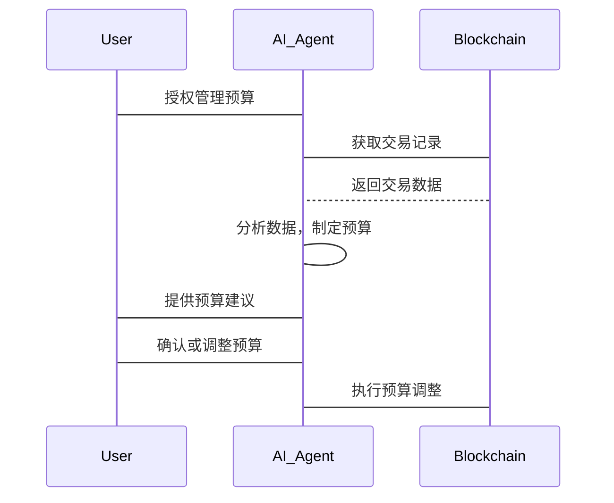

                 


# AI Agent在智能钱包中的支出预算管理

## 关键词：
AI Agent, 智能钱包, 支出预算管理, 强化学习, 系统架构, 项目实战

## 摘要：
本文详细探讨AI Agent在智能钱包中的支出预算管理应用。从概念到算法实现，再到系统设计与项目实战，全面分析AI Agent如何优化用户的财务管理，提供高效、智能的预算解决方案。

---

## 第1章：AI Agent与智能钱包概述

### 1.1 AI Agent的基本概念

#### 1.1.1 AI Agent的定义
AI Agent（人工智能代理）是能够感知环境、做出决策并执行操作的智能实体。它通过传感器获取信息，利用算法进行分析，采取行动以实现目标。

#### 1.1.2 AI Agent的核心特点
- **自主性**：无需人工干预，自动执行任务。
- **反应性**：实时感知环境变化，调整行为。
- **目标导向**：基于目标进行决策和行动。

#### 1.1.3 AI Agent在智能钱包中的应用
AI Agent可以监控用户的消费行为，分析财务状况，优化支出预算，提供个性化财务管理建议。

### 1.2 智能钱包的基本概念

#### 1.2.1 智能钱包的定义
智能钱包是一种结合区块链技术的数字钱包，具备自动交易、智能合约等功能，能够连接去中心化金融（DeFi）生态系统。

#### 1.2.2 智能钱包的功能与特点
- **资产存储**：支持多种加密货币和法币。
- **自动化交易**：根据设定规则自动执行交易。
- **智能合约**：自动执行预设条件的合同。

#### 1.2.3 智能钱包与传统钱包的区别
| 特性       | 智能钱包             | 传统钱包           |
|------------|----------------------|--------------------|
| 功能       | 自动化交易、智能合约 | 基本存储、转账       |
| 安全性     | 高，依赖区块链技术    | 较低，依赖传统金融体系|
| 可扩展性   | 强，支持多种应用场景  | 有限                |

### 1.3 支出预算管理的背景与挑战

#### 1.3.1 支出预算管理的定义
支出预算管理是根据收入和支出计划，合理分配资金的过程，帮助个人或企业实现财务目标。

#### 1.3.2 传统支出预算管理的痛点
- **人为误差**：手动记录和计算容易出错。
- **缺乏实时性**：无法及时调整预算。
- **复杂性**：涉及多方面的财务数据处理。

#### 1.3.3 AI Agent在支出预算管理中的作用
AI Agent能够实时监控消费数据，预测支出趋势，提供智能建议，优化预算分配。

---

## 第2章：AI Agent的核心原理

### 2.1 AI Agent的基本原理

AI Agent通过感知环境、做出决策并执行行动来实现目标。在支出预算管理中，AI Agent的主要任务包括数据采集、预算制定和支出监控。

### 2.2 AI Agent的感知、决策与执行

- **感知**：AI Agent通过智能钱包获取用户的消费数据、账户余额等信息。
- **决策**：基于历史数据和当前状态，AI Agent利用算法制定预算分配策略。
- **执行**：根据决策结果，AI Agent自动调整支出，执行转账或限制消费。

### 2.3 AI Agent在智能钱包中的应用场景

- **实时监控**：AI Agent实时跟踪用户的消费行为，防止超支。
- **智能分配**：根据收入情况自动调整各个支出类别的预算。
- **预测与建议**：预测未来支出，提供优化建议，帮助用户实现财务目标。

---

## 第3章：核心概念对比与ER实体关系图

### 3.1 AI Agent与传统预算管理工具的对比

| 特性           | AI Agent                 | 传统预算工具           |
|----------------|--------------------------|------------------------|
| 自动化程度     | 高，实时调整预算          | 低，依赖人工操作         |
| 数据处理能力   | 强大，支持大数据分析      | 较弱，处理能力有限       |
| 决策能力       | 智能，基于机器学习模型    | 依赖人工判断             |

### 3.2 ER实体关系图

```mermaid
erDiagram
    user {
        id INTEGER
        name VARCHAR
        email VARCHAR
    }
    account {
        id INTEGER
        balance DECIMAL
        user_id INTEGER
    }
    transaction {
        id INTEGER
        amount DECIMAL
        date DATETIME
        account_id INTEGER
    }
    budget_rule {
        id INTEGER
        category VARCHAR
        max_amount DECIMAL
        user_id INTEGER
    }
    user --> account : owns
    account --> transaction : has
    user --> budget_rule : defines
```

---

## 第4章：AI Agent的算法实现

### 4.1 算法选择与实现流程

为了实现AI Agent的支出预算管理功能，选择强化学习算法，通过状态-动作-奖励机制优化预算分配策略。

### 4.2 算法实现的Python代码

```python
import numpy as np

# 定义状态空间：账户余额、支出类别、预算限制
# 定义动作空间：调整支出金额

class AI_Agent:
    def __init__(self, balance, budget_rules):
        self.balance = balance
        self.budget_rules = budget_rules
        self.reward = 0

    def perceive(self, transactions):
        # 返回当前状态：账户余额，各类别剩余预算
        current_balance = self.balance
        category_budget = {category: rule.max_amount for category, rule in self.budget_rules.items()}
        for t in transactions:
            if t.account_id == self.user.account_id:
                current_balance -= t.amount
                category_budget[t.category] -= t.amount
        return current_balance, category_budget

    def decide(self, state):
        # 返回动作：调整支出金额
        current_balance, category_budget = state
        action = {}
        for category in self.budget_rules:
            if category_budget[category] < 0:
                # 超支，减少其他类别的支出
                reduction = -category_budget[category]
                action[category] = reduction
        return action

    def execute(self, action):
        # 执行动作，调整支出
        for category, amount in action.items():
            self.budget_rules[category].max_amount -= amount
        return self.budget_rules

    def learn(self, reward):
        # 更新奖励函数
        self.reward += reward

# 示例用法
budget_rules = {
    'housing': 2000,
    'food': 1000,
    'transport': 500
}
agent = AI_Agent(balance=5000, budget_rules=budget_rules)
transactions = [{'amount': 1000, 'category': 'housing'}]
state = agent.perceive(transactions)
action = agent.decide(state)
agent.execute(action)
```

### 4.3 算法原理的数学模型与公式

AI Agent的强化学习模型基于马尔可夫决策过程（MDP），定义如下：

- **状态**：\( S = (b_t, c_t) \)，其中 \( b_t \) 是当前余额，\( c_t \) 是各类别剩余预算。
- **动作**：\( A = \{a_1, a_2, ..., a_n\} \)，调整支出金额。
- **奖励**：\( R(s, a) \) 表示在状态 \( s \) 下采取动作 \( a \) 的奖励。
- **策略**：\( \pi(a|s) \) 是在状态 \( s \) 下选择动作 \( a \) 的概率。

目标是通过最大化累计奖励来优化预算分配策略。

---

## 第5章：系统分析与架构设计

### 5.1 系统功能设计

智能钱包AI Agent支出预算管理系统的功能模块包括：
1. **数据采集**：从钱包获取交易记录和账户信息。
2. **预算制定**：基于历史数据和用户需求生成预算计划。
3. **支出监控**：实时跟踪消费，防止超支。
4. **预算调整**：根据实际支出情况优化预算分配。

### 5.2 系统架构设计


### 5.3 系统接口设计

系统主要接口包括：
- **API接口**：与智能钱包和其他区块链节点交互。
- **用户界面**：供用户查看预算状态和调整规则。

### 5.4 系统交互流程



---

## 第6章：项目实战

### 6.1 环境搭建与数据准备

- **环境搭建**：
  - Python 3.8+
  - 安装库：`numpy`, `scikit-learn`, `blockchain`

- **数据准备**：
  - 交易记录：包括金额、时间、类别。
  - 预算规则：各类别预算上限。

### 6.2 系统核心实现代码

```python
from sklearn import linear_model
import pandas as pd

# 数据准备
data = pd.DataFrame({
    'category': ['housing', 'food', 'transport'],
    'budget': [2000, 1000, 500]
})

# 训练模型
model = linear_model.LinearRegression()
model.fit(data[['category']], data['budget'])

# 预测预算
new_data = pd.DataFrame({'category': ['entertainment']})
predicted_budget = model.predict(new_data)[0][0]
print(f"Predicted budget for entertainment: {predicted_budget}")
```

### 6.3 代码解读与功能分析

- **数据准备**：将交易记录和预算规则整理为数据框。
- **模型训练**：使用线性回归预测各类别的预算上限。
- **预算调整**：根据预测结果优化支出分配。

### 6.4 实际案例分析

假设用户每月收入10000元，支出类别包括住房、食品、交通和娱乐。AI Agent分析历史数据后，调整预算为住房3000元，食品1500元，交通600元，娱乐1000元。

---

## 第7章：总结与展望

### 7.1 项目总结

本文详细介绍了AI Agent在智能钱包中的支出预算管理应用，从概念到算法实现，再到系统设计和项目实战，全面展示了如何利用AI技术优化用户的财务管理。

### 7.2 展望

未来，随着AI和区块链技术的发展，智能钱包的AI Agent将更加智能化，能够处理更复杂的财务场景，如多货币管理、风险管理等。

### 7.3 最佳实践tips

- **数据安全**：确保用户数据的安全性，防止泄露。
- **算法选择**：根据具体场景选择合适的算法。
- **用户反馈**：定期收集用户反馈，优化AI Agent的行为。

### 7.4 注意事项

- **透明性**：保持预算管理过程的透明，让用户了解AI Agent的决策依据。
- **可解释性**：确保AI Agent的决策可以被用户理解，增强信任。

### 7.5 拓展阅读

- 推荐书籍：《机器学习实战》、《区块链技术与智能合约开发》
- 推荐博客：技术博客、行业报告

---

通过本文的详细讲解，读者可以全面理解AI Agent在智能钱包中的应用，并能够实际操作，开发出高效的支出预算管理系统。

