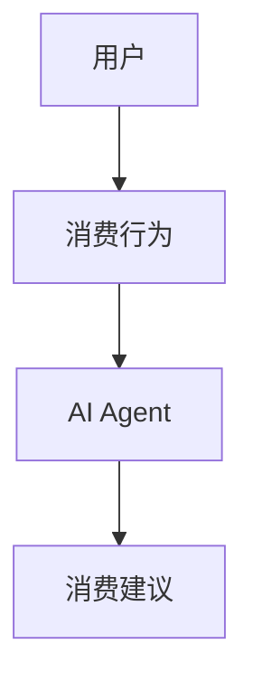
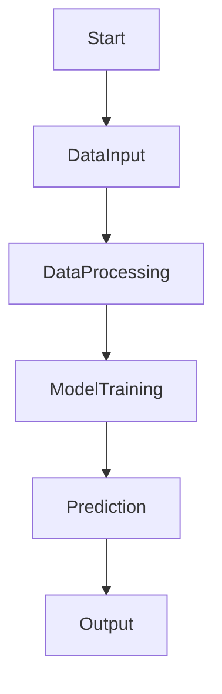
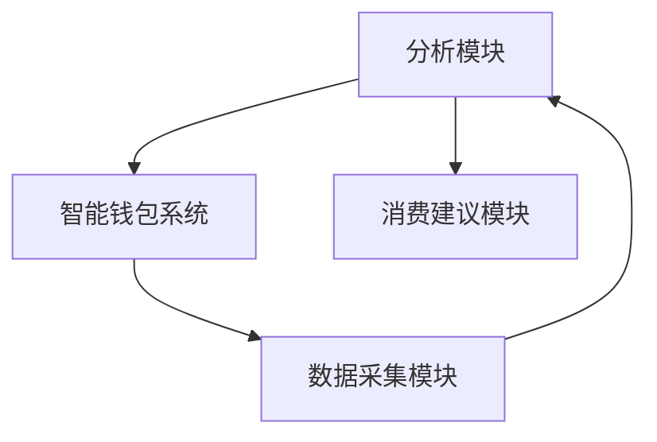
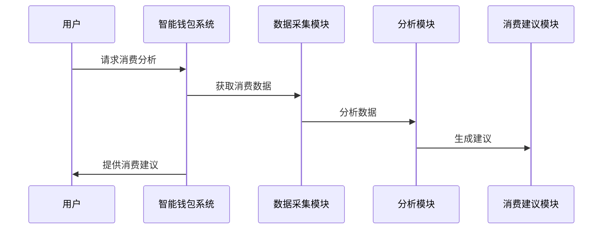

                 


# AI Agent在智能钱包中的消费习惯分析

## 关键词：AI Agent，智能钱包，消费习惯分析，机器学习，数据分析，金融技术

## 摘要：  
本文探讨AI Agent在智能钱包中的消费习惯分析，结合技术背景、算法原理、系统设计和项目实战，深入分析AI Agent如何通过机器学习优化消费决策，实现智能金融管理。

---

# 第1章: 背景介绍

## 1.1 AI Agent与智能钱包概述

### 1.1.1 AI Agent的定义与特点

AI Agent（人工智能代理）是能够感知环境并采取行动以实现目标的智能实体。其特点包括自主性、反应性、目标导向和社会能力。

### 1.1.2 智能钱包的定义与技术基础

智能钱包是结合区块链技术和AI的数字钱包，支持自动化金融管理和安全交易。

### 1.1.3 AI Agent在智能钱包中的作用

AI Agent分析用户消费数据，优化财务决策，提升用户体验。

## 1.2 消费习惯分析的背景与意义

### 1.2.1 消费习惯分析的定义

分析用户消费行为模式的过程。

### 1.2.2 智能钱包中消费习惯分析的必要性

帮助用户优化消费，提高金融安全。

### 1.2.3 消费习惯分析的边界与外延

界定数据范围和应用领域。

---

# 第2章: 核心概念与联系

## 2.1 AI Agent的核心原理

### 2.1.1 AI Agent的感知机制

通过数据输入感知环境。

### 2.1.2 AI Agent的决策

基于感知数据做出最佳决策。

## 2.2 数据模型与消费行为分析

### 2.2.1 数据模型

涉及用户数据和消费行为数据。

## 2.3 概念对比

| **概念**      | **AI Agent** | **传统算法** |
|---------------|--------------|--------------|
| 感知环境      | 是          | 否          |
| 自动决策      | 是          | 否          |

## 2.4 实体关系图



---

# 第3章: 算法原理

## 3.1 算法流程



## 3.2 代码实现

### 3.2.1 环境安装

安装Python、TensorFlow、Pandas。

### 3.2.2 核心代码

```python
import pandas as pd
import numpy as np
from sklearn.model import LinearRegression

# 数据预处理
data = pd.read_csv('消费数据.csv')
X = data[['消费金额', '时间']]
y = data['消费习惯']

# 模型训练
model = LinearRegression()
model.fit(X, y)

# 预测
预测值 = model.predict(X)
```

## 3.3 数学模型

线性回归公式：
$$ y = \beta_0 + \beta_1 x + \epsilon $$

---

# 第4章: 系统分析与架构设计

## 4.1 应用场景

智能钱包优化消费建议。

## 4.2 系统设计

### 4.2.1 功能模块

- 数据采集
- 消费分析
- 优化建议

## 4.3 系统架构



## 4.4 接口设计



---

# 第5章: 项目实战

## 5.1 环境安装

安装所需工具和库。

## 5.2 核心代码

### 数据预处理

```python
import pandas as pd

# 读取数据
data = pd.read_csv('消费数据.csv')

# 去除缺失值
data.dropna(inplace=True)
```

### 模型训练

```python
from sklearn.model import LinearRegression

# 训练模型
model = LinearRegression()
model.fit(X_train, y_train)
```

## 5.3 案例分析

分析用户消费数据，优化消费习惯。

## 5.4 项目小结

总结实现过程和经验教训。

---

# 第6章: 最佳实践

## 6.1 总结

回顾文章内容，强调AI Agent的重要性。

## 6.2 展望

未来发展方向和技术趋势。

---

# 参考文献

- 《机器学习实战》
- 《区块链技术与应用》
- 相关学术论文

---

# 结语

通过以上分析，AI Agent在智能钱包中的消费习惯分析具备广泛的应用前景，未来将继续探索其潜力。

