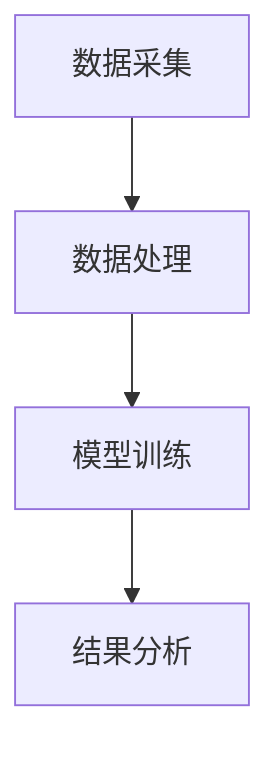
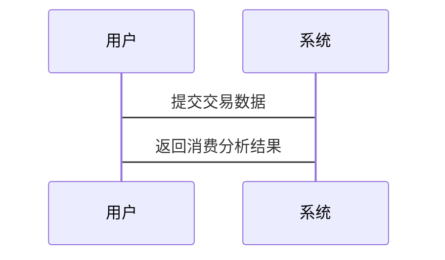

                 


# AI Agent在智能钱包中的消费分析

## 关键词：AI Agent, 智能钱包, 消费分析, 机器学习, 区块链

## 摘要：本文探讨了AI Agent在智能钱包中的消费分析应用，详细介绍了AI Agent的基本概念、消费分析的核心算法以及系统架构设计。通过实际案例分析，展示了如何利用AI技术提升智能钱包的消费分析能力，为读者提供了从理论到实践的全面指导。

---

## 第一部分: AI Agent在智能钱包中的消费分析基础

### 第1章: AI Agent与智能钱包概述

#### 1.1 AI Agent的基本概念

##### 1.1.1 AI Agent的定义
AI Agent（人工智能代理）是一种能够感知环境并采取行动以实现目标的智能实体。它可以自主决策，无需人工干预，广泛应用于自动驾驶、智能助手等领域。

##### 1.1.2 AI Agent的核心特征
| 特征 | 描述 |
|------|------|
| 智能性 | 能够理解、学习和推理 |
| 自主性 | 可以自主决策和行动 |
| 反应性 | 能够实时感知并响应环境变化 |

##### 1.1.3 AI Agent与传统算法的区别
AI Agent不仅执行预定义的规则，还能通过学习和适应环境做出动态决策，而传统算法通常基于固定的规则集。

#### 1.2 智能钱包的定义与特点

##### 1.2.1 智能钱包的定义
智能钱包是一种结合区块链技术的数字钱包，具备自动化功能，如自动交易和智能合约执行。

##### 1.2.2 智能钱包的核心功能
- 自动化交易
- 智能合约执行
- 资产管理
- 消费分析

##### 1.2.3 智能钱包与传统钱包的区别
| 功能 | 智能钱包 | 传统钱包 |
|------|----------|-----------|
| 自动化 | 支持 | 不支持 |
| 智能合约 | 支持 | 不支持 |
| 跨平台支持 | 支持 | 有限 |

#### 1.3 AI Agent在智能钱包中的应用背景

##### 1.3.1 消费分析的痛点与挑战
- 数据量大
- 模型复杂
- 实时性要求高

##### 1.3.2 AI Agent在消费分析中的优势
- 高效决策
- 实时响应
- 自主学习

##### 1.3.3 当前市场中的应用现状
AI Agent在智能钱包中的应用尚处于起步阶段，但已显示出巨大潜力。

#### 1.4 本章小结
本章介绍了AI Agent和智能钱包的基本概念，分析了AI Agent在消费分析中的优势和应用场景。

---

### 第2章: AI Agent在消费分析中的核心概念

#### 2.1 AI Agent的消费分析模型

##### 2.1.1 消费行为分析的基本原理
消费行为分析通过收集和分析用户的交易数据，预测用户的消费行为。

##### 2.1.2 AI Agent的消费预测机制
AI Agent通过机器学习模型预测用户的消费行为，优化消费策略。

##### 2.1.3 消费数据的特征提取
从交易记录中提取特征，如时间、金额、地点等，用于消费预测。

#### 2.2 消费分析的核心算法

##### 2.2.1 监督学习与无监督学习的对比
| 特性 | 监督学习 | 无监督学习 |
|------|----------|-----------|
| 数据需求 | 标签数据 | 无标签数据 |
| 任务类型 | 分类、回归 | 聚类、降维 |

#### 2.3 消费分析的系统架构

##### 2.3.1 系统功能模块划分
- 数据采集模块
- 数据处理模块
- 模型训练模块
- 结果分析模块

##### 2.3.2 系统数据流设计
Mermaid图展示数据流：



##### 2.3.3 系统性能优化策略
- 数据预处理
- 算法优化
- 并行计算

#### 2.4 本章小结
本章详细介绍了AI Agent在消费分析中的核心概念和系统架构设计。

---

## 第二部分: AI Agent消费分析的算法原理

### 第3章: AI Agent消费分析的算法原理

#### 3.1 监督学习算法

##### 3.1.1 线性回归模型
线性回归用于预测连续型变量，公式如下：

$$ y = \beta_0 + \beta_1 x + \epsilon $$

##### 3.1.2 支持向量机(SVM)原理
SVM用于分类和回归，通过构建超平面实现数据分割。

##### 3.1.3 决策树算法
决策树通过构建树状结构进行分类和回归。

##### 3.1.4 随机森林算法
随机森林通过集成多个决策树提高模型鲁棒性。

#### 3.2 无监督学习算法

##### 3.2.1 K-means聚类算法
K-means通过划分簇优化数据聚类。

##### 3.2.2 DBSCAN密度聚类算法
DBSCAN基于密度的聚类算法，适用于高密度区域的数据。

##### 3.2.3 层次聚类算法
层次聚类通过构建树状结构进行数据聚类。

#### 3.3 深度学习算法

##### 3.3.1 卷积神经网络(CNN)原理
CNN用于图像识别，通过卷积操作提取特征。

##### 3.3.2 循环神经网络(RNN)原理
RNN用于序列数据处理，适用于时间序列分析。

##### 3.3.3 Transformer模型原理
Transformer模型通过自注意力机制处理长序列数据。

#### 3.4 强化学习算法

##### 3.4.1 Q-learning算法
Q-learning通过Q表学习最优策略。

##### 3.4.2 Deep Q-Networks(DQN)原理
DQN结合深度学习和强化学习，用于复杂环境下的决策。

##### 3.4.3 策略梯度算法
策略梯度直接优化策略，适用于高维状态空间。

#### 3.5 本章小结
本章详细讲解了各种算法的原理及其在消费分析中的应用。

---

## 第三部分: 系统分析与架构设计方案

### 第4章: AI Agent消费分析的系统架构设计

#### 4.1 系统功能模块设计

##### 4.1.1 数据采集模块
负责收集用户的交易数据，如金额、时间、地点等。

##### 4.1.2 数据处理模块
对数据进行清洗、预处理，提取特征。

##### 4.1.3 模型训练模块
利用机器学习模型进行训练，生成消费预测结果。

##### 4.1.4 结果分析模块
分析预测结果，优化模型。

#### 4.2 系统数据流设计
Mermaid图展示系统架构：


#### 4.3 系统架构设计

##### 4.3.1 分层架构
- 数据层：存储交易数据
- 业务逻辑层：处理数据和训练模型
- 表现层：展示分析结果

##### 4.3.2 接口设计
API接口用于数据采集和结果返回。

##### 4.3.3 交互设计
Mermaid图展示交互流程：



#### 4.4 本章小结
本章详细设计了AI Agent消费分析系统的架构和接口。

---

## 第四部分: 项目实战

### 第5章: 项目实战

#### 5.1 环境安装
安装必要的库，如Python、TensorFlow、Scikit-learn。

#### 5.2 系统核心实现源代码

##### 5.2.1 数据处理代码
```python
import pandas as pd
data = pd.read_csv('transactions.csv')
```

##### 5.2.2 模型训练代码
```python
from sklearn.tree import DecisionTreeClassifier
model = DecisionTreeClassifier()
model.fit(X_train, y_train)
```

##### 5.2.3 结果分析代码
```python
from sklearn.metrics import accuracy_score
print(accuracy_score(y_test, model.predict(X_test)))
```

#### 5.3 案例分析
分析实际交易数据，展示AI Agent如何优化消费策略。

#### 5.4 本章小结
本章通过实际项目展示了AI Agent消费分析系统的实现过程。

---

## 第五部分: 总结与展望

### 第6章: 总结与展望

#### 6.1 本章小结
总结本文的主要内容和研究成果。

#### 6.2 注意事项
在实际应用中需注意数据隐私和模型优化。

#### 6.3 最佳实践
建议在项目中采用模块化设计和持续优化策略。

#### 6.4 未来趋势
展望AI Agent在智能钱包中的进一步应用和发展。

---

## 参考文献
- [1] 《机器学习实战》, 周志华
- [2] 《区块链入门与应用开发》, 陈小明
- [3] TensorFlow官方文档

---

通过以上内容，我们系统地介绍了AI Agent在智能钱包中的消费分析应用，从理论到实践，从算法到系统设计，为读者提供了全面的指导。

